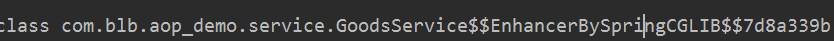
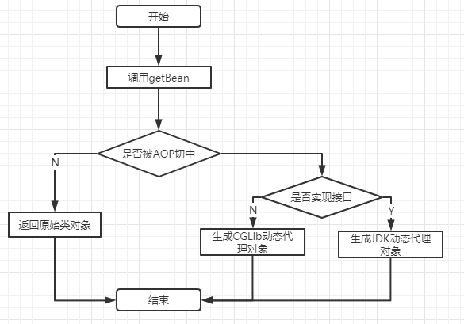
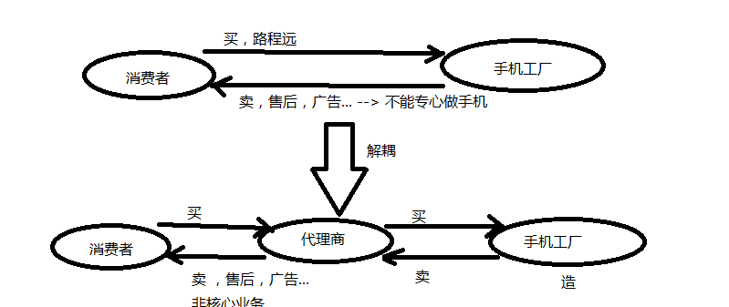
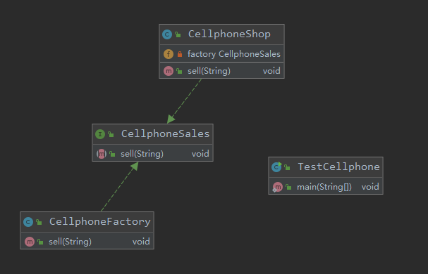

# 学习目标

```
1、AOP的实现原理
2、代理模式
3、静态代理
4、动态代理
```

# 1、AOP的实现原理

## 1.1 AOP的实现原理

打印对象的getClass方法，发现原类名的后面多了些东西：



原因是：如果该类被AOP切中，从IOC容器取出的对象，不是该类的对象，而是该类代理类的对象。

AOP的实现流程：



1) 当调用容器的getBean方法后，Spring查找对象后会判断该对象的方法是否被某个切面切中

2) 如果没有切中，就创建原有类的对象

3) 如果被切中了，再判断该类是否实现过任何接口

4) 如果实现过接口，则通过JDK动态代理生成代理类，并创建对象

5) 如果没有实现过接口，则通过CGLib动态代理生成代理类，并创建对象

# 2、代理模式

## 2.1 代理模式简介

代理模式给某一个对象提供一个代理对象，并由代理对象控制对原对象的引用。

生活中的代理：消费者直接到手机工厂去买手机，路程遥远不方便，而且工厂还需要打广告，做售后等业务，就不能专心制造手机了。加入手机代理商，可以在市中心设立销售点，代替工厂销售，同时可以进行广告和售后等业务，工厂只需要专注于核心业务。



## 2.2 代理模式的作用

代理模式的作用

1）中介的作用，当调用者不能或不方便调用某个对象时，代理起到中介的作用，帮助调用者间接的调用对象。

2）符合开闭原则，在不修改原有类代码的前提下，对类的功能进行增强。

## 2.3 代理模式的分类

代理模式分为两种：

1） 静态代理，在运行前，通过编写代码的方式生成代理类

2） 动态代理，在运行后，通过反射机制生成代理类

# 3、静态代理

## 3.1 实现步骤

1）代理者和被代理者都实现相同的接口

2）代理者包含被代理者的对象

3）创建代理对象时传入被代理对象

4）代理者执行方法时，会调用被代理者的方法，同时扩展新的功能



```
/**
 * 手机销售
 */
public interface CellphoneSales {

    /**
     * 销售手机
     * @param phone
     */
    void sell(String phone);
}
```

```
/**
 * 手机工厂
 */
public class CellphoneFactory implements CellphoneSales {

    public void sell(String phone) {
        System.out.println("卖了一部" + phone);
    }
}
```

```
/**
 * 手机商店
 */
public class CellphoneShop implements CellphoneSales{

    //手机工厂对象
    private CellphoneSales factory = null;

    //通过构造方法传入被代理者
    public CellphoneShop(CellphoneSales factory) {
        this.factory = factory;
    }

    public void sell(String phone) {
        //扩展功能
        System.out.println("打广告！！！新手机，黑科技！！");
        //调用原来的被代理者方法
        this.factory.sell(phone);
        //扩展功能
        System.out.println("做售后！！！");
    }
}
```

```
public class TestCellphone {

    public static void main(String[] args) {
        //创建手机工厂
        CellphoneSales factory = new CellphoneFactory();
        factory.sell("华为P40手机");
        //创建商店
        CellphoneSales shop = new CellphoneShop(factory);
        //调用方法
        shop.sell("华为P40手机");
    }
}
```

## 3.2 存在的问题

思考一下：上面只有卖手机这个业务，如果存在其它业务怎么办？

按照静态代理的实现方法，就需要再编写新的代理类。

这就是静态代理的问题：一个代理类只能代理一种业务，如果有多种业务，就必须创建大量的代理类。

# 4、动态代理

## 4.1 动态代理概述

和静态代理不同，动态代理是在运行时，通过反射机制动态生成代理类。开发者不需要手动编写新的代理类。

## 4.2 动态代理分类

Java的动态代理主要有两种实现：

1）JDK动态代理

2）CGLib动态代理

## 4.3 JDK动态代理

JDK自带的，前提是：被代理类必须实现过接口。

实现步骤

1） 实现InvocationHandler接口

2）实现invoke方法

3）通过Proxy.newProxyInstance方法返回代理对象

```
/**
 * 工厂的JDK动态代理
 */
public class JDKFactoryProxy implements InvocationHandler {

    //被代理对象
    private Object target;

    /**
     * 创建代理对象
     * @param target 被代理对象
     * @return 代理对象
     */
    public Object createProxy(Object target){
        this.target = target;
        //创建代理对象 参数1：类加载器, 参数2：代理对象实现的接口，参数3：InvocationHandler的实现对象
        return Proxy.newProxyInstance(target.getClass().getClassLoader(),target.getClass().getInterfaces(),this);
    }

    /**
     * 代理类的方法调用
     */
    public Object invoke(Object proxy, Method method, Object[] args) throws Throwable {
        //功能扩展
        System.out.println("商店帮忙打广告！！");
        //调用被代理者方法
        Object invoke = method.invoke(target, args);
        System.out.println("商店帮忙做售后！！");
        return invoke;
    }
}
```

```
public class TestJDKProxy {

    public static void main(String[] args) {
        CellphoneSales factory1 = new CellphoneFactory();

        JDKFactoryProxy proxy = new JDKFactoryProxy();
        CellphoneSales cellphoneProxy = (CellphoneSales) proxy.createProxy(factory1);
        cellphoneProxy.sell("小米11");

    }
}

```


## 4.4 CGLib动态代理

需要引入CGLib依赖，它的原理是：通过反射+继承机制动态生成被代理类的子类，所以被代理类不能是final的。

实现步骤

1）引入cglib

```
        <!-- https://mvnrepository.com/artifact/cglib/cglib -->
        <dependency>
            <groupId>cglib</groupId>
            <artifactId>cglib</artifactId>
            <version>3.3.0</version>
        </dependency>
```

2）实现MethodInterceptor接口

3）实现intercept方法

4）通过Enhancer返回代理对象

```
/**
 * CGLib动态代理
 */
public class CGlibFactoryProxy implements MethodInterceptor {

    //被代理对象
    private Object target;

    public Object createProxy(Object target){
        this.target = target;
        Enhancer enhancer = new Enhancer();
        //设置父类
        enhancer.setSuperclass(this.target.getClass());
        //设置方法回调MethodInterceptor实现
        enhancer.setCallback(this);
        //返回代理对象
        return enhancer.create();
    }

    public Object intercept(Object o, Method method, Object[] objects, MethodProxy methodProxy) throws Throwable {
        //扩展
        System.out.println("CGLib商店打广告！");
        //调用原来方法
        Object invoke = method.invoke(target, objects);
        System.out.println("CGLib商店做售后！");
        return invoke;
    }
}

```

```
public class TestCGLibProxy {

    public static void main(String[] args) {
        CellphoneSales factory1 = new CellphoneFactory();
       
        CGlibFactoryProxy proxy = new CGlibFactoryProxy();
        CellphoneSales cellphoneProxy = (CellphoneSales) proxy.createProxy(factory1);
        cellphoneProxy.sell("小米11");
      
    }
}

```

