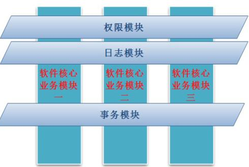
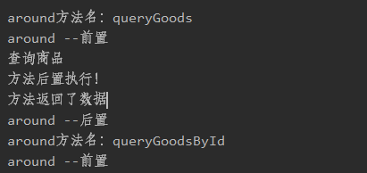

# 学习目标

```
1、AOP简介
2、AOP在Spring中的实现
3、AOP的注解配置
4、AOP日志跟踪案例
```

# 1、AOP简介

## 1.1 AOP基本概念

AOP（Aspect Oriented Programming）面向切面编程，通过预编译方式和运行期间动态代理实现程序功能的统一维护的一种技术。AOP是OOP的延续，是软件开发中的一个热点，也是Spring框架中的一个重要内容。

## 1.2 AOP的作用

AOP的核心作用是：在程序运行期间，不修改代码的同时为程序增强功能。将必不可少的公共功能做成切面，随着程序运行切入到代码中运行。编写业务时只关注于核心功能 ，不再考虑事务、日志等公共功能，减轻了编码负担，更专注于业务。



## 1.3 AOP的术语

1、切面(Aspect)

对哪些方法进行拦截，拦截后怎么处理，这些关注点称之为切面

2、连接点（joinpoint）

被拦截到的点，因为Spring只支持方法类型的连接点，所以在Spring中连接点指的就是被拦截到的方法，实际上连接点还可以是字段或者构造器

3、切入点（pointcut）

对连接点进行拦截的定义

4、通知（advice）

所谓通知指的就是指拦截到连接点之后要执行的代码，通知分为前置、后置、异常、最终、环绕通知五类

5、目标对象(target)

代理的目标对象，将切面应用到目标对象并导致代理对象创建的过程

6、引入\织入（introduction、weave）

在不修改代码的前提下，引入可以在运行期为类动态地添加一些方法或字段

# 2、AOP的实现

## 2.1 AOP配置步骤

### 2.1.1 引入依赖
```
        <dependency>
            <groupId>org.springframework</groupId>
            <artifactId>spring-context</artifactId>
            <version>5.2.8.RELEASE</version>
        </dependency>
        <dependency>
            <groupId>org.springframework</groupId>
            <artifactId>spring-aop</artifactId>
            <version>5.2.8.RELEASE</version>
        </dependency>

        <dependency>
            <groupId>org.aspectj</groupId>
            <artifactId>aspectjrt</artifactId>
            <version>1.9.5</version>
        </dependency>

        <dependency>
            <groupId>org.aspectj</groupId>
            <artifactId>aspectjweaver</artifactId>
            <version>1.9.5</version>
        </dependency>
```
### 2.1.2 编写通知类
```
/**
 * 日志输出通知类
 */
public class LogAdvise {

    public void beforeLog(){
        System.out.println("方法开始执行！");
    }

    public void afterLog(){
        System.out.println("方法后置执行！");
    }

    public void afterReturning(){
        System.out.println("方法返回了数据");
    }

    public void afterThrowing(){
        System.out.println("方法抛出了异常");
    }

    public void around(ProceedingJoinPoint joinPoint) throws Throwable {
        System.out.println("around方法名：" + joinPoint.getSignature().getName());
        System.out.println("around --前置");
        //原来方法
        joinPoint.proceed();
        System.out.println("around --后置");
    }
}
```
### 2.1.3 AOP的配置
```
<?xml version="1.0" encoding="UTF-8"?>
<beans xmlns="http://www.springframework.org/schema/beans"
       xmlns:xsi="http://www.w3.org/2001/XMLSchema-instance"
       xmlns:context="http://www.springframework.org/schema/context"
       xmlns:aop="http://www.springframework.org/schema/aop"
       xsi:schemaLocation="http://www.springframework.org/schema/beans http://www.springframework.org/schema/beans/spring-beans.xsd http://www.springframework.org/schema/context https://www.springframework.org/schema/context/spring-context.xsd http://www.springframework.org/schema/aop https://www.springframework.org/schema/aop/spring-aop.xsd">

    <!--配置包的扫描-->
    <context:component-scan base-package="com.blb.aop_demo"></context:component-scan>
    <!--配置通知类-->
    <bean id="logAdvise" class="com.blb.aop_demo.util.LogAdvise"></bean>
    <!--配置切面-->
    <aop:config>
        <!--配置切入点-->
        <aop:pointcut id="pc" expression="execution(* com.blb.aop_demo.service.*Service.*(..))"/>
        <!--配置切面 ref是通知类的bean-->
        <aop:aspect id="aspect1" ref="logAdvise">
            <!--前置通知 method是对应的通知方法 pointcut-ref是切入点-->
            <aop:before method="beforeLog" pointcut-ref="pc"></aop:before>
            <!--后置-->
            <aop:after method="afterLog" pointcut-ref="pc"></aop:after>
            <!--后置返回-->
            <aop:after-returning method="afterReturning" pointcut-ref="pc"></aop:after-returning>
            <!--后置抛异常-->
            <aop:after-throwing method="afterThrowing" pointcut-ref="pc"></aop:after-throwing>
            <!--环绕-->
            <aop:around method="around" pointcut-ref="pc"></aop:around>
        </aop:aspect>
    </aop:config>
</beans>
```
### 2.1.4 测试
在com.blb.aop_demo.service包下添加几个Service类做测试


```
ClassPathXmlApplicationContext context = new ClassPathXmlApplicationContext("spring-aop.xml");
GoodsService goodsService = context.getBean(GoodsService.class);
goodsService.queryGoods();
goodsService.queryGoodsById(1);
goodsService.createGoods();
goodsService.updateGoods();
goodsService.deleteGoodsById(1);
```



### 2.1.5 配置详解

aop:pointcut 是切入点配置

其中的核心是expression，通过表达式控制切面应用的范围

语法：

```
execution(访问修饰符 返回值 包名.类名.方法名(参数类型,参数类型....))
```

通配符：

```
*代表任意长度的字符

.. 代替子包或任意参数
```


# 3、AOP的注解配置

## 3.1 常用AOP相关注解

@Aspect						 切面，配置到切面类上

@PointCut("表达式")	配置切入点，加在方法上

@Before						 配置前置通知方法

@After							配置后置通知方法

@Around						配置环绕通知方法

@AfterReturning		   配置后置返回值通知方法

@AfterThrowing 		   配置后置抛出异常通知方法

## 3.2 AOP配置

1）配置类

```
@ComponentScan(basePackages = "com.blb.aop_demo")
@Configuration
//启动AspectJ的注解配置
@EnableAspectJAutoProxy
public class AopConfig {
}
```

2） 日志切面

```
/**
 * 日志切面
 */
@Aspect
@Component
public class LogAspect {

    //配置切入点
    @Pointcut("execution(* com.blb.aop_demo.service.*Service.*(..))")
    public void pointcut(){
    }

    //配置通知方法
    @Before("pointcut()")
    public void beforeLog(){
        System.out.println("这是前置的通知方法！！");
    }
}

```

3）测试

```
AnnotationConfigApplicationContext context2 = new   
                              AnnotationConfigApplicationContext(AopConfig.class);
GoodsService goodsService = context2.getBean(GoodsService.class);
goodsService.queryGoods();
goodsService.queryGoodsById(1);
goodsService.createGoods();
goodsService.updateGoods();
goodsService.deleteGoodsById(1);
```


# 4、日志跟踪案例

## 4.1 案例概述

在实际项目部署上线后，都需要通过日志的搜集来定位出现的bug，日志跟踪代码如果在所有方法都写，就会很繁琐，代码也不利于维护，如果使用AOP就能很好解决这个问题。

## 4.2 案例实现

1) 导入log4j依赖

```
        <!-- https://mvnrepository.com/artifact/log4j/log4j -->
        <dependency>
            <groupId>log4j</groupId>
            <artifactId>log4j</artifactId>
            <version>1.2.17</version>
        </dependency>
```

2) 添加log4j.properties

```
### 设置###
log4j.rootLogger = debug,stdout,D,E

### 输出信息到控制抬 ###
log4j.appender.stdout = org.apache.log4j.ConsoleAppender
log4j.appender.stdout.Target = System.out
log4j.appender.stdout.layout = org.apache.log4j.PatternLayout
log4j.appender.stdout.layout.ConversionPattern = [%-5p] %d{yyyy-MM-dd HH:mm:ss,SSS} method:%l%n%m%n

### 输出DEBUG 级别以上的日志到=D://logs/error.log ###
log4j.appender.D = org.apache.log4j.DailyRollingFileAppender
log4j.appender.D.File = D://logs/log.log
log4j.appender.D.Append = true
log4j.appender.D.Threshold = DEBUG 
log4j.appender.D.layout = org.apache.log4j.PatternLayout
log4j.appender.D.layout.ConversionPattern = %-d{yyyy-MM-dd HH:mm:ss}  [ %t:%r ] - [ %p ]  %m%n

### 输出ERROR 级别以上的日志到=D://logs/error.log ###
log4j.appender.E = org.apache.log4j.DailyRollingFileAppender
log4j.appender.E.File =D://logs/error.log 
log4j.appender.E.Append = true
log4j.appender.E.Threshold = ERROR 
log4j.appender.E.layout = org.apache.log4j.PatternLayout
log4j.appender.E.layout.ConversionPattern = %-d{yyyy-MM-dd HH:mm:ss}  [ %t:%r ] - [ %p ]  %m%n
```

3) 编写日志切面

```
/**
 * Log4j日志输出切面
 */
@Aspect
@Component
public class Log4jAspect {

    //创建日志对象
    private Logger logger = Logger.getLogger(Log4jAspect.class);

    //给所有的service类的所有方法加日志跟踪
    @Pointcut("execution(* com.blb.aop_demo.service.*Service.*(..))")
    public void logPointcut(){
    }

    //配置环绕通知
    @Around("logPointcut()")
    public Object aroundLog(ProceedingJoinPoint point) throws Throwable {
        //记录方法执行前时间
        long start = System.currentTimeMillis();
        //打印方法名称
        if(logger.isDebugEnabled()){
            logger.debug("当前执行方法：" + point.getSignature().getName());
        }
        //打印参数
        Object[] args = point.getArgs();
        for(Object arg : args){
            if(logger.isDebugEnabled()){
                logger.debug("参数："+arg);
            }
        }
        //打印返回值
        Object result = point.proceed();
        if(logger.isDebugEnabled()){
            logger.debug("方法返回值：" +result);
        }
        //打印执行时间
        long end = System.currentTimeMillis();
        if(logger.isDebugEnabled()){
            logger.debug("方法执行时间：" +(end - start));
        }
        return result;
    }
}
```

