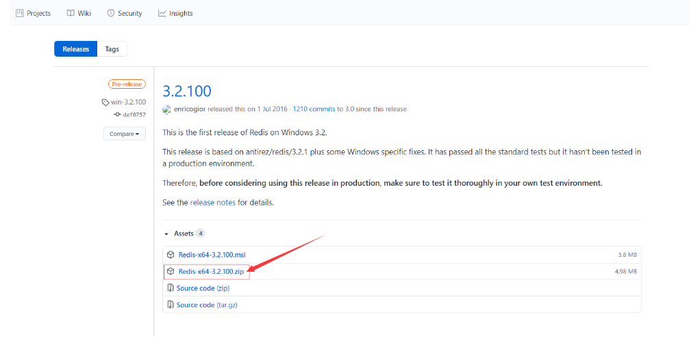
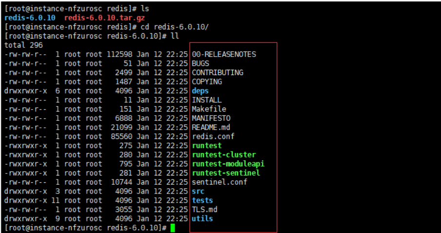

[TOC]

## Redis安装

### 1.Widows下如何安装Redis?

(1) .下载地址: https://github.com/microsoftarchive/redis/releases/tag/win-3.2.100
如下图:



(2) .下载成功后将其移动到我们想要安装的目录下并且解压:
如下图:


(3) .进入后有以下内容文件：


(4). 先点击redis-server.exe启动Redis服务，显示如下：


(5) .再点击redis-cli.exel连接Redis，如下图所示：


(6) .至此，在Windows下的安装就结束了。不过Redis官方文档不建议我们在Widows环境下搭建Redis服务。
最好是Linux环境下搭建并使用Redis服务！

### 2.Linux下如何安装Redis?

前提条件：我这边安装的Linux系统是CentOS7.7版本，并且是云服务器，使用的远程工具是Xshell 6。
(1) .首先下载安装包，下载地址：https://redis.io/
如下图：


(2) .一般我们都是将这些服务安装在指定文件夹下，在/opt目录下新建soft文件夹，再在/soft文件下建我们需要安装的服务名称文件夹，redis：如图：


(3) .将包通过rz命令上传到远程服务器上的redis文件夹下：如下图：


(4) .等待上传成功，速度一般根据你的服务器带宽而定：然后解压redis安装包：
命令：tar -zxvf 需要解压的包名


(5) .解压后，进入文件夹，正常情况下解压后有19个文件，如若不对，请删除，重新解压：



(6) .接下来我们安装基本环境gcc,安装命令：yum install gcc-c++


等待其安装完成，输入gcc -v查看当前gcc的版本：

(7) .这里是重点：我们安装的Redis版本是6.0.10.对gcc环境的版本有一定的要求，所以我们要升级gcc的版本，输入以下命令：

```
#第一步
sudo yum install centos-release-scl
#第二步
sudo yum install devtoolset-7-gcc*
#第三步
scl enable devtoolset-7 bash
```

中途遇到输入时不用管太多，直接yes即可

全部执行完毕后，再次查看版本变为：7.3.1即代表环境升级成功。

(8) .然后在我们解压的redis目录下执行命令：make，，出现以下显示即成功make下载！

再执行命令：make install,安装文件！

(9) .大家应该会发现我们并没有指定安装的路径，但是Redis有一个默认的路径，得记住：

```
/usr/local/bin
```

进入该文件夹内，可以发现，有两个文件和我们再Windows下的文件一样，分别时启动和连接。


(10) .我们将配置文件拷贝过来，以后就用这个配置文件来启动Redis服务。
命令： cp /opt/soft/redis/redis-6.0.10/redis.conf mtconfig/


(11) .redis默认不是后台启动的，修改配置文件！

```
#打开配置文件
vim redis.conf
#保存
wq!
```


(12) 接下来就是.启动和连接Redis服务！

```
#启动redis服务
redis-server mtconfig/redis.conf
#连接redis服务
redis-cli -p 6379
```

(13).测试redis服务：
先测试set和get基本操作：


再查看redis服务的进程：


## Redis入门

### 1.Redis概述

- Redis是什么？what？
  Redis（Remote Dictionary Server )，即远程字典服务 !
  是一个开源的使用ANSI C语言编写、支持网络、可基于内存亦可持久化的日志型、Key-Value数据库，并提供多种语言的API。

  redis会周期性的把更新的数据写入磁盘或者把修改操作写入追加的记录文件，并且在此基础上实现了master-slave(主从)同步。
  免费和开源！是当下最热门的 NoSQL 技术之一！也被人们称之为结构化数据库！

- Redis能干嘛？
  1、内存存储、持久化，内存中是断电即失、所以说持久化很重要（rdb、aof） 2、效率高，可以用于高速缓存
  3、发布订阅系统
  4、地图信息分析
  5、计时器、计数器（浏览量！）

### 2.Redis的基本了解

- 首先我们可以看下官方文档是如何介绍Redis的
  

- Redis-Key
  简单介绍一下Redis中队Key的操作命令。

  ```
  127.0.0.1:6379> ping  #查看当前连接是否正常，正常返回PONG
  PONG
  127.0.0.1:6379> clear  #清楚当前控制台（为了更好的看到下面输入的命令）
  127.0.0.1:6379> keys *  #查看当前库里所有的key
  1) "db"
  127.0.0.1:6379> FLUSHALL  #清空所有库的内容
  OK
  127.0.0.1:6379> keys * 
  (empty array)
  127.0.0.1:6379> set name dingdada  #添加一个key为‘name’ value为‘dingdada’的数据
  OK
  127.0.0.1:6379> get name  #查询key为‘name’的value值
  "dingdada"
  127.0.0.1:6379> keys *
  1) "name"
  127.0.0.1:6379> set name1 dingdada2
  OK
  127.0.0.1:6379> get name1
  "dingdada2"
  127.0.0.1:6379> keys *  #查看当前库里所有的key
  1) "name1"
  2) "name"
  127.0.0.1:6379> EXISTS name  #判断当前key是否存在
  (integer) 1
  127.0.0.1:6379> move name 1  #移除当前库1的key为‘name‘的数据
  (integer) 1
  127.0.0.1:6379> keys *
  1) "name1"
  127.0.0.1:6379> FLUSHALL  #再次清空所有库的内容
  OK
  
  ## 多加几条数据 下面测试设置key的过期时间
  127.0.0.1:6379> set name dingdada
  OK
  127.0.0.1:6379> set name1 dingdada1
  OK
  127.0.0.1:6379> set name2 dingdada2
  OK
  127.0.0.1:6379> EXPIRE name 15  #设置key为’name‘的数据过期时间为15秒 单位seconds
  (integer) 1
  127.0.0.1:6379> ttl name  #查看当前key为’name‘的剩余生命周期时间
  (integer) 13
  127.0.0.1:6379> ttl name
  (integer) 12
  127.0.0.1:6379> ttl name
  (integer) 11
  127.0.0.1:6379> ttl name
  (integer) 8
  127.0.0.1:6379> ttl name
  (integer) 6
  127.0.0.1:6379> ttl name
  (integer) 3
  127.0.0.1:6379> ttl name
  (integer) 2
  127.0.0.1:6379> ttl name
  (integer) 1
  127.0.0.1:6379> ttl name
  (integer) 0
  127.0.0.1:6379> ttl name  #如若返回-2，证明key已过期
  (integer) -2
  127.0.0.1:6379> get name    #再次查询即为空
  (nil)
  127.0.0.1:6379> type name1
  string
  127.0.0.1:6379> 
  ```

### 3.Redis的数据类型

#### String（字符串）

①**添加**、**查询**、**追加**、**获取长度**，**判断是否存在**的操作

```
127.0.0.1:6379> set name dingdada  #插入一个key为‘name’值为‘dingdada’的数据
OK
127.0.0.1:6379> get name  #获取key为‘name’的数据
"dingdada"
127.0.0.1:6379> get key1
"hello world!"
127.0.0.1:6379> keys *  #查看当前库的所有数据
1) "name"
127.0.0.1:6379> EXISTS name  #判断key为‘name’的数据存在不存在，存在返回1
(integer) 1
127.0.0.1:6379> EXISTS name1  #不存在返回0
(integer) 0
127.0.0.1:6379> APPEND name1 dingdada1  #追加到key为‘name’的数据后拼接值为‘dingdada1’，如果key存在类似于java中字符串‘+’，不存在则新增一个，类似于Redis中的set name1 dingdada1 ，并且返回该数据的总长度
(integer) 9
127.0.0.1:6379> get name1
"dingdada1"
127.0.0.1:6379> STRLEN name1  #查看key为‘name1’的字符串长度
(integer) 9
127.0.0.1:6379> APPEND name1 ,dingdada2  #追加，key存在的话，拼接‘+’，返回总长度
(integer) 19
127.0.0.1:6379> STRLEN name1
(integer) 19
127.0.0.1:6379> get name1
"dingdada1,dingdada2"
127.0.0.1:6379> set key1 "hello world!"  #注意点：插入的数据中如果有空格的数据，请用“”双引号，否则会报错！
OK
127.0.0.1:6379> set key1 hello world!  #报错，因为在Redis中空格就是分隔符，相当于该参数已结束
(error) ERR syntax error
127.0.0.1:6379> set key1 hello,world!  #逗号是可以的
OK
```

②**自增**、**自减**操作

```
127.0.0.1:6379> set num 0  #插入一个初始值为0的数据
OK
127.0.0.1:6379> get num
"0"
127.0.0.1:6379> incr num  #指定key为‘num’的数据自增1，返回结果  相当于java中 i++
(integer) 1
127.0.0.1:6379> get num  #一般用来做文章浏览量、点赞数、收藏数等功能
"1"
127.0.0.1:6379> incr num
(integer) 2
127.0.0.1:6379> incr num
(integer) 3
127.0.0.1:6379> get num
"3"
127.0.0.1:6379> decr num  #指定key为‘num’的数据自减1，返回结果  相当于java中 i--
(integer) 2
127.0.0.1:6379> decr num
(integer) 1
127.0.0.1:6379> decr num
(integer) 0
127.0.0.1:6379> decr num  #可以一直减为负数~
(integer) -1
127.0.0.1:6379> decr num  #一般用来做文章取消点赞、取消收藏等功能
(integer) -2
127.0.0.1:6379> decr num
(integer) -3
127.0.0.1:6379> INCRBY num 10  #后面跟上by  指定key为‘num’的数据自增‘参数（10）’，返回结果
(integer) 7
127.0.0.1:6379> INCRBY num 10
(integer) 17
127.0.0.1:6379> DECRBY num 3  #后面跟上by  指定key为‘num’的数据自减‘参数（3）’，返回结果
(integer) 14
127.0.0.1:6379> DECRBY num 3
(integer) 11
```

③**截取**、**替换**字符串操作

```
#截取
127.0.0.1:6379> set key1 "hello world!"
OK
127.0.0.1:6379> get key1
"hello world!"
127.0.0.1:6379> GETRANGE key1 0 4  #截取字符串，相当于java中的subString，下标从0开始，不会改变原有数据
"hello"
127.0.0.1:6379> get key1
"hello world!"
127.0.0.1:6379> GETRANGE key1 0 -1  #0至-1相当于 get key1，效果一致，获取整条数据
"hello world!"
#替换
127.0.0.1:6379> set key2 "hello,,,world!"
OK
127.0.0.1:6379> get key2
"hello,,,world!"
127.0.0.1:6379> SETRANGE key2 5 888  #此语句跟java中replace有点类似，下标也是从0开始，但是有区别：java中是指定替换字符，Redis中是从指定位置开始替换，替换的数据根据你所需替换的长度一致，返回值是替换后的长度
(integer) 14
127.0.0.1:6379> get key2
"hello888world!"
127.0.0.1:6379> SETRANGE key2 5 67  #该处只替换了两位
(integer) 14
127.0.0.1:6379> get key2
"hello678world!"

```

④**设置过期时间**、**不存在设置**操作

```
#设置过期时间，跟Expire的区别是前者设置已存在的key的过期时间，而setex是在创建的时候设置过期时间
127.0.0.1:6379> setex name1 15  dingdada  #新建一个key为‘name1’，值为‘dingdada’，过期时间为15秒的字符串数据
OK
127.0.0.1:6379> ttl name1  #查看key为‘name1’的key的过期时间
(integer) 6
127.0.0.1:6379> ttl name1
(integer) 5
127.0.0.1:6379> ttl name1
(integer) 3
127.0.0.1:6379> ttl name1
(integer) 1
127.0.0.1:6379> ttl name1
(integer) 0
127.0.0.1:6379> ttl name1  #返回为-2时证明该key已过期，即不存在
(integer) -2
#不存在设置
127.0.0.1:6379> setnx name2 dingdada2  #如果key为‘name2’不存在，新增数据，返回值1证明成功
(integer) 1
127.0.0.1:6379> get name2
"dingdada2"
127.0.0.1:6379> keys *
1) "name2"
127.0.0.1:6379> setnx name2 "dingdada3"  #如果key为‘name2’的已存在，设置失败，返回值0，也就是说这个跟set的区别是：set会替换原有的值，而setnx不会，存在即不设置，确保了数据误操作~
(integer) 0
127.0.0.1:6379> get name2
"dingdada2"

```

⑤**mset**、**mget**操作

```
127.0.0.1:6379> mset k1 v1 k2 v2 k3 v3  #插入多条数据
OK
127.0.0.1:6379> keys *  #查询所有数据
1) "k2"
2) "k3"
3) "k1"
127.0.0.1:6379> mget k1 k2 k3  #查询key为‘k1’，‘k2’，‘k3’的数据
1) "v1"
2) "v2"
3) "v3"
127.0.0.1:6379> MSETNX k1 v1 k4 v4  #msetnx是一个原子性的操作，在一定程度上保证了事务！要么都成功，要么都失败！相当于if中的条件&&（与）
(integer) 0
127.0.0.1:6379> keys *
1) "k2"
2) "k3"
3) "k1"
127.0.0.1:6379> MSETNX k5 v5 k4 v4  #全部成功
(integer) 1
127.0.0.1:6379> keys *
1) "k2"
2) "k4"
3) "k3"
4) "k5"
5) "k1"

```

⑥**添加获取对象**、**getset**操作

```
#这里其实本质上还是字符串，但是我们讲其key巧妙的设计了一下。
##mset student:1:name  student 相当于类名，1 相当于id，name 相当于属性
#如果所需数据全部这样设计，那么我们在java的业务代码中，就不需要关注太多的key
#只需要找到student类，下面哪个id，需要哪个属性即可，减少了代码的繁琐，在一定程度上可以理解为这个一个类的对象！
127.0.0.1:6379> mset student:1:name dingdada student:1:age 22  #新增一个key为‘student:1:name’，value为‘dingdada ’。。等数据
OK
127.0.0.1:6379> keys *  #查看所有的key
1) "student:1:age"
2) "student:1:name"
127.0.0.1:6379> mget student:1:age student:1:name  #获取数据
1) "22"
2) "dingdada"

##getset操作
127.0.0.1:6379> getset name1 dingdada1  #先get再set，先获取key，如果没有，set值进去，返回的是get的值
(nil)
127.0.0.1:6379> get name1
"dingdada1"
127.0.0.1:6379> getset name1 dingdada2  ##先获取key，如果有，set（替换）最新的值进去，返回的是get的值
"dingdada1"
127.0.0.1:6379> get name1  #替换成功
"dingdada2"

```

⑦**总结**

*String是Redis中最常用的一种数据类型，也是Redis中最简单的一种数据类型。首先，表面上它是字符串，但其实他可以灵活的表示字符串、整数、浮点数3种值。Redis会自动的识别这3种值。*

#### **List**（列表）

①lpush（左插入）、lrange（查询集合）、rpush（右插入）操作

```
#lpush
127.0.0.1:6379> lpush list v1  #新增一个集合
(integer) 1
127.0.0.1:6379> lpush list v2
(integer) 2
127.0.0.1:6379> lpush list v3
(integer) 3
#lrange
127.0.0.1:6379> LRANGE list 0 -1  #查询list的所有元素值
1) "v3"
2) "v2"
3) "v1"
127.0.0.1:6379> lpush list1 v1 v2 v3 v4 v5  #批量添加集合元素
(integer) 5
127.0.0.1:6379> LRANGE list1 0 -1
1) "v5"
2) "v4"
3) "v3"
4) "v2"
5) "v1"
###这里大家有没有注意到，先进去的会到后面，也就是我们的lpush的意思是左插入，l--left
#rpush
127.0.0.1:6379> LRANGE list 0 1  #指定查询列表中的元素，从下标零开始，1结束，两个元素
1) "v3"
2) "v2"
127.0.0.1:6379> LRANGE list 0 0  #指定查询列表中的唯一元素
1) "v3"
127.0.0.1:6379> rpush list rv0  #右插入，跟lpush相反，这里添加进去元素是在尾部！
(integer) 4
127.0.0.1:6379> lrange list 0 -1  #查看集合所有元素
1) "v3"
2) "v2"
3) "v1"
4) "rv0"
##联想：这里我们是不是可以做一个，保存的记录值（如：账号密码的记录），
每次都使用lpush，老的数据永远在后面，我们每次获取 0 0 位置的元素，是不是相当于更新了
数据操作，但是数据记录还在？想要查询记录即可获取集合所有元素！

```

②lpop（左移除）、rpop（右移除）操作

```
#lpop
127.0.0.1:6379> LRANGE list 0 -1
1) "v5"
2) "v4"
3) "v3"
4) "v2"
5) "v1"
127.0.0.1:6379> lpop list  #从头部开始移除第一个元素
"v5"
##################
#rpop
127.0.0.1:6379> LRANGE list 0 -1
1) "v4"
2) "v3"
3) "v2"
4) "v1"
127.0.0.1:6379> rpop list
"v1"
127.0.0.1:6379> LRANGE list 0 -1  #从尾部开始移除第一个元素
1) "v4"
2) "v3"
3) "v2"

```

③lindex（查询指定下标元素）、llen（获取集合长度） 操作

```
#lindex
127.0.0.1:6379> LRANGE list 0 -1
1) "v4"
2) "v3"
3) "v2"
127.0.0.1:6379> lindex list 1  #获取指定下标位置集合的元素，下标从0开始计数
"v3"
127.0.0.1:6379> lindex list 0  #相当于java中的indexof
"v4"
#llen
127.0.0.1:6379> llen list  #获取指定集合的元素长度，相当于java中的length或者size
(integer) 3

```

④lrem（根据value移除指定的值）

```
127.0.0.1:6379> LRANGE list 0 -1
1) "v4"
2) "v3"
3) "v2"
127.0.0.1:6379> lrem list 1 v2  #移除集合list中的元素是v2的元素1个
(integer) 1
127.0.0.1:6379> LRANGE list 0 -1
1) "v4"
2) "v3"
127.0.0.1:6379> lrem list 0 v3 #移除集合list中的元素是v2的元素1个,这里的0和1效果是一致的
(integer) 1
127.0.0.1:6379> LRANGE list 0 -1
1) "v4"
127.0.0.1:6379> lpush list  v3 v2 v2 v2
(integer) 4
127.0.0.1:6379> LRANGE list 0 -1
1) "v2"
2) "v2"
3) "v2"
4) "v3"
5) "v4"
127.0.0.1:6379> lrem list 3 v2  #移除集合list中元素为v2 的‘3’个，这里的参数数量，如果实际中集合元素数量不达标，不会报错，全部移除后返回成功移除后的数量值
(integer) 3
127.0.0.1:6379> LRANGE list 0 -1
1) "v3"
2) "v4"

```

⑥ltrim（截取元素）、rpoplpush（移除指定集合中最后一个元素到一个新的集合中）操作

```
#ltrim
127.0.0.1:6379> lpush list v1 v2 v3 v4
(integer) 4
127.0.0.1:6379> LRANGE list 0 -1
1) "v4"
2) "v3"
3) "v2"
4) "v1"
127.0.0.1:6379> ltrim list 1 2  #通过下标截取指定的长度，这个list已经被改变了，只剩下我们所指定截取后的元素
OK
127.0.0.1:6379> LRANGE list 0 -1
1) "v3"
2) "v2"
################
#rpoplpush
127.0.0.1:6379> lpush list v1 v2 v3 v4 v5
(integer) 5
127.0.0.1:6379> LRANGE list 0 -1
1) "v5"
2) "v4"
3) "v3"
4) "v2"
5) "v1"
127.0.0.1:6379> rpoplpush list newlist  #移除list集合中的最后一个元素到新的集合newlist中，返回值是移除的最后一个元素值
"v1"
127.0.0.1:6379> LRANGE list 0 -1
1) "v5"
2) "v4"
3) "v3"
4) "v2"
127.0.0.1:6379> LRANGE newlist 0 -1  #确实存在该newlist集合并且有刚刚移除的元素，证明成功
1) "v1"

```

⑦lset（更新）、linsert操作

```
#lset
127.0.0.1:6379> LRANGE list 0 -1
1) "v5"
2) "v4"
3) "v3"
4) "v2"
127.0.0.1:6379> 
127.0.0.1:6379> lset list 1 newV5  #更新list集合中下标为‘1’的元素为‘newV5’
OK
127.0.0.1:6379> LRANGE list 0 -1  #查看证明更新成功
1) "v5"
2) "newV5"
3) "v3"
4) "v2"
##注意点：
127.0.0.1:6379> lset list1 0 vvvv  #如果指定的‘集合’不存在，报错
(error) ERR no such key
127.0.0.1:6379> lset list 8 vvv  #如果集合存在，但是指定的‘下标’不存在，报错
(error) ERR index out of range
########################
#linsert
127.0.0.1:6379> LRANGE list 0 -1
1) "v5"
2) "newV5"
3) "v3"
4) "v2"
127.0.0.1:6379> LINSERT list after v3 insertv3  #在集合中的‘v3’元素 ‘(after)之后’ 加上一个元素
(integer) 5
127.0.0.1:6379> LRANGE list 0 -1
1) "v5"
2) "newV5"
3) "v3"
4) "insertv3"
5) "v2"
127.0.0.1:6379> LINSERT list before v3 insertv3  #在集合中的‘v3’元素 ‘(before)之前’ 加上一个元素
(integer) 6
127.0.0.1:6379> LRANGE list 0 -1
1) "v5"
2) "newV5"
3) "insertv3"
4) "v3"
5) "insertv3"
6) "v2"

```

⑧小结：

- 实际上是一个链表，before Node after ， left，right 都可以插入值
- 如果key 不存在，创建新的链表
- 如果key存在，新增内容
- 如果移除了所有值，空链表，也代表不存在！
- 在两边插入或者改动值，效率最高！ 中间元素，相对来说效率会低一点
- 消息排队！消息队列 （Lpush Rpop）， 栈（ Lpush Lpop）！

#### **Set**（集合）元素唯一不重复

①sadd（添加）、smembers（查看所有元素）、sismember（判断是否存在）、scard（查看长度）、srem（移除指定元素）操作

```
#set中所有的元素都是唯一的不重复的！
127.0.0.1:6379> sadd set1 ding da mian tiao  #添加set集合（可批量可单个，写法一致，不再赘述）
(integer) 4
127.0.0.1:6379> SMEMBERS set1  #查看set中所有元素
1) "mian"
2) "da"
3) "tiao"
4) "ding"
127.0.0.1:6379> SISMEMBER set1 da  #判断某个值在不在set中，在返回1
(integer) 1
127.0.0.1:6379> SISMEMBER set1 da1  #不在返回0
(integer) 0
127.0.0.1:6379> SCARD set1  #查看集合的长度，相当于size、length
(integer) 4
127.0.0.1:6379> srem set1 da  #移除set中指定的元素
(integer) 1
127.0.0.1:6379> SMEMBERS set1  #移除成功
1) "mian"
2) "tiao"
3) "ding"

```

②srandmember（抽随机）操作

```
127.0.0.1:6379> sadd myset 1 2 3 4 5 6 7  #在set中添加7个元素
(integer) 7
127.0.0.1:6379> SMEMBERS myset
1) "1"
2) "2"
3) "3"
4) "4"
5) "5"
6) "6"
7) "7"
127.0.0.1:6379> SRANDMEMBER myset 1  #随机抽取myset中1个元素返回
1) "4"
127.0.0.1:6379> SRANDMEMBER myset 1  #随机抽取myset中1个元素返回
1) "1"
127.0.0.1:6379> SRANDMEMBER myset 1  #随机抽取myset中1个元素返回
1) "5"
127.0.0.1:6379> SRANDMEMBER myset  #不填后参数，默认抽1个值，但是下面返回不会带序号值
"3"
127.0.0.1:6379> SRANDMEMBER myset 3  #随机抽取myset中3个元素返回
1) "1"
2) "2"
3) "3"
127.0.0.1:6379> SRANDMEMBER myset 3  #随机抽取myset中3个元素返回
1) "6"
2) "3"
3) "5"

```

③spop（随机删除元素）、smove（移动指定元素到新的集合中）操作

```
127.0.0.1:6379> SMEMBERS myset
1) "1"
2) "2"
3) "3"
4) "4"
5) "5"
6) "6"
7) "7"
127.0.0.1:6379> spop myset  #随机删除1个元素，不指定参数值即删除1个
"2"
127.0.0.1:6379> spop myset 1  #随机删除1个元素
1) "7"
127.0.0.1:6379> spop myset 2  #随机删除2个元素
1) "3"
2) "5"
127.0.0.1:6379> SMEMBERS myset  #查询删除后的结果
1) "1"
2) "4"
3) "6"
127.0.0.1:6379> smove myset myset2 1  #移动指定set中的指定元素到新的set中
(integer) 1
127.0.0.1:6379> SMEMBERS myset  #查询原来的set集合
1) "4"
2) "6"
127.0.0.1:6379> SMEMBERS myset2  #查询新的set集合，如果新的set存在，即往后加，如果不存在，则自动创建set并且加入进去
1) "1"

```

④sdiff（差集）、sinter（交集）、sunion（并集）操作

```
127.0.0.1:6379> sadd myset1 1 2 3 4 5
(integer) 5
127.0.0.1:6379> sadd myset2 3 4 5 6 7
(integer) 5
127.0.0.1:6379> SMEMBERS myset1
1) "1"
2) "2"
3) "3"
4) "4"
5) "5"
127.0.0.1:6379> SMEMBERS myset2
1) "3"
2) "4"
3) "5"
4) "6"
5) "7"
127.0.0.1:6379> SDIFF myset1 myset2  #查询指定的set之间的差集，可以是多个set
1) "1"
2) "2"
127.0.0.1:6379> SINTER myset1 myset2  #查询指定的set之间的交集，可以是多个set
1) "3"
2) "4"
3) "5"
127.0.0.1:6379> sunion myset1 myset2  #查询指定的set之间的并集，可以是多个set
1) "1"
2) "2"
3) "3"
4) "4"
5) "5"
6) "6"
7) "7"

```

⑤总结：可实现共同好友、共同关注等需求。

#### **Hash**（哈希）

①hset（添加hash）、hget（查询）、hgetall（查询所有）、hdel（删除hash中指定的值）、hlen（获取hash的长度）、hexists（判断key是否存在）操作

```
127.0.0.1:6379> hset myhash name dingdada age 23  #添加hash，可多个
(integer) 2
127.0.0.1:6379> hget myhash name  #获取hash中key是name的值
"dingdada"
127.0.0.1:6379> hget myhash age  #获取hash中key是age的值
"23"
127.0.0.1:6379> hgetall myhash  #获取hash中所有的值，包含key
1) "name"
2) "dingdada"
3) "age"
4) "23"
127.0.0.1:6379> hset myhash del test  #添加
(integer) 1
127.0.0.1:6379> hgetall myhash
1) "name"
2) "dingdada"
3) "age"
4) "23"
5) "del"
6) "test"
127.0.0.1:6379> hdel myhash del age  #删除指定hash中的key（可多个），key删除后对应的value也会被删除
(integer) 2
127.0.0.1:6379> hgetall myhash
1) "name"
2) "dingdada"
127.0.0.1:6379> hlen myhash  #获取指定hash的长度，相当于length、size
(integer) 1
127.0.0.1:6379> HEXISTS myhash name  #判断key是否存在于指定的hash，存在返回1
(integer) 1
127.0.0.1:6379> HEXISTS myhash age  #判断key是否存在于指定的hash，不存在返回0
(integer) 0

```

②hkeys（获取所有key）、hvals（获取所有value）、hincrby（给值加增量）、hsetnx（存在不添加）操作

```
127.0.0.1:6379> hset myhash age 23 high 173
(integer) 2
127.0.0.1:6379> hgetall myhash
1) "name"
2) "dingdada"
3) "age"
4) "23"
5) "high"
6) "173"
127.0.0.1:6379> hkeys myhash  #获取指定hash中的所有key
1) "name"
2) "age"
3) "high"
127.0.0.1:6379> hvals myhash   #获取指定hash中的所有value
1) "dingdada"
2) "23"
3) "173"
127.0.0.1:6379> hincrby myhash age 2  #让hash中age的value指定+2(自增)
(integer) 25
127.0.0.1:6379> hincrby myhash age -1  #让hash中age的value指定-1(自减)
(integer) 24
127.0.0.1:6379> hsetnx myhash nokey novalue  #添加不存在就新增返回新增成功的数量（只能单个增加哦）
(integer) 1 
127.0.0.1:6379> hsetnx myhash name miaotiao  #添加存在则失败返回0
(integer) 0
127.0.0.1:6379> hgetall myhash
1) "name"
2) "dingdada"
3) "age"
4) "24"
5) "high"
6) "173"
7) "nokey"
8) "novalue"

```

③总结：比String更加适合存对象~

#### **zSet**（有序集合）

①zadd（添加）、zrange（查询）、zrangebyscore（排序小-大）、zrevrange（排序大-小）、zrangebyscore withscores（查询所有值包含key）操作

```
127.0.0.1:6379> zadd myzset 1 one 2 two 3 three  #添加zset值，可多个
(integer) 3
127.0.0.1:6379> ZRANGE myzset 0 -1  #查询所有的值
1) "one"
2) "two"
3) "three"
#-inf 负无穷  +inf 正无穷
127.0.0.1:6379> ZRANGEBYSCORE myzset -inf +inf  #将zset的值根据key来从小到大排序并输出
1) "one"
2) "two"
3) "three"
127.0.0.1:6379> ZRANGEBYSCORE myzset 0 1  #只查询key<=1的值并且排序从小到大
1) "one"
127.0.0.1:6379> ZREVRANGE myzset 1 -1  #从大到小排序输出
1) "two"
2) "one"
127.0.0.1:6379> ZRANGEBYSCORE myzset -inf +inf withscores  #查询指定zset的所有值，包含序号的值
1) "one"
2) "1"
3) "two"
4) "2"
5) "three"
6) "3"

```

②zrem（移除元素）、zcard（查看元素个数）、zcount（查询指定区间内的元素个数）操作

```
127.0.0.1:6379> zadd myset 1 v1 2 v2 3 v3 4 v4
(integer) 4
127.0.0.1:6379> ZRANGE myset 0 -1
1) "v1"
2) "v2"
3) "v3"
4) "v4"
127.0.0.1:6379> zrem myset v3  #移除指定的元素，可多个
(integer) 1
127.0.0.1:6379> ZRANGE myset 0 -1
1) "v1"
2) "v2"
3) "v4"
127.0.0.1:6379> zcard myset  #查看zset的元素个数，相当于长度，size。
(integer) 3
127.0.0.1:6379> zcount myset 0 100  #查询指定区间内的元素个数
(integer) 3
127.0.0.1:6379> zcount myset 0 2  #查询指定区间内的元素个数
(integer) 2

```

③总结：成绩表排序，工资表排序，年龄排序等需求可以用zset来实现！

## Redis中的事务和乐观锁

### 前言

#### 事务

①原子性（atomicity）。一个事务是一个不可分割的工作单位，事务中包括的操作要么都做，要么都不做。
②一致性（consistency）。事务必须是使数据库从一个一致性状态变到另一个一致性状态。一致性与原子性是密切相关的。
③隔离性（isolation）。一个事务的执行不能被其他事务干扰。即一个事务内部的操作及使用的数据对并发的其他事务是隔离的，并发执行的各个事务之间不能互相干扰。
④持久性（durability）。持久性也称永久性（permanence），指一个事务一旦提交，它对数据库中数据的改变就应该是永久性的。接下来的其他操作或故障不应该对其有任何影响。
在Redis事务没有没有隔离级别的概念！
在Redis单条命令式保证原子性的，但是事务不保证原子性！

#### **乐观锁**

①当程序中可能出现并发的情况时，就需要保证在并发情况下数据的准确性，以此确保当前用户和其他用户一起操作时，所得到的结果和他单独操作时的结果是一样的。
②没有做好并发控制，就可能导致脏读、幻读和不可重复读等问题。

在Redis是可以实现**乐观锁**的！

### Redis实现事务

①正常执行事务

```
127.0.0.1:6379> multi  #开启事务
OK
127.0.0.1:6379> set name dingyongjun  #添加数据
QUEUED
127.0.0.1:6379> set age 26  #添加数据
QUEUED
127.0.0.1:6379> set high 172  #添加数据
QUEUED
127.0.0.1:6379> exec  执行事务
1) OK
2) OK
3) OK
127.0.0.1:6379> get name  #获取数据成功，证明事务执行成功
"dingyongjun"
127.0.0.1:6379> get age
"26"

```

②放弃事务

```
127.0.0.1:6379> multi  #开启事务
OK
127.0.0.1:6379> set name dingyongjun  #添加数据
QUEUED
127.0.0.1:6379> set age 26  #添加数据
QUEUED
127.0.0.1:6379> discard  #放弃事务
OK
127.0.0.1:6379> get name  #不会执行事务里面的添加操作
(nil)

```

③编译时异常，代码有问题，或者命令有问题，所有的命令都不会被执行

```
127.0.0.1:6379> multi  #开启事务
OK
127.0.0.1:6379> set name dingyongjun  #添加数据
QUEUED
127.0.0.1:6379> set age 23  #添加数据
QUEUED
127.0.0.1:6379> getset name  #输入一个错误的命令，这时候已经报错了，但是这个还是进入了事务的队列当中
(error) ERR wrong number of arguments for 'getset' command
127.0.0.1:6379> set high 173  #添加数据
QUEUED
127.0.0.1:6379> exec  #执行事务，报错，并且所有的命令都不会执行
(error) EXECABORT Transaction discarded because of previous errors.
127.0.0.1:6379> get name  #获取数据为空，证明没有执行
(nil)

```

④运行时异常，除了语法错误不会被执行且抛出异常后，其他的正确命令可以正常执行

```
127.0.0.1:6379> multi  #开启事务
OK
127.0.0.1:6379> set name dingyongjun  #添加字符串数据
QUEUED
127.0.0.1:6379> incr name  #对字符串数据进行自增操作
QUEUED
127.0.0.1:6379> set age 23  #添加数据
QUEUED
127.0.0.1:6379> get age  #获取数据
QUEUED 
127.0.0.1:6379> exec  #执行事务。虽然对字符串数据进行自增操作报错了，但是其他的命令还是可以正常执行的
1) OK
2) (error) ERR value is not an integer or out of range
3) OK
4) "23"
127.0.0.1:6379> get age  #获取数据成功
"23"

```

⑤总结：由以上可以得出结论，Redis是支持单条命令事务的，但是事务并不能保证原子性！

### Redis实现乐观锁

①watch（监视）

```
127.0.0.1:6379> set money 100  #添加金钱100
OK
127.0.0.1:6379> set cost 0  #添加花费0
OK
127.0.0.1:6379> watch money  #监控金钱
OK
127.0.0.1:6379> multi  #开启事务
OK
127.0.0.1:6379> DECRBY money 30  #金钱-30
QUEUED
127.0.0.1:6379> incrby cost 30  #花费+30
QUEUED
127.0.0.1:6379> exec  #执行事务，成功！这时候数据没有发生变动才可以成功
1) (integer) 70
2) (integer) 30

```

②多线程测试watch
\#线程1

```
#线程1
127.0.0.1:6379> set money 100  #添加金钱100
OK
127.0.0.1:6379> set cost 0  #添加花费0
OK
127.0.0.1:6379> watch money  #开启监视（乐观锁）
OK 
127.0.0.1:6379> multi  #开启事务
OK
127.0.0.1:6379> DECRBY money 20  #金钱-20
QUEUED
127.0.0.1:6379> INCRBY cost 20   #花费+20
QUEUED
#这里先不要执行，先执行线程2来修改被监视的值
127.0.0.1:6379> exec  #执行报错，因为我们监视了money这个值，如果事务要对这个值进行操作前
#监视器会判断这个值是否正常，如果发生改变，事务执行失败！
(nil)

```

\#线程2

```
#线程2，这个在事务执行前操作执行
127.0.0.1:6379> INCRBY money 20  #金钱+20
(integer) 120

```

③总结：乐观锁和悲观锁的区别。
**悲观锁：** 什么时候都会出问题，所以一直监视着，没有执行当前步骤完成前，不让任何线程执行，十分浪费性能！一般不使用！
**乐观锁：** 只有更新数据的时候去判断一下，在此期间是否有人修改过被监视的这个数据，没有的话正常执行事务，反之执行失败！

## Jedis如何使用

### 前言

**Jedis是Redis官方推荐的Java连接开发工具！** 虽然现在的SpringBoot2.×版本已经将Jedis换成了Lettuce，但是我觉得还是有必要了解一下Jedis的使用！

### Jedis使用

①创建一个Maven项目
②导入Jedis和fastjson依赖，耐心等待下载完成！

```
<!--导入jedis的包-->
<dependency>
    <groupId>redis.clients</groupId>
    <artifactId>jedis</artifactId>
    <version>3.2.0</version>
</dependency> 
<!--fastjson-->
<dependency>
    <groupId>com.alibaba</groupId>
    <artifactId>fastjson</artifactId>
    <version>1.2.62</version>
 </dependency>

```

③连接Redis测试，此处为了方便测试，连接的是本地的Redis服务，连接远程需要更改配置文件和关闭防火墙，以后会单独弄一篇文章来介绍这个！

```
// 1、 new Jedis 对象即可
Jedis jedis = new Jedis("127.0.0.1",6379);
// jedis 所有的命令就是我们之前的所有指令
System.out.println(jedis.ping());

```


④常用的API练习：

```
 		// 1、 new Jedis 对象即可
        Jedis jedis = new Jedis("127.0.0.1",6379);
        jedis.flushDB();//清空当前库的所有数据
        jedis.set("name","dingyongjun");
        jedis.set("age","23");
        jedis.set("high","173");
        System.out.println("name:"+jedis.get("name")+"\nage:"+jedis.get("age")+"\nhigh"+jedis.get("high"));

```


```
		jedis.lpush("list","1","2","3","4");
        System.out.println("list: "+jedis.lrange("list",0,-1));

```


## SpringBoot整合Redis

### 前言

SpringBoot应该不用过多介绍了吧！是Spring当前最火的一个框架，既然学习了Redis，我们肯定是要在实际项目中使用，那么肯定首选整合SpringBoot啦！

简单介绍下SpringBoot对Jedis的支持吧，在1.×版本的时候，SpringBoot的底层还是使用Jedis来连接Redis的，但是在2.×版本后，就换成了Lettuce。两者的区别如下：
Jedis: 采用的直连，多个线程操作的话，是不安全的，如果想要避免不安全的，使用 jedis pool 连接池！ 更像 BIO 模式！
Lettuce: 采用netty，实例可以再多个线程中进行共享，不存在线程不安全的情况！可以减少线程数据了，更像 NIO 模式！

### 整合使用

#### 添加POM依赖

	<dependencies>
	    <!--集成redis-->
	    <dependency>
	        <groupId>org.springframework.boot</groupId>
	        <artifactId>spring-boot-starter-data-redis</artifactId>
	        <version>2.1.7.RELEASE</version>
	    </dependency>
	    <!--序列化-->
	    <dependency>
	        <groupId>com.alibaba</groupId>
	        <artifactId>fastjson</artifactId>
	        <version>1.2.54</version>
	        <scope>compile</scope>
	    </dependency>
	    <!--lombok,自动生成set、get等方法-->
	    <dependency>
	        <groupId>org.projectlombok</groupId>
	        <artifactId>lombok</artifactId>
	        <version>1.18.10</version>
	        <scope>compile</scope>
	    </dependency>
#### 配置连接的application.yml

```
server:
  port: 10001

spring:
  redis:
    host: 127.0.0.1
    port: 6379

```

#### 测试连接

```
import org.junit.jupiter.api.Test;
import org.springframework.beans.factory.annotation.Autowired;
import org.springframework.boot.test.context.SpringBootTest;
import org.springframework.data.redis.core.RedisTemplate;

@SpringBootTest
public class testRedis {

    @Autowired(required = false)
    private RedisTemplate redisTemplate;

    @Test
    void getName(){
        redisTemplate.opsForValue().set("name","dadadingdada!");
        System.out.println(redisTemplate.opsForValue().get("name"));
    }
}

```

#### 常用方法

```
// redisTemplate  #操作不同的数据类型，api和我们的指令是一样的 
// opsForValue  #操作字符串 类似String 
// opsForList  #操作List 类似List 
// opsForSet  #操作set
// opsForHash  #操作hash
// opsForZSet  #操作zset
// opsForGeo   #操作geo
// opsForHyperLogLog  #操作HyperLogLog
// 除了进本的操作，我们常用的方法都可以直接通过redisTemplate操作，比如事务，和基本的 CRUD 
// 获取redis的连接对象 
// RedisConnection connection = redisTemplate.getConnectionFactory().getConnection(); 
// connection.flushDb(); 
// connection.flushAll();

```

#### 对象的保存和读取

```
import lombok.Data;

@Data
//需要实现序列化接口
public class User implements Serializable {
    private String name;
    private Integer age;
    private Integer high;
}

```

```
@Test
    void setObject(){
        User user = new User();
        user.setName("dingdada");
        user.setAge(23);
        user.setHigh(172);
        redisTemplate.opsForValue().set("user",user);
        System.out.println(redisTemplate.opsForValue().get("user"));
    }

```

#### 封装RedisTemplate类

```
import com.fasterxml.jackson.annotation.JsonAutoDetect;
import com.fasterxml.jackson.annotation.PropertyAccessor;
import com.fasterxml.jackson.databind.ObjectMapper;
import org.springframework.context.annotation.Bean;
import org.springframework.context.annotation.Configuration;
import org.springframework.data.redis.connection.RedisConnectionFactory;
import org.springframework.data.redis.core.RedisTemplate;
import org.springframework.data.redis.serializer.Jackson2JsonRedisSerializer;
import org.springframework.data.redis.serializer.StringRedisSerializer;

@Configuration
public class RedisConfig {
    // 这是我给大家写好的一个固定模板，大家在企业中，拿去就可以直接使用！
    // 自己定义了一个RedisTemplate
    @Bean
    @SuppressWarnings("all")
    public RedisTemplate<String, Object> redisTemplate(RedisConnectionFactory factory) {
        // 我们为了自己开发方便，一般直接使用 <String, Object>
        RedisTemplate<String, Object> template = new RedisTemplate<String, Object>();
        template.setConnectionFactory(factory);
        // Json序列化配置
        Jackson2JsonRedisSerializer jackson2JsonRedisSerializer = new Jackson2JsonRedisSerializer(Object.class);
        ObjectMapper om = new ObjectMapper();
        om.setVisibility(PropertyAccessor.ALL, JsonAutoDetect.Visibility.ANY);
        om.enableDefaultTyping(ObjectMapper.DefaultTyping.NON_FINAL);
        jackson2JsonRedisSerializer.setObjectMapper(om);
        // String 的序列化
        StringRedisSerializer stringRedisSerializer = new StringRedisSerializer();
        // key采用String的序列化方式
        template.setKeySerializer(stringRedisSerializer);
        // hash的key也采用String的序列化方式
        template.setHashKeySerializer(stringRedisSerializer);
        // value序列化方式采用jackson
        template.setValueSerializer(jackson2JsonRedisSerializer);
        // hash的value序列化方式采用jackson
        template.setHashValueSerializer(jackson2JsonRedisSerializer);
        template.afterPropertiesSet();
        return template;
    }
}

```

#### 封装RedisUtils类

```
import org.springframework.data.redis.core.RedisTemplate;
import org.springframework.stereotype.Component;
import org.springframework.util.CollectionUtils;

import javax.annotation.Resource;
import java.util.Collection;
import java.util.List;
import java.util.Map;
import java.util.Set;
import java.util.concurrent.TimeUnit;

@Component
public final class RedisUtil {

    @Resource
    private RedisTemplate<String, Object> redisTemplate;


    public Set<String> keys(String keys){
        try {
            return redisTemplate.keys(keys);
        }catch (Exception e){
            e.printStackTrace();
            return null;
        }
    }

    /**
     * 指定缓存失效时间
     * @param key 键
     * @param time 时间(秒)
     * @return
     */
    public boolean expire(String key, long time) {
        try {
            if (time > 0) {
                redisTemplate.expire(key, time, TimeUnit.SECONDS);
            }
            return true;
        } catch (Exception e) {
            e.printStackTrace();
            return false;
        }
    }
    /**
     * 根据key 获取过期时间
     * @param key 键 不能为null
     * @return 时间(秒) 返回0代表为永久有效
     */
    public long getExpire(String key) {
        return redisTemplate.getExpire(key, TimeUnit.SECONDS);
    }
    /**
     * 判断key是否存在
     * @param key 键
     * @return true 存在 false不存在
     */
    public boolean hasKey(String key) {
        try {
            return redisTemplate.hasKey(key);
        } catch (Exception e) {
            e.printStackTrace();
            return false;
        }
    }
    /**
     * 删除缓存
     * @param key 可以传一个值 或多个
     */
    @SuppressWarnings("unchecked")
    public void del(String... key) {
        if (key != null && key.length > 0) {
            if (key.length == 1) {
                redisTemplate.delete(key[0]);
            } else {
                redisTemplate.delete((Collection<String>) CollectionUtils.arrayToList(key));
            }
        }
    }
    /**
     * 普通缓存获取
     * @param key 键
     * @return 值
     */
    public Object get(String key) {
        return key == null ? null : redisTemplate.opsForValue().get(key);
    }
    /**
     * 普通缓存放入
     * @param key 键
     * @param value 值
     * @return true成功 false失败
     */
    public boolean set(String key, Object value) {
        try {
            redisTemplate.opsForValue().set(key, value);
            return true;
        } catch (Exception e) {
            e.printStackTrace();
            return false;
        }
    }
     /**
     * 普通缓存放入, 不存在放入，存在返回
     * @param key 键
     * @param value 值
     * @return true成功 false失败
     */
    public boolean setnx(String key, Object value) {
        try {
            redisTemplate.opsForValue().setIfAbsent(key,value);
            return true;
        } catch (Exception e) {
            e.printStackTrace();
            return false;
        }
    }
    /**
     * 普通缓存放入并设置时间
     * @param key 键
     * @param value 值
     * @param time 时间(秒) time要大于0 如果time小于等于0 将设置无限期
     * @return true成功 false 失败
     */
    public boolean set(String key, Object value, long time) {
        try {
            if (time > 0) {
                redisTemplate.opsForValue().set(key, value, time, TimeUnit.SECONDS);
            } else {
                set(key, value);
            }
            return true;
        } catch (Exception e) {
            e.printStackTrace();
            return false;
        }
    }

  /**
     * 普通缓存放入并设置时间,不存在放入，存在返回
     * @param key 键
     * @param value 值
     * @param time 时间(秒) time要大于0 如果time小于等于0 将设置无限期
     * @return true成功 false 失败
     */
    public boolean setnx(String key, Object value, long time) {
        try {
            if (time > 0) {
                redisTemplate.opsForValue().setIfAbsent(key, value, time, TimeUnit.SECONDS);
            } else {
                set(key, value);
            }
            return true;
        } catch (Exception e) {
            e.printStackTrace();
            return false;
        }
    }

    /**
     * 递增
     * @param key 键
     * @param delta 要增加几(大于0)
     * @return
     */
    public long incr(String key, long delta) {
        if (delta < 0) {
            throw new RuntimeException("递增因子必须大于0");
        }
        return redisTemplate.opsForValue().increment(key, delta);
    }
    /**
     * 递减
     * @param key 键
     * @param delta 要减少几(小于0)
     * @return
     */
    public long decr(String key, long delta) {
        if (delta < 0) {
            throw new RuntimeException("递减因子必须大于0");
        }
        return redisTemplate.opsForValue().increment(key, -delta);
    }
    /**
     * HashGet
     * @param key 键 不能为null
     * @param item 项 不能为null
     * @return 值
     */
    public Object hget(String key, String item) {
        return redisTemplate.opsForHash().get(key, item);
    }
    /**
     * 获取hashKey对应的所有键值
     * @param key 键
     * @return 对应的多个键值
     */
    public Map<Object, Object> hmget(String key) {
        return redisTemplate.opsForHash().entries(key);
    }
    /**
     * HashSet
     * @param key 键
     * @param map 对应多个键值
     * @return true 成功 false 失败
     */
    public boolean hmset(String key, Map<String, Object> map) {
        try {
            redisTemplate.opsForHash().putAll(key, map);
            return true;
        } catch (Exception e) {
            e.printStackTrace();
            return false;
        }
    }
    /**
     * HashSet 并设置时间
     * @param key 键
     * @param map 对应多个键值
     * @param time 时间(秒)
     * @return true成功 false失败
     */
    public boolean hmset(String key, Map<String, Object> map, long time) {
        try {
            redisTemplate.opsForHash().putAll(key, map);
            if (time > 0) {
                expire(key, time);
            }
            return true;
        } catch (Exception e) {
            e.printStackTrace();
            return false;
        }
    }
    /**
     * 向一张hash表中放入数据,如果不存在将创建
     * @param key 键
     * @param item 项
     * @param value 值
     * @return true 成功 false失败
     */
    public boolean hset(String key, String item, Object value) {
        try {
            redisTemplate.opsForHash().put(key, item, value);
            return true;
        } catch (Exception e) {
            e.printStackTrace();
            return false;
        }
    }
    /**
     * 向一张hash表中放入数据,如果不存在将创建
     * @param key 键
     * @param item 项
     * @param value 值
     * @param time 时间(秒) 注意:如果已存在的hash表有时间,这里将会替换原有的时间
     * @return true 成功 false失败
     */
    public boolean hset(String key, String item, Object value, long time) {
        try {
            redisTemplate.opsForHash().put(key, item, value);
            if (time > 0) {
                expire(key, time);
            }
            return true;
        } catch (Exception e) {
            e.printStackTrace();
            return false;
        }
    }
    /**
     * 删除hash表中的值
     * @param key 键 不能为null
     * @param item 项 可以使多个 不能为null
     */
    public void hdel(String key, Object... item) {
        redisTemplate.opsForHash().delete(key, item);
    }
    /**
     * 判断hash表中是否有该项的值
     * @param key 键 不能为null
     * @param item 项 不能为null
     * @return true 存在 false不存在
     */
    public boolean hHasKey(String key, String item) {
        return redisTemplate.opsForHash().hasKey(key, item);
    }
    /**
     * hash递增 如果不存在,就会创建一个 并把新增后的值返回
     * @param key 键
     * @param item 项
     * @param by 要增加几(大于0)
     * @return
     */
    public double hincr(String key, String item, double by) {
        return redisTemplate.opsForHash().increment(key, item, by);
    }
    /**
     * hash递减
     * @param key 键
     * @param item 项
     * @param by 要减少记(小于0)
     * @return
     */
    public double hdecr(String key, String item, double by) {
        return redisTemplate.opsForHash().increment(key, item, -by);
    }
    /**
     * 根据key获取Set中的所有值
     * @param key 键
     * @return
     */
    public Set<Object> sGet(String key) {
        try {
            return redisTemplate.opsForSet().members(key);
        } catch (Exception e) {
            e.printStackTrace();
            return null;
        }
    }
    /**
     * 根据value从一个set中查询,是否存在
     * @param key 键
     * @param value 值
     * @return true 存在 false不存在
     */
    public boolean sHasKey(String key, Object value) {
        try {
            return redisTemplate.opsForSet().isMember(key, value);
        } catch (Exception e) {
            e.printStackTrace();
            return false;
        }
    }
    /**
     * 将数据放入set缓存
     * @param key 键
     * @param values 值 可以是多个
     * @return 成功个数
     */
    public long sSet(String key, Object... values) {
        try {
            return redisTemplate.opsForSet().add(key, values);
        } catch (Exception e) {
            e.printStackTrace();
            return 0;
        }
    }
    /**
     * 将set数据放入缓存
     * @param key 键
     * @param time 时间(秒)
     * @param values 值 可以是多个
     * @return 成功个数
     */
    public long sSetAndTime(String key, long time, Object... values) {
        try {
            Long count = redisTemplate.opsForSet().add(key, values);
            if (time > 0){
                expire(key, time);
            }
            return count;
        } catch (Exception e) {
            e.printStackTrace();
            return 0;
        }
    }
    /**
     * 获取set缓存的长度
     * @param key 键
     * @return
     */
    public long sGetSetSize(String key) {
        try {
            return redisTemplate.opsForSet().size(key);
        } catch (Exception e) {
            e.printStackTrace();
            return 0;
        }
    }
    /**
     * 移除值为value的
     * @param key 键
     * @param values 值 可以是多个
     * @return 移除的个数
     */
    public long setRemove(String key, Object... values) {
        try {
            Long count = redisTemplate.opsForSet().remove(key, values);
            return count;
        } catch (Exception e) {
            e.printStackTrace();
            return 0;
        }
    }
    // ===============================list=================================
    /**
     * 获取list缓存的内容
     * @param key 键
     * @param start 开始
     * @param end 结束 0 到 -1代表所有值
     * @return
     */
    public List<Object> lGet(String key, long start, long end) {
        try {
            return redisTemplate.opsForList().range(key, start, end);
        } catch (Exception e) {
            e.printStackTrace();
            return null;
        }
    }
    /**
     * 获取list缓存的长度
     * @param key 键
     * @return
     */
    public long lGetListSize(String key) {
        try {
            return redisTemplate.opsForList().size(key);
        } catch (Exception e) {
            e.printStackTrace();
            return 0;
        }
    }
    /**
     * 通过索引 获取list中的值
     * @param key 键
     * @param index 索引 index>=0时， 0 表头，1 第二个元素，依次类推；index<0时，-1，表尾，-2倒数第二个元素，依次类推
     * @return
     */
    public Object lGetIndex(String key, long index) {
        try {
            return redisTemplate.opsForList().index(key, index);
        } catch (Exception e) {
            e.printStackTrace();
            return null;
        }
    }
    /**
     * 将list放入缓存
     * @param key 键
     * @param value 值
     * @return
     */
    public boolean lSet(String key, Object value) {
        try {
            redisTemplate.opsForList().rightPush(key, value);
            return true;
        } catch (Exception e) {
            e.printStackTrace();
            return false;
        }
    }
    /**
     * 将list放入缓存
     * @param key 键
     * @param value 值
     * @param time 时间(秒)
     * @return
     */
    public boolean lSet(String key, Object value, long time) {
        try {
            redisTemplate.opsForList().rightPush(key, value);
            if (time > 0){
                expire(key, time);
            }
            return true;
        } catch (Exception e) {
            e.printStackTrace();
            return false;
        }
    }
    /**
     * 将list放入缓存
     * @param key 键
     * @param value 值
     * @return
     */
    public boolean lSet(String key, List<Object> value) {
        try {
            redisTemplate.opsForList().rightPushAll(key, value);
            return true;
        } catch (Exception e) {
            e.printStackTrace();
            return false;
        }
    }
    /**
     * 将list放入缓存
     *
     * @param key 键
     * @param value 值
     * @param time 时间(秒)
     * @return
     */
    public boolean lSet(String key, List<Object> value, long time) {
        try {
            redisTemplate.opsForList().rightPushAll(key, value);
            if (time > 0){
                expire(key, time);
            }
            return true;
        } catch (Exception e) {
            e.printStackTrace();
            return false;
        }
    }
    /**
     * 根据索引修改list中的某条数据
     * @param key 键
     * @param index 索引
     * @param value 值
     * @return
     */
    public boolean lUpdateIndex(String key, long index, Object value) {
        try {
            redisTemplate.opsForList().set(key, index, value);
            return true;
        } catch (Exception e) {
            e.printStackTrace();
            return false;
        }
    }
    /**
     * 移除N个值为value
     * @param key 键
     * @param count 移除多少个
     * @param value 值
     * @return 移除的个数
     */
    public long lRemove(String key, long count, Object value) {
        try {
            Long remove = redisTemplate.opsForList().remove(key, count, value);
            return remove;
        } catch (Exception e) {
            e.printStackTrace();
            return 0;
        }
    }
}

```

## Redis持久化

### 前言

Redis 是**内存数据库**，如果不将内存中的数据库状态保存到磁盘，那么一旦服务器进程退出，服务器中的数据库状态也会消失。所以 Redis 提供了**持久化功能** !

### RDB（Redis DataBase）

①首先我们找到dump.rdb文件


②测试触发rdb操作:打开redis.conf配置文件


为了方便测试，我们将其改为 ：


③触发机制

1、save的规则满足的情况下，会自动触发rdb规则,测试如下：
先手动删除dump.rdb文件，实验触发规则！


在Redis中操作5次命令！


查看是否生成dump.rdb文件!


2、执行flushall命令，也会触发rdb规则

再次删除dump.rdb文件


执行flushall操作命令！


查看是否生成dump.rdb文件!


3、退出Redis，也会触发rdb规则

删除：


退出：


生成成功！


④恢复rdb文件

1、只需将备份的rdb文件放在我们的redis启动目录即可，Redis启动的时候会自动检查dump.rdb文件并恢复其中的数据！
2、查找文件位置的命令：


⑤优缺点：

**优点：**
1、适合大规模的数据恢复！
2、对数据的完整性要求不高！
**缺点：**
1、需要一定的时间间隔进程操作！如果redis意外宕机了，这个最后一次修改数据就没有的了！
2、fork进程的时候，会占用一定的内容空间！

⑥总结：
Redis会单独创建（fork）一个子进程来进行持久化，会先将数据写入到一个临时文件中，待持久化过程都结束了，再用这个临时文件替换上次持久化好的文件。整个过程中，主进程是不进行任何IO操作的。
这就确保了极高的性能。如果需要进行大规模数据的恢复，且对于数据恢复的完整性不是非常敏感，那RDB方式要比AOF方式更加的高效。RDB的缺点是最后一次持久化后的数据可能丢失。我们默认的就是RDB，一般情况下不需要修改这个配置！

### AOF（Append Only File）

①Redis默认使用的是RDB模式，所以需要手动开启AOF模式！


十分简单！将no改为yes即可！

重启服务器！

发现新文件appendonly.aof！


②aof文件内容：
先进行一些添加的操作：


然后我们可以vim打开appendonly.aof文件看看里面是什么


里面存储的就是我们先前操作的命令！

③修复aof文件：
1、如果有个**坏蛋** 将我们的aof文件给修改了，加了点乱七八糟的东西，我们该如何修复呢？如下图所示：


2、重启下Redis看看：发现重启失败！报错**配置信息加载失败**


返回修复成功！


4、我们再看看aof文件里面的内容


5、发现虽然错误的内容少了，但是正确的也有一定的丢失！所以这个修复无法做到百分百修复！

6、再次重启试试！成功！


④AOF重写规则！
aof默认的就是文件的无限追加，文件会越来越大！在配置文件中可以设置文件的大小！


```
# appendfsync always # 每次修改都会 sync。消耗性能 
appendfsync everysec # 每秒执行一次 sync，可能会丢失这1s的数据！ # appendfsync no # 不执行 sync，这个时候操作系统自己同步数据，速度最快！

appendfilename "appendonly.aof" # 持久化的文件的名字
appendonly no # 默认是不开启aof模式的，默认是使用rdb方式持久化的，在大部分所有的情况下， rdb完全够用！

auto-aof-rewrite-percentage 100  #写入百分比
auto-aof-rewrite-min-size 64mb  #写入的文件最大值是多少，一般在实际工作中我们会将其设置为5gb左右！
```

⑤优缺点：

**优点：**
1、每一次修改都同步，文件的完整性会更加好！
2、每秒同步一次，最多会丢失一秒的数据！
3、从不同步，效率最高的！

**缺点：**
1、相对于数据文件来说，aof远远大于 rdb，修复的速度也比 rdb慢！
2、Aof 运行效率也要比 rdb 慢，所以我们redis默认的配置就是rdb持久化！

⑥总结：
1、RDB 持久化方式能够在指定的时间间隔内对你的数据进行快照存储
2、AOF 持久化方式记录每次对服务器写的操作，当服务器重启的时候会重新执行这些命令来恢复原始的数据，AOF命令以Redis 协议追加保存每次写的操作到文件末尾，Redis还能对AOF文件进行后台重写，使得AOF文件的体积不至于过大。
3、只做缓存，如果你只希望你的数据在服务器运行的时候存在，你也可以不使用任何持久化
4、同时开启两种持久化方式

- 在这种情况下，当redis重启的时候会优先载入AOF文件来恢复原始的数据，因为在通常情况下AOF文件保存的数据集要比RDB文件保存的数据集要完整。
- RDB 的数据不实时，同时使用两者时服务器重启也只会找AOF文件，那要不要只使用AOF呢？建议不要，因为RDB更适合用于备份数据库（AOF在不断变化不好备份），快速重启，而且不会有AOF可能潜在的Bug，留着作为一个万一的手段。

5、性能建议

- 因为RDB文件只用作后备用途，建议只在Slave上持久化RDB文件，而且只要15分钟备份一次就够了，只保留 save 900 1 这条规则。
- 如果Enable AOF ，好处是在最恶劣情况下也只会丢失不超过两秒数据，启动脚本较简单只load自己的AOF文件就可以了，代价一是带来了持续的IO，二是AOF rewrite 的最后将 rewrite 过程中产生的新数据写到新文件造成的阻塞几乎是不可避免的。只要硬盘许可，应该尽量减少AOF rewrite的频率，AOF重写的基础大小默认值64M太小了，可以设到5G以上，默认超过原大小100%大小重写可以改到适当的数值。
- 如果不Enable AOF ，仅靠 Master-Slave Repllcation 实现高可用性也可以，能省掉一大笔IO，也减少了rewrite时带来的系统波动。代价是如果Master/Slave 同时倒掉，会丢失十几分钟的数据，启动脚本也要比较两个 Master/Slave 中的 RDB文件，载入较新的那个，微博就是这种架构。

## Redis集群之主从复制

### 前言

默认情况下，每台Redis服务器都是主节点；
由于个人服务器性能原因，以下的所有操作都是单机集群的概念！在实际工作中并不会这样配置，而是使用**哨兵模式**来监控！这篇文章的意义主要就是为了让大家了解主从复制这个概念！

### 概念

主从复制，是指将一台Redis服务器的数据，复制到其他的Redis服务器。前者称为主节点(master/leader)，后者称为从节点(slave/follower)；数据的复制是单向的，只能由主节点到从节点。Master以写为主，Slave 以读为主。
主要作用：
①数据冗余：主从复制实现了数据的热备份，是持久化之外的一种数据冗余方式。
②故障恢复：当主节点出现问题时，可以由从节点提供服务，实现快速的故障恢复；实际上是一种服务的冗余。
③负载均衡：在主从复制的基础上，配合读写分离，可以由主节点提供写服务，由从节点提供读服务（即写Redis数据时应用连接主节点，读Redis数据时应用连接从节点），分担服务器负载；尤其是在写少读多的场景下，通过多个从节点分担读负载，可以大大提高Redis服务器的并发量。
④高可用（集群）基石：除了上述作用以外，主从复制还是哨兵和集群能够实施的基础，因此说主从复制是Redis高可用的基础。

### 环境配置（单机集群）

1、基本查看命令：

```
127.0.0.1:6379> ping  #测试是否连接成功！
PONG
127.0.0.1:6379> info replication  #查看当前redis信息
# Replication
role:master  #角色--主机
connected_slaves:0  #从机数量为0
master_replid:b9565cf2edea63b7e9860f3ef1a170d59ff7a4d4  #唯一标识的id
master_replid2:0000000000000000000000000000000000000000
#下面的这些咱不用管他是啥
master_repl_offset:0
second_repl_offset:-1
repl_backlog_active:0
repl_backlog_size:1048576
repl_backlog_first_byte_offset:0
repl_backlog_histlen:0

```

2、开启三台服务：

①复制三个配置文件：


②修改以下配置：

端口：


pid名：


log文件名：


dump.rdb名：


③全部启动并查看：


查看所有Redis端口：证明启动成功啦！


### 一主二从（单机测试）

1、确认主机

```
127.0.0.1:6380> ping
PONG
127.0.0.1:6380> slaveof 127.0.0.1 6379  #让本机认6379的机器为大哥！
OK
127.0.0.1:6380> info replication  #查看信息
# Replication
role:slave  #从机
master_host:127.0.0.1  #主机ip
master_port:6379   #主机端口
master_link_status:up
master_last_io_seconds_ago:3
master_sync_in_progress:0
slave_repl_offset:14
slave_priority:100
slave_read_only:1
connected_slaves:0

```

2、确认从机

```
127.0.0.1:6379> ping
PONG
127.0.0.1:6379> info replication
# Replication
role:master  #主机
connected_slaves:2  #有两台从机
#从机的ip、端口等信息
slave0:ip=127.0.0.1,port=6380,state=online,offset=56,lag=1  
#从机的ip、端口等信息
slave1:ip=127.0.0.1,port=6381,state=online,offset=56,lag=1

```

3、注意点：这种通过命令的配置是‘一次性的’，如果机器宕机、断电等，就需要重新确认主机！
在实际工作中，我们都是通过配置文件中修改指定配置的！如下图：


4、测试读写操作：
①主机写，从机读
写：


读：


②如果主机断开


从机可以正常读数据：


查看从机信息：


虽然主机断开了，但是从机还是可以正常读取原先就有的数据的！

③如果断开的主机重新连接上


从机也可正常连接上主机，因为配置了，会自动寻找主机。

④如果从机断开重连呢？


如果从机断开重连，不会自动连接上主机！因为我们的配置是在从机上写的，而且是命令写的，重启时会重置！

⑤从机能写嘛？


从机只能读，不能写！

5、复制原理：
Slave 启动成功连接到 master 后会发送一个sync同步命令

Master 接到命令，启动后台的存盘进程，同时收集所有接收到的用于修改数据集命令，在后台进程执行完毕之后，master将传送整个数据文件到slave，并完成一次完全同步。

**全量复制：**而slave服务在接收到数据库文件数据后，将其存盘并加载到内存中。

增量复制： Master 继续将新的所有收集到的修改命令依次传给slave，完成同步但是只要是重新连接master，一次完全同步（全量复制）将被自动执行！ 我们的数据一定可以在从机中看到！
6、层层链路


**这时候也可以完成我们的主从复制！**

7、主机变更

如果主机断开了连接，我们可以使用

```
 SLAVEOF no one
```

让自己变成主机！其他的节点就可以手动连接到最新的这个主节点（手动）！如果这个时候原来的主机修复了，那就重新连接成为从机！！


**注意！！**
主机没挂，也可以使用这个命令直接让自己变成主机！

### 总结

一般来说，要将Redis运用于工程项目中，只使用一台Redis是万万不能的（宕机），原因如下：

1、从结构上，单个Redis服务器会发生单点故障，并且一台服务器需要处理所有的请求负载，压力较大；

2、从容量上，单个Redis服务器内存容量有限，就算一Redis服务器内存容量为256G，也不能将所有内存用作Redis存储内存，一般来说，单台Redis最大使用内存不应该20G。

主从复制，读写分离！ 80% 的情况下都是在进行读操作！减缓服务器的压力！架构中经常使用！ 一主二从！

只要在公司中，主从复制就是必须要使用的，因为在真实的项目中不可能单机使用Redis！

## Redis集群之哨兵模式

### 前言

在Redis集群中我们讲到了，主机断开后，我们得手动设置另一个从机变成主机！这是不智能的！在实际工作中，我们都是用哨兵模式来自动切换主机。

### 概述

主从切换技术的方法是：当主服务器宕机后，需要手动把一台从服务器切换为主服务器，这就需要人工干预，费事费力，还会造成一段时间内服务不可用。这不是一种推荐的方式，更多时候，我们优先考虑 哨兵模式 。Redis从2.8开始正式提供了Sentinel（哨兵） 架构来解决这个问题。
谋朝篡位 的自动版，能够后台监控主机是否故障，如果故障了根据投票数自动将从库转换为主库。
哨兵模式是一种特殊的模式，首先Redis提供了哨兵的命令，哨兵是一个独立的 进程 ，作为进程，它会独立运行。其原理是哨兵通过发送命令，等待Redis服务器响应，从而监控运行的多个Redis实例。

### 配置哨兵

1、添加哨兵配置文件 sentinel.conf


内容如下：

```
# sentinel monitor 被监控的名称 host port 1 （代表自动投票选举大哥！）
sentinel monitor myredis 127.0.0.1 6379 1
```

2、启动哨兵

```
redis-sentinel dyjConfig/sentinel.conf   #和启动Redis一致
```

启动成功后如下图


3、前提准备条件：

开启一台主机，两台从机，一主二从时最基本的！


4、测试主机宕机后自动选取大哥，如果主机此时回来了，只能归并到新的主机下，当做从机，这就是哨兵模式的规则


等待哨兵的默认配置时间时 30 秒！


再次查看redis信息：


可以发现8381变成主机，8380依旧是从机！

我们将主机连接试试！可以发现6379变成从机了


而6381成功成为主机


### 总结

**1、优点**
①哨兵集群，基于主从复制模式 ，所有的主从配置优点，它全有
②主从可以切换，故障可以转移 ，系统的 可用性 就会更好
③哨兵模式就是主从模式的升级，手动到自动，更加健壮！
**2、缺点**
①Redis 不好在线扩容 的，集群容量一旦到达上限，在线扩容就十分麻烦！
②实现哨兵模式的配置其实是很 麻烦 的，里面有很多选择！

3、注意点：以上所有的配置因为条件所限都是基于单机集群的前提下！有兴趣的可以自己搭建下正式集群下的多哨兵模式来监控！如下图：


4、哨兵的配置文件解析

```
# Example sentinel.conf 

# 哨兵sentinel实例运行的端口 默认26379 
port 26379 

# 哨兵sentinel的工作目录 
dir /tmp 

# 哨兵sentinel监控的redis主节点的 ip port 
# master-name 可以自己命名的主节点名字 只能由字母A-z、数字0-9 、这三个字符".-_"组成。 
# quorum 配置多少个sentinel哨兵统一认为master主节点失联 那么这时客观上认为主节点失联了 
# sentinel monitor <master-name> <ip> <redis-port> <quorum> sentinel monitor mymaster 127.0.0.1 6379 2 

# 当在Redis实例中开启了requirepass foobared 授权密码 这样所有连接Redis实例的客户端都要提供 密码
# 设置哨兵sentinel 连接主从的密码 注意必须为主从设置一样的验证密码 
# sentinel auth-pass <master-name> <password> 
sentinel auth-pass mymaster MySUPER--secret-0123passw0rd 

# 指定多少毫秒之后 主节点没有应答哨兵sentinel 此时 哨兵主观上认为主节点下线 默认30秒 
# sentinel down-after-milliseconds <master-name> <milliseconds> 
sentinel down-after-milliseconds mymaster 30000 

# 这个配置项指定了在发生failover主备切换时最多可以有多少个slave同时对新的master进行 同步
#这个数字越小，完成failover所需的时间就越长，
# 但是如果这个数字越大，就意味着越 多的slave因为replication而不可用。 
#可以通过将这个值设为 1 来保证每次只有一个slave 处于不能处理命令请求的状态。 
# sentinel parallel-syncs <master-name> <numslaves> 
sentinel parallel-syncs mymaster 1 


# 故障转移的超时时间 failover-timeout 可以用在以下这些方面： 
#1. 同一个sentinel对同一个master两次failover之间的间隔时间。 
#2. 当一个slave从一个错误的master那里同步数据开始计算时间。直到slave被纠正为向正确的master那 里同步数据时。 
#3.当想要取消一个正在进行的failover所需要的时间。 
#4.当进行failover时，配置所有slaves指向新的master所需的最大时间。不过，即使过了这个超时， slaves依然会被正确配置为指向master，但是就不按parallel-syncs所配置的规则来了 
# 默认三分钟 # sentinel failover-timeout <master-name> 
sentinel failover-timeout mymaster 180000 


# SCRIPTS EXECUTION #配置当某一事件发生时所需要执行的脚本，可以通过脚本来通知管理员，例如当系统运行不正常时发邮件通知 相关人员。 
#对于脚本的运行结果有以下规则： 
#若脚本执行后返回1，那么该脚本稍后将会被再次执行，重复次数目前默认为10 #若脚本执行后返回2，或者比2更高的一个返回值，脚本将不会重复执行。 
#如果脚本在执行过程中由于收到系统中断信号被终止了，则同返回值为1时的行为相同。 
#一个脚本的最大执行时间为60s，如果超过这个时间，脚本将会被一个SIGKILL信号终止，之后重新执行。 
#通知型脚本:当sentinel有任何警告级别的事件发生时（比如说redis实例的主观失效和客观失效等等）， 将会去调用这个脚本，这时这个脚本应该通过邮件，SMS等方式去通知系统管理员关于系统不正常运行的信 息。调用该脚本时，将传给脚本两个参数，一个是事件的类型，一个是事件的描述。如果sentinel.conf配 置文件中配置了这个脚本路径，那么必须保证这个脚本存在于这个路径，并且是可执行的，否则sentinel无 法正常启动成功。 
#通知脚本 
# shell编程 
# sentinel notification-script <master-name> <script-path> 
sentinel notification-script mymaster /var/redis/notify.sh 


# 客户端重新配置主节点参数脚本 
# 当一个master由于failover而发生改变时，这个脚本将会被调用，通知相关的客户端关于master地址已 经发生改变的信息。 
# 以下参数将会在调用脚本时传给脚本: 
# <master-name> <role> <state> <from-ip> <from-port> <to-ip> <to-port> 
# 目前<state>总是“failover”, 
# <role>是“leader”或者“observer”中的一个。 
# 参数 from-ip, from-port, to-ip, to-port是用来和旧的master和新的master(即旧的slave)通 信的
# 这个脚本应该是通用的，能被多次调用，不是针对性的。 
# sentinel client-reconfig-script <master-name> <script-path> 
sentinel client-reconfig-script mymaster /var/redis/reconfig.sh 
# 一般都是由运维来配置！
```

## Redis缓存穿透、击穿和雪崩

### Redis的缓存穿透


1、**概念：**
用户需要查询一个数据，但是redis中没有（比如说mysql中id=-1的数），直接去请求MySQL，当很多用户同时请求并且都么有命中！于是都去请求了持久层的数据库，那么这样会给持久层数据库带来非常大的压力。一般出现这样的情况都不是正常用户，基本上都是恶意用户！

2、**解决方案**

①布隆过滤器：


布隆过滤器是一种数据结构，对所有可能查询的参数以hash形式存储，在控制层先进行校验，不符合则
丢弃，从而避免了对底层存储系统的查询压力；
因为篇幅原因，在此不展开讲，后面会出单独的文章来仔细讲解布隆过滤器

②缓存空对象：


当存储层查不到，即使是空值，我们也将其存储起来并且在Redis中设置一个过期时间，之后再访问这个数据将会从Redis中访问，保护了持久层的数据库！
③存在的问题：
1）如果空值能够被缓存起来，这就意味着缓存需要更多的空间存储更多的键，因为这当中可能会有很多
的空值的键；
2）即使对空值设置了过期时间，还是会存在缓存层和存储层的数据会有一段时间窗口的不一致，这对于
需要保持一致性的业务会有影响。
注意：缓存穿透前提是：Redis和MySQL中都没有，然后不停的直接请求MySQL。

### Redis的缓存击穿


**1、概念：**
是指一个非常热点的key，在不停的扛着大并发，当这个key失效时，一瞬间大量的请求冲到持久层的数据库中，就像在一堵墙上某个点凿开了一个洞！
**2、解决方案：**
①设置热点key永不过期：
从缓存层面来看，没有设置过期时间，所以不会出现热点 key 过期后产生的问题。
②加互斥锁：


在查询持久层数据库时，保证了只有一个线程能够进行持久层数据查询，其他的线程让它睡眠几百毫秒，等待第一个线程查询完会回写到Redis缓存当中，剩下的线程可以正常查询Redis缓存，就不存在大量请求去冲击持久层数据库了！
③缺点：
其实设置**永不过期**不合理！

### Redis的缓存雪崩


**1、概念：**
在某一个时间段，缓存的key大量集中同时过期了，所有的请求全部冲到持久层数据库上，导致持久层数据库挂掉！
范例：双十一零点抢购，这波商品比较集中的放在缓存，设置了失效时间为1个小时，那么到了零点，这批缓存全部失效了，而大量的请求过来时，全部冲过了缓存，冲到了持久层数据库！
**2、解决方案：**

①Redis高可用：
搭建Redis集群，既然redis有可能挂掉，那我多增设几台redis，这样一台挂掉之后其他的还可以继续工作，其实就是搭建的集群。（异地多活！）
②限流降级：
在缓存失效后，通过加锁或者队列来控制读数据库写缓存的线程数量。比如对
某个key只允许一个线程查询数据和写缓存，其他线程等待。
③数据预热：
数据加热的含义就是在正式部署之前，我先把可能的数据先预先访问一遍，这样部分可能大量访问的数据就会加载到缓存中。在即将发生大并发访问前手动触发加载缓存不同的key，设置不同的过期时间，让缓存失效的时间点尽量均匀 。

