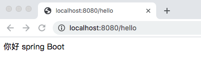

## JAVA第三阶段—DAY14-JAVA笔记
## 课程目录

[toc]

## 1. SpringBoot基本应用

### 1.1 约定优于配置

```
   Build Anything with Spring Boot：Spring Boot is the starting point for building all Spring-based applications. Spring Boot is designed to get you up and running as quickly as possible, with minimal upfront configuration of Spring.
```

​     上面是引自官网的一段话，大概是说： Spring Boot 是所有基于 Spring 开发的项目的起点。Spring Boot 的设计是为了让你尽可能快的跑起来 Spring 应用程序并且尽可能减少你的配置文件。


约定优于配置（Convention over Configuration），又称按约定编程，是一种软件设计范式。

本质上是说，系统、类库或框架应该假定合理的默认值，而非要求提供不必要的配置。比如说模型中有一个名为User的类，那么数据库中对应的表就会默认命名为user。只有在偏离这一个约定的时候，例如想要将该表命名为person，才需要写有关这个名字的配置。

比如平时架构师搭建项目就是限制软件开发随便写代码，制定出一套规范，让开发人员按统一的要求进行开发编码测试之类的，这样就加强了开发效率与审查代码效率。所以说写代码的时候就需要按要求命名，这样统一规范的代码就有良好的可读性与维护性了

约定优于配置简单来理解，就是遵循约定。


### 1.2 SpringBoot概念

#### 1.2.1 Spring优缺点分析

**优点：**

Spring是Java企业版（Java Enterprise Edition，JEE，也称J2EE）的轻量级代替品。无需开发重量级的Enterprise Java Bean（EJB），Spring为企业级Java开发提供了一种相对简单的方法，通过依赖注入和面向切面编程，用简单的Java对象（Plain Old Java Object，POJO）实现了EJB的功能 

**缺点：**

虽然**Spring的组件代码是轻量级的，但它的配置却是重量级的**。一开始，Spring用XML配置，而且是很多XML配 置。Spring 2.5引入了基于注解的组件扫描，这消除了大量针对应用程序自身组件的显式XML配置。Spring 3.0引入 了基于Java的配置，这是一种类型安全的可重构配置方式，可以代替XML。 

所有这些配置都代表了开发时的损耗。因为在思考Spring特性配置和解决业务问题之间需要进行思维切换，所以编写配置挤占了编写应用程序逻辑的时间。和所有框架一样，Spring实用，但与此同时它要求的回报也不少。 

除此之外，**项目的依赖管理也是一件耗时耗力的事情**。在环境搭建时，需要分析要导入哪些库的坐标，而且还需要分析导入与之有依赖关系的其他库的坐标，一旦选错了依赖的版本，随之而来的不兼容问题就会严重阻碍项目的开发进度 

SSM整合：Spring、Spring MVC、Mybatis、Spring-Mybatis整合包、数据库驱动，引入依赖的数量繁多、容易存在版本冲突。


#### 1.2.2 Spring Boot解决上述spring问题

SpringBoot对上述Spring的缺点进行的改善和优化，基于约定优于配置的思想，可以让开发人员不必在配置与逻辑 业务之间进行思维的切换，全身心的投入到逻辑业务的代码编写中，从而大大提高了开发的效率，一定程度上缩短 了项目周期。

**起步依赖** 

起步依赖本质上是一个Maven项目对象模型(Project Object Model，POM)，定义了对其他库的传递依赖，这些东西加在一起即支持某项功能。 

简单的说，起步依赖就是将具备某种功能的依赖坐标打包到一起，并提供一些默认的功能。

**自动配置**

springboot的自动配置，指的是springboot，会自动将一些配置类的bean注册进ioc容器，我们可以需要的地方使用@autowired或者@resource等注解来使用它。

“自动”的表现形式就是我们只需要引我们想用功能的包，相关的配置我们完全不用管，springboot会自动注入这些配置bean，我们直接使用这些bean即可

springboot: 简单、快速、方便地搭建项目；对主流开发框架的无配置集成；极大提高了开发、部署效率


### 1.3 Spring Boot入门案例

  案例需求：请求Controller中的方法，并将返回值响应到页面

#### （1）依赖管理

```xml
    <!--
        所用的Spring Boot项目都会直接或者间接的继承spring-boot-starter-parent
        1.指定项目的编码格式为UTF-8
        2.指定JDK版本为1.8
        3.对项目依赖的版本进行管理，当前项目再引入其他常用的依赖时就需要再指定版本号，避免版本冲突的问题
        4.默认的资源过滤和插件管理
        -->
    <parent>
        <groupId>org.springframework.boot</groupId>
        <artifactId>spring-boot-starter-parent</artifactId>
        <version>2.2.2.RELEASE</version>
    </parent>

    <dependencies>
        <!--引入Spring Web及Spring MVC相关的依赖-->
        <dependency>
            <groupId>org.springframework.boot</groupId>
            <artifactId>spring-boot-starter-web</artifactId>
        </dependency>
    </dependencies>

    <!--可以将project打包为一个可以执行的jar-->
    <build>
        <plugins>
            <plugin>
                <groupId>org.springframework.boot</groupId>
                <artifactId>spring-boot-maven-plugin</artifactId>
            </plugin>
        </plugins>
    </build>
```

#### (2)启动类

```java
/**
 * SpringBoot的启动类通常放在二级包中，比如：com.demo.SpringBootDemo1Application
 * 因为SpringBoot项目在做包扫描，会扫描启动类所在的包及其子包下的所有内容。
 */
//标识当前类为SpringBoot项目的启动类
@SpringBootApplication
public class SpringBootDemo1Application {

    public static void main(String[] args) {
        //样板代码
        SpringApplication.run(SpringBootDemo1Application.class,args);
    }

}
```

#### (3)Controller

```java
package com.demo.controller;

import org.springframework.web.bind.annotation.RequestMapping;
import org.springframework.web.bind.annotation.RestController;

@RestController
@RequestMapping("/hello")
public class HelloController {

    @RequestMapping("/boot")
    public String helloBoot(){
        return "Hello Spring Boot";
    }

}
```


### 1.4 SpringBoot 快速构建

   案例需求：请求Controller中的方法，并将返回值响应到页面

#### （1）使用Spring Initializr方式构建Spring Boot项目

​         本质上说，Spring Initializr是一个Web应用，它提供了一个基本的项目结构，能够帮助我们快速构建一个基础的Spring Boot项目  


​         Project SDK”用于设置创建项目使用的JDK版本，这里，使用之前初始化设置好的JDK版本即可；在“Choose Initializr Service URL（选择初始化服务地址）”下使用默认的初始化服务地址“https://start.spring.io”进行Spring Boot项目创建（注意使用快速方式创建Spring Boot项目时，所在主机须在联网状态下）  


Spring Boot项目就创建好了。创建好的Spring Boot项目结构如图：  


​         使用Spring Initializr方式构建的Spring Boot项目会默认生成项目启动类、存放前端静态资源和页面的文件夹、编写项目配置的配置文件以及进行项目单元测试的测试类  


#### **（2） 创建一个用于Web访问的Controller**  

​         com.demo包下创建名称为controller的包，在该包下创建一个请求处理控制类HelloController，并编写一个请求处理方法 **(注意：将项目启动类SpringBootDemoApplication移动到com.demo包下)**

```java
	@RestController // 该注解为组合注解，等同于Spring中@Controller+@ResponseBody注解
	public class DemoController {

    	@RequestMapping("/hello")
   	  public String demo(){
       	 return "hello spring Boot";
    	}
}
```


#### （3） 运行项目

​         运行主程序启动类SpringbootDemoApplication，项目启动成功后，在控制台上会发现Spring Boot项目默认启动的端口号为8080，此时，可以在浏览器上访问“http://localhost:8080/hello”  


页面输出的内容是“hello Spring Boot”，至此，构建Spring Boot项目就完成了  


### 1.5 单元测试与热部署

#### 1.5.1 单元测试

​         开发中，每当完成一个功能接口或业务方法的编写后，通常都会借助单元测试验证该功能是否正确。Spring Boot对项目的单元测试提供了很好的支持，在使用时，需要提前在项目的pom.xml文件中添加spring-boot-starter-test测试依赖启动器，可以通过相关注解实现单元测试

演示：

1．添加spring-boot-starter-test测试依赖启动器

在项目的pom.xml文件中添加spring-boot-starter-test测试依赖启动器，示例代码如下 ：

```xml
<dependency>
	<groupId>org.springframework.boot</groupId>
	<artifactId>spring-boot-starter-test</artifactId>
	<scope>test</scope>
</dependency>
```

注意：使用Spring Initializr方式搭建的Spring Boot项目，会自动加入spring-boot-starter-test测试依赖启动器，无需再手动添加  

2．编写单元测试类和测试方法

使用Spring Initializr方式搭建的Spring Boot项目，会在src.test.java测试目录下自动创建与项目主程序启动类对应的单元测试类  

```java
package com.demo;

import com.demo.controller.HelloController;
import org.junit.jupiter.api.Test;
import org.junit.runner.RunWith;
import org.junit.runners.JUnit4;
import org.springframework.beans.factory.annotation.Autowired;
import org.springframework.boot.test.context.SpringBootTest;
import org.springframework.test.context.junit4.SpringJUnit4ClassRunner;
import org.springframework.test.context.junit4.SpringRunner;

/**
 *  SpringJUnit4ClassRunner.class:Spring运行环境
 *  JUnit4.class:JUnit运行环境
 *  SpringRunner.class:Spring Boot运行环境
 */
@RunWith(SpringRunner.class) //@RunWith:运行器
@SpringBootTest //标记为当前类为SpringBoot测试类，加载项目的ApplicationContext上下文环境
class Springbootdemo2ApplicationTests {
    /**
     * 需求：调用HelloController的hello方法
     */

    @Autowired
    private HelloController helloController;


    @Test
    void contextLoads() {
        String result = helloController.hello();
        System.out.println(result);
    }

}
```

​         上述代码中，先使用@Autowired注解注入了DemoController实例对象，然后在contextLoads()方法中调用了DemoController类中对应的请求控制方法contextLoads()，并输出打印结果 

​                                         


#### 1.5.2 热部署

​         在开发过程中，通常会对一段业务代码不断地修改测试，在修改之后往往需要重启服务，有些服务需要加载很久才能启动成功，这种不必要的重复操作极大的降低了程序开发效率。为此，Spring Boot框架专门提供了进行热部署的依赖启动器，用于进行项目热部署，而无需手动重启项目 。

​		热部署：在修改完代码之后，不需要重新启动容器，就可以实现更新。 

使用步骤：

​	1）添加SpringBoot的热部署依赖启动器

​	2）开启Idea的自动编译

​	3）开启Idea的在项目运行中自动编译的功能

演示：

**1．添加spring-boot-devtools热部署依赖启动器**

在Spring Boot项目进行热部署测试之前，需要先在项目的pom.xml文件中添加spring-boot-devtools热部署依赖启动器:

```xml
<!-- 引入热部署依赖 -->
<dependency>
   <groupId>org.springframework.boot</groupId>
   <artifactId>spring-boot-devtools</artifactId>
</dependency>
```

​         由于使用的是IDEA开发工具，添加热部署依赖后可能没有任何效果，接下来还需要针对IDEA开发工具进行热部署相关的功能设置  

**2. IDEA工具热部署设置**

​         选择IDEA工具界面的【File】->【Settings】选项，打开Compiler面板设置页面  


​         选择Build下的Compiler选项，在右侧勾选“Build project automatically”选项将项目设置为自动编译，单击【Apply】→【OK】按钮保存设置  


​         在项目任意页面中使用组合快捷键“Ctrl+Shift+Alt+/”打开Maintenance选项框，选中并打开Registry页面，具体如图1-17所示  


​         列表中找到“compiler.automake.allow.when.app.running”，将该选项后的Value值勾选，用于指定IDEA工具在程序运行过程中自动编译，最后单击【Close】按钮完成设置  


3．热部署效果测试

启动chapter01http://localhost:8080/hello


页面原始输出的内容是“hello Spring Boot”。

为了测试配置的热部署是否有效，接下来，在不关闭当前项目的情况下，将DemoController 类中的请求处理方法hello()的返回值修改为“你好，Spring Boot”并保存，查看控制台信息会发现项目能够自动构建和编译，说明项目热部署生效  



可以看出，浏览器输出了“你好，Spring Boot”，说明项目热部署配置成功  


### 1.6 全局配置文件

全局配置文件能够对一些默认配置值进行修改。Spring Boot使用一个application.properties或者application.yaml的文件作为全局配置文件，该文件存放在src/main/resource目录或者类路径的/config，一般会选择resource目录。接下来，将针对这两种全局配置文件进行讲解 ：

Spring Boot配置文件的命名及其格式：

- application.properties

- application.yaml

- application.yml

#### 1.6.1 application.properties配置文件

使用Spring Initializr方式构建Spring Boot项目时，会在resource目录下自动生成一个空的application.properties文件，Spring Boot项目启动时会自动加载application.properties文件。

我们可以在application.properties文件中定义Spring Boot项目的相关属性，当然，这些相关属性可以是系统属性、环境变量、命令参数等信息，也可以是自定义配置文件名称和位置  

```properties
#修改tomcat的版本号
server.port=8888
#定义数据库的连接信息  JdbcTemplate
spring.datasource.driver-class-name=com.mysql.cj.jdbc.Driver
spring.datasource.url=jdbc:mysql://localhost:3306/demodb
spring.datasource.username=root
spring.datasource.password=123456
```

接下来，通过一个案例对Spring Boot项目中application.properties配置文件的具体使用进行讲解  

演示：

 预先准备了两个实体类文件，后续会演示将application.properties配置文件中的自定义配置属性注入到Person实体类的对应属性中

（1）先在项目的com.demo包下创建一个pojo包，并在该包下创建两个实体类Pet和Person  

```java
public class Pet {
    private String type;
    private String name;
}
```

```java
@Component
@ConfigurationProperties(prefix = "person")
public class Person {
    private int id;            //id
    private String name;      //名称
    private List hobby;       //爱好
    private String[] family; //家庭成员
    private Map map;
    private Pet pet;          //宠物
}
```

@ConfigurationProperties(prefix = "person")注解的作用是将配置文件中以person开头的属性值通过setXX()方法注入到实体类对应属性中

@Component注解的作用是将当前注入属性值的Person类对象作为Bean组件放到Spring容器中，只有这样才能被@ConfigurationProperties注解进行赋值 


（2）打开项目的resources目录下的application.properties配置文件，在该配置文件中编写需要对Person类设置的配置属性

```properties
#自定义配置信息
person.id=1
person.name=王二麻子
person.hobby=read,write
person.family=father,mather
person.map.key1=value1
person.map.key2=value2
person.pet.type=dog
person.pet.name=哈士奇
```


（3）查看application.properties配置文件是否正确，同时查看属性配置效果，打开通过IDEA工具创建的项目测试类，在该测试类中引入Person实体类Bean，并进行输出测试  

```java
@RunWith(SpringRunner.class) // 测试启动器，并加载Spring Boot测试注解
@SpringBootTest  // 标记为Spring Boot单元测试类，并加载项目的ApplicationContext上下文环境
class SpringbootDemoApplicationTests {

 // 配置测试
 @Autowired
 private Person person;

 @Test
 void configurationTest() {
    System.out.println(person);
 }
}
```

打印结果：


可以看出，测试方法configurationTest()运行成功，同时正确打印出了Person实体类对象。至此，说明application.properties配置文件属性配置正确，并通过相关注解自动完成了属性注入  

（4）中文乱码问题解决

   调整文件编码格式：


  设置Tomcat及Http编码

```properties
#解决中文乱码
server.tomcat.uri-encoding=UTF-8
spring.http.encoding.force=true
spring.http.encoding.charset=UTF-8
spring.http.encoding.enabled=true
```


#### 1.6.2  application.yaml配置文件  

YAML文件格式是Spring Boot支持的一种JSON文件格式，相较于传统的Properties配置文件，YAML文件以数据为核心，是一种更为直观且容易被电脑识别的数据序列化格式。application.yaml配置文件的工作原理和application.properties是一样的，只不过yaml格式配置文件看起来更简洁一些。

* YAML文件的扩展名可以使用.yml或者.yaml。 
* application.yml文件使用 “key:（空格）value”格式配置属性，使用缩进控制**层级关系**。


**SpringBoot的三种配置文件是可以共存的：**


这里，针对不同数据类型的属性值，介绍一下YAML

（1）value值为普通数据类型（例如数字、字符串、布尔等）  

​         当YAML配置文件中配置的属性值为普通数据类型时，可以直接配置对应的属性值，同时对于字符串类型的属性值，不需要额外添加引号，示例代码如下  

```yaml
server:
  port: 8080
  servlet:
    context-path: /hello
```

  

（2）value值为数组和单列集合

**当YAML配置文件中配置的属性值为数组或单列集合类型时，主要有两种书写方式：缩进式写法和行内式写法。**

其中，缩进式写法还有两种表示形式，示例代码如下

```yaml
person: 
  hobby: 
    - play
    - read
    - sleep 
```

​      或者使用如下示例形式  

```yaml
person:
  hobby:
    play,
    read,
    sleep
```

上述代码中，在YAML配置文件中通过两种缩进式写法对person对象的单列集合（或数组）类型的爱好hobby赋值为play、read和sleep。其中一种形式为“-（空格）属性值”，另一种形式为多个属性值之前加英文逗号分隔（注意，最后一个属性值后不要加逗号）。

```yaml
person: 
  hobby: [play,read,sleep]
```

​         通过上述示例对比发现，YAML配置文件的行内式写法更加简明、方便。另外，包含属性值的中括号“[]”还可以进一步省略，在进行属性赋值时，程序会自动匹配和校对  

（3）value值为Map集合和对象

当YAML配置文件中配置的属性值为Map集合或对象类型时，YAML配置文件格式同样可以分为两种书写方式：缩进式写法和行内式写法。

其中，缩进式写法的示例代码如下

```yaml
person: 
  map: 
    k1: v1
    k2: v2
```

对应的行内式写法示例代码如下  

```yaml
person:
  map: {k1: v1,k2: v2}
```

在YAML配置文件中，配置的属性值为Map集合或对象类型时，缩进式写法的形式按照YAML文件格式编写即可，而行内式写法的属性值要用大括号“{}”包含。

接下来，在Properties配置文件演示案例基础上，通过配置application.yaml配置文件对Person对象进行赋值，具体使用如下  

（1）在项目的resources目录下，新建一个application.yaml配置文件，在该配置文件中编写为Person类设置的配置属性 

```yaml
#对实体类对象Person进行属性配置
person:
  id: 1
  name: 王二麻子
  family:
    - 妻
    - 妾
  hobby:
    - play
    - read
    - sleep
  map:
    k1: value1
    k2: value2
  pet:
    type: 狗
    name: 哈士奇
```

（2）再次执行测试

**Person{id=1, name='王二麻子', hobby=[play, read, sleep], family=[妻, 妾], map={k1=value1, k2=value2}, pet=Pet{type='狗', name='哈士奇'}}**


可以看出，测试方法configurationTest()同样运行成功，并正确打印出了Person实体类对象。

需要**说明**的是，本次使用application.yaml配置文件进行测试时需要提前将application.properties配置文件中编写的配置注释，这是因为application.properties配置文件会覆盖application.yaml配置文件  


### **1.7  配置文件属性值的注入**

配置文件的优先级如下： 从低到高

```xml
 		<includes>
          <include>**/application*.yml</include>
          <include>**/application*.yaml</include>
          <include>**/application*.properties</include>
        </includes>
```


 使用Spring Boot全局配置文件设置属性时：

如果配置属性是Spring Boot已有属性，例如服务端口server.port，那么Spring Boot内部会自动扫描并读取这些配置文件中的属性值并覆盖默认属性。

如果配置的属性是用户自定义属性，例如刚刚自定义的Person实体类属性，还必须在程序中注入这些配置属性方可生效。

Spring Boot支持多种注入配置文件属性的方式，下面来介绍如何使用注解@ConfigurationProperties和@Value注入属性  

#### 1.7.1   使用@ConfigurationProperties注入属性

Spring Boot提供的@ConfigurationProperties注解用来快速、方便地将配置文件中的自定义属性值批量注入到某个Bean对象的多个对应属性中。假设现在有一个配置文件，如果使用@ConfigurationProperties注入配置文件的属性，示例代码如下：

```java
@Component
//将配置文件中所有以person开头的配置信息注入当前类中
//前提1：必须保证配置文件中person.xx与当前Person类的属性名一致
//前提2：必须保证当前Person中的属性都具有set方法
@ConfigurationProperties(prefix = "person")
public class Person {
    private int id;            //id
    private String name;      //名称
    private List hobby;       //爱好
    private String[] family;  //家庭成员
    private Map map;
    private Pet pet;          //宠物
}
```

上述代码使用@Component和@ConfigurationProperties(prefix = “person”)将配置文件中的每个属性映射到person类组件中。


#### 1.7.2 使用@Value注入属性

 @Value注解是Spring框架提供的，用来读取配置文件中的属性值并逐个注入到Bean对象的对应属性中，Spring Boot框架从Spring框架中对@Value注解进行了默认继承，所以在Spring Boot框架中还可以使用该注解读取和注入配置文件属性值。使用@Value注入属性的示例代码如下  

```java
@Component
public class Person {
@Value("${person.id}")
    private int id;      
}
```

​         上述代码中，使用@Component和@Value注入Person实体类的id属性。其中，@Value不仅可以将配置文件的属性注入Person的id属性，还可以直接给id属性赋值，这点是@ConfigurationProperties不支持的  

演示@Value注解读取并注入配置文件属性的使用:

​         （1）在com.demo.pojo包下新创建一个实体类Student，并使用@Value注解注入属性  

```java
@Component
public class Student {

      @Value("${person.id}")
 	  private int id;
 	    @Value("${person.name}")
      private String name; //名称
      
      //省略toString
   }
```

Student类使用@Value注解将配置文件的属性值读取和注入。

从上述示例代码可以看出，使用@Value注解方式需要对每一个属性注入设置，同时又免去了属性的setXX()方法  

​	（2）再次打开测试类进行测试

```java
@Autowired
private Student student;
 @Test
 public void studentTest() {
	System.out.println(student);
 }
```

打印结果：


​         可以看出，测试方法studentTest()运行成功，同时正确打印出了Student实体类对象。需要说明的是，本示例中只是使用@Value注解对实例中Student对象的普通类型属性进行了赋值演示，而@Value注解对于包含Map集合、对象以及YAML文件格式的行内式写法的配置文件的属性注入都不支持，如果赋值会出现错误  


