##JAVA第三阶段—DAY15-JAVA笔记
目录

[toc]

## 1. SpringBoot原理深入及源码剖析

​         传统的Spring框架实现一个Web服务，需要导入各种依赖JAR包，然后编写对应的XML配置文件等，相较而言，Spring Boot显得更加方便、快捷和高效。那么，Spring Boot究竟如何做到这些的呢？

接下来分别针对Spring Boot框架的依赖管理、自动配置通过源码进行深入分析


### 1.1 依赖管理

​	问题：（1）为什么导入dependency时不需要指定版本？

​         在Spring Boot入门程序中，项目pom.xml文件有两个核心依赖，分别是spring-boot-starter-parent和spring-boot-starter-web，关于这两个依赖的相关介绍具体如下：

**1．spring-boot-starter-parent依赖**

在chapter01项目中的pom.xml文件中找到spring-boot-starter-parent依赖，示例代码如下:

```xml
<!-- Spring Boot父项目依赖管理 -->
	<parent>
		<groupId>org.springframework.boot</groupId>
		<artifactId>spring-boot-starter-parent<11./artifactId>
		<version>2.2.2.RELEASE</version>
		<relativePath/> <!-- lookup parent from repository -->
	</parent>
```

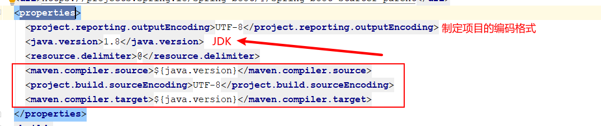         

上述代码中，将spring-boot-starter-parent依赖作为Spring Boot项目的统一父项目依赖管理，并将项目版本号统一为2.2.2.RELEASE，该版本号根据实际开发需求是可以修改的    

​         使用“Ctrl+鼠标左键”进入并查看spring-boot-starter-parent底层源文件，发现spring-boot-starter-parent的底层有一个父依赖spring-boot-dependencies，核心代码具体如下  

```xml
<parent>
	<groupId>org.springframework.boot</groupId>
	<artifactId>spring-boot-dependencies</artifactId>
	<version>2.2.2.RELEASE</version>
	<relativePath>../../spring-boot-dependencies</relativePath>
</parent>
```

继续查看spring-boot-dependencies底层源文件，核心代码具体如下：

```xml
<properties>
  <activemq.version>5.15.11</activemq.version>
  ...
    <solr.version>8.2.0</solr.version>
    <mysql.version>8.0.18</mysql.version>
    <kafka.version>2.3.1</kafka.version>
    <spring-amqp.version>2.2.2.RELEASE</spring-amqp.version>
    <spring-restdocs.version>2.0.4.RELEASE</spring-restdocs.version>
    <spring-retry.version>1.2.4.RELEASE</spring-retry.version>
    <spring-security.version>5.2.1.RELEASE</spring-security.version>
    <spring-session-bom.version>Corn-RELEASE</spring-session-bom.version>
    <spring-ws.version>3.0.8.RELEASE</spring-ws.version>
    <sqlite-jdbc.version>3.28.0</sqlite-jdbc.version>
    <sun-mail.version>${jakarta-mail.version}</sun-mail.version>
    <tomcat.version>9.0.29</tomcat.version>
    <thymeleaf.version>3.0.11.RELEASE</thymeleaf.version>
    <thymeleaf-extras-data-attribute.version>2.0.1</thymeleaf-extras-data-attribute.version>
		...
  </properties>
```

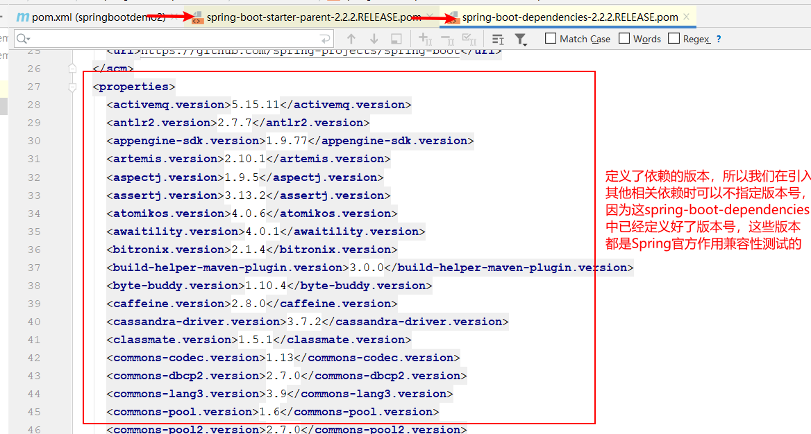 

 从spring-boot-dependencies底层源文件可以看出，该文件通过<properties>标签对一些常用技术框架的依赖文件进行了统一版本号管理，例如activemq、spring、tomcat等，都有与Spring Boot 2.2.2版本相匹配的版本，这也是pom.xml引入依赖文件不需要标注依赖文件版本号的原因。

需要说明的是，如果pom.xml引入的依赖文件不是 spring-boot-starter-parent管理的，那么在pom.xml引入依赖文件时，需要使用<version>标签指定依赖文件的版本号。

（2）问题2： spring-boot-starter-parent父依赖启动器的主要作用是进行版本统一管理，那么项目运行依赖的JAR包是从何而来的？

 **2. spring-boot-starter-web依赖**

​    查看spring-boot-starter-web依赖文件源码，核心代码具体如下

```xml
<dependencies>
  <dependency>
    <groupId>org.springframework.boot</groupId>
    <artifactId>spring-boot-starter</artifactId>
    <version>2.2.2.RELEASE</version>
    <scope>compile</scope>
  </dependency>
  <dependency>
    <groupId>org.springframework.boot</groupId>
    <artifactId>spring-boot-starter-json</artifactId>
    <version>2.2.2.RELEASE</version>
    <scope>compile</scope>
  </dependency>
  <dependency>
    <groupId>org.springframework.boot</groupId>
    <artifactId>spring-boot-starter-tomcat</artifactId>
    <version>2.2.2.RELEASE</version>
    <scope>compile</scope>
  </dependency>
  <dependency>
    <groupId>org.springframework.boot</groupId>
    <artifactId>spring-boot-starter-validation</artifactId>
    <version>2.2.2.RELEASE</version>
    <scope>compile</scope>
    <exclusions>
      <exclusion>
        <artifactId>tomcat-embed-el</artifactId>
        <groupId>org.apache.tomcat.embed</groupId>
      </exclusion>
    </exclusions>
  </dependency>
  <dependency>
    <groupId>org.springframework</groupId>
    <artifactId>spring-web</artifactId>
    <version>5.2.2.RELEASE</version>
    <scope>compile</scope>
  </dependency>
  <dependency>
    <groupId>org.springframework</groupId>
    <artifactId>spring-webmvc</artifactId>
    <version>5.2.2.RELEASE</version>
    <scope>compile</scope>
  </dependency>
</dependencies>
```

从上述代码可以发现，spring-boot-starter-web依赖启动器的主要作用是提供Web开发场景所需的底层所有依赖

正是如此，在pom.xml中引入spring-boot-starter-web依赖启动器时，就可以实现Web场景开发，而不需要额外导入Tomcat服务器以及其他Web依赖文件等。当然，这些引入的依赖文件的版本号还是由spring-boot-starter-parent父依赖进行的统一管理。

有哪些starter：

https://github.com/spring-projects/spring-boot/tree/v2.1.0.RELEASE/spring-boot-project/spring-boot-starters

https://mvnrepository.com/search?q=starter

​         Spring Boot除了提供有上述介绍的Web依赖启动器外，还提供了其他许多开发场景的相关依赖，我们可以打开Spring Boot官方文档，搜索“Starters”关键字查询场景依赖启动器  

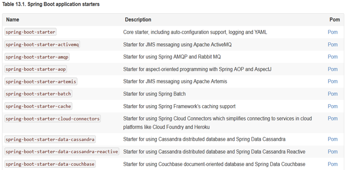

列出了Spring Boot官方提供的部分场景依赖启动器，这些依赖启动器适用于不同的场景开发，使用时只需要在pox.xml文件中导入对应的依赖启动器即可。

需要说明的是，Spring Boot官方并不是针对所有场景开发的技术框架都提供了场景启动器，例如数据库操作框架MyBatis、阿里巴巴的Druid数据源等，Spring Boot官方就没有提供对应的依赖启动器。为了充分利用Spring Boot框架的优势，在Spring Boot官方没有整合这些技术框架的情况下，MyBatis、Druid等技术框架所在的开发团队主动与Spring Boot框架进行了整合，实现了各自的依赖启动器，例如mybatis-spring-boot-starter、druid-spring-boot-starter等。我们在pom.xml文件中引入这些第三方的依赖启动器时，切记要配置对应的版本号  


### 1.2 自动配置

概念：能够在我们添加jar包依赖的时候，自动为我们配置一些组件的相关配置，我们无需配置或者只需要少量配置就能运行编写的项目

问题：**Spring Boot到底是如何进行自动配置的，都把哪些组件进行了自动配置？**

Spring Boot应用的启动入口是@SpringBootApplication注解标注类中的main()方法，        

  `@SpringBootApplication`：`SpringBoot`应用标注在某个类上说明这个类是`SpringBoot`的主配置类，`SpringBoot`就应该运行这个类的`main()`方法启动`SpringBoot`应用。

下面，查看@SpringBootApplication内部源码进行分析 ，核心代码具体如下

```java
@SpringBootApplication
public class SpringbootDemoApplication {

   public static void main(String[] args) {
      SpringApplication.run(SpringbootDemoApplication.class, args);
   }
}
```

 进入到`@SpringBootApplication`内，观察其做了哪些工作：

```java
@Target({ElementType.TYPE}) //注解的适用范围,Type表示注解可以描述在类、接口、注解或枚举中
@Retention(RetentionPolicy.RUNTIME) //表示注解的生命周期，Runtime运行时
@Documented //表示注解可以记录在javadoc中
@Inherited  //表示可以被子类继承该注解
@SpringBootConfiguration     // 标明该类为配置类
@EnableAutoConfiguration     // 启动自动配置功能
@ComponentScan(excludeFilters = { @Filter(type = FilterType.CUSTOM, classes = TypeExcludeFilter.class),
		@Filter(type = FilterType.CUSTOM, classes = AutoConfigurationExcludeFilter.class) })
public @interface SpringBootApplication {

	// 根据class来排除特定的类，使其不能加入spring容器，传入参数value类型是class类型。
	@AliasFor(annotation = EnableAutoConfiguration.class)
	Class<?>[] exclude() default {};

	// 根据classname 来排除特定的类，使其不能加入spring容器，传入参数value类型是class的全类名字符串数组。
	@AliasFor(annotation = EnableAutoConfiguration.class)
	String[] excludeName() default {};

	// 指定扫描包，参数是包名的字符串数组。
	@AliasFor(annotation = ComponentScan.class, attribute = "basePackages")
	String[] scanBasePackages() default {};

	// 扫描特定的包，参数类似是Class类型数组。
	@AliasFor(annotation = ComponentScan.class, attribute = "basePackageClasses")
	Class<?>[] scanBasePackageClasses() default {};
}
```

​         从上述源码可以看出，@SpringBootApplication注解是一个组合注解，前面 4 个是注解的元数据信息， 我们主要看后面 3 个注解：@SpringBootConfiguration、@EnableAutoConfiguration、@ComponentScan三个核心注解，关于这三个核心注解的相关说明具体如下：


**1．@SpringBootConfiguration注解**

`@SpringBootConfiguration`：`SpringBoot`的配置类，标注在某个类上，表示这是一个`SpringBoot`的配置类。

查看@SpringBootConfiguration注解源码，核心代码具体如下。 

```java
@Target({ElementType.TYPE})
@Retention(RetentionPolicy.RUNTIME)
@Documented

@Configuration // 配置类的作用等同于配置文件，配置类也是容器中的一个对象
public @interface SpringBootConfiguration {
}
```

​         从上述源码可以看出，@SpringBootConfiguration注解内部有一个核心注解@Configuration，该注解是Spring框架提供的，表示当前类为一个配置类（XML配置文件的注解表现形式），并可以被组件扫描器扫描。由此可见，**@SpringBootConfiguration注解的作用与@Configuration注解相同，都是标识一个可以被组件扫描器扫描的配置类，只不过@SpringBootConfiguration是被Spring Boot进行了重新封装命名而已 **


**2．@EnableAutoConfiguration注解**

`@EnableAutoConfiguration`：开启自动配置功能，以前由我们需要配置的东西，现在由`SpringBoot`帮我们自动配置，这个注解就是`Springboot`能实现自动配置的关键。        

同样，查看该注解内部查看源码信息，核心代码具体如下  

```java
// 自动配置包
@AutoConfigurationPackage

// Spring的底层注解@Import，给容器中导入一个组件；
// 导入的组件是AutoConfigurationPackages.Registrar.class 
@Import(AutoConfigurationImportSelector.class)

// 告诉SpringBoot开启自动配置功能，这样自动配置才能生效。
public @interface EnableAutoConfiguration {

	String ENABLED_OVERRIDE_PROPERTY = "spring.boot.enableautoconfiguration";

	// 返回不会被导入到 Spring 容器中的类
	Class<?>[] exclude() default {};

	// 返回不会被导入到 Spring 容器中的类名
	String[] excludeName() default {};

}
```

​       

 		可以发现它是一个组合注解， `Spring` 中有很多以`Enable`开头的注解，其作用就是借助`@Import`来收集并注册特定场景相关的`Bean`，并加载到`IOC`容器。@EnableAutoConfiguration就是借助@Import来收集所有符合自动配置条件的bean定义，并加载到IoC容器。

 下面，对这两个核心注解分别讲解 :

**（1）@AutoConfigurationPackage注解**

查看@AutoConfigurationPackage注解内部源码信息，核心代码具体如下：

```java
@Target({ElementType.TYPE})
@Retention(RetentionPolicy.RUNTIME)
@Documented
@Inherited
@Import({Registrar.class})      // 导入Registrar中注册的组件
public @interface AutoConfigurationPackage {
}
```

​         从上述源码可以看出，@AutoConfigurationPackage注解的功能是由@Import注解实现的，它是spring框架的底层注解，它的作用就是给容器中导入某个组件类，例如@Import(AutoConfigurationPackages.Registrar.class)，它就是将Registrar这个组件类导入到容器中，可查看Registrar类中registerBeanDefinitions方法，这个方法就是导入组件类的具体实现 :

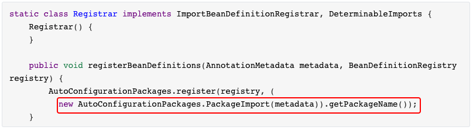

​         从上述源码可以看出，在Registrar类中有一个registerBeanDefinitions()方法，使用Debug模式启动项目，	可以看到选中的部分就是com.demo。也就是说，@AutoConfigurationPackage注解的主要作用就是将主程序类所在包及所有子包下的组件到扫描到spring容器中。

因此 在定义项目包结构时，要求定义的包结构非常规范，项目主程序启动类要定义在最外层的根目录位置，然后在根目录位置内部建立子包和类进行业务开发，这样才能够保证定义的类能够被组件扫描器扫描  


  （2）**@Import({AutoConfigurationImportSelector.class})注解**

将`AutoConfigurationImportSelector`这个类导入到`Spring`容器中，`AutoConfigurationImportSelector`可以帮助`Springboot`应用将所有符合条件的`@Configuration`配置都加载到当前`SpringBoot`创建并使用的`IOC`容器(`ApplicationContext`)中。

继续研究**AutoConfigurationImportSelector**这个类，通过源码分析这个类中是通过selectImports这个方法告诉springboot都需要导入那些组件：

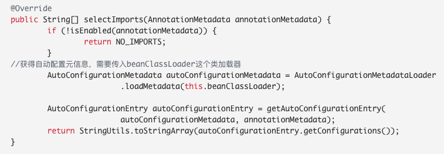

**深入研究loadMetadata方法** 

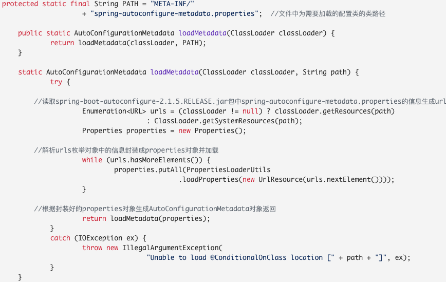       


**AutoConfigurationImportSelector类 getAutoConfigurationEntry方法**

```java
	protected AutoConfigurationEntry getAutoConfigurationEntry(AutoConfigurationMetadata autoConfigurationMetadata,
			AnnotationMetadata annotationMetadata) {
        //判断EnabledAutoConfiguration注解有没有开启,默认开启
		if (!isEnabled(annotationMetadata)) {
			return EMPTY_ENTRY;
		}
        //获得注解的属性信息
		AnnotationAttributes attributes = getAttributes(annotationMetadata);
        //获取默认支持的自动配置类列表
		List<String> configurations = getCandidateConfigurations(annotationMetadata, attributes);
        //去重
		configurations = removeDuplicates(configurations);
        //去除一些多余的配置类，根据EnabledAutoConfiguratio的exclusions属性进行排除
		Set<String> exclusions = getExclusions(annotationMetadata, attributes);
		checkExcludedClasses(configurations, exclusions);
		configurations.removeAll(exclusions);
        //根据pom文件中加入的依赖文件筛选中最终符合当前项目运行环境对应的自动配置类
		configurations = filter(configurations, autoConfigurationMetadata);
        //触发自动配置导入监听事件
		fireAutoConfigurationImportEvents(configurations, exclusions);
		return new AutoConfigurationEntry(configurations, exclusions);
	}
```


**深入getCandidateConfigurations方法**

这个方法中有一个重要方法loadFactoryNames，这个方法是让SpringFactoryLoader去加载一些组件的名字。

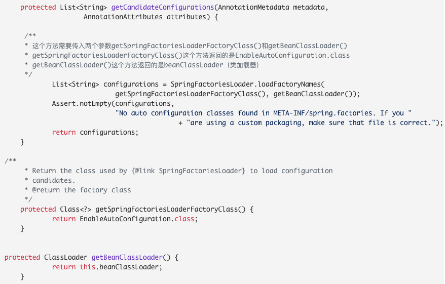

继续点开loadFactory方法

```java
 public static List<String> loadFactoryNames(Class<?> factoryClass, @Nullable ClassLoader classLoader) {
        
        //获取出入的键
        String factoryClassName = factoryClass.getName();
        return (List)loadSpringFactories(classLoader).getOrDefault(factoryClassName, Collections.emptyList());
    }

    private static Map<String, List<String>> loadSpringFactories(@Nullable ClassLoader classLoader) {
        MultiValueMap<String, String> result = (MultiValueMap)cache.get(classLoader);
        if (result != null) {
            return result;
        } else {
            try {
              
                //如果类加载器不为null，则加载类路径下spring.factories文件，将其中设置的配置类的全路径信息封装 为Enumeration类对象
                Enumeration<URL> urls = classLoader != null ? classLoader.getResources("META-INF/spring.factories") : ClassLoader.getSystemResources("META-INF/spring.factories");
                LinkedMultiValueMap result = new LinkedMultiValueMap();

                //循环Enumeration类对象，根据相应的节点信息生成Properties对象，通过传入的键获取值，在将值切割为一个个小的字符串转化为Array，方法result集合中
                while(urls.hasMoreElements()) {
                    URL url = (URL)urls.nextElement();
                    UrlResource resource = new UrlResource(url);
                    Properties properties = PropertiesLoaderUtils.loadProperties(resource);
                    Iterator var6 = properties.entrySet().iterator();

                    while(var6.hasNext()) {
                        Entry<?, ?> entry = (Entry)var6.next();
                        String factoryClassName = ((String)entry.getKey()).trim();
                        String[] var9 = StringUtils.commaDelimitedListToStringArray((String)entry.getValue());
                        int var10 = var9.length;

                        for(int var11 = 0; var11 < var10; ++var11) {
                            String factoryName = var9[var11];
                            result.add(factoryClassName, factoryName.trim());
                        }
                    }
                }

                cache.put(classLoader, result);
                return result;
```


会去读取一个 spring.factories 的文件，读取不到会表这个错误，我们继续根据会看到，最终路径的长这样，而这个是spring提供的一个工具类

```java
public final class SpringFactoriesLoader {
    public static final String FACTORIES_RESOURCE_LOCATION = "META-INF/spring.factories";
}
```

它其实是去加载一个外部的文件，而这文件是在

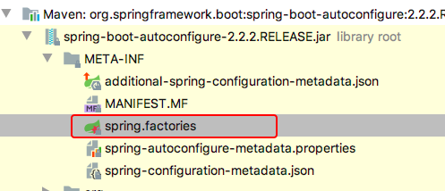

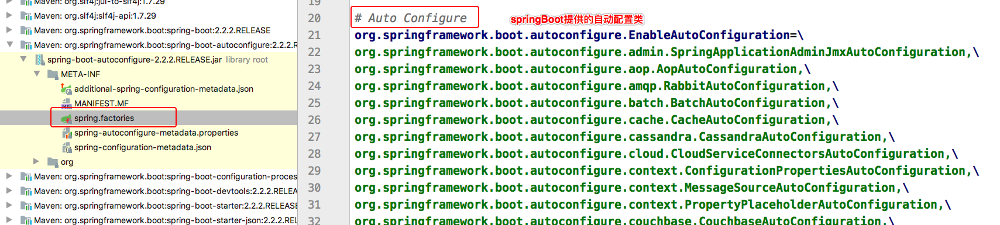

@EnableAutoConfiguration就是从classpath中搜寻META-INF/spring.factories配置文件，并将其中org.springframework.boot.autoconfigure.EnableutoConfiguration对应的配置项通过反射（Java Refletion）实例化为对应的标注了@Configuration的JavaConfig形式的配置类，并加载到IOC容器中       

 以刚刚的项目为例，在项目中加入了Web环境依赖启动器，对应的WebMvcAutoConfiguration自动配置类就会生效，打开该自动配置类会发现，在该配置类中通过全注解配置类的方式对Spring MVC运行所需环境进行了默认配置，包括默认前缀、默认后缀、视图解析器、MVC校验器等。而这些自动配置类的本质是传统Spring MVC框架中对应的XML配置文件，只不过在Spring Boot中以自动配置类的形式进行了预先配置。因此，在Spring Boot项目中加入相关依赖启动器后，基本上不需要任何配置就可以运行程序，当然，我们也可以对这些自动配置类中默认的配置进行更改  

**总结**

   因此springboot底层实现自动配置的步骤是：

1. springboot应用启动；

2. @SpringBootApplication起作用；

3. @EnableAutoConfiguration；

4. @AutoConfigurationPackage：这个组合注解主要是@Import(AutoConfigurationPackages.Registrar.class)，它通过将Registrar类导入到容器中，而Registrar类作用是扫描主配置类同级目录以及子包，并将相应的组件导入到springboot创建管理的容器中；

5. @Import(AutoConfigurationImportSelector.class)：它通过将AutoConfigurationImportSelector类导入到容器中，AutoConfigurationImportSelector类作用是通过selectImports方法执行的过程中，会使用内部工具类SpringFactoriesLoader，查找classpath上所有jar包中的META-INF/spring.factories进行加载，实现将配置类信息交给SpringFactory加载器进行一系列的容器创建过程

   

**3. @ComponentScan注解**  

​         @ComponentScan注解具体扫描的包的根路径由Spring Boot项目主程序启动类所在包位置决定，在扫描过程中由前面介绍的@AutoConfigurationPackage注解进行解析，从而得到Spring Boot项目主程序启动类所在包的具体位置  

总结：

 @SpringBootApplication 的注解的功能就分析差不多了， 简单来说就是 3 个注解的组合注解：

```java
|- @SpringBootConfiguration
   |- @Configuration  //通过javaConfig的方式来添加组件到IOC容器中
|- @EnableAutoConfiguration
   |- @AutoConfigurationPackage //自动配置包，与@ComponentScan扫描到的添加到IOC
   |- @Import(AutoConfigurationImportSelector.class) //到META-INF/spring.factories中定义的bean添加到IOC容器中
|- @ComponentScan //包扫描
```


## 2. SpringBoot数据访问

### 2.1 Spring Boot整合MyBatis

​         MyBatis 是一款优秀的持久层框架，Spring Boot官方虽然没有对MyBatis进行整合，但是MyBatis团队自行适配了对应的启动器，进一步简化了使用MyBatis进行数据的操作  

​         因为Spring Boot框架开发的便利性，所以实现Spring Boot与数据访问层框架（例如MyBatis）的整合非常简单，主要是引入对应的依赖启动器，并进行数据库相关参数设置即可  

#### **基础环境搭建**：

##### （1）数据准备

​         在MySQL中，先创建了一个数据库springbootdata，然后创建了两个表t_article和t_comment并向表中插入数据。其中评论表t_comment的a_id与文章表t_article的主键id相关联  

```sql
	# 创建数据库
	CREATE DATABASE springbootdata;
	# 选择使用数据库
 	USE springbootdata;
	# 创建表t_article并插入相关数据
	DROP TABLE IF EXISTS t_article;
 	CREATE TABLE t_article (
	  id int(20) NOT NULL AUTO_INCREMENT COMMENT '文章id',
	  title varchar(200) DEFAULT NULL COMMENT '文章标题',
 	  content longtext COMMENT '文章内容',
 	  PRIMARY KEY (id)
 	) ENGINE=InnoDB AUTO_INCREMENT=2 DEFAULT CHARSET=utf8;
	INSERT INTO t_article VALUES ('1', 'Spring Boot基础入门', '从入门到精通讲解...');
	INSERT INTO t_article VALUES ('2', 'Spring Cloud基础入门', '从入门到精通讲解...');
	
 	# 创建表t_comment并插入相关数据
	DROP TABLE IF EXISTS t_comment;
	CREATE TABLE t_comment (
	  id int(20) NOT NULL AUTO_INCREMENT COMMENT '评论id',
 	  content longtext COMMENT '评论内容',
	  author varchar(200) DEFAULT NULL COMMENT '评论作者',
	  a_id int(20) DEFAULT NULL COMMENT '关联的文章id',
	  PRIMARY KEY (id)
	) ENGINE=InnoDB AUTO_INCREMENT=3 DEFAULT CHARSET=utf8;
	INSERT INTO t_comment VALUES ('1', '很全、很详细', 'lucy', '1');
	INSERT INTO t_comment VALUES ('2', '赞一个', 'tom', '1');
	INSERT INTO t_comment VALUES ('3', '很详细', 'eric', '1');
	INSERT INTO t_comment VALUES ('4', '很好，非常详细', '张三', '1');
	INSERT INTO t_comment VALUES ('5', '很不错', '李四', '2');

```


##### （2）创建项目，引入相应的启动器      

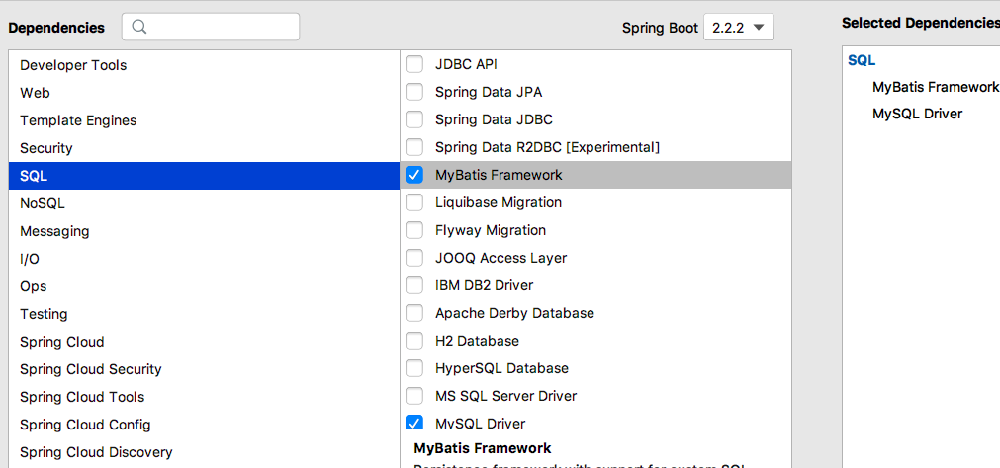


##### （3）编写与数据库表t_comment和t_article对应的实体类Comment和Article

```java
public class Comment {
    private Integer id;
    private String content;
    private String author;
    private Integer aId;
}
```

```java
public class Article {

    private Integer id;
    private String title;
    private String content;
}
```

##### （4）编写配置文件

   （1）在application.properties配置文件中进行数据库连接配置

```properties
# MySQL数据库连接配置
spring:
  datasource:
    driver-class-name: com.mysql.cj.jdbc.Driver
    url: jdbc:mysql://localhost:3306/springbootdata?serverTimezone=UTC&characterEncoding=UTF-8
    username: root
    password: wu7787879
```


#### **注解方式整合Mybatis**

需求：实现通过ID查询Comment信息

#####   （1）创建一个对t_comment表数据操作的接口CommentMapper  

```java

 	public interface CommentMapper {
 	    @Select("SELECT * FROM t_comment WHERE id =#{id}")
 	    public Comment findById(Integer id);
 	}
```

##### （2）在Spring Boot项目启动类上添加@MapperScan("xxx")注解

```java
@SpringBootApplication
@MapperScan("com.demo.mapper")
public class Springboot02MybatisApplication {

    public static void main(String[] args) {
        SpringApplication.run(Springboot02MybatisApplication.class, args);
    }

}
```

##### （3）编写测试方法

```java
@RunWith(SpringRunner.class)
@SpringBootTest
class SpringbootPersistenceApplicationTests {

    @Autowired
    private CommentMapper commentMapper;

    @Test
    void contextLoads() {
        Comment comment = commentMapper.findById(1);
        System.out.println(comment);
    }
}
```

打印结果：

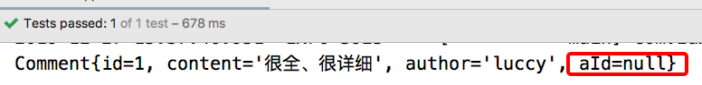

​         控制台中查询的Comment的aId属性值为null，没有映射成功。这是因为编写的实体类Comment中使用了驼峰命名方式将t_comment表中的a_id字段设计成了aId属性，所以无法正确映射查询结果。

为了解决上述由于驼峰命名方式造成的表字段值无法正确映射到类属性的情况，可以在Spring Boot全局配置文件application.properties中添加开启驼峰命名匹配映射配置，示例代码如下  

```properties
#开启驼峰命名匹配映射
mybatis:
  configuration:
    map-underscore-to-camel-case: true
```

打印结果：

​                           	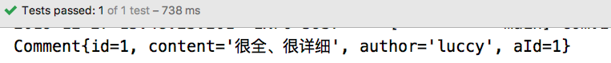


#### 配置文件的方式整合MyBatis

第一、二步骤使用**Free Mybatis plugin**插件生成

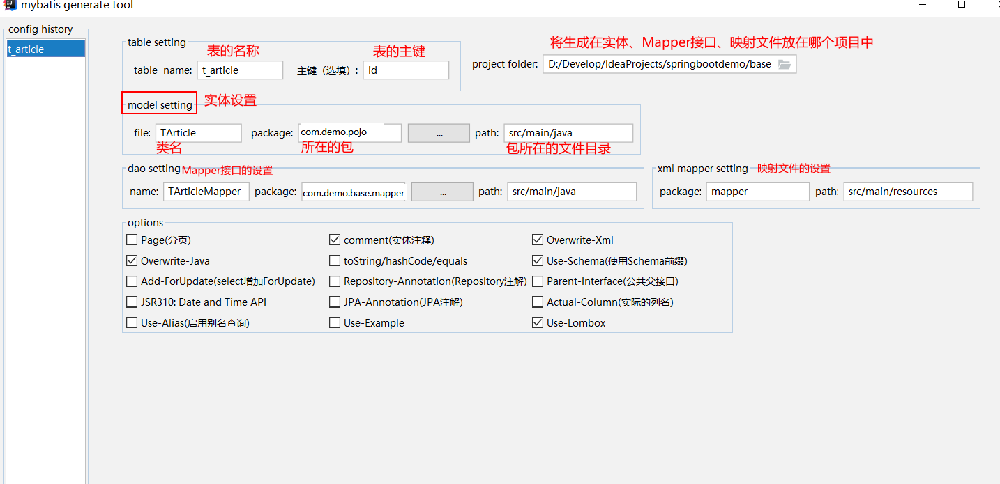

##### （1）创建一个用于对数据库表t_article数据操作的接口ArticleMapper 

```java
 	@Mapper
 	public interface ArticleMapper {
 	    public Article selectArticle(Integer id);
}
```

##### （2）创建XML映射文件

​    resources目录下创建一个统一管理映射文件的包mapper，并在该包下编写与ArticleMapper接口方应的映射文件ArticleMapper.xml  

```xml
<?xml version="1.0" encoding="UTF-8" ?>
	<!DOCTYPE mapper PUBLIC "-//mybatis.org//DTD Mapper 3.0//EN"
    	        "http://mybatis.org/dtd/mybatis-3-mapper.dtd">
<mapper namespace="com.demo.mapper.ArticleMapper">
    <select id="selectArticle" resultType="Article">
        select * from Article
    </select>
</mapper>
```

#####  （3）配置XML映射文件路径

在项目中编写的XML映射文件，Spring Boot并无从知晓，所以无法扫描到该自定义编写的XML配置文件，还必须在全局配置文件application.properties中添加MyBatis映射文件路径的配置，同时需要添加实体类别名映射路径，示例代码如下 

```properties
mybatis:
  #配置MyBatis的xml配置文件路径
  mapper-locations: classpath:mapper/*.xml
  #配置XML映射文件中指定的实体类别名路径
  type-aliases-package: com.demo.base.pojo

```

##### （4）编写单元测试进行接口方法测试 

```java
    @Autowired
    private ArticleMapper articleMapper;

    @Test
    void contextLoads2() {
        Article article = articleMapper.selectByPrimaryKey(1);
        System.out.println(article);
    }
```

打印结果：

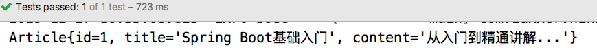


### 2.2 Spring Boot整合Redis

#### （1）添加Redis依赖包

在项目的pom.xml中添加如下：

```xml
	<!-- redis依赖包 -->
	<dependency>
		<groupId>org.springframework.boot</groupId>
		<artifactId>spring-boot-starter-data-redis</artifactId>
	</dependency>
```

#### （2）配置Redis数据库连接

在application.properties中配置redis数据库连接信息，如下：

```properties
#redis配置
#Redis服务器地址
spring.redis.host=127.0.0.1
#Redis服务器连接端口
spring.redis.port=6379
#Redis数据库索引（默认为0）
spring.redis.database=0  
#连接池最大连接数（使用负值表示没有限制）
spring.redis.jedis.pool.max-active=50
#连接池最大阻塞等待时间（使用负值表示没有限制）
spring.redis.jedis.pool.max-wait=3000
#连接池中的最大空闲连接
spring.redis.jedis.pool.max-idle=20
#连接池中的最小空闲连接
spring.redis.jedis.pool.min-idle=2
#连接超时时间（毫秒）
spring.redis.timeout=5000
```


#### （3）编写Redis操作工具类

​    将RedisTemplate实例包装成一个工具类，便于对redis进行数据操作。

```java
package com.demo.utils;

import org.springframework.beans.factory.annotation.Autowired;
import org.springframework.data.redis.core.RedisTemplate;
import org.springframework.stereotype.Component;

import java.util.concurrent.TimeUnit;

@Component
public class RedisUtils {

    @Autowired
    private RedisTemplate redisTemplate;

    /**
     * 读取缓存
     *
     * @param key
     * @return
     */
    public Object get(final String key) {
        return redisTemplate.opsForValue().get(key);
    }

    /**
     * 写入缓存
     */
    public boolean set( String key, Object value) {
        boolean result = false;
        try {
            redisTemplate.opsForValue().set(key, value,1, TimeUnit.DAYS);
            result = true;
        } catch (Exception e) {
            e.printStackTrace();
        }
        return result;
    }

    /**
     * 更新缓存
     */
    public boolean getAndSet(final String key, String value) {
        boolean result = false;
        try {
            redisTemplate.opsForValue().getAndSet(key, value);
            result = true;
        } catch (Exception e) {
            e.printStackTrace();
        }
        return result;
    }

    /**
     * 删除缓存
     */
    public boolean delete(final String key) {
        boolean result = false;
        try {
            redisTemplate.delete(key);
            result = true;
        } catch (Exception e) {
            e.printStackTrace();
        }
        return result;
    }

}

```

#### （4）测试

写一个测试用例类来完成对redis的整合

```java
@RunWith(SpringRunner.class)
@SpringBootTest
class Springboot02MybatisApplicationTests {

    @Autowired
    private RedisUtils redisUtils;


    @Autowired
    private CommentMapper commentMapper;


     @Test
    public void setRedisData() {
       redisUtils.set("article_1",articleMapper.selectByPrimaryKey(1));
        System.out.println("success");
    }

    @Test
    public void getRedisData() {
        Article article = (Article) redisUtils.get("article_1");
        System.out.println(article);
    }

```


