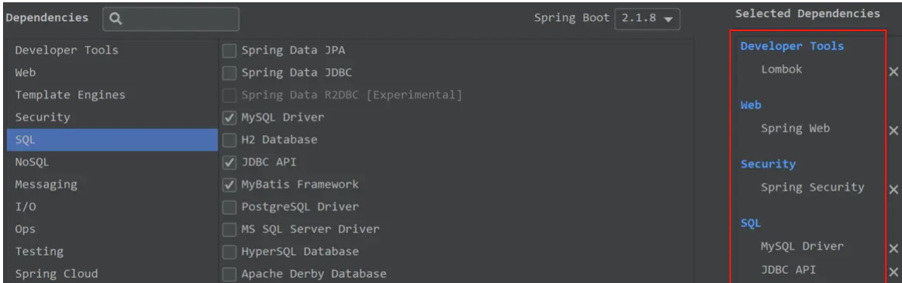
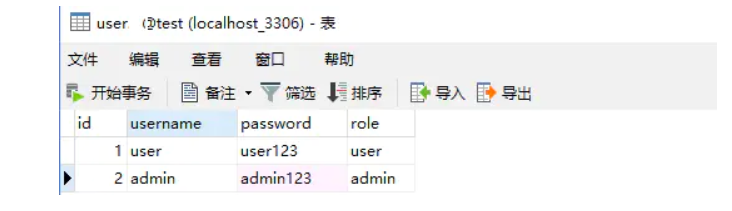
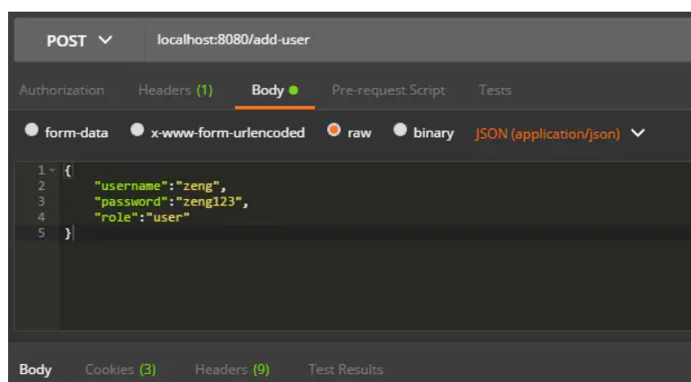
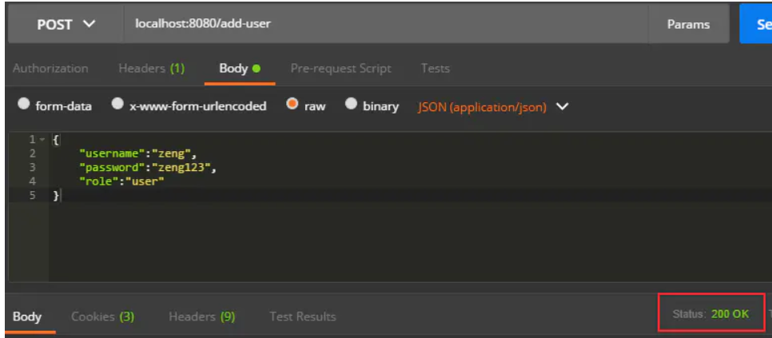
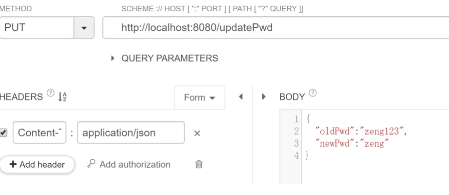
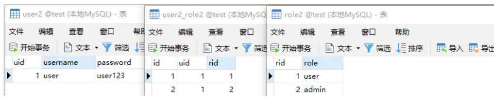

## 一、创建项目

创建一个 SpringBoot 模块项目，选择相关依赖：




导入

```
       <dependency>
            <groupId>com.baomidou</groupId>
            <artifactId>mybatis-plus-boot-starter</artifactId>
            <version>3.1.0</version>
        </dependency>
```

先搭建项目正常访问，在pom.xml中，先把Spring Security依赖注释

```
<!--<dependency>-->
    <!--<groupId>org.springframework.boot</groupId>-->
    <!--<artifactId>spring-boot-starter-security</artifactId>-->
<!--</dependency>-->
```


在MySQL数据库中创建一张用户表，id主键自增，并添加两个用户如下：



代码：
创建entity实体

```
@Data
public class UserInfo {
    private int id;
    private String username;
    private String password;
    private String role;
}

```


创建mapper接口

```
@Mapper
@Repository
public interface UserInfoMapper {
    @Select("select * from user where username = #{username}")
    UserInfo getUserInfoByUsername(String username);
}
```


创建UserInfoService.java文件

```
@Service
public class UserInfoService {
    @Autowired
    private UserInfoMapper userInfoMapper;

    public UserInfo getUserInfoByUsername(String username){
        return userInfoMapper.getUserInfoByUsername(username);
    }

}
```


创建HelloController.java文件

```
@RestController
public class HelloController {
    @Autowired
    private UserInfoService userInfoService;
    

    @GetMapping("/get-user")
    public UserInfo getUser(@RequestParam String username){
        return userInfoService.getUserInfoByUsername(username);
    }

}
```


配置文件application.yml中设置MySQL连接配置和MyBatis配置

```
spring:
  datasource:
    url: jdbc:mysql://localhost:3306/security?useSSL=FALSE&serverTimezone=UTC
    username: root
    password: root
    driver-class-name: com.mysql.cj.jdbc.Driver
logging:
  level:
    com.example.bdatabaserole.mapper: debug  # 打印sql语句
```


以上配置好后，启动项目，访问localhost:8080/get-user?username=user


## 二、Spring Security基于数据库认证

把pom.xml中的Spring Security依赖注释去掉：

```
<dependency>
    <groupId>org.springframework.boot</groupId>
    <artifactId>spring-boot-starter-security</artifactId>
</dependency>
```


要从数据库读取用户信息进行身份认证，需要新建类实现UserDetailService接口重写loadUserByUsername方法：

```

@Component
public class CustomUserDetailsService implements UserDetailsService {
    @Autowired
    private UserInfoService userInfoService;


    /**
     * 需新建配置类注册一个指定的加密方式Bean，或在下一步Security配置类中注册指定
     */
    @Autowired
    private PasswordEncoder passwordEncoder;

    @Override
    public UserDetails loadUserByUsername(String username) throws UsernameNotFoundException {
        // 通过用户名从数据库获取用户信息
        UserInfo userInfo = userInfoService.getUserInfoByUsername(username);
        if (userInfo == null) {
            throw new UsernameNotFoundException("用户不存在");
        }

        // 得到用户角色
        String role = userInfo.getRole();

        // 角色集合
        List<GrantedAuthority> authorities = new ArrayList<>();
        // 角色必须以`ROLE_`开头，数据库中没有，则在这里加
        authorities.add(new SimpleGrantedAuthority("ROLE_" + role));

        return new User(
                userInfo.getUsername(),
                // 因为数据库是明文，所以这里需加密密码
                passwordEncoder.encode(userInfo.getPassword()),
                authorities
        );
    }

}

```


创建Security的配置类WebSecurityConfig继承WebSecurityConfigurerAdapter，并重写configure(auth)方法：

```
@EnableWebSecurity
public class WebSecurityConfig extends WebSecurityConfigurerAdapter {
    @Autowired
    private CustomUserDetailsService userDatailService;

    /**
     * 指定加密方式
     */
    @Bean
    public PasswordEncoder passwordEncoder(){
        // 使用BCrypt加密密码
        return new BCryptPasswordEncoder();
    }

    @Override
    protected void configure(AuthenticationManagerBuilder auth) throws Exception {
        auth
                // 从数据库读取的用户进行身份认证
                .userDetailsService(userDatailService)
                .passwordEncoder(passwordEncoder());
    }

}
```


上面设置完后，重新启动，在登录页面就可以输入数据库中的用户名/密码了。

## 三、角色访问控制

上面设置后，可以使用数据库中的用户名/密码登录，还获取到了用户的角色。通过用户的角色，可以限制用户的请求访问：

开启方法的访问权限，需要在WebSecurityConfig添加

```

@EnableWebSecurity
@EnableGlobalMethodSecurity(prePostEnabled = true) // 开启方法级安全验证
public class WebSecurityConfig extends WebSecurityConfigurerAdapter {
    ...
}
```


修改UserController.java类，增加方法的访问权限

```
@RestController
public class HelloController {
    @Autowired
    private UserInfoService userInfoService;

    @GetMapping("/get-user")
    public UserInfo getUser(@RequestParam String username){
        return userInfoService.getUserInfo(username);
    }
    
    @PreAuthorize("hasAnyRole('user')") // 只能user角色才能访问该方法
    @GetMapping("/user")
    public String user(){
        return "user角色访问";
    }
    
    @PreAuthorize("hasAnyRole('admin')") // 只能admin角色才能访问该方法
    @GetMapping("/admin")
    public String admin(){
        return "admin角色访问";
    }

}
```


配置完后，重新启动程序，在登录页面中：

输入user/user123登录，该用户角色为user，可以访问localhost:8080/user，不能访问localhost:8080/admin；
再重启程序输入admin/admin123登录，角色为admin，能访问localhost:8080/admin，不能访问localhost:8080/user。

## 四、密码加密保存

前面的用户密码都是手动添加的，所以数据库中是明文显示，在实际开发中，都是需要加密保存的。

下面模拟简单注册用户，加密保存密码：

UserInfoMapper.java类中添加插入用户

```
@Mapper
@Repository
public interface UserMapper {
 ...
    // 插入用户
    @Insert("insert into user(username, password, role) value(#{username}, #{password}, #{role})")
    int insertUserInfo(UserInfo userInfo);
}
```


UserInfoService.java类中添加插入方法，注意要加密密码

```
@Service
public class UserInfoService {
    ...
    

    @Autowired
    private PasswordEncoder passwordEncoder;
    
    ...
    
    public int insertUser(UserInfo userInfo){
        // 加密密码
        userInfo.setPassword(passwordEncoder.encode(userInfo.getPassword()));
        return userInfoMapper.insertUserInfo(userInfo);
    }
}
```


修改HelloController.java，增加添加用户接口

```
@RestController
public class HelloController {
    ...
        

    @PostMapping("/add-user")
    public int addUser(@RequestBody UserInfo userInfo){
        return userInfoService.insertUserInfo(userInfo);
    }

}
```


配置完后，启动服务，使用Postman发送POST请求来添加用户：



点击Send按钮后，添加失败，不会返回成功1，看到红框的状态码显示401 Unauthorized，说明无权限，需要登录，但注册用户是不用登录的，所以就需要注册用户的请求无需身份验证：

修改WebSecurityConfig配置类，重写configure(HttpSecurity http)方法，配置允许注册用户的请求访问：

```
@EnableWebSecurity
@EnableGlobalMethodSecurity(prePostEnabled = true)
public class WebSecurityConfig extends WebSecurityConfigurerAdapter {
 ...    
    @Override
    protected void configure(HttpSecurity http) throws Exception {
        http
                .authorizeRequests()
                .antMatchers(HttpMethod.POST, "/add-user").permitAll() // 允许post请求/add-user，而无需认证
                .anyRequest().authenticated() // 所有请求都需要验证
                .and()
                .formLogin() // 使用默认的登录页面
                .and()
                .csrf().disable();// post请求要关闭csrf验证,不然访问报错；实际开发中开启，需要前端配合传递其他参数
    }
}
```


配置允许POST请求/add-user访问后，再在Postman发送请求就可以成功了：


查看数据库数据，添加的用户密码已加密：


使用加密密码登录，需要修改CustomUserDetailsService类，之前从数据库拿到明文密码后需要加密，现在数据库里面的密码已经加密了，就不用加密了：

```
@Component
public class CustomUserDetailsService implements UserDetailsService {
    //@Autowired
    //private PasswordEncoder passwordEncoder;
    ...
    @Override
    public UserDetails loadUserByUsername(String username) throws UsernameNotFoundException {
        ...
        return new User(
                user.getUsername(),
                // 数据库密码已加密，不用再加密
                user.getPassword(),
                authorities
        );
    }
}
```


浏览器访问localhost:8080/user，输入zeng/zeng123登录即可。

## 五、密码修改

UserInfoMapper.java类中添加更新用户密码操作：

```
@Mapper
@Repository
public interface UserMapper {
 ...
 @Update("update user set password = #{newPwd} where username = #{username}")
    int updatePwd(String username, String newPwd);
}


UserInfoService.java类中添加更新密码的操作方法：

@Service
public class UserInfoService { 
    ...
    public int updatePwd(String oldPwd, String newPwd) {
        // 获取当前登录用户信息(注意：没有密码的)
        UserDetails principal = (UserDetails) SecurityContextHolder.getContext().getAuthentication().getPrincipal();
        String username = principal.getUsername();

        // 通过用户名获取到用户信息（获取密码）
        UserInfo userInfo = userInfoMapper.getUserInfoByUsername(username);
    
        // 判断输入的旧密码是正确
        if (passwordEncoder.matches(oldPwd, userInfo.getPassword())) {
            // 不要忘记加密新密码
            return userInfoMapper.updatePwd(username, passwordEncoder.encode(newPwd));
        }
        return 0;
    }

}
```


HelloController.java类增加修改用户密码接口:

```
@RestController
public class HelloController {    
    @PutMapping("/updatePwd")
    public int updatePwd(@RequestBody Map<String, String> map){
        return userInfoService.updatePwd(map.get("oldPwd"), map.get("newPwd"));
    }
}
```


启动程序，因为需要登录，且修改密码请求方式为PUT请求，所以无法使用Postman发起请求，可以使用谷歌浏览器的插件Restlet Client：

先浏览器输入http://localhost:8080/login登录用户zeng/zeng123:


在Restlet Client中进行PUT更新请求：



这里更新后，需要重启后就可以使用新密码登录了。

## 六、用户角色多对多关系

上面的设置后，能基本实现了身份认证和角色授权了，但还是有一点不足：

我们前面用户表中，用户和角色是绑定一起，用户就只有一个角色了，但实际上，用户可能拥有多个角色，角色拥有多个用户，是多对多的关系，所以需要重新设置用户表和角色表。
创建普通项目运行
IDEA创建一个 Spring Initializr模块项目，名为b-database-manytomany-role，选择Spring Security和web依赖，其他按需选择Lombok、MySQL、JDBC和MyBatis。

先按照普通项目创建起来正常访问，在pom.xml中，先把Spring Security依赖注释

```
<!--<dependency>-->
    <!--<groupId>org.springframework.boot</groupId>-->
    <!--<artifactId>spring-boot-starter-security</artifactId>-->
<!--</dependency>-->
```


新建表，主键id全部都是自增。

用户user2表

```
CREATE TABLE user2 ( uid int(11) NOT NULL AUTO_INCREMENT,
username varchar(255) CHARACTER SET utf8 COLLATE utf8_general_ci
NULL DEFAULT NULL, password varchar(255) CHARACTER SET utf8
COLLATE utf8_general_ci NULL DEFAULT NULL, PRIMARY KEY (uid) USING
BTREE ) ENGINE = InnoDB AUTO_INCREMENT = 11 CHARACTER SET = utf8
COLLATE = utf8_general_ci ROW_FORMAT = Dynamic;
```

角色role2表，指定了2个角色

```
CREATE TABLE role2 ( rid int(11) NOT NULL AUTO_INCREMENT,
role varchar(255) CHARACTER SET utf8 COLLATE utf8_general_ci NULL
DEFAULT NULL, PRIMARY KEY (rid) USING BTREE ) ENGINE = InnoDB
AUTO_INCREMENT = 3 CHARACTER SET = utf8 COLLATE = utf8_general_ci
ROW_FORMAT = Dynamic;
```

用户角色关系user2_role2表

```
CREATE TABLE user2_role2 ( id int(11) NOT NULL AUTO_INCREMENT,
uid int(11) NULL DEFAULT NULL, rid int(11) NULL DEFAULT NULL,
PRIMARY KEY (id) USING BTREE ) ENGINE = InnoDB AUTO_INCREMENT = 10
CHARACTER SET = utf8 COLLATE = utf8_general_ci ROW_FORMAT = Dynamic;
```

初始化数据：

```
– 添加1个用户
INSERT INTO user2 VALUES (1, 'user', 'user123');

– 添加2个角色 
INSERT INTO role2 VALUES (1, 'user');
INSERT INTO role2 VALUES (2, 'admin');

– 1个用户,拥有2个角色 
INSERT INTO user2_role2 VALUES (1, 1, 1);
INSERT INTO user2_role2 VALUES (2, 1, 2);
```

使用Navicat可视化表的数据结构为：



创建entity实体类

User类

```
@Data
public class User {
    private Integer uid;
    private String username;
    private String password;
}

```


Role类

```
@Data
public class Role {
    private Integer rid;
    private String role;
}
```

创建DTO类

因为用户和角色是多对多关系，需要在用户中含有角色的对象，角色中含有用户的对象，创建DTO类而不再entity类中添加，是因为entity类属性是和表字段一一对应的，一般不推荐在entity类中添加与表字段无关的属性。

新建dto包，在包下创建如下类：

UserDTO类

// 注意，多对多不要用@Data，因为ToString会相互调用，导致死循环

```
@Setter
@Getter
public class UserDTO extends User {
    private Set<Role> roles;
}

```


RoleDTO类（目前用不到，可不建）

// 注意，多对多不要用@Data，因为ToString会相互调用，导致死循环

```
@Setter
@Getter
public class RoleDTO extends Role {
    private Set<User> users;
}
```

添加UserMapper.java类

```
@Mapper
@Repository
public interface UserMapper {
    // 查询用户
    UserDTO selectUserByUsername(@Param("username") String username);
}

```


UserMapper.xml。因为需要关联查询，所有使用xml方式

```
<?xml version="1.0" encoding="UTF-8" ?>

<!DOCTYPE mapper PUBLIC "-//mybatis.org//DTD Mapper 3.0//EN" "http://mybatis.org/dtd/mybatis-3-mapper.dtd" >
<mapper namespace="com.example.bdatabasemanytomanyrole.mapper.UserMapper">


    <resultMap id="userRoleMap" type="com.example.bdatabasemanytomanyrole.dto.UserDTO">
        <id property="uid" column="uid"/>
        <result property="username" column="username"/>
        <result property="password" column="password"/>
        <collection property="roles" ofType="com.example.bdatabasemanytomanyrole.dto.RoleDTO">
            <id property="rid" column="rid"/>
            <result property="role" column="role"></result>
        </collection>
    </resultMap>
    <select id="selectUserByUsername" resultMap="userRoleMap">
        select user2.uid, user2.username, user2.password, role2.rid, role2.role
        from user2, user2_role2, role2
        where user2.username=#{username} 
        and user2.uid = user2_role2.uid 
        and user2_role2.rid = role2.rid
    </select>

</mapper>
```

UserService.java

```
@Service
public class UserService {
    @Autowired
    private UserMapper userMapper;

    public UserDTO getUser(String username){
        return userMapper.selectUserByUsername(username);
    }

}
```

UserController.java

```
@RestController
public class UserController {
    @Autowired
    private UserService userService;

    @GetMapping("/get-user")
    public UserDTO getUser(@RequestParam String username){
        return userService.getUser(username);
    }

}
```

上面完成后，启动项目，访问localhost:8080/get-user?username=user，查询到的用户信息为：

引入Spring Security安全验证
把pom.xml中的Spring Security依赖注释去掉：

```
<dependency>
    <groupId>org.springframework.boot</groupId>
    <artifactId>spring-boot-starter-security</artifactId>
</dependency>

```


此时，再重新启动程序，访问localhost:8080/get-user?username=user时，会跳转到登录页面。此时默认的登录用户名为user，密码在启动时打印在控制台。

从数据库中获取用户、密码进行登录：

添加MyUserDetailsService.java，实现UserDetailsService，重写loadUserByUsername方法：

```
@Component
public class MyUserDetailsService implements UserDetailsService {
    @Autowired
    private UserService userService;
    

    @Override
    public UserDetails loadUserByUsername(String username) throws UsernameNotFoundException {
        UserDTO user = userService.getUser(username);
        if (user == null) {
            throw new UsernameNotFoundException("用户不存在");
        }
        // 添加用户拥有的多个角色
        List<GrantedAuthority> grantedAuthorities = new ArrayList<>();
        Set<Role> roles = user.getRoles();
        for (Role role : roles) {
            grantedAuthorities.add(new SimpleGrantedAuthority("ROLE_" + role.getRole()));
        }
    
        return new User(
                user.getUsername(),
             // 数据库中密码没加密，需加密
                new BCryptPasswordEncoder().encode(user.getPassword()),
                grantedAuthorities
        );
    }

}
```

添加WebSecurityConfig.java，继承WebSecurityConfigurerAdapter，重写configure(AuthenticationManagerBuilder auth)方法：

```
@EnableWebSecurity
public class WebSecurityConfig extends WebSecurityConfigurerAdapter {
    @Autowired
    private MyUserDetailsService userDetailsService;
    @Bean
    public PasswordEncoder passwordEncoder(){
        return new BCryptPasswordEncoder();
 }        
    @Override
    protected void configure(AuthenticationManagerBuilder auth) throws Exception {
        auth
                .userDetailsService(userDetailsService)
                .passwordEncoder(passwordEncoder());
    }
}
```


重新启动，可以使用user/user123登录了。

查看登录用户信息
要查看登录用户信息，我们可以在UserController中添加方法：

```
@RestController
public class UserController {
    @Autowired
    private UserService userService;

    @GetMapping("/get-user")
    public UserDTO getUser(@RequestParam String username){
        return userService.getUser(username);
    }
    
    /**
     * 查看登录用户信息
     */
    @GetMapping("/get-auth")
    public Authentication getAuth(){
        return SecurityContextHolder.getContext().getAuthentication();
    }

}
```

重新启动登录后，访问localhost:8080/get-auth，返回：