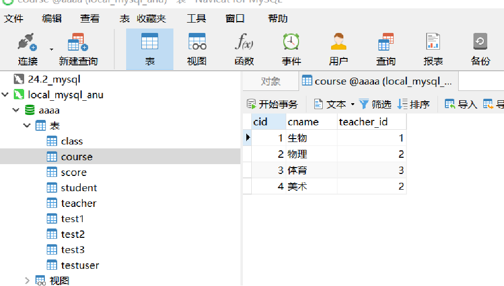
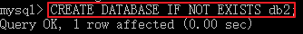
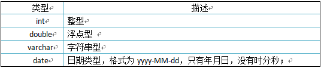
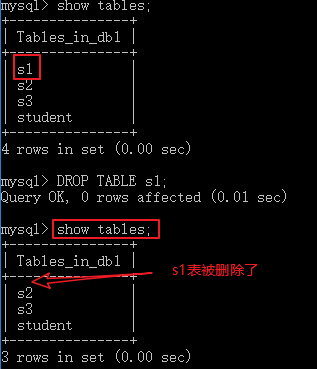
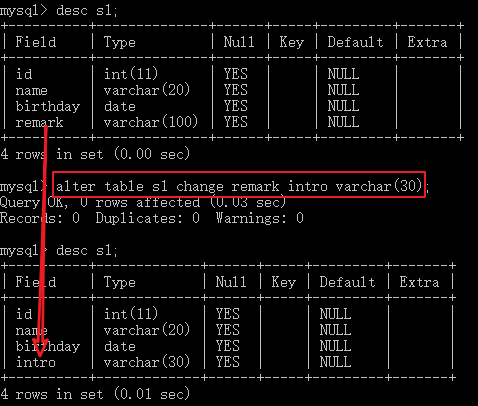
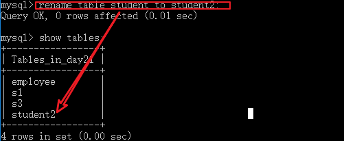

# Java第二阶段_day02_MySQL入门

# 0. 学习目标

- 能够理解数据库的概念
- 能够安装MySQL数据库
- 能够启动,关闭及登录MySQL
- 能够安装使用MySQL图形客户端Navicat
- 能够使用SQL语句操作数据库
- 能够使用SQL语句操作表结构
- 能够使用SQL语句简单查询数据


# 1. 数据库概述

## 1.1 计算机系统如何存储数据

**哪些算是计算机数据**

​		1、计算机程序代码，包括操作系统核心、各种运行库、用户应用程序等等。特点是不会经常变换，稳定性较高。

​		2、支持计算机程序运行的数据，比如说银行系统的账户信息，游戏系统中的玩家角色等级，金币数量、物品信息。		


**计算机系统的数据存放在哪里的**

​		一个计算机系统，其存储可以分为内存与外存。

​		内存的特点是高速高吞吐，异失性。比如CPU一级二级缓存，内存等，一旦掉电，所有内存数据都会丢失。

​		例如：数组,集合;new出来的对象存储在堆中.堆是内存中的一小块空间
​		优点：内存速度快 
​		缺点：断电/程序退出,数据就清除了.内存价格贵

​		外存的特点是可以持久保存，可能是磁介质（硬盘），光介质（VCD、DVD、蓝光）、集成电路（U盘，固态硬盘）。但是其代价是存取数据较慢。

​		例如：普通磁盘文件
​		优点：永久保存
​		缺点：查找，增加，修改，删除数据比较麻烦，效率低


​		当遇到需要长期保留数据，不能因为应用停止，系统关机二丢失数据的话，那么我们只能选择外存来存储这些数据，比方说银行账户系统、qq聊天记录，游戏角色等级记录等等。

​		**最终系统存储永久性数据的，就是通过一个个文件。**


**仅仅用文件存储数据有什么弊端**

​		对于单用户应用程序，使用文件存储数据不存在太大的问题，但是在多用户、大数据量、强数据私密性的情况下，只使用文件来存储就存在种种弊端。

​		1、文件的安全性问题，每个访问到文件系统的用户，都可以随意访问文件。

​		2、文件中查询数据，管理数据并不方便。

​		3、在文件中存取海量数据，速度和效率并不理想。

​		4、在程序中控制文件较繁琐。比方说，多个用户打开同一个文件等等。

​		5、一旦文件损坏（磁盘问题，误删除、误覆盖）等等，会造成无可挽回的数据丢失。

**如何解决这些问题**

​		引入数据库系统，通过数据库来管理、存取、备份数据，可以提供多并发、严格用户权限控制、数据安全保障等方面的功能。

​		比如说，用文件存储数据就好像是你家的书架，2到3个人来看书，摆放百把本书，还是不错的。如果有两三千人来看书，存书数百万册，那么就需要建立一个专门的图书馆，雇佣专门的图书管理员来为大家服务。

​		这个图书馆就可以理解成一个数据库。


## 1.2 什么是数据库

> 数据库是“按照数据结构来组织、存储和管理数据的仓库”。是一个长期存储在计算机内的、有组织的、有共享的、统一管理的数据集合。
>
> 数据库是以一定方式储存在一起、能与多个用户共享、具有尽可能小的冗余度、与应用程序彼此独立的数据集合，可视为电子化的文件柜——存储电子文件的处所，用户可以对文件中的数据进行新增、查询、更新、删除等操作。

​	存储数据的仓库，其本质是一个文件系统，数据库按照特定的格式将数据存储起来，并通过特定的应用程序（数据库管理系统，DataBase Management System），用户可以对数据库中的数据进行增加，修改，删除及查询操作。

**关键字：**文件系统、特定的格式、存储数据、对数据进行增删改查


## 1.3 数据库的优点

​	数据库是按照特定的格式将数据持久化存储在文件中，通过SQL语句可以方便的对大量数据进行增、删、改、查操作，数据库是对大量的信息进行管理的高效的解决方案。


## 1.4 数据库管理系统

​	数据库管理系统（DataBase Management System，**DBMS**）：指一种操作和管理数据库的大型软件，用于建立、使用和维护数据库，对数据库进行统一管理和控制，以保证数据库的安全性和完整性。用户通过数据库管理系统访问数据库中表内的数据。

## 1.5 数据库管理系统、数据库和表的关系

​	数据库管理系统(DBMS)可以管理多个数据库，一般开发人员会针对每一个应用创建一个数据库。为保存应用中实体的数据，一般会在数据库创建多个表，以保存程序中实体的数据。数据库管理系统、数据库和表的关系如图所示：


先有数据库 → 再有表 → 再有数据
一个库包含多个表，一个表可以对应有多条数据


## 1.6 常见数据库


**MYSQL**：开源免费的数据库，小型的数据库.已经被Oracle收购了.MySQL6.x版本也开始收费。
**Oracle**：收费的大型数据库，Oracle公司的产品。Oracle收购SUN公司，收购MYSQL。
**DB2** ：IBM公司的数据库产品,收费的。常应用在银行系统中.
**SQLServer**：MicroSoft 公司收费的中型的数据库。C#、.net等语言常使用。
**SyBase**：已经淡出历史舞台。提供了一个非常专业数据建模的工具PowerDesigner。
**SQLite**: 嵌入式的小型数据库，应用在手机端。

**Redis：** 是一个开源（BSD许可）的、使用ANSI C语言编写、遵守BSD协议、支持网络、可基于内存亦可持久化的日志型文件系统，它是内存中的数据结构存储系统，它可以用作数据库（非关系型数据库）、缓存和消息中间件。

**MongoDB：**是由C++语言编写的，是一个基于分布式文件存储的开源数据库系统，MongoDB是一个介于[关系数据库](https://baike.baidu.com/item/关系数据库)和非关系数据库之间的产品。

**常用数据库**：**MYSQL**，**Oracle**，**Redis**
在web应用中，使用的最多的就是MySQL数据库，原因如下：

1. 开源、免费
2. 功能足够强大，足以应付web应用开发


# 2. MySQL的安装,卸载与使用

## 2.1 MySQL的安装

### 2.1.1 下载安装版本

​		[点击MySQL下载](https://dev.mysql.com/downloads/mysql/)，目前最新版本为8.0.19。


​		下载完成后进行解压


​		没有安装程序，直接将将解压完成后的目录复制到你计划安装MySQL的目录。

### 2.1.2 初始化数据库

配置初始化的my.ini文件的文件，解压后的目录并没有的my.ini文件，需自行创建在安装根目录下添加的my.ini（新建文本文件，将文件类型改为的.ini），写入基本配置： 

```properties
[mysqld]
# 设置3306端口
port=3306
# 设置mysql的安装目录，需指向自己计划安装MySQL的目录
basedir=C:\Program Files\MySQL
# 设置mysql数据库的数据的存放目录，通常指定到安装目录下的Data文件夹
datadir=C:\Program Files\MySQL\Data
# 允许最大连接数
max_connections=200
# 允许连接失败的次数。
max_connect_errors=10
# 服务端使用的字符集默认为utf8mb4
character-set-server=utf8mb4
# 创建新表时将使用的默认存储引擎
default-storage-engine=INNODB
# 默认使用“mysql_native_password”插件认证
#mysql_native_password
default_authentication_plugin=mysql_native_password
# 设置时区为东八区
default-time-zone='+8:00'
[mysql]
# 设置mysql客户端默认字符集
default-character-set=utf8mb4
[client]
# 设置mysql客户端连接服务端时默认使用的端口
port=3306
default-character-set=utf8mb4
```

​		配置文件中的路径要和实际存放的路径一致（8.0.18不要手动创建Data文件夹）

​		**在初始化时，避免出错我们尽量全部使用管理员身份运行命令行程序，否则会报错，导致安装失败。打开cmd后进入mysql的bin目录。**


**在MySQL目录下的bin目录下执行命令：**

**mysqld --initialize --console**


​		**注意！输出日志中中root @ localhost：后面的9P0gYk-？0，kT就是初始密码（不含首位空格）。在没有更改密码前，需要记住这个密码，后续登录需要用到。复制密码先保存起来!!!**

​		在系统环境变量中加入MYSQL_HOME，其值为你安装mysql的物理路径。再在系统环境变量PATH中加入一项 %MYSQL_HOME%/bin。完成此操作后，就可以在任意目录下执行mysql相关命令。


### 2.1.3 安装+启动MySQL服务

**执行下面的命令：**

**mysqld --install [服务名]（服务名可以不加默认为mysql）**


窗口提示 successfully installed. 即代表成功完成安装服务。

> **如果出现这个**
>
> 
>
> **说明mysql的服务还在把它删掉**  
>
> **用这个命令**
>
> **SC删除的MySQL**
>
> 
>
> **再执行上面安装服务**


**服务安装成功之后通过命令net start mysql启动MySQL的服务**


启动MYSQL: `net start mysql`
停止MYSQL: `net stop mysql`


​		**也可以使用Windows服务方式启动**
操作步骤：


### 2.1.4 卸载MySQL

1. 首先停止window的MySQL服务。
   找到“控制面板”-> “管理工具”-> “服务”，停止MySQL后台服务。
2. 卸载MySQL服务，用管理员身份启动命令行程序，执行 **sc delete mysql** 。
3. 删除MySQL安装目录下的所有文件。
4. 删除c盘ProgramDate目录中关于MySQL的目录。路径为：C:\ProgramData\MySQL(是隐藏文件,需要显示出来)
   
   

**如果还是没有卸载干净，需要删除注册表残留**

```tex
三、windows+R运行“regedit”文件，打开注册表；

四、删除注册表：HKEY_LOCAL_MACHINE\SYSTEM\ControlSet001\Services\Eventlog\Application\MySQL文件夹；

五、删除HKEY_LOCAL_MACHINE\SYSTEM\ControlSet002\Services\Eventlog\Application\MySQL文件夹，如果没有可以不用删除了；

六、删除C盘下的C:\ProgramData\MySQL 所有文件，如果删除不了则用360粉碎掉即可，该programData文件是隐藏的默认，设置显示后即可见；

七、关键！！！！删除C:\Documents and Settings\All Users\Application Data\MySQL下的文件夹，一定要删；

最好重启下电脑，重新安装就可以了!

```


## 2.3 控制台连接数据库

​	MySQL是一个需要账户名密码登录的数据库，登陆后使用，它提供了一个默认的root账号，使用安装时设置的密码即可登录,常见的登录方式有以下几种:掌握其中一种即可

**本地登录格式**1：`mysql -u用户名 -p密码`
例如：`mysql –uroot -proot`

后期输入密码的登录方式：

`mysql -u用户名 -p回车`

`密码`


**远程登录精简格式**2：`mysql -hip地址 -u用户名 -p密码`
例如：`mysql –h127.0.0.1 –uroot -proot`
​

**远程登录全写格式**3：`mysql --host=ip地址 --user=用户名 --password=密码`
例如：`mysql --host=localhost --user=root --password=root`
​

退出MySQL：`exit`


**修改root用户的初始密码**

在初始化时，系统自动生成了一个root的密码，但是很复杂，不方便使用。我们可以登录进mysql中重新设置一个好用的密码。

方法是以root身份，使用初始密码登录MySQL后，执行sql：

```sql
alter user root identified by "新密码";
flush privileges;
```

退出后，就可以使用新密码登录。


## 2.4 常见问题解决

### 2.4.1 忘记root密码后，如何重置root密码

停止mysql服务以后，以免密码方式登录

```
mysqld --console --skip-grant-tables --shared-memory
```


不要关闭cmd窗口，另开一屏

```
mysql -uroot -p
```


登入系统后执行以下sql

```
update mysql.user set authentication_string='' where user='root';
```

将root用户的密码置为空，然后退出SQL窗口，并关闭免密模式的启动窗口，以正常方式启动mysql。
重新用root用户身份，空密码登录mysql。

```
ALTER user 'root'@'localhost' IDENTIFIED BY 'xxxxx';
```

 重新为root用户设置密码。


### 2.4.2 客户端连接服务器报caching-sha2-password错

这是是因为客户端不支持加密插件，可以如下来修改密码模式。

首先以root身份登录MySQL

```
ALTER USER '用户名'@'localhost' IDENTIFIED WITH mysql_native_password BY '新密码' PASSWORD EXPIRE NEVER;
```

这句sql的意思是，将指定用户对应localhost的密码设置为 native 模式的新密码，且此密码永不过期。


### 2.4.3 登录报时区错误

登录时报告类似如下错误

```
The server time zone value 'Öйú±ê׼ʱ¼ä' is unrecognized or represents more t
```

这都是因为安装mysql的时候时区设置的不正确，mysql默认的是美国的时区，而中国大陆要比他们迟8小时，采用+8:00格式。

可以找到mysql的安装目录下的`my.ini`文件，使用notepad++打开，在`mysqld`下加入如下代码：

```
# 设置时区
default-time-zone='+8:00'
```

之后重启mysql即可。


# 3. 数据库可视化操作

​		上面进行数据库连接登录，以及操作都是通过cmd终端窗口的形式来完成的，这种方式可视化效果较差，且不容易管理。为此，我们可以使用一些可视化管理工具来管理我们的MySQL数据库。

常见的一些数据库可视化管理工具：

有**Navicat**、**SQLyog**、**Workbench**等等。


## 3.1 安装Navicat For Mysql

​		获取“Navicat for MySQL”安装应用程序（navicat121_mysql_cs_x64.exe）完毕后双击运行，在欢迎安装向导页面，点击【下一步】继续。


​    请阅读许可协议，接受并点击【下一步】。


在“选择安装文件夹”窗口，软件默认安装在 C 盘，如果您想安装软件在其他目录请点击【浏览】操作，设置完安装位置点击【下一步】。


选择在“开始”菜单默认创建的快捷方式，点击【下一步】。


在“选择额外任务”窗口，默认选中“Create a deskstop icon”，即创建系统桌面图标，点击【下一步】，如果不想创建桌面图标，取消勾选。


在“准备安装”窗口，安装程序即将安装 PremiumSoft Navicat 12 for MySQL，点击【安装】开始安装。


耐心等待安装完成。


运行 Navicat 12 for MySQL，因为新安装的 Navicat 只有 14 天的免费试用期，打开时会弹出“注册”页面，点击【试用】，后续我们将对此软件破解。


## 3.2 破解Navicat For Mysql

在网上下载对应版本的注册机，准备开始破解，具体步骤如下：

1、关闭navicat
2、打开注册机，点右上角的path按钮，选择navicat安装到硬盘的路径，选中navicat.exe文件，点确定按钮
3、等注册机出现"cracked"对话框，再点击生成注册码
4、打开navicat，点击注册，输入注册码，注意，有可能出现注册码校验失败，打x的。关闭注册窗口，重新打开注册窗口，里面注册码已经填好，且校验成功。


5、选择我们要注册的MYSQL，选择中文版，选择site license，完了后点击“Generate”生成序列号
6、此时打开软件，将网线拔掉或热点断开，再点注册。


7、由于网络失败，Naticat 报错，提示转到手动激活。


8、这里将请求码中的代码复制到注册机中，再点击generate得到激活码，填入注册界面；


9、点击激活；


5、至此，navicat 12 for mysql中文破解版成功激活，从帮助菜单下可以查看软件已经是企业版本。注意：不要升级版本，以免破解失效。


## 3.3 使用Navicat For Mysql

启动 Naticat for MySQL，选择菜单： 文件 -》 新建连接  -》 MySQL...


在配置页面上，填入服务器IP或主机名
连接端口
连接用户名
连接密码
等参数，点击测试连接


在配置页面上，填入服务器IP或主机名
连接端口
连接用户名
连接密码
等参数，点击测试连接
若一切正常，即可显示“连接成功”，再点击确定按钮。
这个连接就被 Naticat for MySQL保存下来，下次连接就不需要输入IP、用户名、密码了。


在软件页面上，左侧菜单上就会出现你命名的连接项，左键双击，或在右键菜单中选中“打开连接”。


即可显示数据库服务器上的数据库列表，下一步就可以点击相应菜单，显示表内容，或新建查询，执行SQL。



或者是打开SQL窗口，直接输入SQL语句，选中待执行的语句，快捷键 ctrl+R 执行之。


# 4. 结构化查询语言SQL

## SQL的概念

### 什么是SQL

​	结构化查询语言(Structured Query Language)简称SQL,SQL语句就是对数据库进行操作的一种语言。

### SQL作用

​	通过SQL语句我们可以方便的操作数据库中的数据、表、数据库。
​	SQL是数据库管理系统都需要遵循的规范。不同的数据库生产厂商都支持SQL语句，但都有特有内容。


### SQL语句分类

1. DDL(Data Definition Language)数据定义语言
   用来定义数据库对象：数据库，表，列等。关键字：create, drop,alter等

2. DML(Data Manipulation Language)数据操作语言
   用来对数据库中表的数据进行增删改。关键字：insert, delete, update等

3. DQL(Data Query Language) 数据查询语言 (掌握)

   DQL语言并不是属于MYSQL官方的分类，但是对数据库的操作最多就是查询，所以把查询语句的语句称作为DQL语言

4. DCL(Data Control Language)数据控制语言(了解)

   用来定义数据库的访问权限和安全级别，及创建用户。关键字：GRANT， REVOKE等

5. TCL(Transaction Control Language) 事务控制语言或TPL事务处理语言

   用于控制数据库的事务操作，关键字; COMMIT，SAVEPOINT，ROLLBACK等
   
6. CCL（Cursor Control Language）指针控制语言（了解）

   像DECLARE CURSOR，FETCH INTO和UPDATE WHERE CURRENT用于对一个或多个表单独行的操作。多用于存储过程中对结果集的处理。

### SQL通用语法

1. SQL语句可以单行或多行书写，以分号结尾。

2. 可使用空格和缩进来增强语句的可读性。

3. MySQL数据库的SQL语句不区分大小写，关键字建议使用大写。

   ```sql
   SELECT * FROM student;
   ```

4. 3种注释
   单行注释: -- 注释内容 或 # 注释内容(mysql特有)
   多行注释: /* 注释 */
   
   

## 延展阅读

SQL标准简介

　　SQL是Structured Query Language的缩写，它的前身是著名的关系数据库原型系统System R所采用的SEQUEL语言。作为一种访问关系型数据库的标准语言，SQL自问世以来得到了广泛的应用，不仅是著名的大型商用数据库产品Oracle、DB2、Sybase、SQL Server支持它，很多开源的数据库产品如PostgreSQL、MySQL也支持它，甚至一些小型的产品如Access也支持SQL。近些年蓬勃发展的NoSQL系统最初是宣称不再需要SQL的，后来也不得不修正为Not Only SQL，来拥抱SQL。

　　蓝色巨人IBM对关系数据库以及SQL语言的形成和规范化产生了重大的影响，第一个版本的SQL标准SQL86就是基于System R的手册而来的。Oracle在1979年率先推出了支持SQL的商用产品。随着数据库技术和应用的发展，为不同RDBMS提供一致的语言成了一种现实需要。

　　对SQL标准影响最大的机构自然是那些著名的数据库产商，而具体的制订者则是一些非营利机构，例如国际标准化组织ISO、美国国家标准委员会ANSI等。各国通常会按照 ISO标准和ANSI标准（这两个机构的很多标准是差不多等同的）制定自己的国家标准。中国是ISO标准委员会的成员国，也经常翻译一些国际标准对应的中文版。标准为了避免采用具体产品的术语，往往会抽象出很多名词，从而增加了阅读和理解的难度，翻译成中文之后更容易词不达意。对于数据库系统实现者和用户而言，很多时候还不如直接读英文版本为好。虽然正式的标准不像RFC那样可以从网络上免费获得，标准草案还是比较容易找到的（例如：http://www.jtc1sc32.org/doc/）。待批准的标准草案和最终的标准也没有什么实质上的区别，能够满足日常工作的需要。

　　下面是SQL发展的简要历史：
1986年，ANSI X3.135-1986，ISO/IEC 9075:1986，SQL-86
1989年，ANSI X3.135-1989，ISO/IEC 9075:1989，SQL-89
1992年，ANSI X3.135-1992，ISO/IEC 9075:1992，SQL-92（SQL2）
1999年，ISO/IEC 9075:1999，SQL:1999（SQL3）
2003年，ISO/IEC 9075:2003，SQL:2003
2008年，ISO/IEC 9075:2008，SQL:2008
2011年，ISO/IEC 9075:2011，SQL:2011

　　细心的读者能发现，从SQL:1999开始，标准简称中的短横线（-）被换成了冒号（:），而且标准制定的年份也改用四位数字了。前一个修改的原因是ISO标准习惯上采用冒号，ANSI标准则一直采用短横线。后一个修改的原因是标准的命名也遇到了2000年问题。

　　SQL86大概只有几十页，SQL92正文大约有500页，而SQL99则超过了1000页。可以看出，从SQL99开始，SQL标准的个头就非常庞大了，内容包罗万象，已经没有人能够掌握标准的所有内容了。以SQL:2003为例，它包括以下9个部分（中间编号空缺是曾经被占用，之后被废弃的标准造成的）：

ISO/IEC9075-1: Framework (SQL/Framework)
ISO/IEC 9075-2: Foundation (SQL/Foundation)
ISO/IEC 9075-3: Call Level Interface (SQL/CLI)
ISO/IEC 9075-4: Persistent Stored Modules (SQL/PSM)
ISO/IEC 9075-9: Management of External Data (SQL/MED)
ISO/IEC 9075-10: Object Language Bindings (SQL/OLB)
ISO/IEC 9075-11: Information and Definition Schemas (SQL/Schemata)
ISO/IEC 9075-13: Java Routines and Types Using the Java Programming Language(SQL/JRT)
ISO/IEC 9075-14: XML-Related Specifications (SQL/XML)

负责具体制定工作的是ISO和IEC联合成立的一个技术委员会JTC1/SC32。正因为关系数据库市场非常成熟，竞争不够激烈，标准本身变得过于庞大等原因，SQL3制定的周期很长，制定期间也存在很多争议。例如文章《Is SQL a Real Standard Anymore?》对SQL标准化进程提出了置疑。

　　如果要了解标准的内容，比较推荐的方法是泛读SQL92（因为它涉及了SQL最基础和最核心的一些内容），然后增量式的阅读其他标准。标准在每次更新的时候，委员会的成员们都为大家提供比较好的介绍文档。例如针对最新的SQL:2011，SIGMODRecord上就有很不错的介绍：http://www.sigmod.org/publications/sigmod-record/1203/pdfs/10.industry.zemke.pdf

　　最后再简要介绍一下SQL标准的符合程度。绝大多数人提起SQL标准，涉及的内容其实是SQL92里头最基本或者说最核心的一部分。SQL92本身是分级的，包括入门级、过度级、中间级和完全级。为了验证具体的产品对标准的遵从程度，NIST还曾经专门发起了一个项目，来做标准符合程度的测试集合：http://itl.nist.gov/div897/ctg/sql_form.htm。不过，SQL标准包含的内容实在太多了，而且有很多特性对新的SQL产品而言也越来越不重要了。从SQL99之后，标准中符合程度的定义就不再分级，而是改成了核心兼容性和特性兼容性；也没有机构来推出权威的SQL标准符合程度的测试认证了。


# 5. 用户管理与权限管理

用户是我们使用数据库的基础，任何连入数据库的操作，都依托于一个用户，并受到这个用户所具有权限的限制。

## 用户管理

### 查看用户

```sql
select host,user,authentication_string from mysql.user;
```

mysql是MySQL数据库中的系统库，所有用户、权限、密码、时区等信息都存放在这个库里。

库名.表名的方式可以让我们跨库来引用某个特定库的表。


### 创建用户

语法：**create user "username"@"host" identified by "password";**

```sql
create user 'test'@'localhost' identified by '123';
create user 'test'@'192.168.7.22' identified by '123';
create user 'test'@'%' identified by '123';
```

host的含义是限制访问的客户端的主机IP，%表示无限制。

语句中的单引号表示字符串，在这里也可以使用双引号，用户名可以不用引号。

密码设置串可以不带，但是带了密码，就必须带引号。


### 设置用户密码

**方法1：用alter修改用户密码** 
首先需要以root身份登录MySQL。 

```sql
ALTER USER 'bbb'@'localhost' IDENTIFIED BY '456';
flush privileges; 
```

**方法2：用mysqladmin** 
格式：mysqladmin -u用户名 -p旧密码 password 新密码 

此语句需用在命令行下

```
mysqladmin -uroot -p123456 password 123 
```

**方法3：忘记root密码，需要重置root密码**

1、首先停止mysql服务

```
net stop mysql
```

2、以管理员身份启动命令行，执行

```
mysqld --skip-grant-tables --shared-memory
```

这时以忽略密码模式启动了mysql，不要关闭此cmd窗口。

3、再开一屏cmd窗口
用mysql直接登录，不输入用户和密码


```
ALTER USER 'root'@'localhost' IDENTIFIED BY 'new_psd_123';
FLUSH PRIVILEGES;
```

完成后此屏可以退出。
前一屏，先ctrl+C强制退出mysqld，再用net start mysql
最后尝试一下root的新密码登录

```
mysql -uroot -pnew_psd_123
```

### 删除用户

语法：drop user 用户名@主机名；

```
drop user zhangsan@'%';
```

drop user命令会删除用户以及对应的权限，执行命令后你会发现mysql.user表和mysql.db表的相应记录都消失了。


## 权限管理

### 给用户授权

初始创建的用户，还不能访问数据库，因为还没有给用户赋予相应权限，需要执行用户授权操作。

命令格式：grant 权限码 on 数据库名.表名 to 用户名@主机名 identified by "password";

```sql
grant all on dbname.* to zhrt@localhost identified by '123456';
FLUSH PRIVILEGES;
```

设置密码的子串可写可不写

权限码表示授予的权限类型，常用的有以下几种类型：

- all ：所有权限。
- select：读取权限。
- delete：删除权限。
- update：更新权限。
- create：创建权限。
- drop：删除数据库、数据表权限。

### 查看用户权限

语法：show grants for 用户名@主机名; 

```sql
show grants for 'bbb'@'localhost'; 
```

### 取消用户授权

语法：REVOKE 权限码 ON 库名.表名 FROM 用户名@主机名;

```sql
REVOKE all ON power.* FROM bbb@localhost;
```


# 6. 数据定义语言（DDL）

## 操作数据库

### 创建数据库

1. 直接创建数据库
   `CREATE DATABASE 数据库名;`

2. 判断是否存在并创建数据库(了解)
   `CREATE DATABASE IF NOT EXISTS 数据库名;`

3. 创建数据库并指定字符集(了解)
   `CREATE DATABASE 数据库名 CHARACTER SET 字符集;`

4. 具体操作：

* 直接创建数据库db1

  ```sql
  CREATE DATABASE db1;
  ```

  

* 判断是否存在并创建数据库db2

  ```sql
  CREATE DATABASE IF NOT EXISTS db2;
  ```

  

* 创建数据库并指定字符集为gbk

  ```sql
  CREATE DATABASE db2 CHARACTER SET gbk;
  ```

  

### 查看数据库

1. 查看所有的数据库
   
   ```
SHOW databases;
   ```
   
   
   
2. 查看某个数据库的定义信息
   
   ```
   SHOW CREATE DATABASE 数据库名;
   ```
   
   
   

### 修改数据库(了解)

修改数据库字符集格式

`ALTER DATABASE 数据库名 DEFAULT CHARACTER SET 字符集;`

具体操作：

* 将db3数据库的字符集改成utf8

  ```sql
  ALTER DATABASE db3 DEFAULT CHARACTER SET utf8;
  ```

  

### 删除数据库

`DROP DATABASE 数据库名;`

具体操作：

* 删除db2数据库

  ```sql
  DROP DATABASE db2;
  ```

  

### 使用数据库

1. 查看正在使用的数据库
   `SELECT DATABASE();`
2. 使用/切换数据库
   `USE 数据库名;`

具体操作：

* 查看正在使用的数据库

  ```sql
  SELECT DATABASE();
  ```

  

* 使用db1数据库

  ```sql
  USE db1;
  ```

  

## 操作表

>**如果已执行 use 数据库名; 可以省略数据库名。**

### 创建表

语法：

```
CREATE TABLE [IF NOT EXISTS] 表名 (
   字段名 字段类型 [ primary key | unique | not null | auto_increment |
      | binary | default 缺省值 | comment 注释语句],
   ......
) [ ENGINE=InnoDB | DEFAULT CHARSET=utf8 ];
```

表可选项：

if not exists：如果不存在就执行建表

engine：设置数据引擎，默认为innodb

default charset：设置默认字符编码

字段可选项：

primary key：主键，值唯一，不可为null

unique：唯一键，值唯一，可以为null

not null：不可为null，不写这一项，则默认为可以接受null值

auto_increment：自动增长，只能与整数类型搭配，默认每次增长1

binary：与字符类型搭配，在字段比较时大小写敏感

default：设置缺省值，若插入值为null时，则使用默认值填充

comment：设置字段注释


示例：

[]()


### MySQL的数值数据类型

​		MySQL支持所有标准SQL数值数据类型。

​		这些类型包括严格数值数据类型(**INTEGER、SMALLINT、DECIMAL和NUMERIC**)，以及近似数值数据类型(**FLOAT、REAL和DOUBLE PRECISION**)。


#### 整数类型

| 类型         | 大小   | 范围（有符号）                                           | 范围（无符号）                  | 用途       |
| :----------- | :----- | :------------------------------------------------------- | :------------------------------ | :--------- |
| TINYINT      | 1 字节 | (-128，127) FF 1111 1111                                 | (0，255)                        | 小整数值   |
| SMALLINT     | 2 字节 | (-32 768，32 767)                                        | (0，65 535)                     | 大整数值   |
| MEDIUMINT    | 3 字节 | (-8 388 608，8 388 607)                                  | (0，16 777 215)                 | 大整数值   |
| INT或INTEGER | 4 字节 | (-2,147,483,648，2,147,483,647)                          | (0，4 294 967 295)              | 大整数值   |
| BIGINT       | 8 字节 | (-9,223,372,036,854,775,808 ~ 9,223,372,036,854,775,807) | (0，18 446 744 073 709 551 615) | 极大整数值 |

关键字**INT**是**INTEGER**的同义词，关键字**DEC**是**DECIMAL**的同义词。

BIT数据类型保存位字段值，并且支持MyISAM、MEMORY、InnoDB和BDB表。

作为SQL标准的扩展，MySQL也支持整数类型TINYINT、MEDIUMINT和BIGINT。下面的表显示了需要的每个整数类型的存储和范围。


​		**TINYINT**，1字节，8位，16进制最大表示为FF，2进制表示最大为1111 1111，有符号，第一位为符号为（整数为0，负数为1），所以整数最大值为0111 1111（127），负数最大值为1111 1111（-128），无符号的最大值是255。

- 可以用unsigned控制是否有符号位

- 可以使用zerofill控制是否有前导零

- 也存在布尔类型。首先mysql是不支持布尔类型的,当把一个数据设置成布尔类型的时候,数据库会自动转换成tinyint(1)的数据类型,其实这个就是变相的布尔。 默认值也就是1,0两种,分别对应了布尔类型的true和false。

- 类型后面(1)，代表的显示长度，只有跟zerofill配合起来才能用。简单地说，没有(1)，会显示成00x数字，具体连数字带前导零总共几位，有(n)来限制。

  我们在这里测试一下。

  ```sql
  create table test1 (
  c1 TINYINT,
  c2 tinyint UNSIGNED,
  c3 tinyint ZEROFILL );
  ```

  然后执行sql，分别看看执行结果，分析报错信息。

  ```sql
  insert into test1 values(1, 2, 3);
  insert into test1 values(-1, 2, 3);
  insert into test1 values(1, -2, 3);
  insert into test1 values(1, 2, -3);
  insert into test1 values(127, 2, -3);
  insert into test1 values(-128, 128, 3);
  insert into test1 values(-128, 256, 255);
  ```

  总结：zerofill具备unsigned的隐藏属性，不能存负值。


​		**SMALLINT**，2字节，16位，16进制最大表示为FFFF。

​		**MEDIUMINT**，3字节，24位，16进制最大表示为FF FFFF。

​		**INT**或**INTEGER** ，4字节，32位 ，16进制最大表示为FFFF FFFF。

​		**BIGINT**，8字节，64位 ，16进制最大表示为FFFF FFFF FFFF FFFF。

​		这些类型都可以用unsigned和zerofill修饰。


#### 浮点数类型

| 类型   | 大小   | 范围（有符号）                                               | 范围（无符号）                                               | 用途            |
| :----- | :----- | :----------------------------------------------------------- | :----------------------------------------------------------- | :-------------- |
| FLOAT  | 4 字节 | (-3.402 823 466 E+38，-1.175 494 351 E-38)，0，(1.175 494 351 E-38，3.402 823 466 351 E+38) | 0，(1.175 494 351 E-38，3.402 823 466 E+38)                  | 单精度 浮点数值 |
| DOUBLE | 8 字节 | (-1.797 693 134 862 315 7 E+308，-2.225 073 858 507 201 4 E-308)，0，(2.225 073 858 507 201 4 E-308，1.797 693 134 862 315 7 E+308) | 0，(2.225 073 858 507 201 4 E-308，1.797 693 134 862 315 7 E+308) | 双精度 浮点数值 |

科学计数法，0.123 * 10^1。

创建该类型字段时，可以设置（M，D）模式控制数值范围

```
create table test4 (
  f1 float,
  f2 float(5, 2),
  f3 float(16，4)
);

insert into test4 values (123.456789, 123.456789, 123.456789);
insert into test4 values (1234.56789, 1234.56789, 1234.56789);
insert into test4 values (12345.6789, 12345.6789, 12345.6789);
insert into test4 values (123456.789, 123456.789, 123456.789);
insert into test4 values (1234567.89, 1234567.89, 1234567.89);
insert into test4 values (12345678.9, 12345678.9, 12345678.9);
insert into test4 values (123456789, 123456789, 123456789);
select * from test4;
```

**从上面看出：**默认的float类型都只能存6个数字（包括小数点前后的位数），整数超过6位就被科学计数表示（id=4），小数位超出则需要四舍五入。

float(m,d)：小数点后位数为d，即整数位数为（m-d），整数位超出则整数为(m-d)个，小数点后位数为(d)个9999，不用科学计算了；若小数位超出，则需要四舍五入。

单精度浮点数的精度是不高的，我们可以试试double。

```sql
drop table test5;
create table test5 (
  d1 double,
  d2 double(5, 2),
  d3 double(16, 4)
);

insert into test5 values (123.456789, 123.456789, 123.456789);
insert into test5 values (1234.56789, 1234.56789, 1234.56789);
insert into test5 values (12345.6789, 12345.6789, 12345.6789);
insert into test5 values (123456.789, 123456.789, 123456.789);
insert into test5 values (1234567.89, 1234567.89, 1234567.89);
insert into test5 values (12345678.9, 12345678.9, 12345678.9);
insert into test5 values (123456789, 123456789, 123456789);
```

双精度浮点型的有效精度更高（16位左右），可以容纳更多的值。

#### **定点小数类型**

| 类型    | 大小                                     | 范围（有符号） | 范围（无符号） | 用途   |
| :------ | :--------------------------------------- | :------------- | :------------- | :----- |
| DECIMAL | 对DECIMAL(M,D) ，如果M>D，为M+2否则为D+2 | 依赖于M和D的值 | 依赖于M和D的值 | 小数值 |

我们创建一个包含decimal类型字段的表

```sql
drop table test6;
create table test6 (
  d1 decimal,
  d2 decimal(6, 2),
  d3 decimal(32, 4)
);
insert into test6 values (123.456789, 123.456789, 123.456789);
insert into test6 values (1234.56789, 1234.56789, 1234.56789);
insert into test6 values (12345.6789, 12345.6789, 12345.6789);
insert into test6 values (123456.789, 123456.789, 123456.789);
insert into test6 values (1234567.89, 1234567.89, 1234567.89);
insert into test6 values (12345678.9, 12345678.9, 12345678.9);
```

decimal型的默认整数位为10，小数位为0，即默认为整数。

在MySQL中，定点数以字符串形式存储，因此，其精度比浮点数要高，而且浮点数会出现误差，这是浮点数一直存在的缺陷。如果要对数据的精度要求比较高，还是选择定点数decimal比较安全。


#### **MySQL 数值类型溢出处理**(了解)

当 MySQL 在某个数值列上存储超出列数据类型允许范围的值时，结果取决于当时生效的 SQL 模式

- 如果启用了严格的 SQL 模式，则 MySQL 会根据 SQL 标准拒绝带有错误的超出范围的值，并且插入失败。

  ```sql
  SET sql_mode = 'TRADITIONAL'; -- 将当前会话的模式设置严格模式
  ```

  

- 如果没有启用任何限制模式，那么 MySQL 会将值裁剪到列数据类型范围的上下限值并存储

  - 当超出范围的值分配给整数列时，MySQL 会存储表示列数据类型范围的相应端点的值
  - 当为浮点或定点列分配的值超出指定（或默认）精度和比例所隐含的范围时，MySQL 会存储表示该范围的相应端点的值

  ```sql
  SET sql_mode = ''; -- 禁用所有模式
  ```


不光是insert 的时候，其他时候也可能会触发数值溢出。

数值表达式求值过程中的溢出会导致错误，例如，因为最大的有符号 BIGINT 值是 9223372036854775807，因此以下表达式会产生错误。

```sql
mysql> SELECT 9223372036854775807 + 1;
ERROR 1690 (22003): BIGINT value is out of range in '(9223372036854775807 + 1)'
```

为了在这种情况下使操作成功，需要将值转换为 unsigned

```
mysql> SELECT CAST(9223372036854775807 AS UNSIGNED) + 1;
+-------------------------------------------+
| CAST(9223372036854775807 AS UNSIGNED) + 1 |
+-------------------------------------------+
|                       9223372036854775808 |
+-------------------------------------------+
1 row in set (0.00 sec)
```


整数数值之间的减去，如果其中一个类型为 UNSIGNED ，默认情况下会生成无符号结果。如果为负，则会引发错误。

```sql
mysql> SET sql_mode = '';
Query OK, 0 rows affected (0.00 sec)

mysql> SELECT CAST(0 AS UNSIGNED) - 1;
ERROR 1690 (22003): BIGINT UNSIGNED value is out of range in '(cast(0 as unsigned) - 1)'
```

这种情况下，如果启用了 NO_UNSIGNED_SUBTRACTION SQL 模式，则结果为负。

```sql
mysql> SET sql_mode = 'NO_UNSIGNED_SUBTRACTION';
Query OK, 0 rows affected (0.00 sec)

mysql> SELECT CAST(0 AS UNSIGNED) - 1;
+-------------------------+
| CAST(0 AS UNSIGNED) - 1 |
+-------------------------+
|                      -1 |
+-------------------------+
1 row in set (0.00 sec)
```

如果此类操作的结果用于更新 UNSIGNED 整数列，则结果将裁剪为列类型的最大值，如果启用了 NO_UNSIGNED_SUBTRACTION 则裁剪为 0。但如果启用了严格的 SQL 模式，则会发生错误并且列保持不变。


#### MySQL的日期时间数据类型

表示时间值的日期和时间类型为DATETIME、DATE、TIMESTAMP、TIME和YEAR。

每个时间类型有一个有效值范围和一个"零"值，当指定不合法的MySQL不能表示的值时使用"零"值。

TIMESTAMP类型有专有的自动更新特性，将在后面描述。

| 日期时间类型 | 占用空间 | 日期格式            | 最小值              | 最大值                                                       | 零值表示            |
| ------------ | -------- | ------------------- | ------------------- | ------------------------------------------------------------ | ------------------- |
| DATETIME     | 8 bytes  | YYYY-MM-DD HH:MM:SS | 1000-01-01 00:00:00 | 9999-12-31 23:59:59                                          | 0000-00-00 00:00:00 |
| TIMESTAMP    | 4 bytes  | YYYY-MM-DD HH:MM:SS | 1970-01-01 00:00:00 | 结束时间是第 **2147483647** 秒，北京时间 **2038-1-19 11:14:07**，格林尼治时间 2038年1月19日 凌晨 03:14:07 | 00000000000000      |
| DATE         | 4 bytes  | YYYY-MM-DD          | 1000-01-01          | 9999-12-31                                                   | 0000-00-00          |
| TIME         | 3 bytes  | HH:MM:SS            | -838:59:59          | 838:59:59                                                    | 00:00:00            |
| YEAR         | 1 bytes  | YYYY                | 1901                | 2155                                                         | 0000                |

我们来创建 一个表试试。

```sql
drop table dt01;
create table dt01(
  d1 year,
  d2 date,
  d3 time,
  d4 datetime,
  d5 timestamp
);

insert into dt01 values ('2020', '2020-3-4', '3:4:5','2020-3-4 3:4:5', null);
insert into dt01 values ('2020', '20200304', '131415','20200304131415', CURRENT_TIMESTAMP);
insert into dt01 values ('2020', '2020-3-4', '3:4:5','2020-3-4 3:4:5', CURRENT_TIMESTAMP);
insert into dt01 values ('2020', '2020:3:4', '03:04:05','2020:3:4 3:4:5', CURRENT_TIMESTAMP);
insert into dt01 values ('2020', '2020-3-4', '3:4:5',
STR_TO_DATE('2019-12-5 7:8:9', '%Y-%m-%d %H:%i:%s'), CURRENT_TIMESTAMP);
insert into dt01 values ('2020', '2020-3-4', '3:4:5',
STR_TO_DATE('2019*12*5 7&8&9', '%Y*%m*%d %H&%i&%s'), CURRENT_TIMESTAMP);
insert into dt01 values ('2020', '2020-3-4', '3:4:5',
STR_TO_DATE('2019年12月12日 7时8分9秒', '%Y年%m月%d日 %H时%i分%s秒'), CURRENT_TIMESTAMP);

```

日期时间类型转换成格式字符串，可以使用这种方法。

```sql
select date_format(now(), ‘%Y-%m-%d %H:%i:%s’); 
```

格式字符串转换成日期时间类型，可以使用这个函数

```
STR_TO_DATE('2019-12-5 7:8:9', '%Y-%m-%d %H:%i:%s')
```

format可以使用的值为：

%M 月名字(January……December)

%W 星期名字(Sunday……Saturday) 

%D 有英语前缀的月份的日期(1st, 2nd, 3rd, 等等。） 

%Y 年, 数字, 4 位

%y 年, 数字, 2 位 

%a 缩写的星期名字(Sun……Sat) 

%d 月份中的天数, 数字(00……31) 

%e 月份中的天数, 数字(0……31) 

%m 月, 数字(01……12) 

%c 月, 数字(1……12) 

%b 缩写的月份名字(Jan……Dec) 

%j 一年中的天数(001……366) 

%H 小时(00……23) 

%k 小时(0……23) 

%h 小时(01……12) 

%I 小时(01……12) 

%l 小时(1……12) 

%i 分钟, 数字(00……59) 

%r 时间,12 小时(hh:mm:ss [AP]M) 

%T 时间,24 小时(hh:mm:ss) 

%S 秒(00……59) %s 秒(00……59) 

%p AM或PM 

%w 一个星期中的天数(0=Sunday ……6=Saturday ） 

%U 星期(0……52), 这里星期天是星期的第一天 

%u 星期(0……52), 这里星期一是星期的第一天 

%% 一个文字“%”。


#### MySQL的字符串类型


| 类型          | 大小                       | 用途                            |
| :------------ | :------------------------- | :------------------------------ |
| CHAR(n)       | 0-255字符（*字符集字节数） | 定长字符串                      |
| VARCHAR(2000) | 0-65535 字节               | 变长字符串                      |
| TINYBLOB      | 0-255字节                  | 不超过 255 个字符的二进制字符串 |
| TINYTEXT      | 0-255字节                  | 短文本字符串                    |
| BLOB          | 0-65 535字节               | 二进制形式的长文本数据          |
| TEXT          | 0-65 535字节               | 长文本数据                      |
| MEDIUMBLOB    | 0-16 777 215字节           | 二进制形式的中等长度文本数据    |
| MEDIUMTEXT    | 0-16 777 215字节           | 中等长度文本数据                |
| LONGBLOB      | 0-4 294 967 295字节        | 二进制形式的极大文本数据        |
| LONGTEXT      | 0-4 294 967 295字节        | 极大文本数据                    |

**CHAR 和 VARCHAR** 类型类似，但它们保存和检索的方式不同。它们的最大长度和是否尾部空格被保留等方面也不同。在存储或检索过程中不进行大小写转换，CHAR删除尾部的空格，VARCHAR则保留尾部的空格。

因为varchar要记录数据长度（系统根据数据长度自动分配空间），所以每个varchar数据产生后，系统都会在数据后面增加1-2个字节的额外开销：是用来保存数据所占用的空间长度

如果数据本身小于127个字符：额外开销一个字节；如果大于127个，就开销两个字节。

最大长度根据字符集换算，GBK每个字符2个字节，UTF8每个字符3个字节，utf8mb4每个字符4字节，那么

在GBK字符集下，varchar最大长度**32766**，UTF8最大长度**21844**，UTF8MB4最大长度16384。

我们来验证一下

```sql
create table test7 (
  test_char varchar(21845)
) character set utf8;
create table test7 (
  test_char varchar(32766)
) character set gbk;
create table test7 (
  test_char varchar(16383)
) character set utf8mb4;
```

还有一个有趣的现象，mysql表的每行记录字节总和不能超过65535。

```mysql
create table test7 (
  c1 char(100),
  c2 varchar(21845)
) character set utf8;

create table test7 (
  c1 char(100),
  c2 varchar(21744)
) character set utf8;
```


**BLOB** 是一个二进制大对象，可以容纳可变数量的数据。有 4 种 BLOB 类型：TINYBLOB、BLOB、MEDIUMBLOB 和 LONGBLOB。它们区别在于可容纳存储范围不同。


有 4 种 **TEXT** 类型：**TINYTEXT、TEXT、MEDIUMTEXT 和 LONGTEXT**。对应的这 4 种 BLOB 类型，可存储的最大长度不同，可根据实际情况选择。

1.BLOB和text存储方式不同，TEXT以文本方式存储，英文存储区分大小写，而Blob是以二进制方式存储，不分大小写。
2.BLOB存储的数据只能整体读出。
3.TEXT可以指定字符集，BLOB不用指定字符集。


#### MySQL的枚举类型（了解）

枚举类型：在数据插入之前，先设定几个项，这几个项就是可能最终出现的数据结果。

如果确定某个字段的数据只有那么几个值：如性别，男、女、保密，系统就可以在设定字段的时候规定当前字段只能存放固定的几个值：使用枚举

基本语法：enum(数据值1,数据值2…)

```sql
create table student (
  sex enum('男', '女')
	);
desc student;
```

插入数据：合法数据，字段对应的值必须是设定表的时候所确定的值

```
insert into student values('男');
insert into student values('xx');
```

我们可以把这个student表扩展一下，来看看enum与字符字段的区别。

```
create table student (
  s char(1),
  sex enum('男', '女')
	) character set utf8mb4;
insert into student values('男','男');
insert into student values('女','女');
select * from student;
select s+0,  sex+0 from student;
```

验证结果说明，enum实际在数据库中以整型存放，获取值时，会进行对应值的转换。

在MySQL数据库中,连接字符串,如果我们使用+号的话,就会出现结果"0",所以MySQL数据库,我们必须使用concat连接字符串。


#### MySQL的SET类型（了解）

在ENUM中我们只能从允许值列表中给字段插入一个值，而在SET类型中可以给字段插入多个值

```
CREATE TABLE set_t(
a SET('1','2','3','4','5')
);
desc set_t;
```

再来插些值看看

```
INSERT set_t VALUES('1');
INSERT set_t VALUES('1,2,3');
```

插入值时值之间不能有空格，插入会报错，必须把空格去掉


**MySQL数据类型**
MySQL中的我们常使用的数据类型如下：


详细的数据类型如下(不建议详细阅读！)

| 分类             | 类型名称       | 说明                                                         |
| :--------------- | :------------- | :----------------------------------------------------------- |
| 整数类型         | tinyInt        | 很小的整数（两种整数选择时会用，比如说性别）                 |
|                  | smallint       | 小的整数                                                     |
|                  | mediumint      | 中等大小的整数                                               |
|                  | int(integer)   | 普通大小的整数（最常用）                                     |
| 小数类型         | float          | 单精度浮点数                                                 |
|                  | double         | 双精度浮点数（最常用）                                       |
|                  | decimal（m,d） | 压缩严格的定点数                                             |
| 日期类型         | year           | YYYY  1901~2155                                              |
|                  | time           | HH:MM:SS  -838:59:59~838:59:59                               |
|                  | date           | YYYY-MM-DD 1000-01-01~9999-12-3                              |
|                  | datetime       | YYYY-MM-DD HH:MM:SS 1000-01-01 00:00:00~ 9999-12-31 23:59:59 |
|                  | timestamp      | YYYY-MM-DD HH:MM:SS  1970~01~01 00:00:01 UTC~2038-01-19 03:14:07UTC |
| 文本、二进制类型 | CHAR(M)        | M为0~255之间的整数                                           |
|                  | VARCHAR(M)     | M为0~65535之间的整数（普通字符串，最常用）                   |
|                  | TINYBLOB       | 允许长度0~255字节                                            |
|                  | BLOB           | 允许长度0~65535字节                                          |
|                  | MEDIUMBLOB     | 允许长度0~167772150字节                                      |
|                  | LONGBLOB       | 允许长度0~4294967295字节                                     |
|                  | TINYTEXT       | 允许长度0~255字节                                            |
|                  | TEXT           | 允许长度0~65535字节                                          |
|                  | MEDIUMTEXT     | 允许长度0~167772150字节                                      |
|                  | LONGTEXT       | 允许长度0~4294967295字节                                     |
|                  | VARBINARY(M)   | 允许长度0~M个字节的变长字节字符串                            |
|                  | BINARY(M)      | 允许长度0~M个字节的定长字节字符串                            |

> **注意：**char与VARCHAR的区别：
>
> 1．CHAR的长度是固定的，而VARCHAR的长度是可以变化的， 比如，存储字符串“abc"，对于CHAR (20)，表示你存储的字符将占20个字节(包括17个空字符)，而同样的VARCHAR2 (20)则只占用3个字节的长度，20只是最大值，当你存储的字符小于20时，按实际长度存储。
>
> 2．CHAR的效率比VARCHAR2的效率稍高。
>
> VARCHAR比CHAR节省空间，在效率上比CHAR会稍微差一些，即要想获得效率，就必须牺牲一定的空间，这也就是我们在数据库设计上常说的‘以空间换效率’。

具体操作: 

创建student表包含id,name,birthday字段

```sql
CREATE TABLE student (
      id INT,
      name VARCHAR(20),
      birthday DATE
);
```

### 查看表

1. 查看某个数据库中的所有表
   `SHOW TABLES;`

2. 查看表结构
   `DESC 表名;`

3. 查看创建表的SQL语句
   `SHOW CREATE TABLE 表名;`

  具体操作：

* 查看mysql数据库中的所有表

  ```sql
  SHOW TABLES;
  ```

  

* 查看student表的结构

  ```sql
  DESC student;
  ```

  

* 查看student的创建表SQL语句

  ```sql
  SHOW CREATE TABLE student;
  ```

  

### 快速创建一个表结构相同的表

`CREATE TABLE 新表名 LIKE 旧表名;`

具体操作：

* 创建s1表，s1表结构和student表结构相同

  ```sql
  CREATE TABLE s1 LIKE student;
  ```

  

### 删除表

1. 直接删除表
   `DROP TABLE 表名;`
2. 判断表是否存在并删除表(了解)
   `DROP TABLE IF EXISTS 表名;`

具体操作：

* 直接删除表s1表

  ```sql
  DROP TABLE s1;
  ```

  

* 判断表是否存在并删除s1表

  ```sql
  DROP TABLE IF EXISTS s1;
  ```

  

### 修改表结构

> 修改表结构使用不是很频繁，只需要知道下，等需要使用的时候再回来查即可

1. 添加表列
   `ALTER TABLE 表名 ADD 列名 类型;`

   具体操作：

   * 为学生表添加一个新的字段remark,类型为varchar(20)

     ```sql
     ALTER TABLE student ADD remark VARCHAR(20);
     ```

     

2. 修改列类型
   `ALTER TABLE 表名 MODIFY 列名 新的类型;`
   具体操作：

   * 将student表中的remark字段的改成varchar(100)

     ```sql
     ALTER TABLE student MODIFY remark VARCHAR(100);
     ```

     

3. 修改列名
   `ALTER TABLE 表名 CHANGE 旧列名 新列名 类型;`
   具体操作：

   * 将student表中的remark字段名改成intro，类型varchar(30)

     ```sql
     ALTER TABLE student CHANGE remark intro varchar(30);
     ```

     

4. 删除列
   `ALTER TABLE 表名 DROP 列名;`
   具体操作：

   * 删除student表中的字段intro

     ```sql
     ALTER TABLE student DROP intro;
     ```

      

5. 修改表名
   `RENAME TABLE 表名 TO 新表名;`
   具体操作：

   * 将学生表student改名成student2

     ```sql
      RENAME TABLE student TO student2;
     ```

      

6. 修改字符集
   `ALTER TABLE 表名 character set 字符集;`
   具体操作：

   * 将sutden2表的编码修改成gbk

     ```sql
     ALTER TABLE student2 character set gbk;
     ```

      


# 7. 单表查询语句（Select）

>查询不会对数据库中的数据进行修改.只是一种显示数据的方式
>准备数据

```sql
CREATE TABLE student3 (
  id int,
  name varchar(20),
  age int,
  sex varchar(5),
  address varchar(100),
  math int,
  english int
);

INSERT INTO student3(id,NAME,age,sex,address,math,english) VALUES (1,'马云',55,'男','杭州',66,78),(2,'马化腾',45,'女','深圳',98,87),(3,'马景涛',55,'男','香港',56,77),(4,'柳岩',20,'女','湖南',76,65),(5,'柳青',20,'男','湖南',86,NULL),(6,'刘德华',57,'男','香港',99,99),(7,'马德',22,'女','香港',99,99),(8,'德玛西亚',18,'男','南京',56,65);
```

## 简单查询

### 查询表所有数据

1. 使用*表示所有列
   `SELECT * FROM 表名;`
   具体操作：

   ```sql
   SELECT * FROM student3;
   ```

   

2. 写出查询每列的名称
   `SELECT 字段名1, 字段名2, 字段名3, ... FROM 表名;`
   具体操作：

   ```sql
   SELECT id, NAME ,age, sex, address, math, english FROM student3;
   ```

   

### 查询指定列

查询指定列的数据,多个列之间以逗号分隔
`SELECT 字段名1, 字段名2... FROM 表名;`

具体操作：
查询student3表中的id , name , age , sex , address 列

```sql
SELECT id, NAME ,age, sex, address FROM student3;
```


### 别名查询

​	1、“*”，表示按照create table的顺序排列的所有列。 

​	2、表名.*，表示取回一个指定表中的所有列，适用于多表关联时，存在同名字段。列表中使用非限定列名，可能会产生解析错误。

​	2、按照用户所需顺序排列的列名的清单。 

​	3、可以使用别名取代列名，形式如下：

```
column name as column_heading 
```

​	mysql还支持不带as，直接空格跟别名的方式来指定别名。

​	4、表达式（列名、常量、函数，或以算术或逐位运算符连接的列名、常量和函数的任何组合）。 

​	5、内部函数或集合函数。 

​	6、上述各项的任何一种组合。 


## SQL的运算符

​		MySql中，数据库中的表结构确立后，表中的数据代表的意义就已经确定。而通过 MySQL 运算符进行运算，就可以获取到表结构以外的另一种数据。

​		例如，学生表中存在一个 birth 字段，这个字段表示学生的出生年份。而运用 MySQL 的算术运算符用当前的年份减学生出生的年份，那么得到的就是这个学生的实际年龄数据。

### 算术运算符

​		算术运算符是 SQL 中最基本的运算符，MySQL 中的算术运算符如下表所示。

| 算术运算符 | 说明               |
| ---------- | ------------------ |
| +          | 加法运算           |
| -          | 减法运算           |
| *          | 乘法运算           |
| /          | 除法运算，返回商   |
| %          | 求余运算，返回余数 |

​		注意：在除法运算和模运算中，如果除数为0，将是非法除法，返回结果为NULL。

​		加法减法没什么可以说的，我们先来说说乘法。

​		整数的乘法结果是整数。小数的乘法呢？

```sql
mysql> select 2*3 as t;
+---+
| t |
+---+
| 6 |
+---+
1 row in set (0.00 sec)
```

```sql
mysql> select 2.0*3.0 as t;
+------+
| t    |
+------+
| 6.00 |
+------+
1 row in set (0.00 sec)
```

可以看到小数乘以小数，结果仍然是小数，我们需要关注精度，保留了乘数和被乘数的小数之和，系统并不会将小数点后的零自动去除。如果需要去除，则采用强制转换函数。

```sql
mysql> select 1.234 * 5.678 as t;
+----------+
| t        |
+----------+
| 7.006652 |
+----------+
1 row in set (0.00 sec)
mysql> select convert(1.234 * 5.678, decimal(10,2)) as t;
+------+
| t    |
+------+
| 7.01 |
+------+
1 row in set (0.00 sec)
```

MySQL 的CONVERT()函数可用来获取一个类型的值，并产生另一个类型的值。具体的语法如下：

```
CONVERT(value, type);
```

直接在sql中操作乘法的精度没问题，我们来看看字段操作怎么样。

```sql
create table ta (
aaa double,
bbb double,
ccc float,
ddd float,
eee decimal(10,2),
fff decimal(10,2)
);
insert into ta values (1.23, 2.34, 1.23, 2.34, 1.23, 2.34);
mysql> select aaa, bbb, aaa*bbb, ccc, ddd, ccc*ddd, eee, fff ,eee*fff from ta;
+------+------+--------------------+------+------+--------------------+------+------+---------+
| aaa  | bbb  | aaa*bbb            | ccc  | ddd  | ccc*ddd            | eee  | fff  | eee*fff |
+------+------+--------------------+------+------+--------------------+------+------+---------+
| 1.23 | 2.34 | 2.8781999999999996 | 1.23 | 2.34 | 2.8781999390602095 | 1.23 | 2.34 |  2.8782 |
+------+------+--------------------+------+------+--------------------+------+------+---------+
1 row in set (0.00 sec)
```

可以发现除了decimal，float和double的乘法操作都存在精度问题，需要强转。

可以发现：

sql里面直接数相乘，与字段中decimal相乘一致，结果小数位数保留被乘数乘数之和。

double类型数相乘，结果的精度高于float数相乘。

**提示：能用decimal，就不要用float和double。**


除法操作，我们也来看看精度问题。跟乘法类似，


进一步尝试

```
select 1.22345 / 2.3456;
insert into ta values (1.2345, 2.3456, 1.2345, 2.3456, 1.2345, 2.3456);
select aaa, bbb, aaa/bbb, ccc, ddd, ccc/ddd, eee, fff ,eee/fff from ta where aaa=1.2345;
```


可以发现：

sql里面直接数相除，与字段中decimal相除一致，结果小数位数保留被除数除数之和。

double类型数相除，结果的精度高于float数相除。

### 比较运算符

select语句中的条件语句经常要使用比较运算符。通过这些比较运算符，可以判断表中的哪些记录时符合条件的，比较结果为真，则返回1，为假则返回0，比较结果不确定则返回NULL。

```
select 1<2;
```


**等于（==）与严格等于运算符（<=>）**

严格等于和等于运算符（=）的作用一致，只不过多了一个功能，就是可以判断NULL值，如下：

```
select 1=0,'2'=2,(1+3)=(2+2),NULL=NULL;
select 1<=>0,'2'<=>2,(1+3)<=>(2+2),NULL<=>NULL;
```


**不等于运算符（<>或!=）**

不等于运算符用于判断数字、字符串、表达式是否不相等，如果不相等则返回 1，否则返回 0 ，但是不能判断 NULL 值。

**IS NULL 、IS NOT NULL**

> - IS NULL是 检验一个值是否为 NULL ，如果为 NULL ，返回值为 1，否则返回值为 0；
> - IS NOT NULL 检验一个值是否不为 NULL ，如果不为 NULL ，返回值为 1，否则返回值为 0。

**BETWEEN AND**

用于判断一个值是否落在两个值之间。

```
select 4 between 1 and 5,4 between 4 and 6,12 between 9 and 10;
```


**between ... and 操作符是包含两边端点的。**


**IN、NOT IN**

> - IN ：判断一个值是否是 IN 列表中的任意一个值；
> - NOT IN ：判断一个值是否不是 IN 列表中的任意一个值。

```
select 2 in(3,5,8,2), 2 not in(1,3,5);
```


**LIKE**

> - LIKE 运算符用来匹配字符串（正则表达式），如果匹配则返回 1，如果不匹配则返回 0；
> - LIKE 使用两种通配符：'%' 用于匹配任何数目的字符，包括零字符 ； '_' 只能匹配一个字符。

```
mysql> select 'stud' like 'stu_','stud' like 's___','stud' like '%d';
```

**REGEXP**

> 1）REGEXP运算符用来匹配字符串，如果匹配则返回1，如果不匹配则返回0；
> 2）REGEXP 使用以下几种通配符：
>
> - '^'：用于匹配以什么开头的字符串；
> - '$'：用以匹配以什么结尾的字符串；
> - '.'：用于匹配任何一个单字符串；
> - '[...]'：用于匹配在方括号内的任何字符；
> - '*'用于匹配零个或多个在它前面的字符；

```
select 'ssky' regexp '^s', 'ssky' regexp 'y$', 'ssky' regexp '.sky', 'ssky' regexp '[ab]' ;
```


### 逻辑运算符

逻辑运算符用来判断表达式的真假。如果表达式是真，结果返回 1。如果表达式是假，结果返回 0。


**逻辑非（NOT 或 ！）**

> - 当操作数为 0 时，所得值为 1；
> - 当操作数为非 0 时，所得值为 0；
> - 当操作数为 NULL 时，所得值为 NULL。

```
mysql> select not  10,!10,not(1-1),!(1-1),not 1+1,not null;
```

**逻辑与（AND或&&）**

> - 当所有操作数均为非零值、并且不为 NULL 时，所得值为 1；
> - 当一个或多个操作数为 0 时，所得值为 0 ；
> - 其余情况所得值为 NULL。

```
mysql> select 1 and -1,1 && 0,0 and null,1 && null;
```

**逻辑或（OR 或 || ）**

> - 当两个操作数均为非 NULL 值，且任意一个操作数为非零值时，结果为 1 ，否则为 0；
> - 当有一个操作数为 NULL ，且另一个操作数为非零值时，则结果为 1 ，否则结果为 NULL；
> - 当两个操作数均为 NULL 时，则所得结果为 NULL。

```
mysql> select 1 or -1 or 0,1 || 2,0 or null,null|| null;
```

**逻辑异或（XOR）**

> - a XOR b 的计算等同于 ( a AND (NOT b) ) 或 ( (NOT a) AND b )；
> - 当任意一个操作数为 NULL 时，返回值为 NULL；
> - 对于非 NULL 的操作数，如果两个操作数都是非 0 值或者都是 0 值，则返回结果为 0；
> - 如果一个为 0 值，另一个为非 0 值，返回结果为 1。

```
mysql> select 1 xor 1,0 xor 0,1 xor 0,1 xor null,1 xor 1 xor 1;
```


### 运算符的优先级

最低优先级为： **:=**。

最高优先级为： **!、BINARY、 COLLATE**。


​	**用（），千万记得用括号。**


## where子句

​		where子句设置了搜索条件。

​		它在insert，update，delete语句中的应用方法也与在select语句中的应用方法完全相同。搜索条件紧跟在关键词where的后面。如果用户要在语句中使用多个搜索条件，则可用and或or连接。

​		搜索条件的基本语法是

```
select * from test1 where aaa = '呵呵';
select* from test1 where not aaa = '呵呵';
select* from test1 where aaa != '呵呵';
```

​		

###  distinct关键字的用法

​		在mysql中，distinct关键字的主要作用就是对数据库表中一个或者多个字段重复的数据进行过滤，只返回其中的一条数据给用户，distinct只可以在select中使用。

​		distinct的原理：
​		distinct进行去重的主要原理是通过先对要进行去重的数据进行分组操作，然后从分组后的每组数据中去一条返回给客户端，在这个分组的过程可能会出现两种不同的情况：

​		distinct 依赖的字段全部包含索引：
​		该情况mysql直接通过操作索引对满足条件的数据进行分组，然后从分组后的每组数据中去一条数据。

​		distinct 依赖的字段未全部包含索引：
​		该情况由于索引不能满足整个去重分组的过程，所以需要用到临时表，mysql首先需要将满足条件的数据放到临时表中，然后在临时表中对该部分数据进行分组，然后从临时表中每个分组的数据中去一条数据，在临时表中进行分组的过程中不会对数据进行排序。

#### GROUP BY 语句

​		GROUP BY 语句根据一个或多个列对结果集进行分组。

```sql
select bbb from test1 group by bbb;
--这其实跟distinct返回的结果一致
select distinct bbb from test1;
```


### 聚合函数

​		**聚合函数**aggregation function又称为**组函数**。 默认情况下 聚合函数会对当前所在表当做一个组进行统计，MySQL提供了许多聚合函数，包括`AVG`，`COUNT`，`SUM`，`MIN`，`MAX`等。除`COUNT`函数外，其它聚合函数在执行计算时会忽略`NULL`值。

​		聚合函数的特点

```
　　1.每个组函数接收一个参数（字段名或者表达式），统计结果中默认忽略字段为NULL的记录
　　2.要想列值为NULL的行也参与组函数的计算，必须使用IFNULL函数对NULL值做转换。
　　3.不允许出现嵌套 比如sum(max(xx))
```

#### AVG函数

​		AVG()函数计算一组值的平均值。 它计算过程中是忽略`NULL`值的。

```
select avg(bbb) from test1;
select aaa, avg(bbb) from test1 group by aaa;
```

​		如果select的字段列表除了聚合函数以外，没有其他字段，可以不用group by分组子句。否则必须搭配group by使用。


#### MAX()函数

​		MAX()函数返回一组值中的最大值，其语法如下所示 -

```sql
select aaa, max(bbb) from test1 group by aaa;
```


#### MIN()函数

​		MIN()函数返回一组值中的最小值，其语法如下所示 -

```sql
select aaa, min(bbb) from test1 group by aaa;
```

​		

​		现在我们设想一个应用场景，计算公司部门的员工最高工资和最低工资，先创建表。

```sql
drop table emp;
create table emp(
	emp_id int primary key auto_increment,
	emp_name varchar(20) comment '员工姓名',
	emp_dept varchar(20) comment '部门名称',
	salary decimal(10, 2) comment '工资',
	hiredate datetime comment '入职时间'
);

insert into emp(emp_name, emp_dept, salary, hiredate) values('赵大', '开发部', 4500, '2016-3-1');
insert into emp(emp_name, emp_dept, salary, hiredate) values('陈二', '开发部', 5000, '2015-5-6');
insert into emp(emp_name, emp_dept, salary, hiredate) values('张三', '开发部', 7000, '2012-7-4');
insert into emp(emp_name, emp_dept, salary, hiredate) values('李四', '测试部', 5500, '2015-3-5');
insert into emp(emp_name, emp_dept, salary, hiredate) values('王五', '测试部', 3500, '20180407');
insert into emp(emp_name, emp_dept, salary, hiredate) values('钱六', '销售部', 6000, '20170909');
insert into emp(emp_name, emp_dept, salary, hiredate) values('周七', '财务部', 5200, '20170709');
select * from emp;
```

​		我们要如何统计各个部门的最高工资和最低工资呢？

```
select emp_dept, max(salary) from emp group by emp_dept;
select emp_dept, min(salary) from emp group by emp_dept;
```

​		解释一下这个结果：
1、满足“SELECT子句中的列名必须为分组列或列函数”，因为SELECT有GROUP BY DEPT中包含的列DEPT。
2、“列函数对于GROUP BY子句定义的每个组各返回一个结果”，根据部门分组，对每个部门返回一个结果，就是每个部门的最高薪水。
3、分组查询可以在形成组和计算列函数之前具有消除非限定行的标准 WHERE 子句。必须在GROUP BY 子句之前指定 WHERE 子句。

```sql
select emp_dept, max(salary) from emp where hiredate between '20150101' and '2016-12-31' group by emp_dept;
```


#### COUNT()函数

​		COUNT()函数返回结果集中的行数。

```
select count(*) from emp;
select count(1) from emp;
select count(emp_id) from emp;
select emp_dept, count(emp_id) from emp group by emp_dept;
```

注意：count() 在统计时，会计入null值。


#### SUM()函数

​		SUM()函数返回一组值的总和，SUM()函数忽略`NULL`值。如果找不到匹配行，则SUM()函数返回`NULL`值。

```sql
select emp_dept, sum(salary) from emp group by emp_dept;
select emp_dept, sum(salary) from emp  where emp_dept='aaa' group by emp_dept;
```


### Order by 子句 

​		如果我们需要对读取的数据进行排序，我们就可以使用 MySQL 的 **ORDER BY** 子句来设定你想按哪个字段哪种方式来进行排序，再返回搜索结果。	

以下是 SQL SELECT 语句使用 ORDER BY 子句将查询数据排序后再返回数据：

```
SELECT field1, field2,...fieldN FROM table_name1, table_name2...
ORDER BY field1 [ASC [DESC][默认 ASC]], [field2...] [ASC [DESC][默认 ASC]]
```

- 你可以使用任何字段来作为排序的条件，从而返回排序后的查询结果。
- 你可以设定多个字段来排序。
- 你可以使用 ASC 或 DESC 关键字来设置查询结果是按升序或降序排列。 默认情况下，它是按升序排列。


​		我们来看几个例子

```
select * from emp order by salary;
--默认情况按升序排列
select * from emp order by salary desc;
--指定desc后按降序排列
select emp_dept, sum(salary) from emp group by emp_dept order by emp_dept;
--字符串也可以排序，排序依据为字符编码的二进制值
select emp_dept, sum(salary) from emp group by emp_dept order by emp_dept desc;
```

​		SELECT后被选择的列，可以在ORDER by和GROUP BY中，通过列名、列别名或者代表列位置的整数（从1开始）来引用。

```
select emp_dept, sum(salary) from emp group by emp_dept order by 1 desc;
```


### 用 union/union all来连接结果集

​		如果想选择其他几个表中的行或从一个单一的表作为一个单独的结果集行的几个集会，那么可以使用的UNION。

​		UNION 用于合并两个或多个 SELECT 语句的结果集，并消去表中任何重复行。如果允许重复的值，请使用 UNION ALL。我们来创建一个场景，学生表和教师表

```
create table teacher(
	id int primary key auto_increment,
	teacher_name varchar(20),
	teacher_city varchar(20)
);
create table student(
	id int primary key auto_increment,
	student_name varchar(20),
	student_city varchar(20)
);
insert into teacher(teacher_name, teacher_city) values('赵大', '武汉');
insert into teacher(teacher_name, teacher_city) values('陈二', '鄂州');
insert into teacher(teacher_name, teacher_city) values('张三', '襄阳');

insert into student(student_name, student_city) values('李四', '宜昌');
insert into student(student_name, student_city) values('王五', '恩施');
insert into student(student_name, student_city) values('钱六', '黄石');
insert into student(student_name, student_city) values('周七', '孝感');
```

​		我们用两个查询分别取得两个表的结果集，然后连接。

```
select * from teacher
union
select * from student;
```

​		如果要获取老师和学生来自哪些城市，则

```
select teacher_city from teacher
union
select student_city from student;
```

注意：

​		1、UNION 结果集中的列名总是等于第一个 SELECT 语句中的列名
​		2、UNION 内部的 SELECT 语句必须拥有相同数量的列。列也必须拥有相似的数据类型。同时，每条 SELECT 语句中的列的顺序必须相同。union只关注数据类型，数据业务含义是否相同不管。


​		我们再插入3条记录

```
insert into student(student_name, student_city) values('周七1', '武汉');
insert into student(student_name, student_city) values('周七2', '武汉');
insert into student(student_name, student_city) values('周七3', '武汉');
```

​		比较一下3句sql

```sql
select * from teacher
union
select * from student;
select teacher_city from teacher
union
select student_city from student;
select teacher_city from teacher
union all
select student_city from student;
```

​		union会将结果集去重，它比较结果集中的全部字段，所有字段都相同的将被去除。union all 不去重。


**union的用法及注意事项**

​		union:联合的意思，即把两次或多次查询结果合并起来。
​		要求：两次查询的列数必须一致
​		推荐：列的类型可以不一样，但推荐查询的每一列，想对应的类型以一样
​		可以来自多张表的数据：多次sql语句取出的列名可以不一致，此时以第一个sql语句的列名为准。
​		如果不同的语句中取出的行，有完全相同(这里表示的是每个列的值都相同)，那么union会将相同的行合并，		最终只保留一行。也可以这样理解，union会去掉重复的行。
​		如果不想去掉重复的行，可以使用union all。
​		如果子句中有order by,limit，需用括号()包起来。推荐放到所有子句之后，即对最终合并的结果来排序或筛选。

```sql
select emp_dept, sum(salary) from emp group by emp_dept
union
select emp_dept, sum(salary) from emp group by emp_dept
order by emp_dept desc;
--或者这样
(select emp_dept, sum(salary) from emp group by emp_dept)
union all
(select emp_dept, sum(salary) from emp group by emp_dept)
order by emp_dept desc;
```


