# Java第二阶段_day05_JDBC高级

## 0. 学习目标

- 掌握三层架构的开发思想
- 掌握数据访问层及DAO的概念及设计方法
- 掌握数据库操作工具类dbHelper的实现方法
- 掌握DBCP连接池的配置使用方法
- 掌握Druid连接池的配置使用方法


## 第1章 三层架构的设计原则

​		三层架构(3-tier architecture) ，通常意义上的三层架构就是将整个业务应用划分为：表示层（User Interface layer）、业务逻辑层（Business Logic Layer）、数据访问层（Data access layer）。区分层次的目的即为了 “**高内聚低耦合**” 的思想。

​		在软件体系架构设计中，分层式结构是最常见，也是最重要的一种结构。推荐的分层式结构一般分为三层，从上至下分别为：**表示层、业务逻辑层（又或称为领域层）、数据访问层**。

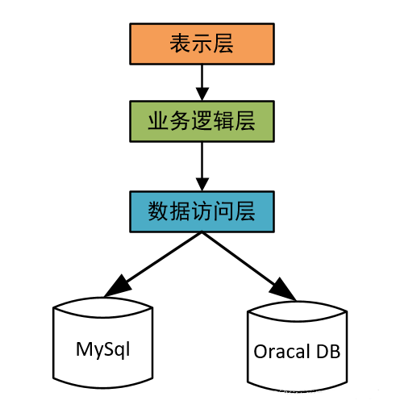


**1、表现层(UI)：**通俗讲就是展现给用户的界面，即用户在使用一个系统的时候他的所见所得。

**2、业务逻辑层(BLL)：**针对具体问题的操作，也可以说是对数据层的操作，对数据业务逻辑处理。 　　

**3、数据访问层(DAL)：**该层所做事务直接操作数据库，针对数据的增添、删除、修改、查找等。


**表示层**

位于最外层(最上层)，离用户最近。用于显示数据和接收用户输入的数据，为用户提供一种交互式操作的界面。

**业务逻辑层**

**业务逻辑层(Business Logic Layer)**无疑是系统架构中体现核心价值的部分。它的关注点主要集中在业务规则的制定、业务流程的实现等与业务需求有关的系统设计，也即是说它是与系统所应对的领域(Domain)逻辑有关，很多时候，也将业务逻辑层称为领域层。

例如Martin Fowler在《Patterns of Enterprise Application Architecture》一书中，将整个架构分为三个主要的层：表示层、领域层和数据源层。作为领域驱动设计的先驱Eric Evans，对业务逻辑层作了更细致地划分，细分为应用层与领域层，通过分层进一步将领域逻辑与领域逻辑的解决方案分离。

业务逻辑层在体系架构中的位置很关键，它处于数据访问层与表示层中间，起到了数据交换中承上启下的作用。由于层是一种弱耦合结构，层与层之间的依赖是向下的，底层对于上层而言是“无知”的，改变上层的设计对于其调用的底层而言没有任何影响。

如果在分层设计时，遵循了面向接口设计的思想，那么这种向下的依赖也应该是一种弱依赖关系。因而在不改变接口定义的前提下，理想的分层式架构，应该是一个支持可抽取、可替换的“抽屉”式架构。正因为如此，业务逻辑层的设计对于一个支持可扩展的架构尤为关键，因为它扮演了两个不同的角色。

对于数据访问层而言，它是调用者;对于表示层而言，它却是被调用者。依赖与被依赖的关系都纠结在业务逻辑层上，如何实现依赖关系的解耦，则是除了实现业务逻辑之外留给设计师的任务。

**数据层**

**数据访问层（Data Access Layer）**：有时候也称为是持久层，其功能主要是负责数据库的访问，可以访问数据库系统、二进制文件、文本文档或是XML文档。

简单的说法就是实现对数据表的Select，Insert，Update，Delete的操作。如果要加入ORM的元素，那么就会包括对象和数据表之间的mapping，以及对象实体的持久化。

**优缺点**

**优点**

1、开发人员可以只关注整个结构中的其中某一层;

2、可以很容易的用新的实现来替换原有层次的实现;

3、可以降低层与层之间的依赖;

4、有利于标准化;

5、利于各层逻辑的复用。

6、结构更加的明确

7、在后期维护的时候，极大地降低了维护成本和维护时间

**缺点**

1、降低了系统的性能。这是不言而喻的。如果不采用分层式结构，很多业务可以直接造访数据库，以此获取相应的数据，如今却必须通过中间层来完成。

2、有时会导致级联的修改。这种修改尤其体现在自上而下的方向。如果在表示层中需要增加一个功能，为保证其设计符合分层式结构，可能需要在相应的业务逻辑层和数据访问层中都增加相应的代码。

3、增加了开发成本。

**规则**

三层结构的程序不是说把项目分成DAL, BLL, WebUI三个模块就叫三层了, 下面几个问题在你的项目里面：

1. **UILayer里面只有少量(或者没有)SQL语句或者存储过程调用, 并且这些语句保证不会修改数据?**

2. **如果把UILayer拿掉, 你的项目还能在Interface/API的层次上提供所有功能吗?**

3. **你的DAL可以移植到其他类似环境的项目吗?**

4. **三个模块, 可以分别运行于不同的服务器吗?**

如果不是所有答案都为YES, 那么你的项目还不能算是严格意义上的三层程序. 三层程序有一些需要约定遵守的规则：　

1. 最关键的, UI层只能作为一个外壳, 不能包含任何BizLogic的处理过程

2. 设计时应该从BLL出发, 而不是UI出发. BLL层在API上应该实现所有BizLogic, 以面向对象的方式

3. 不管数据层是一个简单的SqlHelper也好, 还是带有Mapping过的Classes也好, 应该在一定的抽象程度上做到系统无关

4. 不管使用`COM+(`Enterprise Service), 还是`Remoting,` 还是`WebService`之类的远程对象技术, 不管部署的时候是不是真的分别部署到不同的服务器上, 最起码在设计的时候要做这样的考虑, 更远的, 还得考虑多台服务器通过负载均衡作集群

所以考虑一个项目是不是应该应用三层/多层设计时, 先得考虑下是不是真的需要? 实际上大部分程序就开个WebApplication就足够了, 完全没必要作的这么复杂. 而多层结构, 是用于解决真正复杂的项目需求的。


## 第2章 以用户登录为例解析三层架构逻辑实现

​		要以三层架构来实现一个业务，我们要从几个方面入手，按先后顺序来区分：

​			1、分析需求

​			2、拆解业务逻辑

​			3、确定调用关系

​			4、定义接口

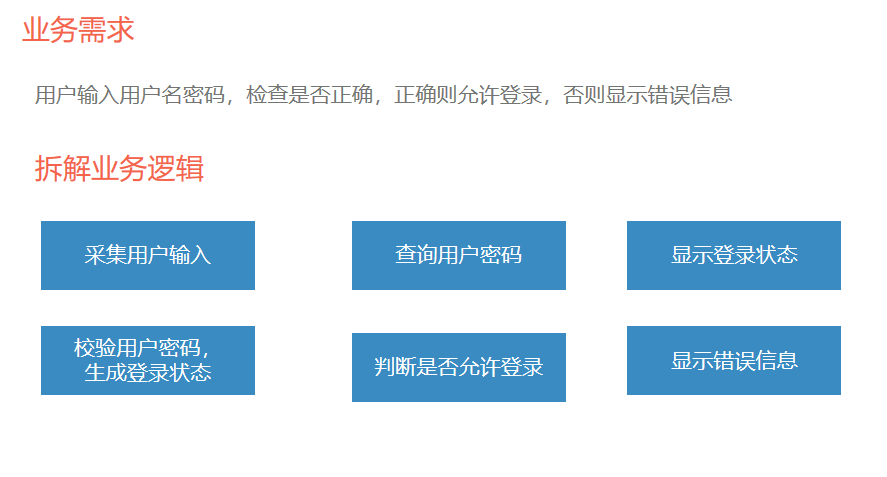


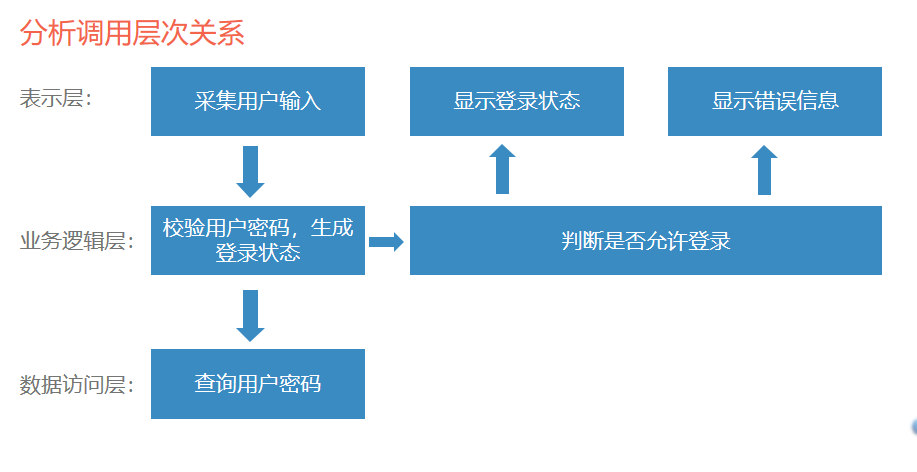

定义接口：

表示层：

​	采集用户输入(输入：String用户名，String密码，
​		          输出：user对象(包含username和password属性))
​	
​	显示登录信息(输入：login对象，输出：String login.loginStatus值)

​	显示错误信息(输入：login对象，输出：String login.errorInfo值)

1、思考：我们用scan对象来获取用户输入，为什么接口方法不定义成
(输入：scan对象或无输入对象，输出：user对象)？

2、思考：显示登录信息的输出，为什么不用login对象，而是要输出login.loginStatus的值？


逻辑层：

​	校验用户密码，生成登录状态
​		(输入：user对象,
​		 输出：login对象(包含loginStatus和errorInfo属性))

​                  判断是否允许登录
​		(输入：login对象，
​		 输出：boolean)

3、思考：校验用户密码方法的输入为什么不定义成接受拼好的查询SQL ?


数据访问层：

​	查询用户密码
​		(输入：user对象,
​		 输出：String password) 如果没查到用户，返回null，否则返回数据库中			 存的密码。)

​                  判断是否允许登录
​		(输入：login对象，
​		 输出：boolean)

4、思考：查询用户密码，为什么不直接返回是否登录成功的true或false ?


思考解答：

1、考虑封装的通用性，scan是命令行实现，如果是web实现，则需要使用request对象，这样接口就做不到通用

2、输出也要考虑通用性，如果输出login对象，那么需要在表现层的其他方法或更上层中拆解login对象。如果是web页面带模板解析，还能拆解对象，但是命令行的展现终端是System.out，不具备拆解能力。

3、如果在逻辑层拼好sql，那么数据访问层只能使用数据库，不能适应文本文件存储底层的情况。

4、如果使用单点登录等框架，还可能需要调用远程方法来判断登录，这样可以预留实现空间。

​      三层架构功能要区分清晰，不要混淆。要尽量考虑可扩展性，哪怕牺牲复杂度。


## 第3章 数据访问层DAO实现

### 		数据访问层概念

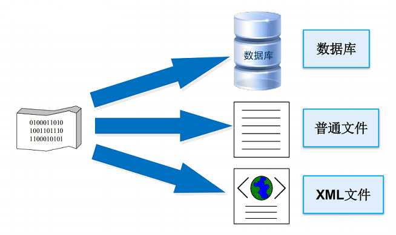

数据持久化目标：
         可以是数据库，也可以是普通文件，或xml。
         还可以是云端设备等，

设计数据访问层的一个目的就是
        可以广泛适应各种持久化设备，把设计复杂度屏蔽在层的内部，抽取出简单的接口供上层使用。

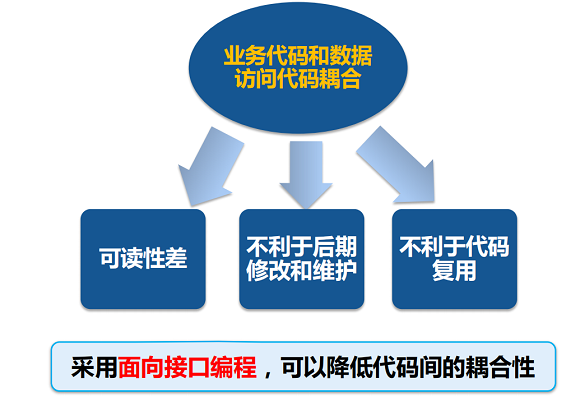

​		如果不采用持久层设计，则导致业务代码与数据访问代码紧密耦合，可读性差，不利于后期修改和维护，不利于代码复用。


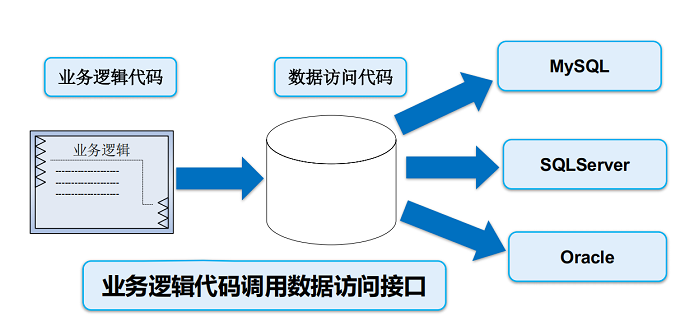

​		采用数据访问层后，可以把数据访问代码封装在层内部，从而对上层调用屏蔽实现细节，提高系统适应性，提供代码复用率。


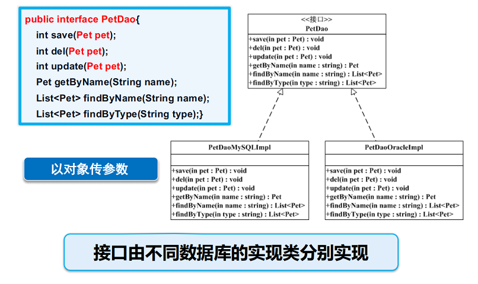

​		通过针对数据访问层接口编程，可以在同一接口下实现不同数据库的持久类，从而简化上层调用，提高系统可扩展性。

### 什么是DAO

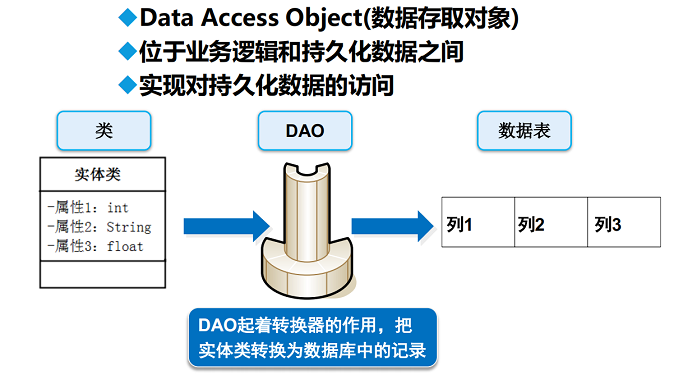


> 1）、DAO全称是（Data Access Objects) ，数据库访问对象，主要的功能就是用于进行数据操作的，在程序的标准开发架构中属于数据访问层的操作。
>
> 2）、DAO层一般有接口和该接口的实现类！ 接口用于规范实现类！ 实现类一般用于用于操作数据库！ 一般操作修改，添加，删除数据库操作的步骤很相似，就写了一个公共类DAO类 ，修改，添加，删除数据库操作时 直接调用公共类DAO类！


​		DAO设计模式可以减少代码量，增强程序的可移植性，提高代码的可读性。在整个DAO中实际上都是以接口为操作标准的，即：客户端依靠DAO实现的接口进行操作，而服务端要将接口进行具体的实现。DAO由以下几个部分组成。

1）、VO实体类：主要由属性、setter、getter方法组成，VO类中的属性与表中的字段相对应，每一个VO类的对象都表示表中的每一条记录，即包含属性和表中字段完全对应的类。

2）、DAO接口：主要定义操作的接口，定义一系列数据库的原子性操作，例如：增加、修改、删除、按ID查询等，即提供了用户所有的操作方法（就如老师给学生提供一些学习方法）。

3）、Impl(DAO实现类)： DAO接口的真实实现类，完成具体的数据库操作，但是不负责数据库的打开和关闭，即实现DAO中所有的方法（就如老师给提供的方法看你如何去完成）；

4）、DatabaseConnection数据库连接类: 专门负责数据库操作的类，即连接数据库并获取连接对象，执行SQL。


### 		如何实现数据访问层

#### 实现实体类

**实体类的特征：**

​		1.属性一般用private修饰（getter/setter方法—---用public修饰）；

​        2.最好实现java.io.Serializable接口支持序列化机制，可以将该对象转换成字节序列而保存在磁盘上或在网络上传输；

​        3.对实体类提供无参构造方法，根据业务需要提供相应的有参构造方法；

​        4.定义属性serialVersionUID，解决不同版本之间的序列化问题（可选）

​           (private static final long serialVersionUID=2070056025956126480L)

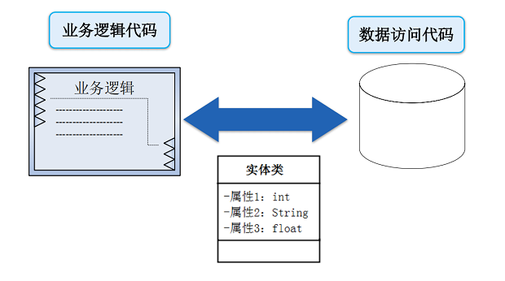

其次要实现接口类

​        接口类的定义要根据业务需求，在逻辑层的调用需求，都需要在接口层定义相应的接口。
​        只要是实现了此接口的实现类，都可以在逻辑层被正常调用，这样就实现了底层实现类更新扩展替换，而不影响到逻辑层代码的目的。


然后要实现接口的实现类

​         接口的实现类具体实现接口逻辑，根据底层存储的不同，可以有多种不同的实现类，每个实现类对应一种底层存储。

最后要实现数据库操作工具类
        避免数据库连接和关闭代码的重复使用，方便修改。


#### 实现数据库操作工具类

将通用操作（数据库打开连接，关闭连接）封装到工具类中。

```
public class BaseDao {
    private String driver = "com.mysql.jdbc.Driver";// 数据库驱动字符串
	private String url = "jdbc:mysql://localhost:3306/epet";// 连接URL字符串
	private String user = "epetadmin"; // 数据库用户名
	private String password = "0000"; // 用户密码
    Connection conn = null;				// 数据连接对象
    /**
     * 获取数据库连接对象
     */
    public Connection getConnection() {
        if(conn==null) {
            // 获取连接并捕获异常
            try {
                Class.forName(driver);
                conn = DriverManager.getConnection(url, user, password);
            } catch (Exception e) {
                e.printStackTrace();				// 异常处理
            }
        }
        return conn;							// 返回连接对象
    }
    /**
     * 关闭数据库连接
     * @param conn 数据库连接
     * @param stmt Statement对象
     * @param rs 结果集
     */
    public void closeAll(Connection conn, Statement stmt, 
                   ResultSet rs) {
        // 若结果集对象不为空,则关闭
        if (rs != null) {
            try {
                rs.close();
            } catch (Exception e) {
                e.printStackTrace();
            }
        }
        // 若Statement对象不为空,则关闭
        if (stmt != null) {
            try {
                stmt.close();
            } catch (Exception e) {
                e.printStackTrace();
            }
        }
        // 若数据库连接对象不为空,则关闭
        if (conn != null) {
            try {
                conn.close();
            } catch (Exception e) {
                e.printStackTrace();
            }
        }
    }
}
```

实现通用的增删改操作（采用预处理SQL模式 ）。

```
	 /**
	 * 增、删、改的操作
	 * @param sql 预编译的 SQL 语句          
	 * @param param 参数的字符串数组          
	 * @return 影响的行数
	 */
	public int exceuteUpdate (String preparedSql, Object[] param) {
		PreparedStatement pstmt = null;
		int num = 0;
		conn =  getConnection(); 
		try {
			pstmt = conn.prepareStatement(preparedSql);
			if (param != null) {
				for (int i = 0; i < param.length; i++) {
                     	//为预编译sql设置参数
					pstmt.setObject(i + 1, param[i]); 
				}
			}
			num = pstmt.executeUpdate(); 
		} catch (SQLException e) {
			e.printStackTrace();
		} finally{
			closeAll(conn,pstmt,null);
		}
		return num;
	}
```


接口实现类继承基础工具类，并实现数据访问层业务接口

```
	public interface PetDao {
    /**
      * 保存宠物。
      * @param pet 宠物
      */
     int save(Pet pet);
    /**
     * 删除宠物。
     * @param pet 宠物
     */
     int del(Pet pet);
    /**
     * 更新宠物。
     * @param pet 宠物
     */
    int update(Pet pet);
     /**
     * 获取指定昵称的宠物,精确查询。
     * @param name 昵称
     * @return 宠物
     */
    Pet getByName(String name);
    /**
     * 获取指定昵称的宠物列表,模糊查询。
     * @param name 昵称
     * @return 宠物列表
     */
    List<Pet> findByName(String name);
    /**
     * 获取指定类型的宠物列表。
     * @param type 宠物类型
     * @return 宠物列表
     */
    List<Pet> findByType(String type);
}
```


```
public class PetDaoMySQLImpl extends BaseDao implements PetDao{
	public int update(Pet pet) {	
		String sql="update pet set status=0 where id=?";
		Object[] param={pet.getId()};
		int result=this.exceuteUpdate(sql, param);
		return result;
	}

	@Override
	public List<Pet> findByName(String name) {
		// TODO Auto-generated method stub
		return null;
	}

	@Override
	public Pet getByName(String name) {
		// TODO Auto-generated method stub
		return null;
	}
	
	@Override
	public List<Pet> findByType(String type) {
		// TODO Auto-generated method stub
		return null;
	}

	@Override
	public int save(Pet pet) {
		String sql="insert pet(master_id,name,type_id) values(?,?,?)";
		Object[]param={pet.getMasterId(),pet.getName(),pet.getTypeId()};
		return exceuteUpdate(sql, param);
	}

	@Override
	public int del(Pet pet) {
		// TODO Auto-generated method stub
		return 0;
	}
}
```

#### 实现连接参数可配置化

​		常见的Java配置文件有.properties、.xml，我们这里使用.properties文件来配置连接参数

​				此类文件后缀为.properties.

​				采用键值对的方式存储

​				使用#号来注释

​				一般存放在 java源代码根路径下，即CLASS文件配置根路径


​		jdk提供了Properties类来读取配置文件，常用方法如下：

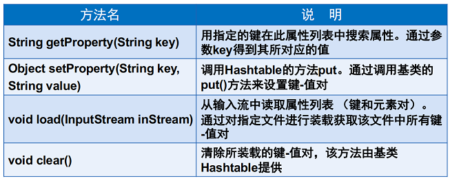

​		具体使用方法：

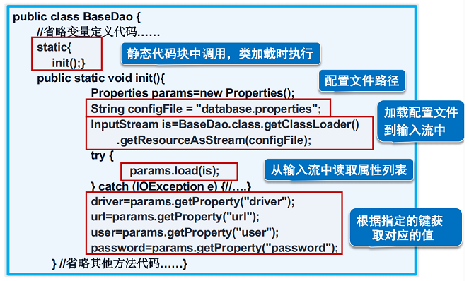


## 第4章 Java连接池

当我们创建了一个Connection对象，它在内部都执行了什么：

​		1.“DriverManager”检查并注册驱动程序；

​		2.“com.mysql.jdbc.Driver”就是我们注册了的驱动程序，它会在驱动程序类中调用“connect(url…)”方法。

​		3.com.mysql.jdbc.Driver的connect方法根据我们请求的“connUrl”，创建一个“Socket连接”，连接到IP为“your.database.domain”，默认端口3306的数据库。

​		4.创建的Socket连接将被用来查询我们指定的数据库，并最终让程序返回得到一个结果。

​		简单的获取一个连接，系统却要在背后做很多消耗资源的事情，大多时候，创建连接的时间比执行sql语句的时间还要长。


### 什么是连接池

​			为解决上述问题，可以采用数据库连接池技术。数据库连接池的基本思想就是为数据库连接建立一个“缓冲池”。预先在缓冲池中放入一定数量的连接，当需要建立数据库连接时，只需从“缓冲池”中取出一个，使用完毕之后再放回去。我们可以通过设定连接池最大连接数来防止系统无尽的与数据库连接。更为重要的是我们可以通过连接池的管理机制监视数据库的连接的数量﹑使用情况，为系统开发﹑测试及性能调整提供依据。

​		其原理是：

​		先打开一定数量的数据库连接，当使用的时候分配给调用者，调用完毕后返回给连接池，注意返回给连接池后这些连接并不会关闭，而是准备给下一个调用者进行分配。由此可以看出连接池节省了大量的数据库连接打开和关闭的动作，对系统性能会有较大地提升。


​		数据库连接池的最小连接数和最大连接数的设置要考虑到以下几个因素:

1. 最小连接数:是连接池一直保持的数据库连接,所以如果应用程序对数据库连接的使用量不大,将会有大量的数据库连接资源被浪费.

2. 最大连接数:是连接池能申请的最大连接数,如果数据库连接请求超过次数,后面的数据库连接请求将被加入到等待队列中,这会影响以后的数据库操作

3. 如果最小连接数与最大连接数相差很大:那么最先连接请求将会获利,之后超过最小连接数量的连接请求等价于建立一个新的数据库连接.不过,这些大于最小连接数的数据库连接在使用完不会马上被释放,他将被放到连接池中等待重复使用或是空间超时后被释放.

   

在Java中开源的常用的数据库连接池有以下几种 ：

1）DBCP
DBCP是一个依赖Jakarta commons-pool对象池机制的数据库连接池.DBCP可以直接的在应用程序中使用，Tomcat的数据源使用的就是DBCP。

2）c3p0
c3p0是一个开放源代码的JDBC连接池，它在lib目录中与Hibernate一起发布,包括了实现jdbc3和jdbc2扩展规范说明的Connection 和Statement 池的DataSources 对象。

3）Druid
阿里出品，淘宝和支付宝专用数据库连接池，对Oracle和MySql做了特别优化。


### 怎么用连接池（DBCP）

​		**DBCP(DataBase connection pool)**数据库连接池是 apache 上的一个Java连接池项目。DBCP通过连接池预先同数据库建立一些连接放在内存中(即连接池中)，应用程序需要建立数据库连接时直接到从接池中申请一个连接使用，用完后由连接池回收该连接，从而达到连接复用，减少资源消耗的目的。

​		下面以DBCP为例来说明如何配置使用连接池

#### 第一步：添加jar包

commons-dbcp-1.4.jar
commons-pool-1.6.jar
mysql-connector-java-8.0.22.jar

#### 第二步：在src下创建DBCP的配置文件dbcp.properties

```
#<!-- 连接设置 -->
driverClassName=com.mysql.jdbc.Driver
url=jdbc:mysql://localhost:3306/mydb
username=root
password=root

#<!-- 初始化连接 -->
initialSize=10
#<!-- 最大连接数量 -->
maxActive=50
#<!-- 最大空闲连接 -->
maxIdle=20
#<!-- 最小空闲连接 -->
minIdle=5
#<!-- 超时等待时间(单位毫秒) -->
maxWait=50000
#<!-- 编码方式 -->
connectionProperties=useUnicode=true;characterEncoding=utf8
##<!-- 指定由连接池所创建的连接自动提交 -->
defaultAutoCommit=true
#<!-- 指定由连接池所创建的连接的事务级别 -->
defaultTransactionIsolation=REPEATABLE_READ
```

#### 第三步：编写操作DBCP的工具类DBCPUtil

```
package cn.com.demo8;

import java.sql.Connection;
import java.sql.ResultSet;
import java.sql.SQLException;
import java.sql.Statement;
import java.util.Properties;
import javax.sql.DataSource;
import org.apache.commons.dbcp.BasicDataSourceFactory;

public class DBCPUtil {
   private static DataSource dataSource = null;
   //创建数据库连接池
   static{
       Properties properties = new Properties();
       try {
           ClassLoader classLoader=DBCPUtil.class.getClassLoader();
           properties.load(classLoader.getResourceAsStream("dbcpconfig.properties"));
           dataSource = BasicDataSourceFactory.createDataSource(properties);
       } catch (Exception e) {
           throw new ExceptionInInitializerError("DBCP始化错误，请检查配置文件");
       }
   }

   //创建连接
   public static Connection getConnection(){
       try {
           return dataSource.getConnection();
       } catch (SQLException e) {
           throw new RuntimeException("数据库连接错误");
       }
   }

   //释放连接
   public static void releaseConnection(Connection connection, Statement statement, ResultSet resultSet) {
       if (resultSet != null) {
           try {
               resultSet.close();
           } catch (Exception e) {
               e.printStackTrace();
           }
           resultSet = null;
       }
       if (statement != null) {
           try {
               statement.close();
           } catch (Exception e) {
               e.printStackTrace();
           }
           statement = null;
       }
       if (connection != null) {
           try {
               connection.close();
           } catch (Exception e) {
               e.printStackTrace();
           }
           connection = null;
       }
   }
}
```

完成后即可像普通数据库工具类一样，使用DBCP连接工具类了。

### 怎么用连接池（Druid）

​		Druid首先是一个数据库连接池。Druid是目前最好的数据库连接池，在功能、性能、扩展性方面，都超过其他数据库连接池，包括DBCP、C3P0、BoneCP、Proxool、JBoss DataSource。Druid已经在阿里巴巴部署了超过600个应用，经过一年多生产环境大规模部署的严苛考验。

同时Druid不仅仅是一个数据库连接池，它包括四个部分：

   ***Druid是一个JDBC组件，它包括三个部分：***

  	基于Filter－Chain模式的插件体系。

  	DruidDataSource 高效可管理的数据库连接池。

  	SQLParser

**Druid的功能**

1、替换DBCP和C3P0。Druid提供了一个高效、功能强大、可扩展性好的数据库连接池。

2、可以监控数据库访问性能，Druid内置提供了一个功能强大的StatFilter插件，能够详细统计SQL的执行性能，这对于线上分析数据库访问性能有帮助。

3、数据库密码加密。直接把数据库密码写在配置文件中，这是不好的行为，容易导致安全问题。DruidDriver和DruidDataSource都支持PasswordCallback。

4、SQL执行日志，Druid提供了不同的LogFilter，能够支持Common-Logging、Log4j和JdkLog，你可以按需要选择相应的LogFilter，监控你应用的数据库访问情况。

5、扩展JDBC，如果你要对JDBC层有编程的需求，可以通过Druid提供的Filter机制，很方便编写JDBC层的扩展插件。

#### 第一步：添加jar包

druid-1.2.1.jar
mysql-connector-java-8.0.22.jar

#### 第二步：在src下创建Druid的配置文件druid.properties

```
#MySQL驱动  
druid.driverClassName=com.mysql.jdbc.Driver  
#MySQL连接地址  
druid.url=jdbc\:mysql\://192.168.0.8\:3306/test  
#数据库用户  
druid.username=moster  
#该用户密码  
druid.password=shzygjrmdwg  
#自动提交  
druid.defaultAutoCommit=false  
#只读设置  
druid.defaultReadOnly=false  
druiddruid.defaultTransactionIsolation=  
druid.defaultCatalog=  
#连接池最大使用连接数量  
druid.maxActive=25  
#连接池最大空闲  
druid.maxIdle=25  
#连接池最小空闲  
druid.minIdle=1  
#初始化连接池大小  
druid.initialSize=1  
#连接等待时间，默认：-1  
druid.maxWait=3000  
druiddruid.testOnBorrow=  
druid.testOnReturn=  
#检测间隔，检测需要关闭的空闲连接，单位：毫秒  
druiddruid.timeBetweenEvictionRunsMillis=  
druid.numTestsPerEvictionRun=  
#一个连接在池中最小生存的时间，单位：毫秒  
druiddruid.minEvictableIdleTimeMillis=  
druid.testWhileIdle=  
#测试SQL  
druid.validationQuery=  
#测试超时时间  
druid.validationQueryTimeout=  
#初始化连接SQL  
druiddruid.initConnectionSqls=  
druid.accessToUnderlyingConnectionAllowed=  
#移除被废弃连接  
druid.removeAbandoned=  
#超时时间  
druid.removeAbandonedTimeout=  
#日志记录  
druid.logAbandoned=  
#PreparedStatements  
druid.poolPreparedStatements=  
#PreparedStatement最大数量  
druid.maxOpenPreparedStatements=  
#属性配置文件  
druid.connectionProperties=  
#filters配置  
druid.filters=  
#Exception处理  
druid.exceptionSorter=  
#Exception处理类名  
druid.exception-sorter-class-name=  
#初始化  
druid.init= 
```

#### 第三步：编写操作Druid的工具类DruidUtil

```
import com.alibaba.druid.pool.DruidDataSourceFactory;

import javax.sql.DataSource;
import java.io.IOException;
import java.sql.Connection;
import java.sql.ResultSet;
import java.sql.SQLException;
import java.sql.Statement;
import java.util.Properties;

/**
 * Druid连接池的工具类
 */
public class DruidUtil {
    //1、定义成员变量DataSource
    private static DataSource ds;

    static {

        try {
            //1、加载配置文件
            Properties pro =new Properties();
            pro.load(DruidUtil.class.getClassLoader().getResourceAsStream("druid.properties"));
            //2、获取DataSource
            ds= DruidDataSourceFactory.createDataSource(pro);
        } catch (IOException e) {
            e.printStackTrace();
        } catch (Exception e) {
            e.printStackTrace();
        }
    }
    /**
     * 获取连接
     */
    public static Connection getConnection() throws SQLException {
        return ds.getConnection();
    }


    /**
     * 释放资源
     */
    public static void close(Statement stmt,Connection conn){
        close(null, stmt, conn);
    }

    public static void close(ResultSet rs,Statement stmt,Connection conn){
        if (rs !=null){
            try {
                rs.close();
            } catch (SQLException e) {
                e.printStackTrace();
            }
        }
        if (stmt !=null){
            try {
                stmt.close();
            } catch (SQLException e) {
                e.printStackTrace();
            }
        }
        if (conn !=null){
            try {
                conn.close();
            } catch (SQLException e) {
                e.printStackTrace();
            }
        }
    }

    /**
     * 获取连接池方法
     */
    public static DataSource getDataSource(){
        return ds;
    }
}

```

完成后即可像普通数据库工具类一样，使用DBCP连接工具类了。

```
import java.sql.Connection;
import java.sql.PreparedStatement;
import java.sql.ResultSet;

public class Demo1 {
    public void test1() throws Exception {
        Connection conn = DruidUtil.getConnection();
        String sql = "select * from t_dict where dvalue=?";
        PreparedStatement pstmt = conn.prepareStatement(sql);
        pstmt.setString(1, "男");
        ResultSet resultSet = pstmt.executeQuery();
        while (resultSet.next() != false) {
            System.out.println("did=" + resultSet.getString("did"));
        }
        DruidUtil.close(resultSet, pstmt, conn);
    }

    public static void main(String[] args) throws Exception {
        Demo1 d = new Demo1();
        d.test1();
    }
}
```

