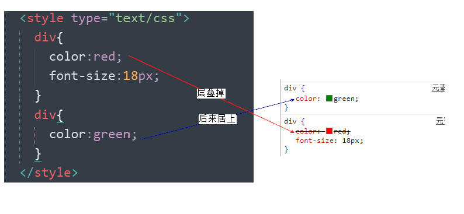

# 一.HTML的局限性

说起HTML，这其实是个非常单纯的家伙， 他只关注内容的语义， 

比如<h1>表明这是一个大标题，用<p> 表明这是一个段落，用 表明这儿有一个图片， 用<a> 表示此处有链接

很早的时候，世界上的网站虽然很多，但是他们都有一个共同的特点： **丑**

**总结：**

​	HTML满足不了设计者的需求

​	操作html属性不方便

​	HTML里面添加样式带来的是无尽的臃肿和繁琐

# 二.CSS简介

**网页的美容师**

让我们的网页更加丰富多彩，布局更加灵活自如。   

CSS的最大贡献就是：  让 HTML 从样式中脱离，  实现了 HTML 专注去做 结构呈现，样式交给css 

> **我们理想中的结果： 结构(html)与样式(css)相分离**  这句话要记住

CSS 做的很出色，如果JavaScript是网页的魔法师，那么CSS它是我们网页的美容师

**概念：**

​	CSS(Cascading Style Sheets)  ，通常称为CSS样式表或层叠样式表（级联样式表）

**作用：**

​	主要用于**设置** HTML页面中的文本内容（字体、大小、对齐方式等）、图片的外形（宽高、边框样式、边距等）以及**版面的布局和外观显示样式。**

​	CSS以HTML为基础，提供了丰富的功能，如字体、颜色、背景的控制及整体排版等，而且还可以针对不同的浏览器设置不同的样式。

```html
<!DOCTYPE html>
<html lang="en">
<head>
    <meta charset="UTF-8">
    <meta name="viewport" content="width=device-width, initial-scale=1.0">
    <title>Document</title>
    <link rel="stylesheet" href="css/index.css">
    <style>
        div{
            color: blue;
            font-family: 仿宋;
            color: rgba(255,0,0,0.6);
        }
    </style>
   
</head>
<body>
    <div>Lorem, ipsum dolor sit amet consectetur adipisicing elit. Eaque quo possimus sapiente repellendus, facilis illum voluptatum? Ratione, nulla laborum nobis soluta sapiente dolores ab, ut molestias perspiciatis, tenetur adipisci blanditiis.</div>
    <div></div>
</body>
</html>
```


# 	三.四种引入方式

​	第一种引入方式

​		行内样式表（首次提出结构和样式相分离)
​               用法：  在标签内添加一个style属性
​     第二种引入方式

​		内部样式表
​                用法：  在head标签里面添加一个style标签
​      第三种引入方式

​				外部样式表（完全实现了结构和样式的相分离）
​                用法：  在外部新建一个CSS为后缀的文件  然后使用link标签进行引入。

  	**第四种引入方式**

​				导入式

```html
		<style>
			@import "test.css";//@import导入样式表
		</style>
```

​					**注意**：链接式与导入式的区别：

​					链接式是html层面写的，导入式是使用css脚本写的；在页面加载时，链接式是先加载好了css文档，再显示html页面；而导入式是先加载html显示出来后，再加载css脚本的效果；

​						所以：推荐使用链接式，不推荐使用导入式，但是我们需要知道有这么一种方式；

   		优先级
         				就近原则（显示）
         				行内 >  (link style谁在后面)
   		执行顺序
         				从上到下依次执行同样的属性 在权重相同的情况下 后面的会覆盖前面的

```html
<!DOCTYPE html>
<html lang="en">
<head>
    <meta charset="UTF-8">
    <meta name="viewport" content="width=device-width, initial-scale=1.0">
    <title>Document</title>
    <style>
        /* CSS的地盘 */
        h1{
            font-size: 30px;
            color: red;
            font-family: 仿宋;
        }
    </style>
    <link rel="stylesheet" href="css/index.css">
</head>
<body>
    <!-- CSS的第一阶段（行内样式表）
                在标签内部   添加一个  通用的    style    属性
        一条样式由      样式名 ： 样式值 并且以分号结尾
        font-size: 1500px;     后面必须加上单位而且不受大小限制
             -->
    <div style="font-size: 15px;color: chartreuse;font-family: 仿宋;">今天是周二</div>
    <h1 style="">今天的天气有点冷</h1>
    <h1>需要人暖手手</h1>
    <h2>!!!</h2>
    <p>Lorem ipsum, dolor sit amet consectetur adipisicing elit. Est assumenda eaque enim doloremque aspernatur ad fuga possimus nisi praesentium error vel itaque voluptatum laborum, ipsa incidunt, nemo quisquam natus reprehenderit.</p>
</body>
</html>
```


# 四.CSS特性

## 1.CSS层叠性



概念：所谓层叠性是指多种CSS样式的叠加

​	是浏览器处理冲突的一个能力,如果一个属性通过两个相同选择器设置到同一个元素上，那么这个时候一个属性就会将另一个属性层叠掉

原则：

​	样式冲突，遵循的原则是**就近原则。** 那个样式离着结构近，就执行那个样式

​	样式不冲突，不会层叠

## 2.CSS继承性

概念：

​	子标签会继承父标签的某些样式，如文本颜色和字号

​    想要设置一个可继承的属性，只需将它应用于父元素即可

​	简单的理解就是：  子承父业

​	**注意**：

​		恰当地使用继承可以简化代码，降低CSS样式的复杂性。比如有很多子级孩子都需要某个样式，可以给父级指定一个，这些孩子继承过来就好了

​		子元素可以继承父元素的样式（**text-，font-，line-这些元素开头的可以继承，以及color属性**）

# 五.CSS中的选择器

## 1.基础选择器

| 选择器       | 作用                          | 缺点                     | 使用情况   | 用法                 |
| ------------ | ----------------------------- | ------------------------ | ---------- | -------------------- |
| 标签选择器   | 可以选出所有相同的标签，比如p | 不能差异化选择           | 较多       | p { color：red;}     |
| 类选择器     | 可以选出1个或者多个标签       | 可以根据需求选择         | 非常多     | .nav { color: red; } |
| id选择器     | 一次只能选择器1个标签         | 只能使用一次             | 不推荐使用 | #nav {color: red;}   |
| 通配符选择器 | 选择所有的标签                | 选择的太多，有部分不需要 | 不推荐使用 | * {color: red;}      |

```HTML
<!DOCTYPE html>
<html lang="en">
<head>
    <meta charset="UTF-8">
    <meta name="viewport" content="width=device-width, initial-scale=1.0">
    <title>Document</title>
    <style>
        *{
            font-family: 仿宋;
            text-decoration: none;
        }
        span{
            color: red;
        }
        #span1{
            color: pink;
            text-decoration: none;
        }
        #span2{
            color: blue;
        }
        .p1{
            color: coral;
        }
        .p2{
            color: yellow;
        }
        .son{
            font-size: 40px;
        }
        .son2{
            color: teal;
        }
        .son1{
            font-size: 100px;
        }
        .邱{
            background-color: red;
        }
    </style>
</head>
<body>
    <div>
        这是一个div
        <span id="span2" id="span1">
            这是一个span
        </span>
        <span>
            这是一个复制的span
        </span>
        <input type="text">
        <a href="#" id="span1">百度</a>
        <p class="p1 p2">
            Lorem ipsum dolor sit amet consectetur, adipisicing elit. Eveniet explicabo excepturi reprehenderit aut quidem nostrum architecto modi velit debitis, aliquam officiis perferendis corporis soluta iusto quo nihil reiciendis recusandae minus!
        </p>
        <div class="邱">123</div>
        <div class="son son2">123</div>
        <div class="son">123</div>
    </div>
</body>
</html>
```


## 2.复杂选择器

| 选择器         | 作用                         | 特征                 | 隔开符号及用法                          |
| -------------- | ---------------------------- | -------------------- | --------------------------------------- |
| 后代选择器     | 用来选择元素后代             | 是选择所有的子孙后代 | 符号是空格 .nav a                       |
| 子代选择器     | 选择 最近一级元素            | 只选亲儿子           | 符号是**>**   .nav>p                    |
| 兄弟选择器     | 选择紧挨着后面的一个兄弟元素 | 选兄弟               | 符号是+   div + p                       |
| 群组选择器     | 选择多个标签                 | 既是 又是            | 没有符号  div，p                        |
| 属性选择器     | 选择属性                     | 找到该属性           | [title]                                 |
| 链接伪类选择器 | 给链接更改状态               |                      | 重点记住 a{} 和 a:hover  实际开发的写法 |

  伪类选择器（主要应用于a标签）
           :hover   当鼠标指向时产生的样式
           :link    超链接未访问时的状态
           :visited 超链接访问后的状态
           :active  激活状态 点击时的状态

​	**注意**

 			定义CSS时候的顺序不同，也会直接导致链接显示的效果不同

​			 写的时候，他们的顺序尽量不要颠倒  按照  link、visited、hover、active 的顺序

​             爱恨法则：love hate

```html
<!DOCTYPE html>
<html lang="en">
<head>
    <meta charset="UTF-8">
    <meta name="viewport" content="width=device-width, initial-scale=1.0">
    <title>Document</title>
    <style>
        #father,.p1{
            color: red;
        }
        #foot .ul1 li a{
            color: blueviolet;
        }
        #foot ul li a{
            color: teal;
        }
        #foot a{
            color: yellow;
            text-decoration: none;
            font-size: 40px;
        }
        #foot>#ul{
            width: 100px;
            height: 200px;
            background-color: red;
        }
        #div1>#div2>#div3>#div4{
            width: 100px;
            height: 100px;
            background-color: green;
        }
       #div1+div{
            width: 100px;
            height: 100px;
            background-color: pink;
        }
    </style>
</head>
<body>
    <div id="father">1</div>
    <div>2</div>
    <p class="p1">3</p>
    <h1 id="h1">4</h1>

    <div id="foot">
        <!-- <p id="p1"> -->
            <ul class="ul1">
                <li><a href="">1</a></li>
                <li><a href="">12</a></li>
                <li><a href="">1234</a></li>
            </ul>
        <!-- </p> -->
    </div>

    <div id="div1">
        <div id="div2">
            <div id="div3">
                <div id="div4"></div>
            </div>
        </div>
    </div>
</body>
</html>
```


## 3.选择器的命名规范

1.  要做到见名知意
 2.  不能以数字开头(class选择器必须以字母开头)
 3.  不能用中文字符   

## 4.选择器优先级

 	优先级关系：内联样式 > ID 选择器 > 类选择器 = 属性选择器 = 伪类选择器 > 标签选择器 = 伪元素选择器 

​	 使用选择器相同的情况下：就近原则

​	 使用选择器不同情况下：计算权值

| 选择器                           | 权重值  |
| :------------------------------- | ------- |
| 通配选择符                       | 0,0,0,0 |
| 标签选择器 、伪元素选择器        | 0,0,0,1 |
| 类选择器、属性选择器、伪类选择器 | 0,0,1,0 |
| ID选择器                         | 0,1,0,0 |
| 行内样式                         | 1,0,0,0 |
| @important                       | ∞无穷大 |

​	 使用的规则也很简单，就是 **选择器的权值加到一起，大的优先；如果权值相同，后定义的优先** ，虽然很简单，但如果书写的时候没有注意，很容易就会导致CSS的重复定义，代码冗余

​	**总结**：

​			权值的大小跟选择器的类型和数量有关

​			样式的优先级跟样式的定义顺序有关

# 七.文字文本样式

   ## 		1.颜色的表现形式

​		英文字符   （提前定义好的 ）

​		十六进制    (使用#开头)

​		rgb         （三原色）  取值范围 0-255

​		rgba       a是透明度   

   ## 		2.字体样式

  	font-size  字体的大小 （单位  px  像素  绝对单位）

  	font-family   字体的类型

  	color  字体颜色（前面不加font）

  	font-weight  取值范围是100-900 900是加粗效果   bold == 900

  	font-style   字体倾斜  italic

  	text-decoration:   字体划线

​            	underline     	下划线
​            	overline      	  上划线
​            	line-through    中划线 

  	text-indent: 2em;  首行文本缩进 

  	text-align   水平位置

 	 letter-spacing 字体间隙

##     	3.尺寸样式

   	width  宽度
   	height 高度

​	   line-height   行高
​              **注意**当一行的行高等于父级的高度的时候 就会产生垂直居中的一个效果

   	溢出 overflow 
                hidden  隐藏
                scroll  元素会出现滚动条  当内容溢出的时候滚动条可用
                auto    自动 没有溢出的时候就没有滚动条 一旦溢出就会出现滚动条

   ## 	4.背景样式

  	background-color     背景颜色 

  	background-image   背景图片

  	background-repeat  背景图片平铺

​           	repeat   默认  X Y都平铺
​           	repeat-x   	  横向平铺
​           	repeat-y   	  纵向平铺
​           	no-repeat  	不平铺

​	background-size   背景图片大小

​			   像素值（px）

​			   百分比（%）

  			 cover  	等比放大  铺满全部区域为止

  			 contain  等比放大 直到背景图像的右边或者下边停止  

​	background-attachment	背景固定


​            

# 八.元素分类

HTML标签一般分为块标签和行内标签两种类型，它们也称块元素和行内元素

## 1.块级元素(block-level)

常见的块元素有<h1>~<h6>、<p>、<div>、<ul>、<ol>、<li>等，其中<div>标签是最典型的块元素

块级元素的特点：

​	独占一行

​	高度，宽度、外边距以及内边距都可以控制

​	宽度默认是容器（父级宽度）的100%

​	是一个容器及盒子，里面可以放行内或者块级元素

**注意**：

​	只有文字才能组成段落 ，因此 p 里面不能放块级元素，特别是 p 中不能放div 

​	同理还有这些标签h1~h6,dt，他们都是文字类块级标签，里面不能放其他块级元素

## 2.行内元素(inline-level)

常见的行内元素有<a>、<strong>、<b>、<em>、<i>、<del>、<s>、<ins>、<u>、<span>等，其中<span>标签最典型的行内元素，有的地方也成内联元素

​	行内元素的特点：

​		相邻行内元素在一行上，一行可以显示多个

​		高、宽直接设置是无效的

​		默认宽度就是它本身内容的宽度

​		**行内元素只能容纳文本或则其他行内元素**

​	注意：

​		链接里面不能再放链接。

​		特殊情况a里面可以放块级元素，但是给a转换一下块级模式最安全

## 3.行内块元素（inline-block）

​	在行内元素中有几个特殊的标签、<input />、<td>，可以对它们设置宽高和对齐属性，有些资料可能会称它们为行内块元素

​	行内块元素的特点：

​		和相邻行内元素（行内块）在一行上,但是之间会有空白缝隙。一行可以显示多个
​		默认宽度就是它本身内容的宽度。
​		高度，行高、外边距以及内边距都可以控制

# 九.元素的显示与隐藏

## 1.opacity 透明度

​	控制元素的透明度

​		取值：0~1 （取值为0时完全不显示，为1时为元素初始状态）

## 2.display 显示

​	display 设置或检索对象是否及如何显示

​		display: none 隐藏对象

​		display：block 除了转换为块级元素之外，同时还有显示元素的意思

​		特点： 隐藏之后，不再保留位置

​	实际开发场景：

> ​	配合后面js做特效，比如下拉菜单，原先没有，鼠标经过，显示下拉菜单， 应用极为广泛

## 3.visibility 可见性 

​	设置或检索是否显示对象	

   	 visibility：visible ; 　  对象可视
		visibility：hidden; 　  对象隐藏

​		特点： 隐藏之后，继续保留原有位置

## 4.overflow 溢出

检索或设置当对象的内容超过其指定高度及宽度时如何管理内容。

| 属性值      | 描述                                       |
| ----------- | ------------------------------------------ |
| **visible** | 不剪切内容也不添加滚动条                   |
| **hidden**  | 不显示超过对象尺寸的内容，超出的部分隐藏掉 |
| **scroll**  | 不管超出内容否，总是显示滚动条             |
| **auto**    | 超出自动显示滚动条，不超出不显示滚动条     |

实际开发场景：

1. 清除浮动
2. 隐藏超出内容，隐藏掉,  不允许内容超过父盒子

# 十.盒子模型

​	就是把HTML页面中的布局元素看作是一个矩形的盒子，也就是一个盛装内容的容器

​	**标准盒子模型**

 

​	**特点：**

​		盒子模型由元素的内容、边框（border）、内边距（padding）、和外边距（margin）组成

​		盒子里面的文字和图片等元素是 内容区域

​		盒子的厚度 我们称为 盒子的边框 

​		盒子内容与边框的距离是内边距（类似单元格的 cellpadding)

​		盒子与盒子之间的距离是外边距（类似单元格的 cellspacing）

## 1.内容（content）

​		内容区域：用来存放文字，图片等元素

## 2.内边距（padding）

 

padding属性用于设置内边距， **是指边框与内容之间的距离**

**内边距设置**

| 属性           | 作用     |
| -------------- | :------- |
| padding-left   | 左内边距 |
| padding-right  | 右内边距 |
| padding-top    | 上内边距 |
| padding-bottom | 下内边距 |

当我们给盒子指定padding值之后， 发生了2件事情：

1. 内容和边框 有了距离，添加了内边距
2. 盒子会变大了

简写形式：

​	**注意**：  后面跟几个数值表示的意思是不一样的

| 值的个数 | 表达意思                                        |
| -------- | ----------------------------------------------- |
| 1个值    | padding：上下左右内边距;                        |
| 2个值    | padding: 上下内边距    左右内边距 ；            |
| 3个值    | padding：上内边距   左右内边距   下内边距；     |
| 4个值    | padding: 上内边距 右内边距 下内边距 左内边距 ； |

```html
<!DOCTYPE html>
<html lang="en">
<head>
    <meta charset="UTF-8">
    <meta name="viewport" content="width=device-width, initial-scale=1.0">
    <title>Document</title>
    <style>
        .father{
            width: 300px;
            height: 300px;
            background-color: pink;
            border: 1px solid red;
            /* 内边距
                    内容到边框的距离
             */
             /* padding: 30px; */
             /* 上下左右 */
             /* padding-top: 50px;
             padding-left: 60px; */
             /* 上 右  下  左 */
             padding: 10px;

        }
        .father2{
            width: 300px;
            height: 300px;
            background-color: red;
            padding: 30px 30px 30px 30px;
        }
        .son{
            width: 100px;
            height: 100px;
            background-color: green;
        }
    </style>
</head>
<body>
    <div class="father">
        星期三
    </div>
    <div class="father2">
        <div class="son"></div>
    </div>
</body>
</html>
```


## 3.边框（border） 

 

  	border-width  定义边框粗细，单位是px  

​	  border-style  边框的样式  

​	  border-color  边框颜色

边框的样式：

​	 none：没有边框即忽略所有边框的宽度（默认值）

​	 solid：边框为单实线(最为常用的)

​	 dashed：边框为虚线  

​	 dotted：边框为点线

**边框综合设置**

```css
 border: 1px solid red;   
```

```html
<!DOCTYPE html>
<html lang="en">
<head>
    <meta charset="UTF-8">
    <meta name="viewport" content="width=device-width, initial-scale=1.0">
    <title>Document</title>
    <style>
        .son{
            /* 改变是内容 */
            width: 400px;
            height: 400px;
            /* 鞋盒  -----》 边框 
            solid   实线
            double  双线
            dashed  虚线
            dotted  点线
            */

            border: 5px solid teal;
            /*  */
            /* border-width: 10px; */
            /* border-style: double; */
            /* border-top: 10px solid pink; */
            /* border-style: solid;
            border-color: plum; */
            background-color:black;
            /* 边框弯曲 */
            border-radius: 4em;
        }
    </style>
</head>
<body>
    <div class="son"></div>
</body>
</html>
```


## 4.外边距（margin）

 

**外边距属性**

​	margin属性用于设置外边距

​	margin就是控制**盒子和盒子之间的距离**

| 属性          | 作用     |
| ------------- | :------- |
| margin-left   | 左外边距 |
| margin-right  | 右外边距 |
| margin-top    | 上外边距 |
| margin-bottom | 下外边距 |

margin值的简写 （复合写法）代表意思  跟 padding 完全相同

**常见问题及解决方案**

①块级盒子水平居中

​	可以让一个块级盒子实现水平居中必须：

​		盒子必须指定了宽度（width）

​		然后就给**左右的外边距都设置为auto**

实际工作中常用这种方式进行网页布局，示例代码如下：

```css
.header{ width:960px; margin:0 auto;}
```

常见的写法，以下下三种都可以

​		margin-left: auto;   margin-right: auto;

​		margin: auto;

​		margin: 0 auto;

②文字居中和盒子居中区别

​	盒子内的文字水平居中是  text-align: center,  而且还可以让 行内元素和行内块居中对齐	

​	块级盒子水平居中  左右margin 改为 auto 

```css
text-align: center; /*  文字 行内元素 行内块元素水平居中 */
margin: 10px auto;  /* 块级盒子水平居中  左右margin 改为 auto 就阔以了 上下margin都可以 */
```

③插入图片和背景图片区别

插入图片 我们用的最多 比如产品展示类  移动位置只能靠盒模型 padding margin

背景图片我们一般用于小图标背景 或者 超大背景图片  背景图片 只能通过  background-position

④清除元素的默认内外边距(重要)

​	为了更灵活方便地控制网页中的元素，制作网页时，我们需要将元素的默认内外边距清除

​	代码： 

```css
* {
   padding:0;         /* 清除内边距 */
   margin:0;          /* 清除外边距 */
}
```

**注意**：  

​	行内元素为了照顾兼容性， 尽量只设置左右内外边距， 不要设置上下内外边距。

⑤外边距合并

​	使用margin定义块元素的**垂直外边距**时，可能会出现外边距的合并

相邻块元素垂直外边距的合并

​	当上下相邻的两个块元素相遇时，如果上面的元素有下外边距margin-bottom

​	下面的元素有上外边距margin-top，则他们之间的垂直间距不是margin-bottom与margin-top之和

​	**取两个值中的较大者**这种现象被称为相邻块元素垂直外边距的合并（也称外边距塌陷）

​	**解决方案：尽量给只给一个盒子添加margin值**

嵌套块元素垂直外边距的合并（塌陷）

​		对于两个嵌套关系的块元素，如果父元素没有上内边距及边框

​		父元素的上外边距会与子元素的上外边距发生合并

​		合并后的外边距为两者中的较大者

​	**解决方案：**

​		可以为父元素定义上边框。

​		可以为父元素定义上内边距

​		可以为父元素添加overflow:hidden。

```html
<!DOCTYPE html>
<html lang="en">
<head>
    <meta charset="UTF-8">
    <meta name="viewport" content="width=device-width, initial-scale=1.0">
    <title>Document</title>
    <style>
        .father{
            width: 300px;
            height: 300px;
            border: 2px solid red;
        }
        .son1{
            width: 100px;
            height: 100px;
            background-color: red;
            /* margin-left: 200px; */
            /* display: inline-block; */
             margin-left: 200px;
            margin-top: 100px; 

        }
        .son2{
            width: 100px;
            height: 100px;
            background-color: green;
            /* display: inline-block; */
            margin-bottom: -100px;


        }
        .son3{
            width: 100px;
            height: 100px;
            background-color: blue;
            /* display: inline-block; */
            /* margin-bottom: 100px; */
        }

    </style>
</head>
<body>
    <div class="father">
        
            <div class="son1"></div><div class="son2"></div><div class="son3"></div>
        
    </div>
</body>
</html>
```


## 5.盒子模型布局稳定性

​	大部分情况下是可以混用的，就是说，你用内边距也可以，用外边距也可以，你觉得哪个方便，就用哪个

我们根据稳定性来分，建议如下：

​	按照 优先使用  宽度 （width）  其次 使用内边距（padding）    再次  外边距（margin）。  

```
  width >  padding  >  margin   
```

原因：

​	margin 会有外边距合并 还有 ie6下面margin 加倍的bug所以最后使用

​	padding  会影响盒子大小， 需要进行加减计算，其次使用

​	width   没有问题我们经常使用宽度剩余法 高度剩余法来做

# 十一.样式属性拓展

## 1.鼠标样式cursor

 	设置或检索在对象上移动的鼠标指针采用何种系统预定义的光标形状

| 属性值          | 描述       |
| --------------- | ---------- |
| **default**     | 小白  默认 |
| **pointer**     | 小手       |
| **move**        | 移动       |
| **text**        | 文本       |
| **not-allowed** | 禁止       |
| **help**        | 帮助       |
| **wait**        | 等待       |

## 2.轮廓线 outline

 是绘制于元素周围的一条线，位于边框边缘的外围，可起到突出元素的作用

```css
 outline : outline-color ||outline-style || outline-width 
```

 但是我们都不关心可以设置多少，我们平时都是去掉的

 最直接的写法是 ：  outline: 0;   或者  outline: none;

```html
 <input  type="text"  style="outline: 0;"/>
```

## 3.防止拖拽文本域resize

实际开发中，我们文本域右下角是不可以拖拽： 

```html
<textarea  style="resize: none;"></textarea>
```

## 4.用户界面样式总结

| 属性         | 用途                 | 用途                                                         |
| ------------ | -------------------- | ------------------------------------------------------------ |
| **鼠标样式** | 更改鼠标样式cursor   | 样式很多，重点记住 pointer                                   |
| **轮廓线**   | 表单默认outline      | outline 轮廓线，我们一般直接去掉，border是边框，我们会经常用 |
| 防止拖拽     | 主要针对文本域resize | 防止用户随意拖拽文本域，造成页面布局混乱，我们resize:none    |

## 5.vertical-align 垂直对齐

有宽度的块级元素居中对齐，是margin: 0 auto;

让文字居中对齐，是 text-align: center;

vertical-align 垂直对齐，它只针对于**行内元素**或者**行内块元素**，

​	**注意**：

​		vertical-align 不影响块级元素中的内容对齐，它只针对于**行内元素**或者**行内块元素**，

​		特别是行内块元素， **通常用来控制图片/表单与文字的对齐**。


```html
<!DOCTYPE html>
<html lang="en">
<head>
    <meta charset="UTF-8">
    <meta name="viewport" content="width=device-width, initial-scale=1.0">
    <title>Document</title>
    <style>
        .div1{
            width: 300px;
            height: 300px;
            background-color: chartreuse;
            /* hidden   隐藏
            scroll
            auto  自动 */
            /* overflow: scroll; */
        }
        /* .div1:hover{
            width: 300px;
        } */
        .div2{
            width: 300px;
            height: 300px;
            background-color: coral;
        }
        ul li{
            /* list-style:none;  */
            /* list-style-image: url(爱宠01.png);
            list-style-size: 30px 30px; */
            list-style: square;
            width: 30px;
            height: 30px;
        }
    </style>
</head>
<body>
    <div class="div1">
        
        <ul>
            <li>1</li>
            <li>2</li>
            <li>3</li>
            <li>4</li>
            <li>5</li>
            <li>6</li>
        </ul>
    </div>
    <div class="div2"></div>
</body>
</html>
```


# 十二.布局机制

CSS 提供了 **3 种机制**来设置盒子的摆放位置，分别是普通流（标准流）、浮动和定位，其中： 

​	1.**普通流**（标准流）

​		块级元素会独占一行，从上向下顺序排列；

​			常用元素：div、hr、p、h1~h6、ul、ol、dl、form、table

​		行内元素会按照顺序，从左到右顺序排列，碰到父元素边缘则自动换行；

​			常用元素：span、a、i、em等

​	2.**浮动**

​		让盒子从普通流中浮起来,主要作用让多个块级盒子一行显示

​	3.**定位**

​		将盒子定在浏览器的某一个位置——CSS 离不开定位，特别是后面的 js 特效

## 一.浮动(float)

### 1.浮动介绍

**为什么需要浮动**

​	虽然我们前面学过行内块（inline-block） 但是他却有自己的缺陷：

​		1.它可以实现多个元素一行显示，但是中间会有空白缝隙

​		2.盒子垂直对齐问题

> 因为一些网页布局要求，标准流不能满足我们的需要了，因此我们需要浮动来完成网页布局

**概念**：元素的浮动是指设置了浮动属性的元素会脱离标准普通流的控制

**作用**

1. 让多个盒子(div)水平排列成一行，使得浮动成为布局的重要手段
2. 可以实现盒子的垂直对齐等等..
3. 浮动最早是用来控制图片，实现文字环绕图片的效果

**语法**

​	在 CSS 中，通过 `float`属性定义浮动，语法如下：

```
选择器 { float: 属性值; }
```

| 属性值    | 描述                 |
| --------- | -------------------- |
| **none**  | 元素不浮动（默认值） |
| **left**  | 元素向左浮动         |
| **right** | 元素向右浮动         |

​	`float` 属性会让盒子漂浮在标准流的上面，所以第二个标准流的盒子跑到浮动盒子的底下了

**注意： 浮动的元素互相贴靠一起的，但是如果父级宽度装不下这些浮动的盒子， 多出的盒子会另起一行对齐**


### 2.清除浮动

①.为什么要清除浮动

​	因为父级盒子很多情况下，不方便给高度，但是子盒子浮动就不占有位置，最后父级盒子高度为0，就影响了下面的标准流盒子

​	总结：

​		由于浮动元素不再占用原文档流的位置，所以它会对后面的元素排版产生影响

​		准确地说，并不是清除浮动，而是清除浮动后造成的影响

②.清除浮动的方法

​	在CSS中，clear属性用于清除浮动，在这里，我们先记住清除浮动的方法，具体的原理，等我们学完css会再回头分析

语法：

```
选择器{clear:属性值;}   clear 清除  
```

| 属性值 | 描述                                       |
| ------ | ------------------------------------------ |
| left   | 不允许左侧有浮动元素（清除左侧浮动的影响） |
| right  | 不允许右侧有浮动元素（清除右侧浮动的影响） |
| both   | 同时清除左右两侧浮动的影响                 |

但是我们实际工作中， 几乎只用 clear: both;

**额外标签法(隔墙法)**

```html
是W3C推荐的做法是通过在浮动元素末尾添加一个空的标签例如 <div style=”clear:both”></div>，或则其他标签br等亦可。
```

​	优点： 通俗易懂，书写方便

​	缺点： 添加许多无意义的标签，结构化较差。

 ```html
<!DOCTYPE html>
<html lang="en">
<head>
    <meta charset="UTF-8">
    <meta name="viewport" content="width=device-width, initial-scale=1.0">
    <title>Document</title>
    <style>
        .father{
            width: 300px;
            height: 300px;
            border: 2px solid red;
            margin: 0 auto;
        }
        .son1{
            /* display: inline-block; */
            /* width:100px;
            height: 100px; */
            background-color: red;
            float: left;
        }
        .son2{
            /* width:100px;
            height: 100px; */
            background-color: green;
            /* margin-left: 100px; */
            /* float: left; */
            /* display: inline-block; */
            float: left;
        }
        .son3{
            /* width:100px;
            height: 100px; */
            background-color: blue;
            /* display: inline-block; */
            float: left;
        }
    </style>
</head>
<body>
    <div class="father">
        <div class="son1">123</div>
        <div class="son2">456</div><div class="son3">789</div>
    </div>
</body>
</html>
 ```

```html
<!DOCTYPE html>
<html lang="en">
<head>
    <meta charset="UTF-8">
    <meta name="viewport" content="width=device-width, initial-scale=1.0">
    <title>Document</title>
    <style>
        .father{
            width: 300px;
            /* height: 300px; */
            border: 2px solid red;
            margin: 0 auto;
        }
        .son1{
            width:100px;
            height: 100px;
            background-color: red;
            float: left;
            margin-left: -10px;
        }
        .son2{
            width:100px;
            height: 100px;
            background-color: green;
            float: left;
        }
        .son3{
            width:100px;
            height: 100px;
            background-color: blue;
            float: left;
        }
        .son4{
            clear: both;
        }
    </style>
</head>
<body>
    <div class="father">
        <div class="son1">123</div>
        <div class="son2">456</div>
        <div class="son3">789</div>
        <div class="son4"></div>
    </div>
</body>
</html>
```


## 二.定位（position）

**为什么使用定位**

​	将盒子**定**在某一个**位**置  自由的漂浮在其他盒子(包括标准流和浮动)的上面 

​	所以，我们脑海应该有三种布局机制的上下顺序

标准流在最底层 (海底)  -------    浮动的盒子在中间层 (海面)  -------   定位的盒子在最上层（天空）

### 1.定位介绍

​	定位也是用来布局的，它有两部分组成：

> `定位 = 定位模式 + 边偏移`

​	**使用定位后，会将元素改为块级元素**

**边偏移**

​	简单说， 我们定位的盒子，是通过边偏移来移动位置的

​	在 CSS 中，通过 `top`、`bottom`、`left` 和 `right` 属性定义元素的**边偏移**：（方位名词）

| 边偏移属性 | 示例           | 描述                                                     |
| ---------- | :------------- | -------------------------------------------------------- |
| `top`      | `top: 80px`    | **顶端**偏移量，定义元素相对于其父元素**上边线的距离**。 |
| `bottom`   | `bottom: 80px` | **底部**偏移量，定义元素相对于其父元素**下边线的距离**。 |
| `left`     | `left: 80px`   | **左侧**偏移量，定义元素相对于其父元素**左边线的距离**。 |
| `right`    | `right: 80px`  | **右侧**偏移量，定义元素相对于其父元素**右边线的距离**   |

​	定位的盒子有了边偏移才有价值, 一般情况下，凡是有定位地方必定有边偏移

**定位模式 (position)**

在 CSS 中，通过 `position` 属性定义元素的**定位模式**，语法如下：

```css
选择器 { position: 属性值; }
```

定位模式是有不同分类的，在不同情况下，我们用到不同的定位模式

  

### 2.定位方式

| 取值     | 特点                                                 |
| -------- | ---------------------------------------------------- |
| static   | 静态定位是元素的默认定位方式，指定元素使用正常的布局 |
| relative | 相对于自己原来在标准流中位置来进行移动的             |
| absolute | 相对于最近的非static定位父级元素来偏移               |
| fixed    | 设置固定定位后 元素不会随滚动条移动而移动            |

> **提示**：IE 6 等低版本浏览器不支持固定定位
>
> 注意：三种定位有不同的表现形式，绝对定位可以配合相对定位来使用

### 3.定位(position)的扩展

#### 3.1绝对定位的盒子居中

> **注意**：**绝对定位/固定定位的盒子**不能通过设置 `margin: auto` 设置**水平居中**

在使用绝对定位时要想实现水平居中：

1. `left: 50%;`：让盒子的左侧移动到父级元素的水平中心位置
2. `margin-left: -100px;`：让盒子向左移动自身宽度的一半

#### 3.2堆叠顺序（z-index）

​	在使用定位布局时，可能会出现盒子重叠的情况

​	加了定位的盒子，默认后来者居上， 后面的盒子会压住前面的盒子

​	应用 `z-index` 层叠等级属性可以调整盒子的堆叠顺序，如下图所示：


`z-index` 的特性如下：

1. 属性值：正整数、负整数或 0，默认值是 0，数值越大，盒子越靠上
2. 如果属性值相同，则按照书写顺序，后来居上
3. 数字后面不能加单位

**注意**：`z-index` 只能应用于**绝对定位**和**固定定位**的元素


   


​						

​						