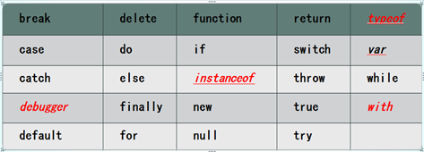
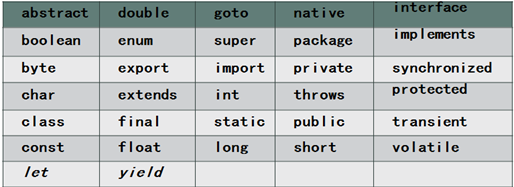
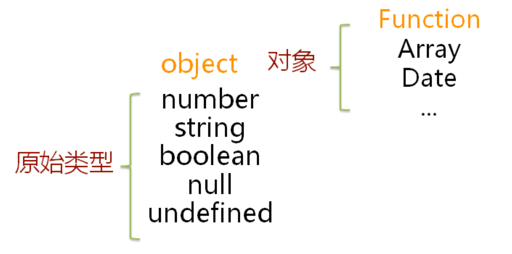

# Java第二阶段_day10_JavaScript基础

### 1. JavaScript概述


#### 1.1 历史

JavaScript是世界上最流行的脚本语言。1994年，网景公司（Netscape）发布了Navigator浏览器0.9版。这是历史上第一个比较成熟的网络浏览器，轰动一时。但是，这个版本的浏览器只能用来浏览，不具备与访问者互动的能力。网景公司急需一种网页脚本语言，使得浏览器可以与网页互动。网景公司的整个管理层，都是Java语言的信徒，Sun公司完全介入网页脚本语言的决策。因此，Javascript后来就是网景和Sun两家公司一起携手推向市场的，这种语言被命名为"Java+script"并不是偶然的。

此时，34岁的系统程序员Brendan Eich登场了。仅仅一个月之后，1995年5月，网景公司做出决策，未来的网页脚本语言必须"看上去与Java足够相似"，但是比Java简单，使得非专业的网页作者也能很快上手。Brendan Eich被指定为这种"简化版Java语言"的设计师。但是，他对Java一点兴趣也没有。**为了应付公司安排的任务，他只用10天时间就把Javascript设计出来了**。


**ECMAScript**是一种由Ecma国际（前身为欧洲计算机制造商协会，European Computer Manufacturers Association）通过ECMA-262标准化的脚本程序设计语言。这种语言在万维网上应用广泛，它往往被称为JavaScript，所以它可以理解为是JavaScript的一个标准,但实际上后两者是ECMA-262标准的实现和扩展。目前主流版本为ES6。


#### 1.2 JavaScript组成

- 核心语法(ECMAscript)
- 文档对象模型 (DOM Docuemtn Object Model) ，JS与HTML文档交互。
- 浏览器对象模型（BOM Browser Object Model)，JS与游览器交互。


#### 1.3 JavaScript特征

JavaScript是一种解释型脚本语言，或者动态语言。是一种弱类型语言，意味着里面的类型可以变化。

- 编译型语言，需要经历编写-编译-链接-运行。比如java、c++等。

- 解释型语言，解释型语言没有编译结果


### 2. JavaScript基础语法


#### 2.1 JS的引入

HTML中有3种方式写入JS代码。

- 写在标签属性

  ```html
  <a href="#" onclick="alert('hello world')">点击我</a>
  ```

- 写在script标签中

  ```html
  <script type="text/javascript">			
      alert("hello world...");			
  </script>
  ```

- 写在外部的JS文件中

  js/hello.js

  ```javascript
   alert("hello world...");	
  ```

  index.html

  ```html
  <!-- 注意：即使标签中没有内容也不能写成自闭合的 -->
  <script src="js/hello.js" type="text/javascript"></script>
  ```


#### 2.2 注释

JS中的注释同Java。

- //  单行注释
- /*  */ 多行注释
- /**  */ 多行注释


#### 2.3 变量

变量是用来存储数据的，操作变量来间接操作内存中空间的数据。由于JS是弱类型语言，变量类型是动态的，故定义的时候不需要定义变量类型，使用var即可。

- 变量命名规范：
  - 不允许使用js关键字和保留关键字
  - 可以包含字母、数字、下划线_以及$
  - 变量名不能以数字开头
  - 可以用中文，但是不推荐使用
  - 见名知意（驼峰）


- 变量的声明提前

  所有变量的声明，会自动提升到代码(当前作用域)的最顶部。声明提前破坏了程序的执行顺序，所以大家知道原理即可，切勿在实际开发过程中使用，不仅会降低代码可读性，还容易造成程序错误。

  ```javascript
  1 console.log(a);               //undefined
  2 var a; // 这行代码相当于插入到最开始
  3 a=10;
  4 console.log(a
  ```


#### 2.4 调试

- alert将数据弹出
- document.write();在文档内输出
- console.log在游览器的控制中输出
- 在游览器的开发控制台的Sources面板中断点调试


#### 2.5 流程控制

条件分支跟循环参考Java，此处省略。


#### 2.6 关键字跟保留字

JS中我们在命名规范中不能使用系统的关键字跟保留字。

- 关键字



- 保留字

  


### 3. 数据类型

变量没有类型，但是值有类型，可以通过`typeof`运算符检查值类型。

```javascript
var i = 1 ;
console.log(typeof i );
```

- 原始类型（基本类型）：按值访问，可以操作保存在变量中实际的值。原始类型汇总中null和undefined比较特殊，5种。

- 引用类型：引用类型的值是保存在内存中的对象。



#### 3.1 基本数据类型


##### 3.1.1 number

数字类型，既可以表示整数，也可以表示小数。

```javascript
123 //整数
123.1 //小数
1.1e3 // 科学计数法
-9 // 负数
NaN // not a number 
Infinity // 无穷大
-Infinity // 负无穷大
0x11a // 16进制
0755 // 8进制
0b10101 // 2进制
```

- NaN不等于任何值，包括它自身。所以只能通过全局函数`isNaN()`来判断。
-  Infinity比任何数字都要大。
- -Infinity比任何数字都要小。


##### 3.1.2 string

- 字符串表示一段文本符号数据。由字符、数字、符号、特殊字符等组成。JS中的字符串可以用单引号也可以使用双引号。

  ```javasc
  "hello"
  'hello \n world'
  ```

- 字符串模板：模板字符串是ES6增加的用于定于字符串的新特性，支持字符串直接换行而不需要转义，且支持插值 `${}`

  ```javascript
  var name = "seven";
  		   
  var msg = ` 你好，
  	${name} `;
  ```


##### 3.1.3 boolean

- 布尔类型，只有`true`跟`false`2个值，表示结果是真还是假。
- boolean也可以进行算术运算，true当做1，false当做0。


##### 3.1.4 undefined

表示未定义。


##### 3.1.5 null

表示空，不存在。从逻辑角度上看，null是一个空的对象指针。而这也正是使用typeof操作符检测null值，会返回“object”的原因。


#### 3.2 引用数据类型

也就是对象类型Object type，比如：Object 、Array 、Function 、Data等，以及自定义的。


##### object

对象，是一组数据和功能（函数）的集合。可以用new操作符后跟要创建的对象类型的名称来创建。也可以用字面量表示法创建。

```javascript
var person = {name:'zhangsan'} // 方式1： 字面量的方式
var obj1= new Object();        // 方式2： 构造方法
```


### 4. 运算符

#### 算术运算符

`+` `-` `*` `/` `%` `++` `--``**`

- `+`用在字符串上表示字符串的拼接。
- 可以通过（）改变运算的优先级。

- 浮点数也有小尾巴的问题(0.1 + 0.2 )，尽量避免。可以使用number的toFixedf方法来四舍五入。

- `++` `--` 只能作用在变量上，不能作用在值上面。

- `/`除数为0，结果是无穷

  ```javascript
  console.log(-1/0); // -Infinity
  console.log(1/0);  // Infinity
  console.log(0/0)   //  NaN
  console.log(isNaN(0/0))  // true
  ```

- `**`表示计算幂，优先级比较高

  ```javascript
  console.log(3**4); // 81
  console.log(-3**3); // 报错
  console.log((-3)**3); // -27
  console.log(-(3**3)); // -27
  ```


#### 比较运算符

比较运算符的结果是一个boolean类型。

`>` `<` `>=` `<=` 用法同JAVA

- `==`

  等于，js中`==`只判断2个值是否相等，不考虑类型。

  ```javascript
  "1" == 1  // true
  1 == true   // true
  0 == false   // true
  null == undefined // true
  NaN == NaN // false
  ```

- `===`

  绝对等于，js中用来判断值跟类型都必须相同。

  ```javascript
  "1" === 1  // false
  "1" === "1"  // true
  NaN === NaN // false
  ```


#### 逻辑运算符

逻辑运算符同java中逻辑运算符，也具有短路功能。结果是一个boolean类型。

```javascript
&&  2个都为真则为真
||  有一个为真则为真
！  真即假，假即真
```


### 5. 函数

JS中通过函数来把一段逻辑封装用来重复使用。函数式通过关键字`function`来定义的。

- JS中的函数不需要定义返回类型，直接返回结果即可
- JS中的函数参数列表不需要定义类型以及var，只需定义变量名
- 函数需要调用才会执行，不调用是不会执行的
- 函数没有重载，只要方法名相同就会去执行，不管参数列表匹配与否
- 如果定义了多个方法名相同，后面覆盖前面的


#### 5.1 函数的定义

> 定义方式一

```javascript
/* 语法
function 函数名(参数列表){ 
    函数体；
}*/

function study（）{
    console.log("好好学习，天天向上。");
}
```

> 定义方式二

```javascript
/* 语法
var  函数名 = function(参数列表){ 
    函数体；
}*/

var study = function(){
    console.log("好好学习，天天向上。");
}
```

> 定义方式三(不推荐)

```javascript
/*
	语法：参数跟函数体都必须在字符串内，Function的F必须大写
new Function(arg1, arg2, ..., argN, function_body);
*/

var study = new Function("name", "time","console.log(name+'每天学习'+time+'分钟');console.log('继续保持')");
```


#### 5.2 函数的调用

> 函数的调用（方式一）

```javascript
/* 
语法： 函数名(参数值)
*/
study("seven",180);
```

> 函数的调用（方式二）

```javascript
/*
语法： 函数名.call(调用对象，参数值)
*/
study.call(this,"seven",180 );
```

> 函数的调用（方式三）

```javascript
/*  
参数需要封装到数组中
语法： 函数名.apply(调用对象，参数值数组)
*/
study.apply(this,['seven',120]  );
```

> 函数的调用（方式四）

```javascript
/*
bind会返回新的函数，需要调用才会执行，所以后面需要(),其它跟call用法一样。
语法： 函数名.bind(调用对象，参数值)()
*/
study.bind(this,"seven",180 )();
```


#### 5.3 函数参数

JS中的参数都会封装到`arguments`中，在函数体中可以通过这个参数拿到定义参数以外的参数值。

```javascript
var study = function(name , time){
    // 传统方式只能拿到定义的参数
    console.log(name);
    console.log(time);
    // 通过arguments可以定义参数以外的参数
    console.log(arguments.length);
    console.log(arguments[0]);
    console.log(arguments[1]);
    console.log(arguments[2]);
    console.log(arguments[3]);
    
    console.log(name+'每天学习'+time+'分钟');
}

study("zhangsan",180,1,"a");
```

ES6也支持类似Java中的可变长度参数

```javascript
var study = function(name , time ,  ... args){
    console.log(args);
}
```


### 6. 数组

用来装元素的集合。

- JS中的数组中的类型可以不一样。
- JS中数组下标越界不会异常，访问会返回  undefined


#### 数组的定义

```javascript
// 方式1 
var arr1 = [1,2,3,true,2.1,'hello',null ];
// 方式2 
var arr2 = new Array(1,2,3,true,2.1,'hello',null);

console.log(arr1[100]);// undefined
```


### 7. 对象

JS中的对象分为3类：

- 内置对象（**Array**、**Boolean**、**Date**、**Function**、**Global**、**Math**、**Number**、**Object**、**RegExp**、**Error**、 **String**  ）

- 自定义对象

- 宿主对象（**BOM**/**DOM**）

  

#### 内置对象

- ##### String

  ```javascript
  var s = "hello js world ...";
  
  console.log(s.length);// length属性表示字符串长度
  console.log(s[1]);// 可以通过具体的下标访问数组中的字符
  s.toUpperCase();// 转换成大写
  s.toLowerCase();// 转换成小写
  s.indexOf('e')； // 获取字符e出现的位置
  s.substring(3,5)； // 获取子字符串
  
  ```


- ##### Array

  ```javascript
  var arr = [1,2,3,4,5];
  
  console.log(arr.length);// length属性表示数组元素个数
  arr.length = 2 ; // 设置长度减小，表示只保留前面的2个元素，剩余的丢掉
  arr.length = 10 ;// 会增加5个元素，增加的都是undefined值
  arr.indexOf(3);//返回元素3的索引，如果没有返回-1
  arr.slice(3,6);// 截取子数组，类似String的subString
  arr.push("a","b","c"); // 往数组尾部添加元素
  arr.pop(); // 把数组的尾部最后一个元素弹出，也就是删除
  arr.unshift("f"); // 往数组头部添加元素
  arr.shift(); // 把数组的头部第一个元素弹出，也就是删除
  arr.sort();  // 把数组进行排序
  arr.reverse();  // 把数组元素进行反转
  arr.concat(['a','b','c']); // 把新的数组拼接在元素后，会返回新的数组，并没改变原数组
  arr.join("-");// 把数组中的所有元素拼接在一起，使用设置的分隔符。
  
  // 数组的遍历
  arr.forEach(function(value){
      console.log(value);
  });
  
  // 数组的遍历，这里的index是数组中的索引
  for(var index in arr){
      console.log( arr[index]);
  }
  
  // 数组的遍历，这里的e是数组中的元素
  for(var e of arr){
      console.log( e);
  }
  ```


- ##### Date

  ```javascript
  var d = new Date();// 定义日期类型
  console.log(d);// 打印当前日期
  console.log(d.getFullYear());// 获取年份
  console.log(d.getMonth());// 获取月份
  console.log(d.getDate());// 获取日
  console.log(d.getDay());// 获取星期几
  console.log(d.getHours());// 获取小时
  console.log(d.getMinutes());// 获取分
  console.log(d.getSeconds());// 获取秒
  console.log(d.getTime());// 获取时间戳
  console.log(d.toLocaleString());// 获取本地日期 
  console.log(d.toLocaleDateString());// 获取本地日期,只有年月日
  ```


- ##### JSON

    JSON（JavaScript Object Notation）(http://www.json.org/)  是一种轻量级的**数据交换格式**。 JSON中支持2种数据格式：对象跟数组2种数据。具体支持的值类型有数字、字符串、boolean、null

  - 对象用花括号表示{}

  - 数组用中括号表示[]

  - 数据表现为键值对用：隔开

  - 同级数据用，号隔开

    ```json
    // json对象
       { "name":"seven","age":"18"}
    // json数组，数组里面的元素是对象
       [
        {“name”:"张三","age":"21"},
        {“name”:"李四","age":"22"} 
       ]
    ```

  > JSON跟JS对象的区别

| 区别 |                           **JSON**                           |                        **Javascript**                        |
| :--: | :----------------------------------------------------------: | :----------------------------------------------------------: |
| 含义 |                      仅仅是一种数据格式                      |                         表示类的实例                         |
| 传输 |                  可以跨平台数据传输，速度快                  |                           不能传输                           |
| 表现 | 1.键值对方式，键必须加双引号    2.值不能是方法函数，不能是undefined/NaN | 1.键值对方式，键不加引号      2.值可以是函数、对象、字符串、数字、boolean 等 |

- JS对象转JSON

  ```javascript
  var user = {
      name:"zhangsan",
      age:18,
      sex:"男"
  };
  
  // js对象转JSON对象（JSON.stringify）
  var json = JSON.stringify(user);
  console.log(json); //{"name":"zhangsan","age":18,"sex":"男"}
  ```

- JSON转JS对象

  ```javascript
  var user = JSON.parse('{"name":"zhangsan","age":18,"sex":"男"}');
  console.log(user);
  ```


#### 自定义对象

##### 对象的定义

- 方式1（字面量）

  ```javascript
  // 大括号{}表示一个对象
  var user = {
  		name:"zhangsan",
  		age:17,
  		sleep:function(){
  			console.log("sleeping ... ");
  		}
  	};
  
  ```


- 方式2（Object）

  ```javascript
  var user = new Object();
  user.name = "zhangsan";
  user.age = 17 ;
  user.sleep = function(){
      console.log("sleeping ... ");
  }
  
  ```


- 方式3（工厂模式）

  ```javascript
  function createUser(name,age){
      var user = new Object();
      user.name = name ;
      user.age = age ;
      user.sleep = function(){
          console.log("sleeping ... ");
      };
      return user;
  };
  
  ```


- 方式4（构造方法）

  ```javascript
  // 构造方法名首字母大写，用以区分其他普通函数
  function User(name,age){
      this.name = name;
      this.age = age ;
      this.sleep = function(){
          console.log("sleeping ... ");
      };
  }
  
  var u1 = new User("zhang",111);
  ```


- 方式5（Class）

  ```javascript
  // ES6
  class Person{//定义了一个名字为Person的类
      constructor(name,age){//constructor是一个构造方法，用来接收参数
          this.name = name;//this代表的是实例对象
          this.age=age;
      }
      say(){//这是一个类的方法，注意千万不要加上function
          return "我的名字叫" + this.name+"今年"+this.age+"岁了";
      }
  }
  var obj=new Person("laotie",88);
  console.log(obj.say());//我的名字叫laotie今年88岁了
  
  ```


##### 对象的使用

```javascript
var person = {
    name:"zhangsan",
    age:19,
    sex:"男",
    sleep:function(){
        console.log("早睡早起身体好。");
    }    
    
```

- 属性的访问跟赋值

  ```javascript
  person.name 
  person["name"]
  person.name = "seven"；
  person["name"] = "seven"；
  
  person.height // 使用对象的一个不存在的属性不会报错，undefined
  ```


- 动态的删除属性

  ```javascript
  delete person.name ;// 动态的删除person对象的name属性
  ```


- 动态的添加属性

  ```javascript
  person.hello = "hello";// 直接给新的属性赋值即可
  person.eat =function(){console.log("吃");} // 函数也一样。
  ```


- 判断属性是否在这个对象中

  ```javascript
  'name' in person  // 判断name属性是否存在person对象或者父类对象中。
  'sleep' in person // 判断sleep函数是否存在person对象或者父类对象中。
  person.hasOwnProperty("name");// 判断name属性是否存在person对象中，不包括父类的
  person.hasOwnProperty("sleep");// 判断sleep函数是否存在person对象中，不包括父类的
  ```


### 8. 原型与原型链

​	我们先通过构造函数创建一个对象

```javascript
function Person() {

}
//Person 就是一个构造函数，我们使用 new 创建了一个实例对象 person
var person = new Person();

person.name = 'seven';
console.log(person.name) // seven
```

JS在创建对象的时候都会创建对应类型的原型。


- 当我们给Person添加属性跟方法的时候，可以添加在对象中，也可以添加在原型中。区别是对象中的属性是独立的，原型中的属性是所有对象共享的。


- 当访问对象的属性跟方法时，先去对象中找，找不到再去原型中找。

  ```javascript
  function Person() {
  
  }
  // 虽然写在注释里，但是你要注意：
  // prototype是函数才会有的属性
  Person.prototype.name = 'seven';
  var person1 = new Person();
  var person2 = new Person();
  console.log(person1.name) // seven
  console.log(person2.name) // seven
  ```


- 每一个JS对象都有一个属性`__proto__`,这个属性会指向该对象的原型.

  

```javascript
function Person() {

}
var person = new Person();
console.log(person.__proto__ === Person.prototype); // true
```


- 每个对象跟原型都有一个 constructor 属性指向关联的构造函数实例原型指向构造函数。

  

```javascript
function Person() {

}
console.log(Person === Person.prototype.constructor); // true
```


- 原型也是一个特殊的对象，也有`__proto__`属性，默认指向`Object.prototype`。
  
- 
  
- 我们访问对象的属性跟方法先去对象中找，找不到就去对应的原型上找，原型找不到再去父原型上面找，直到顶级原型`Object.prototype`。JS中是通过原型链来达到继承的效果。

  ```javascript
  function Person() {
  
  }
  
  var person = new Person();
  
  Object.prototype.name = "seven";
  
  console.log(person.name) // seven
  ```


