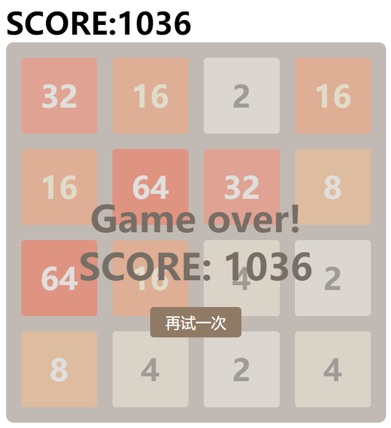

Java第二阶段_day12_JavaScript综合测试2048游戏项目

## 学习目标

~~~
1、掌握小游戏开发的基本流程
2、了解项目所需的技术
3、熟悉游戏的各个功能如何完成
4、掌握前端基本开发规范
~~~

# 2048游戏开发

## 1、简介

《2048》是一款比较流行的一款数字游戏，游戏设计的初衷是一款益智类游戏，其特点在于轻松、简单。

游戏开始界面：

游戏进行中：

游戏结束：

## 2、技术列表

- html
- css
- javascript

## 3、游戏规则

1. 按上下左右键，数字格子会朝着相应的方向移动
2. 相同的两个数字格子，相撞时数字会相加
3. 每次移动时，空白处会随机刷新出一个数字的格子
4. 当界面不可运动时，也就是当界面全部都被数字填满时，游戏结束，然后显示最后的分数

## 4、项目实战

### 4.1 游戏面板搭建

游戏面板搭建，面板中的数字是4*4的小方块，最外层可以使用div进行包裹。在给每个数字方块取id名时可以参考二维数组下标取值方式，方便后面j使用js操作数字方块

**HTML代码：**

~~~css
    
SCORE:0

    

        <!-- 第一行 -->
        

        

        

        

        <!-- 第二行 -->
        

        

        

        

        <!-- 第三行 -->
        

        

        

        

        <!-- 第四行 -->
        

        

        

        

    

    <!-- 遮罩层，游戏结束时显示 -->
    

        
Game over!

        SCORE: 0  
        <input type="button" value="再试一次"">

    

~~~

**css代码**

~~~css
        * {
            margin: 0;
            padding: 0;
        }

        /* 分数显示 */
        .score {
            width: 500px;
            margin: 50px auto 0;
            font-size: 40px;
            font-weight: 700;
        }

        /* 游戏主面板 */
        .main {
            width: 500px;
            height: 500px;
            margin: auto;
            background-color: #bbada0;
            border-radius: 10px;
        }

        /* 数字方块 */
        .main>div {
            width: 100px;
            height: 100px;
            margin: 20px 0 0 20px;
            background-color: #cdc1b4;
            float: left;
            border-radius: 5px;
            font-size: 40px;
            font-weight: 700;
            text-align: center;
            line-height: 100px;
            color: #fff;
        }

        /* 游戏结束时显示 */
        #gameover {
            width: 500px;
            height: 300px;
            position: absolute;
            top: 102px;
            left: 50%;
            margin-left: -250px;
            z-index: 3;
            background: rgba(200, 200, 200, 0.5);
            text-align: center;
            font-size: 48px;
            font-weight: 700;
            color: #776e65;
            border-radius: 10px;
            padding-top: 200px;
            display: none;
        }

        /* 游戏结束时再试一次按钮 */
        .zhe input {
            margin-top: -480px;
            width: 120px;
            height: 40px;
            background: #8f7a66;
            border-radius: 5px;
            border: none;
            color: white;
            font-size: 20px;
        }

        /* 数字为2 */
        .main>.n2 {
            background: #eee4da;
            color: #776e65;
        }

        /* 数字为4 */
        .main>.n4 {
            background: #ede0c8;
            color: #776e65;
        }

        /* 数字为8 */
        .main>.n8 {
            background: #f2b179;
            color: #f9f6f2;
        }

        /* 数字为16 */
        .main>.n16 {
            background: #f59563;
            color: #f9f0cd;
        }

        /* 数字为32 */
        .main>.n32 {
            background: #f67c5f;
            color: #f9f6ef;
        }

        /* 数字为64 */
        .main>.n64 {
            background: #f65e3b;
            color: #f9f6f2;
        }

        /* 数字为128 */
        .main>.n128 {
            background: #edcf72;
            color: #f6ebd5;
            font-size: 36px;
        }

        /* 数字为256 */
        .main>.n256 {
            background: #edcc61;
            color: #f9f6f2;
            font-size: 36px;
        }

        /* 数字为512 */
        .main>.n512 {
            background: #edc850;
            color: #f9f6f2;
            font-size: 36px;
        }

        /* 数字为1024 */
        .main>.n1024 {
            background: #edc53f;
            color: #f7f6f2;
            font-size: 30px;
        }

        /* 数字为2048 */
        .main>.n2048 {
            background: #edc22e;
            color: #f9f6f2;
            font-size: 30px;
        }

        /* 数字为4096 */
        .main>.n4096 {
            background: #a6c;
            color: #f9f6f2;
            font-size: 30px;
        }
~~~

### 4.2 游戏初始化

#### 	4.2.1、初始化数据

可以将游戏中用到的所有数据都放到一个对象中，要使用哪个方法直接通过对象名调用

代码：

~~~JavaScript
//创建一个game对象，游戏所有的属性和方法都放在game对象中
var game = {
	data:[],//添加一个属性，用于存储游戏数据
	score:0,//添加一个得分的属性
	status:1,//添加一个游戏状态
	gameover:0,//添加一个游戏结束状态
	gamerunning:1,//添加一个游戏运行状态
	start:function(){//添加一个开始游戏的方法
		this.status = this.gamerunning;//游戏的状态为游戏运行的状态
		this.score = 0;//重置游戏的得分为0
		this.data = [];//清空游戏的数组
		for(var r = 0;r < 4;r++){
			this.data[r] = [];//创建四行
			for(var c = 0;c < 4;c++){
				this.data[r][c] = 0;//每行创建四个元素赋值为0
			}
		} 
        this.randomNum(); //随机生成第一个数字，调用生成随机数方法
		this.randomNum();//随机生成第二个数字，调用生成随机数方法
		this.dataView();//更新视图	
	},
	}
~~~

#### 4.2.2、初始化时在游戏面板中随机生成两个数字为2或者4

生成随机数代码：

~~~JavaScript
//随机生成空位置和随机生成2或者4
randomNum:function(){
		for(;;){//死循环   直到生成跳出循环
			var r = Math.floor(Math.random()*4);//随机生成一个行
			var c = Math.floor(Math.random()*4);//随机生成一个列
			if (this.data[r][c] == 0) {//随机生成的位置如果为0
				var num = Math.random() > 0.5?2:4;//随机生成2或者4保存到num变量中
				this.data[r][c] = num;//为数组赋值
				break;//退出循环
			}
		}
}
~~~

#### 4.2.3、将数据显示到页面

~~~javascript
dataView:function(){ //数据显示到页面的方法
		for(var r = 0;r < 4;r ++){//遍历data
			for(var c = 0;c <4 ;c ++){
				//每一个素组元素对应每一个div
				var div = document.getElementById("c" + r + c);
				if (this.data[r][c] != 0) {//数组的值如果不等于0
					div.innerHTML = this.data[r][c];//修改div的值
					div.className = "cell n" + this.data[r][c];//div的样式设置为cell 和对应的样式
				}else{//数组的值如果等于0
					div.innerHTML = "";//div的内容设置成空
					div.className = "cell";//div的样式设置为cell
				}
			}
		}
		//找到分数的ID，设置分数
		document.getElementById("score01").innerHTML = this.score;

	},
~~~

### 4.3 移动数字方块

数字方块可以通过按上下左右键来进行移动，在移动之前需要判断在这个方向上是否可以移动。具体流程如下：

#### 4.3.1、左移

~~~JavaScript
moveLeft:function(){
		var before = String(this.data);//移动前为数组拍照
		// console.log(before)
		for(var r = 0;r < 4;r++){//遍历每一行
			this.moveLeftinRow(r);//左移第r行
		}
		var after = String(this.data);//移动后为数组拍照
		if (before != after) {//如果移动前不等于移动后
			this.randomNum();//生成一个随机数
			if (this.isgameover()) {//如果游戏结束
				this.status = this.gameover;//游戏状态更改为结束状态
			}
			this.dataView();//数据更新
		}
	}

moveLeftinRow:function(r){//仅左移第r行
		for(var c = 0;c < 3;c++){//最左边的不需要考虑,所以遍历3次
			//查找r行c位置后面不为0的位置保存到一个变量中
			var nextc = this.getNextinRow(r,c);
			
			if (nextc != -1) {//如果找到
				if (this.data[r][c] == 0) {
					//用nextc位置的值代替c位置的值
					this.data[r][c] = this.data[r][nextc];
					//nextc位置的值改变成0
					this.data[r][nextc] = 0;
					c--;//c留在原地继续往后
				}else if (this.data[r][c] == this.data[r][nextc]) {//如果当前位置的值等于nextc位置的值
					this.data[r][c] *= 2;//c的位置*2
					this.score += this.data[r][c];//更新分数
					this.data[r][nextc] = 0;//nextc的位置改变成0
				}
			}else{//如果没有找到数字
				break;//退出循环
			}
		}
	}

//查找r行c位置后面不为0的位置
getNextinRow:function(r,c){
		for(var i = c + 1;i < 4;i ++){
			//如果不为0，表示找到，就返回i，i对应的格子的几个位置
			if (this.data[r][i] != 0) {
				return i;
			}
		}
		return -1 //如果找不到，给出一个状态，用-1表示该方法的返回
	},
        
~~~

#### 4.3.2、右移

~~~javascript
moveRight:function(){
		var before=String(this.data);//移动前为数组拍照
		for(var r=0;r<4;r++){//遍历data中每一行
			this.moveRightInRow(r);//右移第r行
		}
		var after=String(this.data);//移动后为数组拍照
		if(before!=after){//如果发生了移动
			this.randomNum();//随机生成数
			if(this.isgameover()){//如果游戏结束
				//就设置游戏状态为GAMEOVER
				this.status=this.gameover;
			}
			this.dataView();//更新页面
		}
	}
	
moveRightInRow:function(r){//仅右移第r行
		//c从CN-1开始，到>0结束,反向遍历r行中每个格
		for(var c=4;c>0;c--){
			//查找r行c位置前一个不为0的位置prevc
			var prevc=this.getPrevInRow(r,c);
			if(prevc!=-1){//如果找到
				console.log(c)
				if(this.data[r][c]==0){//如果c位置的值等于0
					//用nextc位置的值代替c位置的值
					this.data[r][c]=this.data[r][prevc];
					//将nextc位置的值置为0
					this.data[r][prevc]=0;
					c++;//c留在原地
				}else if(//否则,如果c位置的值等于nextc位置值
					this.data[r][c]==this.data[r][prevc]){
					this.data[r][c]*=2;//c位置的值*2
					this.score+=this.data[r][c];
					this.data[r][prevc]=0;//nextc位置的值置为0
				}
			}else break;//否则，没找到，就退出循环
		}
	}
	
	getPrevInRow:function(r,c){//查找r行c列左侧前一个不为0位置
		//i从c-1开始，到>=0结束, 反向遍历r行每个格
		for(var i=c-1;i>=0;i--){
			//如果r行i列的值不是0,就返回i
			if(this.data[r][i]!=0){
				return i;
			}
		}//(遍历结束)就返回-1
		return -1;
	}
~~~

#### 4.3.3、上移

~~~javascript
moveUp:function(){//上移所有行
		var before=String(this.data);//移动前为数组拍照
		for(var c=0;c<4;c++){//遍历data中每一列
			this.moveUpInCol(c);//上移第c列
		}
		var after=String(this.data);//移动后为数组拍照
		if(before!=after){//如果发生了移动
			this.randomNum();//随机生成数
			if(this.isgameover()){//如果游戏结束
				//就设置游戏状态为GAMEOVER
				this.status=this.gameover;
			}
			this.dataView();//更新页面
		}
	}
	
	moveUpInCol:function(c){//仅上移第c列
		//r从0开始，到<RN-1结束,遍历c列中每一行
		for(var r=0;r<4;r++){
			//查找c列r行下方下一个不为0的位置nextr
			var nextr=this.getNextInCol(r,c);
			if(nextr!=-1){//如果找到
				if(this.data[r][c]==0){//如果c位置的值等于0
					//用nextr位置的值代替c位置的值
					this.data[r][c]=this.data[nextr][c];
					//将nextr位置的值置为0
					this.data[nextr][c]=0;
					r--;//r留在原地
				}else if(//否则,如果r位置值等于nextr位置值
					this.data[r][c]==this.data[nextr][c]){
					this.data[r][c]*=2;//r位置的值*2
					this.score+=this.data[r][c];
					this.data[nextr][c]=0;//nextr位置的值归0
				}
			}else{
				break;//否则，没找到，就退出循环
			}
		}
	}
	
	getNextInCol:function(r,c){//查找c列r行下方下一个不为0位置
		//i从r+1开始，到<RN结束
		for(var i=r+1;i<4;i++){
			//如果c列i行的值不是0,就返回i
			if(this.data[i][c]!=0){
				return i;
			} 
		}//(遍历结束)就返回-1
		return -1;
	},
~~~

#### 4.3.4、下移

~~~javascript
moveDown:function(){//下移所有行
		var before=String(this.data);//移动前为数组拍照
		for(var c=0;c<4;c++){//遍历data中每一列
			this.moveDownInCol(c);//下移第c列
		}
		var after=String(this.data);//移动后为数组拍照
		if(before!=after){//如果发生了移动
			this.randomNum();//随机生成数
			if(this.isgameover()){//如果游戏结束
				//就设置游戏状态为GAMEOVER
				this.status=this.gameover;
			}
			this.dataView();//更新页面
		}
	}
	
	moveDownInCol:function(c){//仅上移第c列
		//r从RN-1开始，到>0结束,反向遍历c列中每一行
		for(var r=3;r>0;r--){
			//查找c列r行上方前一个不为0的位置prevr
			var prevr=this.getPrevInCol(r,c);
			if(prevr!=-1){//如果找到
				if(this.data[r][c]==0){//如果c位置的值等于0
					//用prevr位置的值代替c位置的值
					this.data[r][c]=this.data[prevr][c];
					//将prevr位置的值置为0
					this.data[prevr][c]=0;
					r++;//r留在原地
				}else if(//否则,如果r位置值等于prevr位置值
					this.data[r][c]==this.data[prevr][c]){
					this.data[r][c]*=2;//r位置的值*2
					this.score+=this.data[r][c];
					this.data[prevr][c]=0;//prevr位置的值归0
				}
			}else {
				break;
			}//否则，没找到，就退出循环

		}
	}

	getPrevInCol:function(r,c){//查找c列r行下方下一个不为0位置
		//i从r-1开始，到>=0结束
		for(var i=r-1;i>=0;i--){
			//如果c列i行的值不是0,就返回i
			if(this.data[i][c]!=0){
				return i;
			} 
		}//(遍历结束)就返回-1
		return -1;
	}
~~~

### 4.4 绑定键盘事件

此游戏需要使用键盘进行操作，所以需要和键盘的上下左右键绑定事件，然后再调用相对应的方法

代码：

~~~javascript
//键盘被按下事件
	document.onkeydown=function(event){
		var event=event||arguments[0]||e;
			if(event.keyCode==37){
				game.moveLeft();
			}else if(event.keyCode==39){
				game.moveRight();
			}else if(event.keyCode==38){
				game.moveUp();
			}else if(event.keyCode==40){
				game.moveDown();
			}
	}
~~~

### 4.5 游戏结束界面

当游戏界面不可以再运动时（当界面全部被数字填满时），游戏结束。

代码：

~~~javascript
isgameover:function(){//判断游戏结束的方法
		for(var r = 0;r < 4;r++){
			for(var c = 0;c < 4;c ++){
				if (this.data[r][c] == 0) {//有等于0的返回false
					return false;
				}
				if(c<3){//检查右侧相邻
					if(this.data[r][c]==this.data[r][c+1]){
    					return false;
					}
				}
				if(r<3){//检查下方相邻
					if(this.data[r][c]==this.data[r+1][c]){
						return false;
					}		
				}
			}
		}//遍历结束
		return true;//否则就返回true
	}
~~~

**此时可以在显示数据的方法中加上一段判断游戏是否结束的代码，游戏结束时和游戏正在进行时显示的分数面板是不同的，当游戏结束时，可以将之前设置的gameover的div显示。**

代码：

~~~javascript
	 if (this.status == this.gameover) { //游戏状态等于游戏结束状态
            document.getElementById("score02").innerHTML = this.score; //游戏结束时候的分数显示	
            document.getElementById("gameover").style.display = "block"; //结束游戏的弹框显示
        } else {
            document.getElementById("gameover").style.display = "none"; //运行状态为1即游戏运行状态的时候结束游戏的弹框始终为隐藏
        }
~~~

