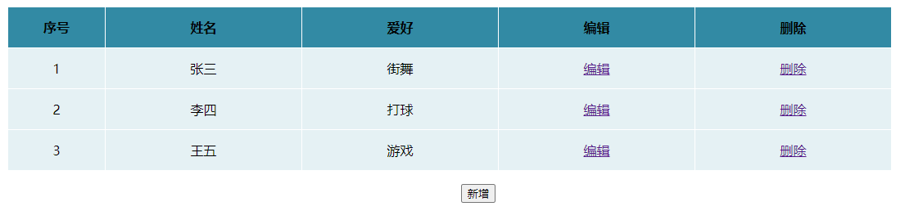
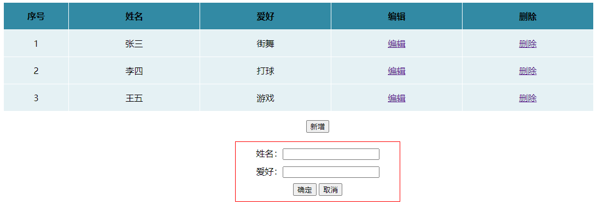
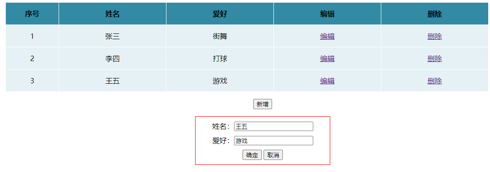
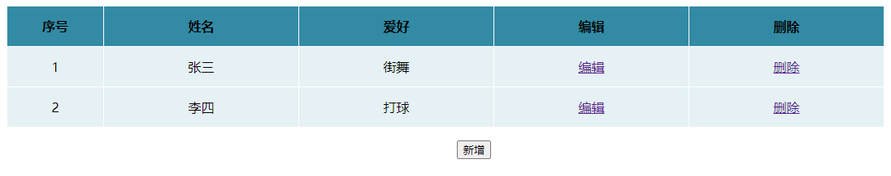

## 一. jquery事件绑定

### 1. 事件绑定

| 方法       | 说明                                                         |
| ---------- | ------------------------------------------------------------ |
| .on()      | 可以在匹配元素上绑定一个或者多个事件处理函数。自 jQuery 版本 1.7 起，on() 方法是 bind()、live() 和 delegate() 方法的新的替代品。 |
| .one()     |                                                              |
| .off()     | 移除元素上绑定的一个或多个事件的事件处理函数, 主要用于解除由[on()](http://www.365mini.com/page/jquery-on.htm)函数绑定的事件处理函数, 自 jQuery 版本 1.7 起，off() 方法是 unbind()、die() 和 undelegate() 方法的新的替代品 |
| .trigger() | 在指定的时机去触发某个事件, 例如不点击按钮, 但是需要触发按钮的点击事件 |
| .hover()   |                                                              |

注 : trigger 主动触发事件 参数 1.事件类型 2.参数

​	trigger 触发事件是会事件冒泡 触发li 会冒泡到 ul

​	trigger 传递参数 trigger('click', data);  $('li').on('click', function (e,data) {})参数是在 事件处理函数的第二个参数

​	trigger可以触发自定义事件  

### 2. 事件类型

| 事件类型   | 说明                   |
| ---------- | ---------------------- |
| click      | 单击事件               |
| keydown    | 键盘按下事件           |
| mouseenter | 鼠标移入事件           |
| input      | 表单元素的键盘输入事件 |
| change     | 表单元素的值改变事件   |
| mousewheel | 鼠标滚轮事件           |
| .......    | ......                 |

### 3. 兼容的事件对象

   e.pageX

​	e.clienX

​	e.which

​	e.button

​	e.preventDefault()   阻止元素的默认行为

​	e.stopPropagation()   阻止事件冒泡

​	return false;   基本阻止事件的默认行为, 也可以阻止冒泡

### 4. 动画

#### 1. jquery基本动画

显示隐藏类：.hide()、.show()、.toggle()

淡入淡出类：.fadeIn、.fadeout 、.fadeToggle、.fadeTo()	

卷入卷出类：.slideDown()、.slideUp()、.slideToggle()

​	slideToggle()  通过使用滑动效果（高度变化）来切换元素的可见状态。如果被选元素是可见的，则隐藏这些

元素，如果被选元素是隐藏的，则显示这些元素

#### 2. jquery的animate动画

.animate()  源码  

​	参数1 :  参与动画的属性

​	参数2 : 动画执行的时长

​	参数4 : 运动曲线 (匀速: linear, 还是缓动, 默认为缓动)

​	参数5 : 动画执行完毕之后的回调函数

.stop()   停止动画队列

​	stop() 阻止当前运动继续后续运动     为默认情况  相当于 stop(false, false)

​	stop(true) 阻止后续所有运动

​	stop(true, true) 停止当前所有运动 停在当前目标点

​	stop(false, true) 跳过当前运动并到达目标点，执行后续运动

.finish()  停止当前运动 并且达到最后运动的目标点

.delay()   延迟 参数 延迟时间

jQuery.fx.off = true 运动的开关 

动画插件：jQuery Easing Plugin

依赖于jQuery，在jQuery之后引入

cdn：https://cdnjs.cloudflare.com/ajax/libs/jquery-easing/1.4.1/jquery.easing.min.js

 

# 二. 案例

### 1. 需求

​	使用JQuery在HTML页面中完成列表数据的增删改查，截图如下

**列表**



**新增**



**修改**



**删除**



### 2.实现

#### 2.1 界面渲染

```html
<!DOCTYPE html>
<html>
	<head>
		<meta charset="utf-8" />
		<title></title>
		<script src="https://cdn.bootcdn.net/ajax/libs/jquery/3.5.1/jquery.min.js"></script>
	<style>
		#insert_panel{
			border: 1px solid red;
			width: 300px;
			/* height: 100px; */
			margin: 0 auto;
			display: none;
			text-align:center;
		}
		
		 #insert_panel div{
			 margin: 10px;
		 }
		
		
		 table, td{ 
		 font:100% '微软雅黑'; 
		 } 
		 table{width:80%;border-collapse:collapse; margin:0 0 0 100px} 
		 th, td{text-align:center;border:1px solid #fff;} 
		 th{background:#328aa4} 
		 td{background:#e5f1f4;} 
		
	</style>
	
	
	</head>
	<body>
		
		<table border="1" cellpadding="0" cellspacing="0" align="center" width="400">
						<tr align="center" height="50">
							<th width="10%">序号</th>
							<th width="20%">姓名</th>
							<th width="20%">爱好</th>
							<th width="20%">编辑</th>
							<th width="20%">删除</th>
						</tr>
						<tr align="center" height="50">
							<td class="number">1</td>
							<td class="name">张三</td>
							<td class="hobby">街舞</td>
							<td><a href="#" class="update_item">编辑</a></td>
							<td><a href="#" class="del_item">删除</a></td>
						</tr>
						<tr align="center" height="50">
							<td class="number">2</td>
							<td class="name">李四</td>
							<td class="hobby">打球</td>
							<td><a href="#" class="update_item">编辑</a></td>
							<td><a href="#" class="del_item">删除</a></td>
						</tr>
						<tr align="center" height="50">
							<td class="number">3</td>
							<td class="name">王五</td>
							<td class="hobby">游戏</td>
							<td><a href="#" class="update_item">编辑</a></td>
							<td><a href="#" class="del_item">删除</a></td>
						</tr>
						 
				</table>
				<p align="center"><button id="insert_btn">新增</button></p>
				 
		
				<div id="insert_panel"  >
					
					
					<div>姓名：<input id="new_name"  /></div>
					<div>爱好：<input id="new_hobby"  /> </div>
					<div>
						<button id="ok"  >确定</button>
						<button id="cancel">取消</button>
					</div>
					
				</div>
        <script>
            // jquery code
            $(function(){
           
            });    
        </script>
				
	</body>
</html>

```


#### 2.2 功能实现

##### 2.2.1 全局变量

```javascript
<script>
    // jquery code
    $(function(){
			// false表示新增还是修改true
			var flag = false ;
			// 记录修改的行索引
			var index = -1 ;
	});   	 
</script>
```


##### 2.2.2 删除功能

```javascript
$("table").on("click",".del_item",function(){
    $(this).parent().parent().remove();
});
```


##### 2.2.3 新增功能

```javascript
$("#insert_btn").on("click",function(){
    flag = false ;
    $("#insert_panel").show();
});
```


##### 2.2.4 修改功能

```javascript
// 修改
$("table").on("click",".update_item",function(){
    flag = true ;
    index = $(this).parents("tr").index();
    var name = $(this).parents("tr").find(".name").text();
    var hobby = $(this).parents("tr").find(".hobby").text();
    $("#new_name").val(name);	
    $("#new_hobby").val(hobby);

    $("#insert_panel").show();
});
```


##### 2.2.5 OK功能

```javascript
// OK按钮处理事件
$("#ok").on("click",function(){
    var name =  $("#new_name").val();	
    var hobby =  $("#new_hobby").val();	
    $("#new_name").val("");	
    $("#new_hobby").val("");	

    if(flag){
        $("tr").eq(index).find(".name").text(name);
        $("tr").eq(index).find(".hobby").text(hobby);
        $("#insert_panel").hide();
        return ;
    }

    var $newTr =  $("tr").eq($("tr").length-1).clone();
    $newTr.find(".number").text($("tr").length);
    $newTr.find(".name").text(name);
    $newTr.find(".hobby").text(hobby);
    $("table").append( $newTr );
    $("#insert_panel").hide();
});
```


##### 2.2.6 cancel功能

```javascript
// cancel按钮处理事件
$("#cancel").on("click",function(){
    $("#new_name").val("");
    $("#new_hobby").val("");
    $("#insert_panel").hide();
});
```


##### 2.2.7 完整代码

```html
<!DOCTYPE html>
<html>
	<head>
		<meta charset="utf-8" />
		<title></title>
		<script src="https://cdn.bootcdn.net/ajax/libs/jquery/3.5.1/jquery.min.js"></script>
	<style>
		#insert_panel{
			border: 1px solid red;
			width: 300px;
			/* height: 100px; */
			margin: 0 auto;
			display: none;
			text-align:center;
		}
		
		 #insert_panel div{
			 margin: 10px;
		 }
		
		
		 table, td{ 
		 font:100% '微软雅黑'; 
		 } 
		 table{width:80%;border-collapse:collapse; margin:0 0 0 100px} 
		 th, td{text-align:center;border:1px solid #fff;} 
		 th{background:#328aa4} 
		 td{background:#e5f1f4;} 
		
	</style>
	
	
	</head>
	<body>
		
		<table border="1" cellpadding="0" cellspacing="0" align="center" width="400">
						<tr align="center" height="50">
							<th width="10%">序号</th>
							<th width="20%">姓名</th>
							<th width="20%">爱好</th>
							<th width="20%">编辑</th>
							<th width="20%">删除</th>
						</tr>
						<tr align="center" height="50">
							<td class="number">1</td>
							<td class="name">张三</td>
							<td class="hobby">街舞</td>
							<td><a href="#" class="update_item">编辑</a></td>
							<td><a href="#" class="del_item">删除</a></td>
						</tr>
						<tr align="center" height="50">
							<td class="number">2</td>
							<td class="name">李四</td>
							<td class="hobby">打球</td>
							<td><a href="#" class="update_item">编辑</a></td>
							<td><a href="#" class="del_item">删除</a></td>
						</tr>
						<tr align="center" height="50">
							<td class="number">3</td>
							<td class="name">王五</td>
							<td class="hobby">游戏</td>
							<td><a href="#" class="update_item">编辑</a></td>
							<td><a href="#" class="del_item">删除</a></td>
						</tr>
						 
				</table>
				<p align="center"><button id="insert_btn">新增</button></p>
				 
		
				<div id="insert_panel"  >
					
					
					<div>姓名：<input id="new_name"  /></div>
					<div>爱好：<input id="new_hobby"  /> </div>
					<div>
						<button id="ok"  >确定</button>
						<button id="cancel">取消</button>
					</div>
					
				</div>
		
		
		<script>
			
			$(function(){
				
			
			
			
			// false新增还是修改true
			var flag = false ;
			// 记录修改的行索引
			var index = -1 ;
			
			//  删除功能
			$("table").on("click",".del_item",function(){
				$(this).parent().parent().remove();
			});
			
		 // 新增
		 $("#insert_btn").on("click",function(){
			 flag = false ;
			 $("#insert_panel").show();
		 });
		 
		 // 修改
		 $("table").on("click",".update_item",function(){
			flag = true ;
			index = $(this).parents("tr").index();
			 var name = $(this).parents("tr").find(".name").text();
			 var hobby = $(this).parents("tr").find(".hobby").text();
			 $("#new_name").val(name);	
			 $("#new_hobby").val(hobby);
			 
		 			 $("#insert_panel").show();
		 });
		 
		 // OK按钮处理事件
		  $("#ok").on("click",function(){
		 		var name =  $("#new_name").val();	
				var hobby =  $("#new_hobby").val();	
				$("#new_name").val("");	
				$("#new_hobby").val("");	
				
				if(flag){
					$("tr").eq(index).find(".name").text(name);
					$("tr").eq(index).find(".hobby").text(hobby);
					 $("#insert_panel").hide();
					return ;
				}
				
				var $newTr =  $("tr").eq($("tr").length-1).clone();
				$newTr.find(".number").text($("tr").length);
				$newTr.find(".name").text(name);
				$newTr.find(".hobby").text(hobby);
				$("table").append( $newTr );
				$("#insert_panel").hide();
		 });
		 
		 // cancel按钮处理事件
		  $("#cancel").on("click",function(){
			  $("#new_name").val("");
			  $("#new_hobby").val("");
			  $("#insert_panel").hide();
		  });
		  })
		</script>
		
	</body>
</html>

```


