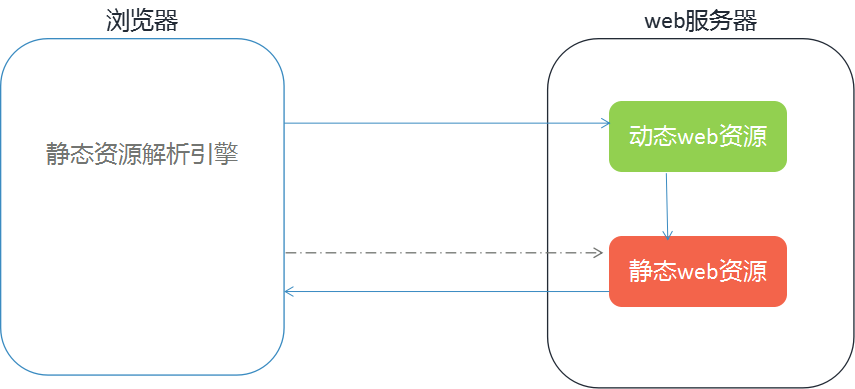
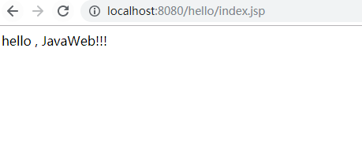

# JavaWeb入门&Servlet基础

## 学习目标

- 理解WEB相关概念和WEB服务器概念
- 会安装、卸载、启动和关闭tomcat
- 掌握使用tomcat部署项目
- 能够使用Eclipse开发Web应用程序
- 了解Servlet概念
- Servlet快速入门

## 一 、Web相关概念

### 1.1 软件架构

WEB：在英语中web即表示网页的意思，它用于表示Internet主机上供外界访问的资源。
JavaWeb：使用Java语言开发基于互联网的项目

#### 1.1.1 软件架构：


#### 1.1.2 软件架构详解：

- **C/S**: Client/Server 客户端/服务器端
  - 在用户本地有一个客户端程序，在远程有一个服务器端程序
    - 如：QQ，迅雷...
  - 特点：
    - 充分发挥客户端PC的处理能力，很多数据可以通过客户端的处理后再发给服务器，降低了服务器的负荷，提高了速度。但维护和升级比较复杂，维护和升级是针对成千上万的客户机的。
    - 必须安装专用的客户端软件。客户端是成千上万的，要安装专用软件，是多么大的工作量，如果一台客户机出现了问题，如：感染病毒、计算机故障等等原因，都需要进行安装或维护。系统软件需要升级的时候，每一台客户机都需要重新安装系统软件，维护和升级成本相当的高。
    - 对客户机的操作系统有限制，对一些操作系统和新开发的操作系统不兼容。目前产品更新换代十分的快，要针对不同的操作系统系统版本开发不同的客户机软件，对成本而言是相当大。
- **B/S**: Browser/Server 浏览器/服务器端
  - 只需要一个浏览器，用户通过不同的网址(URL)，客户访问不同的服务器端程序
    - 如：淘宝，京东...
  - 特点：
    - 维护和升级简单，我们只要对服务器端进行维护和升级即可，不需要对成千上万的客服端进行维护和升级，减少了人力资源成本。
    - 随时随地都可以访问，只要有一台连接互联网和安装了浏览器的计算机就可以访问。
    - 减轻了客户端电脑载荷，客户端电脑只要运行少部分程序就能实现。因此对客服端电脑要求不高，对服务器端负荷较重，由于主要的功能都集中到了服务器端，因此对服务器要求高，但总体而言，还是大大降低了成本。
- **总结**：B/S对C/S而言，B/S具有的优势。
  - 分布性：可以随时随地进行查询和浏览等业务；
  - 功能业务扩展比较方便：增加服务器的功能，就能增加浏览器端的功能；
  - 维护简单方便：改变服务器端数据即可以实现所有用户同步更新；
  - 开发简单，共享性强，成本低，数据可以持久存储在服务器端而不必担心数据的丢失。

### 1.2 Web资源分类

- **静态资源：**
  - 使用静态网页开发技术发布的资源
  - 特点：
    - 所有用户访问，得到的结果是一样的
      - 如：文本，图片，音频、视频, `HTML,CSS,JavaScript`
    - 如果用户请求的是静态资源，那么服务器会直接将静态资源发送给浏览器。浏览器中内置了静态资源的解析引擎，可以展示静态资源
- **动态资源：**
  - 使用动态网页技术发布的资源
  - 特点：
    - 所有用户访问，得到的结果可能不一样
      - 如：`jsp/servlet,php,asp...`
    - 如果用户请求的是动态资源，那么服务器会执行动态资源，转换为静态资源，再发送给浏览器			

### 1.3 网络通信三要素

**IP**：电子设备(计算机)在网络中的唯一标识

**端口**：应用程序在计算机中的唯一标识。 0~65536

**传输协议**：规定了数据传输的规则

- 基础协议：
  - tcp:安全协议，三次握手。 速度稍慢
  - udp：不安全协议。 速度快

- 高级协议
  -  http协议
    - 基于TCP/IP的高级协议
    - 基于请求/响应模型的:一次请求对应一次响应


### 1.4 Web资源请求响应过程



## 二、Web服务器软件

### 2.1 web服务器软件概念

服务器：安装了服务器软件的计算机。

服务器软件：接收用户的请求，处理请求，做出响应。

web服务器软件：接收用户的请求，处理请求，做出响应。

在web服务器软件中，可以部署web项目，让用户通过浏览器来访问这些项目。

> 疑问：学习web开发，为什么必须要先装一个WEB服务器 ?

### 2.2 常见的web服务器软件：

- webLogic：oracle公司，大型的JavaEE服务器，支持所有的JavaEE规范，收费的。
- webSphere：IBM公司， 大型的JavaEE服务器，支持所有的JavaEE规范，收费的。
- JBOSS：JBOSS公司的，大型的JavaEE服务器，支持所有的JavaEE规范，收费的。
- Tomcat：Apache基金组织，中小型的JavaEE服务器，仅仅支持少量的JavaEE规范servlet/jsp。开源的，免费的。

### 2.3 Tomcat：web服务器软件

Tomcat免费的Web服务器，该服务器支持全部JSP以及Servlet规范，也是我们学习javaweb所使用的服务器，所以我们有必要深入了解;

#### 2.3.1 下载

可以直接在官网下载：http://tomcat.apache.org/

#### 2.3.2 安装

解压压缩包即可。 

注意：安装目录建议不要有中文和空格,解压的目录结构如下图


#### 2.3.3 卸载

删除目录就行了

#### 2.3.4 启动

`bin/startup.bat` ,双击运行该文件即可

访问：浏览器输入：http://localhost:8080 回车访问自己

​                                   [http://别人的ip:8080](http://别人的ip:8080) 访问别人

显示如下界面表示成功


**启动时可能遇到的问题**：

1. 黑窗口一闪而过：

   1. 原因： 没有正确配置JAVA_HOME环境变量
   2. 解决方案：正确配置JAVA_HOME环境变量

2. 端口号被占用：

  
   1. 暴力解决：找到占用的端口号，并且找到对应的进程，杀死该进程
       1. 使用命令`netstat –ano|findstr [指定端口号]`找到占用端口的进程 
  
      1. 打开任务管理器->查看->选择列->然后勾选PID选项，回到任务管理器上可以查看到对应的pid，然后结束进程
  
  1. 温柔解决：修改自身的端口号
  
  在conf/server.xml 配置文件中修改
  
  ```xml
  <Connector port="8888" protocol="HTTP/1.1"
  	    connectionTimeout="20000"
     	    redirectPort="8445" />
  ```
  
  > 一般会将tomcat的默认端口号修改为80。80端口号是http协议的默认端口号。
  >
  >  好处：在访问时，就不用输入端口号

#### 2.3.5 关闭

- 正常关闭：
  - `bin/shutdown.bat`
  - `ctrl+c`
- 强制关闭：
  - 点击启动窗口的 `×`

#### 2.3.6 Tomcat项目部署 （虚拟目录映射）

Web应用开发好后，若想供外界访问，需要把web应用所在目录交给web服务器管理，这个过程称之为项目部署（虚拟目录的映射）。

- 配置`conf/server.xml`文件, 在`<Host>`标签体中加入子标签配置

  ```xml
   <!--<Context  path="虚拟路径"   docBase ="物理路径" />-->
   <Context docBase="D:\hello" path="/xixi" /> 
  ```

  - `docBase`:项目存放的路径

  - `path`：虚拟目录

- 直接将项目放到webapps目录下即可

  - `/hello`：项目的访问路径-->虚拟目录
  - 简化部署：将项目打成一个war包，再将war包放置到webapps目录下。 war包会自动解压缩。

## 三、Eclipse开发Web应用程序

### 3.1 Eclipse中配置Tomcat

window ->Preferences


Server -> Runtime Envvironme -> add


### 3.2  创建Web项目


由于创建项目的时候选择的是 3.0以上版本，没有web.xml文件 ，所以需要生成


创建JSP文件


文件内容如下


将项目添加到Tomcat服务器


启动Tomcat服务器


通过浏览器访问显示如下信息，成功


### 3.3 JavaWeb应用目录结构

开发web应用时，不同类型的文件有严格的存放规则，否则不仅可能会使web应用无法访问，还会导致web服务器启动报错


web应用中，web.xml文件是其中最重要的一个文件，它用于对web应用中的web资源进行配置。

#### 案例1：

使用Eclipse开发一个Web应用程序，通过浏览器访问并显示 “hello,JavaWeb!!!”



## 四、Servlet

### 4.1 什么是Servlet？

Servlet是一门用于开发动态web资源的技术，它是运行在服务器端的小程序。

Servlet就是一个接口，定义了Java类被浏览器访问到(tomcat识别)的规则。

作用：Servlet主要用于处理客户端传来的HTTP请求，并返回一个响应，它能够处理的请求有doGet()和doPost()等方法。

用户若想用发一个动态web资源(即开发一个Java程序向浏览器输出数据)，需要完成以下2个步骤：

1. 编写一个Java类，实现Servlet接口。
2. 把开发好的Java类部署到web服务器中。

### 4.2 Servlet快速入门

#### 案例2：

快速入门，用Servlet向浏览器输出“hello servlet”。

1. 创建JavaEE项目

2. 定义一个类，实现Servlet接口

   * public class Demo1Servlet implements Servlet

3. 实现接口中的抽象方法

   ```java
   package com.bailiban.servlet;
   
   import java.io.IOException;
   import java.io.PrintWriter;
   
   import javax.servlet.Servlet;
   import javax.servlet.ServletConfig;
   import javax.servlet.ServletException;
   import javax.servlet.ServletRequest;
   import javax.servlet.ServletResponse;
   
   /*
    * Servlet快速入门
    * 定义一个类实现Servlet接口
    */
   public class Demo1Servlet implements Servlet{
   
   	@Override
   	public void destroy() {
   		// TODO Auto-generated method stub
   		
   	}
   	@Override
   	public ServletConfig getServletConfig() {
   		// TODO Auto-generated method stub
   		return null;
   	}
   
   	@Override
   	public String getServletInfo() {
   		// TODO Auto-generated method stub
   		return null;
   	}
   
   	@Override
   	public void init(ServletConfig config) throws ServletException {
   		// TODO Auto-generated method stub
   		
   	}
   	//提供服务的方法
   	@Override
   	public void service(ServletRequest req, ServletResponse res) throws ServletException, IOException {
   		//向控制台输出一句话
   		System.out.println("Hello Servlet");
   		//得到输出对象
   		PrintWriter out = res.getWriter();
   		//向浏览器输出信息
   		out.write("Hello Servlet");
   	}	
   
   }
   ```
   
4. 在web.xml中配置Servlet

   ```xml
    <!--配置Servlet -->
    <servlet>
        <servlet-name>demo1</servlet-name>
        <servlet-class>cn.hp.servlet.Demo1Servlet</servlet-class>
    </servlet>
   
    <servlet-mapping>
        <servlet-name>demo1</servlet-name>
        <url-pattern>/demo1</url-pattern>
    </servlet-mapping>
   
   ```

5. 运行效果

   

   6.Servlet执行原理

   


### 案例3：

完成综合案例

需求：

1. 编写login.html登录页面

2. 用户输入用户名和密码，点击登录按钮，访问LoginServlet
3. 在LoginServlet的service方法中，向控制台中输出"用户登录"

