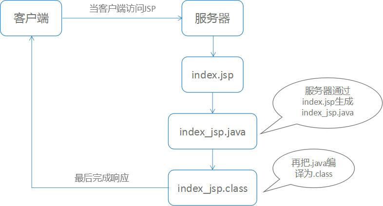
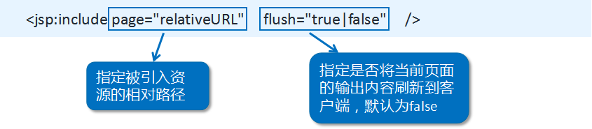
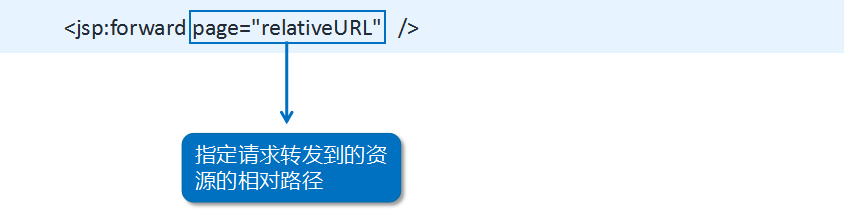
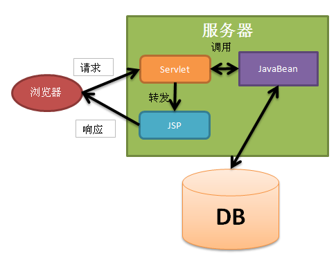
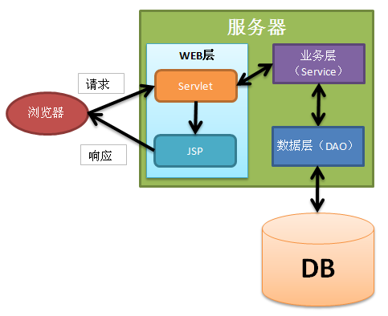
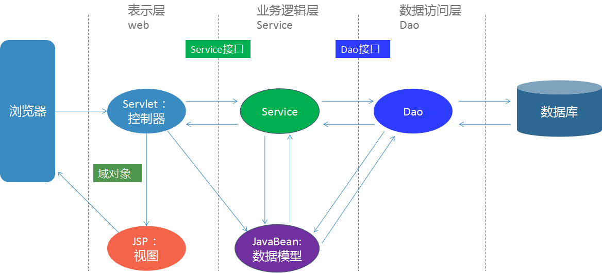

# JSP基础

## 学习目标

- 能够掌握jsp的基本使用 
- 理解JSP隐式对象
- 理解MVC
- 理解javaEE三层架构
- 能够独立完成综合案例

## 一、JSP

### 1.1 JSP简介

JSP全称是Java Server Pages，它和servle技术一样，都是一种用于开发动态web资源的技术。

JSP这门技术的最大的特点在于，写jsp就像在写html，但它相比html而言，html只能为用户提供静态数据，而Jsp技术允许在页面中嵌套java代码，为用户提供动态数据。

它与html页面的作用是相同的，获取数据和显示数据

### 1.2 JSP原理

JSP的本质是Servlet,具体过程在第一次访问JSP时,被编译成一个java类,继承HttpJspBase,它最终继承HttpServlet，然后再去执行Servlet。




JSP生成的Servlet存放在tomcat的 work目录下，我经常开玩笑的说，它是JSP的“真身”。我们打开看看其中的内容，了解一下JSP的“真身”。

你会发现，在JSP中的静态信息（例如<html>等）在“真身”中都是使用out.write()完成打印！这些静态信息都是作为字符串输出给了客户端。
JSP的整篇内容都会放到名为_jspService的方法中！

### 1.3  JSP脚本

JSP本质是一个类,说明这个JSP里面可以书写java代码,具体书写方式有三种。

- `<% 代码 %>`：代码段，在service方法中。service方法中可以定义什么，该脚本中就可以定义什么。 
- `<%! 代码 %>`：声明，在jsp转换后的java类的成员位置。 
- `<%= 代码 %>`：表达式，会输出到页面上。输出语句中可以定义什么，该脚本中就可以定义什么

### 案例1：

演示JSP三种脚本的使用

### 1.4 JSP注释

1. html注释：
	`<!-- -->`:只能注释html代码片段
2. jsp注释：推荐使用
	`<%-- --%>`：可以注释所有

### 案例2：

演示JSP注释和HTML注释区别

### 1.5 JSP指令

#### 1.5.1 JSP三大指令：

- `page`   设置页面信息
- `include`  引入外部的资源文件
- `taglib`   引入外部标签

#### 1.5.2 JSP指令的格式：

`<%@指令名  属性1=”值1”   属性2=”值2” %>`，一般都会把JSP指令放到JSP文件的最上方，但这不是必须的。

如果一个指令有多个属性，这多个属性可以写在一个指令中，也可以分开写。

#### 1.5.3 JSP指令详解

##### page指令的属性:

- contentType：等同于response.setContentType()
  - 设置响应体的mime类型以及字符集
  - 设置当前jsp页面的编码

- pageEncoding:
  - 指定当前JSP页面的编码！这个编码是给服务器看的，所以这个编码只需要与真实的页面编码一致即可！

-  import：导包
-  errorPage：当前页面发生异常后，会自动跳转到指定的错误页面
- isErrorPage：标识当前页面是否是错误页面。

### 案例3：

演示page指令

##### include指令:

- 表示静态包含！即目的是把多个JSP合并成一个JSP文件！

- 只有一个属性：file，指定要包含的页面，例如：<%@include file=”b.jsp”%>

### 案例4：

演示include指令

##### taglib指令:

- taglib指令是用来在当前jsp页面中导入第三方的标签库
  -  ` <%@ taglib prefix="c" uri="http://java.sun.com/jsp/jstl/core" %>`
    - prefix：指定标签前缀，这个东西可以随意起名
    - uri：指定第三方标签库的uri（唯一标识）
    - 当然，需要先把第三方标签库所需jar包导入到项目中

### 1.6 JSP动作元素

#### 1.6.1 include动作

`<jsp:include>`：动作标签的作用是用来包含其它JSP页面的！

其语法格式：




你可能会说，前面已经学习了include指令了，它们是否相同呢？虽然它们都是用来包含其它JSP页面的，但它们的实现的级别是不同的！

- include指令:是在编译级别完成的包含，即把当前JSP和被包含的JSP合并成一个JSP，然后再编译成一个Servlet。(静态包含)


- include动作:是在运行级别完成的包含，即当前JSP和被包含的JSP都会各自生成Servlet，然后在执行当前JSP的Servlet时完成包含另一个JSP的Servlet。(动态包含)


### 案例5：

演示include动作

#### 1.6.2 forward动作

`<jsp:forward>`:forward标签的作用是请求转发！

其语法格式：



### 案例6：

演示forward动作

### 1.7 JSP隐式对象

为了简化Web应用程序的开发，JSP 2.0规范中提供了9个隐式（内置）对象，它们是JSP默认创建的，可以直接在JSP页面中使用。

| **名称**    | **类型**                               | **描述**                                    |
| ----------- | -------------------------------------- | ------------------------------------------- |
| out         | javax.servlet.jsp.JspWriter            | 用于页面输出                                |
| request     | javax.servlet.http.HttpServletRequest  | 得到用户请求信息                            |
| response    | javax.servlet.http.HttpServletResponse | 服务器向客户端的回应信息                    |
| config      | javax.servlet.ServletConfig            | 服务器配置，可以取得初始化参数              |
| session     | javax.servlet.http.HttpSession         | 用来保存用户的信息                          |
| application | javax.servlet.ServletContext           | 所有用户的共享信息                          |
| page        | java.lang.Object                       | 指当前页面转换后的Servlet类的实例           |
| pageContext | javax.servlet.jsp.PageContext          | JSP的页面容器                               |
| exception   | java.lang.Throwable                    | 表示JSP页面所发生的异常，在错误页中才起作用 |

#### 1.7.1  request对象

request对象是javax.servlet.http.HttpServletRequest对象的一个实例。每当客户端请求页面时，JSP引擎将创建一个新对象来表示该请求。

request对象提供了获取包括表单数据，Cookie，HTTP方法等HTTP头信息的方法。

#### 1.7.2 response对象

`response`对象是`javax.servlet.http.HttpServletResponse`对象的一个实例。就像服务器创建`request`对象一样，它还创建一个对象来表示对客户端的响应。

`response`对象还定义了处理创建新HTTP头的接口。通过此对象，JSP程序员可以添加新的Cookie或日期戳，HTTP状态代码等。

#### 1.7.3 out对象

`out`隐式对象是`javax.servlet.jsp.JspWriter`对象的一个实例，用于在响应中发送内容。

初始化`JspWriter`对象根据页面是否缓存而不同地实例化。缓冲可以通过使用`page`指令的`buffered ='false'`属性来关闭。

`JspWriter`对象包含与`java.io.PrintWriter`类大部分相同的方法。但是，`JspWriter`还有一些额外的方法用来处理缓冲。与`PrintWriter`对象不同，`JspWriter`会抛出`IOExceptions`异常。

#### 1.7.4 session对象

`session`对象是`javax.servlet.http.HttpSession`的一个实例，其行为与Java Servlet下的会话对象行为完全相同。
`session`对象用于跟踪客户端请求之间的客户端会话。

#### 1.7.5 application对象

`application`对象是生成的`Servlet`的`ServletContext`对象的直接包装，实际上是`javax.servlet.ServletContext`对象的一个实例。

`application`对象是JSP页面在其整个生命周期中的表示。 当JSP页面被初始化时，将创建此对象，并且在JSP页面被`jspDestroy()`方法删除时`application`对象也将被删除。

通过向`application`对象添加属性值，可以确保组成Web应用程序的所有JSP文件都可以访问它。

#### 1.7.6 config对象

`config`对象是`javax.servlet.ServletConfig`的实例化，是生成的servlet的`ServletConfig`对象周围的直接包装。

#### 1.7.7 pageContext对象

`pageContext`对象是`javax.servlet.jsp.PageContext`对象的一个实例。`pageContext`对象用于表示整个JSP页面。

#### 1.7.8 page对象

`page`对象是对该页面实例的实际引用。可以认为它是表示整个JSP页面的对象。

`page`对象是`this`对象的直接同义词。

#### 1.7.9 exception对象 

`exception`对象是一个包含上一页抛出的异常的包装器。它通常用于生成对错误条件的适当响应。

## 二、 MVC开发模式

### 2.1 JavaWeb演变历史

最初的最初，纯Servlet开发，只能使用response输出标签数据，非常麻烦。

大概如下面这样：

```java
import java.io.IOException;
import java.io.PrintWriter;

import javax.servlet.ServletException;
import javax.servlet.http.HttpServlet;
import javax.servlet.http.HttpServletRequest;
import javax.servlet.http.HttpServletResponse;

public class HelloWorld extends HttpServlet {
    public void doGet(HttpServletRequest request, HttpServletResponse response)
            throws ServletException, IOException {
        response.setContentType("text/html");
        PrintWriter out = response.getWriter();
        out.println("<html>");
        out.println("<head>");
        out.println("<title>Hello World</title>");
        out.println("</head>");
        out.println("<body>");
        out.println("<h1>Hello World!</h1>");
        out.println("</body>");
        out.println("</html>");
    }
}

```

最初的之后，jsp出现简化了Servlet的开发，但是大段大段的html夹杂着Java的代码造成项目难于维护，难于分工协作。

```jsp
<%@ page import="java.sql.DriverManager" %>
<%@ page import="java.sql.Connection" %>
<%@ page import="java.sql.PreparedStatement" %><%--
  Created by IntelliJ IDEA.
  User: Bryan
  Date: 2017/4/8
  Time: 11:54
  To change this template use File | Settings | File Templates.
--%>
<%@ page contentType="text/html;charset=UTF-8" language="java" %>
<html>
<head>
    <title>处理任务添加页面</title>
</head>
<body>
    <%
        request.setCharacterEncoding("UTF-8");
        String name = request.getParameter("name");
        String age = request.getParameter("age");
        int sex = Integer.parseInt(request.getParameter("sex"));
    %>
    <%
        Class.forName("com.mysql.jdbc.Driver");
        Connection connection = DriverManager.getConnection("jdbc:mysql://localhost:3306/db_mvc_demo","root","root");
        String sql = "INSERT INTO t_person(name,age,sex) VALUES(?,?,?)";
        PreparedStatement ps = connection.prepareStatement(sql);
        ps.setString(1,name);
        ps.setString(2,age);
        ps.setInt(3,sex);
        ps.execute();
        request.getRequestDispatcher("index.jsp").forward(request,response);
    %>
</body>
</html>

```

再后来，JavaWeb开发，借鉴mvc开发模式，使得程序的设计更加合理性

### 2.2 MVC详解

MVC是由web前端人员设计开发的一种设计模式,可以应用在任何语言的开发中,MVC中的M,V,C具体是什么,对应的技术需要记清楚。

 **M**：Model，模型。JavaBean

- 完成具体的业务操作，如：查询数据库，封装对象

 **V**：View，视图。JSP

- 展示数据
- 提交请求

 **C**：Controller，控制器。Servlet

- 获取用户的输入数据
- 调用模型
- 将数据交给视图进行展示

优缺点：

- 优点：
  - 耦合性低，方便维护，利于分工协作
  - 重用性高

- 缺点：
  - 使得项目架构变得复杂，对开发人员要求高了点点


### 2.3 三层架构回顾

三层架构就是为了符合“高内聚，低耦合”思想，把各个功能模块划分为表示层、业务逻辑层、数据访问层三层架构，各层之间采用接口相互访问，并通过对象模型的实体类（Model）作为数据传递的载体，不同的对象模型的实体类一般对应于数据库的不同表，实体类的属性与数据库表的字段名一致。

- 表示层(web层)：用户看的得界面。用户可以通过界面上的组件和服务器进行交互
- 业务逻辑层：处理业务逻辑的
- 数据访问层：操作数据存储文件
  


### 2.4 三层架构与MVC的关系

三层架构中的表示层(web层 )是跟用户发生直接关系的层。

MVC中的V和C就是这样的存在，所以MVC中的V和C均属于三层架构的web层。

同时，MVC中的M（Model）包括了数据承载Bean和业务处理Bean，其中业务处理Bean分为Service或Dao对象，分别对应业务逻辑处理和数据库操作，相应的，它们对应的是三层架构中的Service层和Dao层。



### 案例7：

使用MVC模式实现登录和图书列表的显示

### 企业应用案例：

完成图书列表的添加和删除

​	