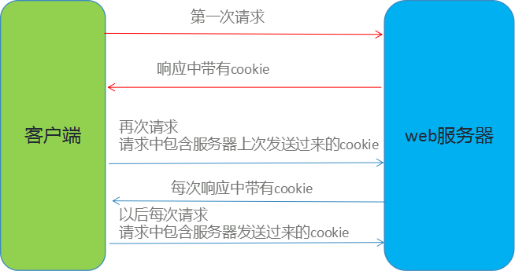

# 会话管理和使用

## 学习目标

- 理解会话管理技术 
- 能够掌握Cookie技术的应用
- 能够掌握Session技术的应用
- 能够掌握四大域对象的使用
- 能够掌握EL的使用 
- 能够掌握JSTL的使用 

# 一、会话技术概述

## 1.1 什么是会话？

可以把会话理解为客户端与服务器之间的一次会晤，在一次会晤中可能会包含多次请求和响应。例如你给10086打个电话，你就是客户端，而10086服务人员就是服务器了。从双方接通电话那一刻起，会话就开始了，到某一方挂断电话表示会话结束。在通话过程中，你会向10086发出多个请求，那么这多个请求都在一个会话中。

在JavaWeb中，客户向某一服务器发出第一个请求开始，会话就开始了，直到客户关闭了浏览器会话结束。

总结：

一次会话中包含多次请求和响应。

一次会话：浏览器第一次给服务器资源发送请求，会话建立，直到有一方断开为止

## 1.2 什么是会话跟踪技术

我们知道HTTP协议是无状态协议，也就是说每个请求都是独立的！无法记录前一次请求的状态,会话跟踪技术的出现就是解决该问题

在一次会话的多个请求间共享数据，这就是会话跟踪技术

例如在一个会话中的请求如下：

- 请求银行主页。
- 请求登录（请求参数是用户名和密码）。
- 请求转账（请求参数与转账相关的数据）。
- 请求信誉卡还款（请求参数与还款相关的数据）。

在这上会话中当前用户信息必须在这个会话中共享的，因为登录的是张三，那么在转账和还款时一定是相对张三的转账和还款！这就说明我们必须在一个会话过程中有共享数据的能力。

### 常用的会话跟踪技术

#### 隐藏表单域

```html
<input type="hidden" id="xxx" value="xxx">
```

#### URL 重写

可以在 URL 后面附加参数，和服务器的请求一起发送，这些参数为键/值对

#### Cookie   

HTTP协议中可以使用Cookie来完成会话跟踪

#### Session

使用session来完成会话跟踪，session底层依赖Cookie技术

# 二、Cookie   

## 2.1 Cookie概述

Cookie翻译成中文是小甜点，小饼干的意思。在HTTP中它表示服务器送给客户端浏览器的小甜点。其实Cookie就是一个键和一个值构成的，随着服务器端的响应发送给客户端浏览器。然后客户端浏览器会把Cookie保存起来，当下一次再访问服务器时把Cookie再发送给服务器。

> 客户端会话技术，将数据保存到客户端



Cookie是由服务器创建，然后通过响应发送给客户端的一个键值对。客户端会保存Cookie，并会标注出Cookie的来源（哪个服务器的Cookie）。

当客户端向服务器发出请求时会把所有这个服务器Cookie包含在请求中发送给服务器，这样服务器就可以识别客户端了！

## 2.2 Cookie快速入门

步骤：

1. 创建Cookie对象，绑定数据

   ```java
    new Cookie(String name, String value) 
   ```

2. 发送Cookie对象

   ```java
    response.addCookie(Cookie cookie) 
   ```

3. 获取Cookie，拿到数据

   ```java
    Cookie[]  request.getCookies()  
   ```

### 案例1 ：

 Cookie快速入门 演示Cookie的创建发送流程

> 实现原理 : 基于响应头set-cookie和请求头cookie实现

## 2.3 Cookie细节

### 一次可不可以发送多个cookie?

可以创建多个Cookie对象，使用response调用多次addCookie方法发送cookie即可

### cookie在浏览器中保存多长时间？

- 默认情况下，当浏览器关闭后，Cookie数据被销毁

- 持久化存储：

  ```java
   setMaxAge(int seconds)
  ```

  - 正数：将Cookie数据写到硬盘的文件中。持久化存储。并指定cookie存活时间，时间到后，cookie文件自动失效
  - 负数：默认值
  - 零：删除cookie信息

### cookie能不能存中文？

- 在tomcat 8 之前 cookie中不能直接存储中文数据，需要将中文数据转码,一般采用URL编码

- 在tomcat 8 之后，cookie支持中文数据。特殊字符还是不支持，建议使用URL编码存储，URL解码解析

### cookie共享问题

- 假设在一个tomcat服务器中，部署了多个web项目，那么在这些web项目中cookie能不能共享？

  默认情况下cookie不能共享

  ```java
  setPath(String path):设置cookie的获取范围。默认情况下，设置当前的虚拟目录
  //如果要共享，则可以将path设置为"/"
  ```

### 案例2 ： 

基于案例1演示 Cookie细节

## 2.4 Cookie的特点和作用

 **特点：**

- cookie存储数据在客户端浏览器
-  浏览器对于单个cookie 的大小有限制(4kb) 以及 对同一个域名下的总cookie数量也有限制(20个)

**作用：**

- cookie一般用于存出少量的不太敏感的数据
- 在不登录的情况下，完成服务器对客户端的身份识别

### 练习：

​	使用 cookie技术，统计每个用户访问网站的次数

**需求：**

​	访问一个jsp页面，每访问一次统计用户的访问次数在页面输出 当前访问次数为n次

**分析：**

1. 可以采用Cookie来完成
2. 在服务器中的JSP判断是否有一个名为count的cookie

  - 有：不是第一次访问
    - 从该cookie中取出 上一次的访问次数 ，并 +1
    - 写回Cookie

  - 没有：是第一次访问
    - 创建一个名为count的cookie ,并将值设置为 1
    - 写回Cookie

# 三、Session （重点）

## 3.1 Session概述

概念：服务器端会话技术，在一次会话的多次请求间共享数据，将数据保存在服务器端的对象HttpSession中

`javax.servlet.http.HttpSession`接口表示一个会话，我们可以把一个会话内需要共享的数据保存到HttSession对象中！

## 3.2 Session快速入门

步骤：

1. 获取HttpSession对象

   ```java
    HttpSession session = request.getSession();
   ```

2. 使用HttpSession对象：

   - `getAttribute`方法 
     - ` Object getAttribute(String name) `
     -  根据指定的属性名称获取指定的值，返回结果是Object需要强转
   - `setAttribute`方法 
     - ` void setAttribute(String name, Object value) `
     -   绑定数据到此会话上，数据格式键/值对,name属性名 value属性值
   - `removeAttribute`方法 
     - ` void   removeAttribute(String name)  `
     -   移除绑定的数据，根据键（属性名）移除

### 案例3： 

HttpSession快速入门，熟悉session中数据的存和取

## 3.3 Session原理

服务器如何确保在一次会话范围内，多次获取的Session对象是同一个？

当我首次去银行时，因为还没有账号，所以需要开一个账号，我获得的是银行卡，而银行这边的数据库中留下了我的账号，我的钱是保存在银行的账号中，而我带走的是我的卡号。

当我再次去银行时，只需要带上我的卡，而无需再次开一个账号了。只要带上我的卡，那么我在银行操作的一定是我的账号！Session的实现是依赖于Cookie的，这是因为服务器需要把键为JSESSIONID的cookie保存到客户端。

## 3.4 Session细节

### 当客户端关闭后，服务器不关闭，两次获取session是否为同一个？

- 默认情况下，不是。
- 如果需要相同，则可以创建Cookie,键为JSESSIONID，设置最大存活时间，让cookie持久化保存。 

### 客户端不关闭，服务器关闭后，两次获取的session是同一个？

- 不是同一个，但是要确保数据不丢失。tomcat自动完成以下工作

- session的钝化：
  -  在服务器正常关闭之前，将session对象系列化到硬盘上
-  session的活化：
  -  在服务器启动后，将session文件转化为内存中的session对象即可。

### session什么时候被销毁？

- 服务器关闭
- session对象调用invalidate() 。
- session默认失效时间 30分钟，可在tomcat xml文件中配置

```xml
<session-config>
	<session-timeout>30</session-timeout>
</session-config>
```

## 3.5 Session的特点和作用

 特点

- session用于存储一次会话的多次请求的数据，存在服务器端
- session可以存储任意类型，任意大小的数据

作用：

- 保存用户特有数据
- 一次会话中很多资源都要用的数据

# 四 、JSP四大域对象

## 4.1 概述

到此为止，web开发接触到了4个域对象,这4个域对象是学习web的重点

- pageContext（称之为page域）
- request（称之为request域）
- session（称之为session域）
- application （称之为application域） 本质上是ServletContext

### 什么是域？

域： 即范围的意思

之所以把这些对象叫做域对象 是为他们都有自己的固定的生命周期和作用域

内部是Map集合的实现 `Map<String, Object>`

都有 存 和 取  、删除的方法

```java
void setAttribute(String name, Object value)：用来存储数据

Object getAttribute(String name)：用来获取域中的数据

void removeAttribute(String name)：用来移除域中数据
```

## 4.2 域对象总结

| 域对象      | 生命周期       | 作用                                                         |
| ----------- | -------------- | ------------------------------------------------------------ |
| pageContext | 当期页面       | 代理其他域对象                                               |
| request     | 一次请求       | 数据只是做显示的，看完了就没用了 （请求转发， Servlet 产生的处理结果(数据) 交给jsp显示） |
| session     | 一次会话       | 保存用户特有数据 或 数据给用户看完了，一会还要用，会话结束了就没用了 |
| application | 与服务器共存亡 | 数据给一个用户用完了，别人还要用，保存所有用户共享的数据     |

> 域范围： pageContext <request<session<application
>
> ​				从小到大

### 案例4：

演示4大域对象的生命周期特点

# 五、EL表达式

## 5.1 概述

**概念**：EL 全名为Expression Language   表达式语言

**作用**：

替换和简化jsp页面中java代码的编写

**语法格式：**

```xml
${表达式}
```

## 5.2 EL表达式使用

### 5.2.1 运算：

- 算数运算符： `+  -  *  /(div)  %(mod)`
- 比较运算符：` >  <  >=  <=  ==  !=`
- 逻辑运算符：` &&(and)  ||(or)  !(not)`
- 三元运算符：表达式1 ? 表达式2 ： 表达式3;
- 空运算符：`empty`
  - 功能：用于判断字符串、集合、数组对象是否为null或者长度是否为0
  - `${empty list}`:判断字符串、集合、数组对象是否为null或者长度为0
  - `${not empty str}`:表示判断字符串、集合、数组对象是否不为null 并且 长度>0

### 案例5：

演示EL表达式运算符的使用

在web根目录WebContent 中创建目录el,在该目录中创建el1.jsp 页面

使用EL运算符

```jsp
<%@ page language="java" contentType="text/html; charset=UTF-8"
    pageEncoding="UTF-8"%>
<!DOCTYPE html>
<html>
<head>
<meta charset="UTF-8">
<title>运算符</title>
</head>
<body>
   <h1>算术运算符</h1>
   ${8+3 }<br/>
   ${8-3 }<br/>
   ${8/3 }<br/>
   ${8*3 }<br/>
   ${8%3 }
   <h1>比较运算符</h1>
   ${3>8}
   <h1>逻辑运算符</h1>
   ${3>1&&3>8}
   <h1>三元运算符</h1>
   ${3<8?true:false}
</body>
</html>
```

### 5.2.2 获取值：

**注意**：el表达式只能从域对象中获取值，自动屏蔽null值

**语法**：

- `${域名称.键名}`：从指定域中获取指定键的值

- 域名称：
  - pageScope	--> pageContext
  - requestScope --> request
  - sessionScope --> session
  - applicationScope --> application（ServletContext）
    -  举例：在request域中存储了 name=旺财 
    -  获取：${requestScope.name}

- `${键名}`：表示依次从最小的域中查找是否有该键对应的值，直到找到为止。(最常用)

### 案例6：

演示EL取值


### 5.2.3 获取对象、List集合、Map集合的值(重要)

- 对象：`${域名称.键名.属性名}`

- List集合：`${域名称.键名[索引]}`

- Map集合：
  - `${域名称.键名.key名称}`
  - `${域名称.键名["key名称"]}`

### 案例7：

演示EL获取对象、List集合、Map集合的值

## 5.3 隐式对象：

 EL表达式中有11个隐式对象

| **隐含对象名称** | **功能描述**                                                 |
| ---------------- | ------------------------------------------------------------ |
| pageContext      | 对应于JSP页面中的pageContext对象                             |
| pageScope        | 代表page域中用于保存属性的Map对象                            |
| requestScope     | 代表request域中用于保存属性的Map对象                         |
| sessionScope     | 代表session域中用于保存属性的Map对象                         |
| applicationScope | 代表application域中用于保存属性的Map对象                     |
| param            | 表示一个保存了所有请求参数的Map对象                          |
| paramValues      | 表示一个保存了所有请求参数的Map对象，它对于某个请求参数，返回的是一个String类型数组 |
| header           | 表示一个保存了所有http请求头字段的Map对象                    |
| headerValues     | 表示一个保存了所有http请求头字段的Map对象，返回String类型数组 |
| cookie           | 用来取得使用者的cookie值，cookie的类型是Map                  |
| initParam        | 表示一个保存了所有Web应用初始化参数的Map对象                 |

pageContext：

- 获取其中八个内置对象

- 在JSP页面可以使用 `${pageContext.request.contextPath}` 动态获取虚拟目录

### 案例8：

 使用EL内置对象 pageContext 动态获取虚拟目录

# 六、 JSTL

## 6.1 概述

JSTL 全名 Java Server Pages Tag Library  JSP标准标签库

是由Apache组织提供的开源的免费的jsp标签	

**作用**：

替换和简化jsp页面中java代码的编写

**使用步骤：**
 	1. 导入jstl相关jar包
 	2. 引入标签库：taglib指令：  <%@ taglib %>
 	3. 使用标签

## 6.2 常用的JSTL标签

### 6.2.1 if 标签

if标签:相当于java代码的if语句

#### 说明:

- test 必须属性，接受boolean表达式
-   如果表达式为true，则显示if标签体内容，如果为false，则不显示标签体内容
-  一般情况下，test属性值会结合el表达式一起使用
- 注意： c:if标签没有else情况，想要else情况，则可以再定义一个c:if标签

### 6.2.2 choose 标签

相当于java代码的switch语句

####  说明:

- 使用choose标签声明，	相当于switch声明
- 使用when标签做判断， 相当于case
-  使用otherwise标签做其他情况的声明 ，相当于default

### 6.2.3 foreach 标签

**相当于java代码的for语句：完成重复的操作**

```jsp
for(int i = 0; i < 10; i ++){

}
<c:forEach begin="1" end="10" var="i" step="2" varStatus="s">
    ${i}-${s.index}-${s.count}<br>
</c:forEach>

```

属性：

- begin：开始值
- end：结束值
- var：临时变量
- step：步长
- varStatus:循环状态对象
  - index:容器中元素的索引，从0开始
  - count:循环次数，从1开始

**遍历集合**

```jsp
List<String> list;
for(String str : list){

}
 <c:forEach items="${list}" var="str" varStatus="s">

            ${s.index} ${s.count} ${str}<br>

 </c:forEach>
```

属性：

- items:容器对象
- var:容器中元素的临时变量
-  varStatus:循环状态对象
  -  index:容器中元素的索引，从0开始
  -  count:循环次数，从1开始

### 案例9：

 使用 `if` 标签判定 集合是否为空，和数字的奇偶

### 案例10： 

使用`choose`标签 完成数字编号对应星期

### 案例11：

 演示foreach标签的使用

### 练习： 

需求：

在request域中有一个存有User对象的List集合。需要使用jstl+el将list集合数据展示到jsp页面的表格table中

### 企业应用案例：

优化登录和图书管理功能

需求：

1. 使用EL和JSTL替换JSP页面的所有JAVA代码,并动态获取项目名
2. 给用户登录增加会话跟踪技术，用户登录成功将用户信息放入session 跟踪其登录状态,在图书列表页面显示欢迎信息
3. 访问图书列表加入权限判断，如果用户没有登录成功，禁止访问，强制跳转到登录页面提示用户登录
4. 登录页面添加记住用户名功能,提高用户体验

### 练习：

完成图书修改功能

需求：

1. 用户点击修改按钮，跳转到修改页面，回显图书以前的数据
2. 点击修改页面的修改按钮，完成修改 回到图书列表页

