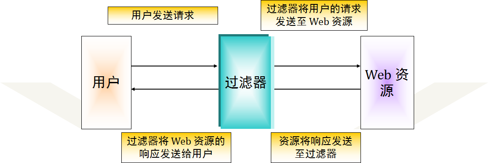
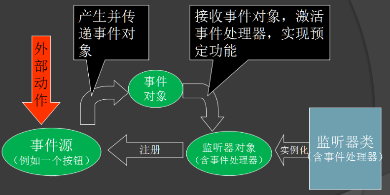

# 过滤器、监听器、文件的上传下载

## 学习目标

- 理解并掌握如何编写一个Filter(过滤器)
- 理解并掌握Filter的各项配置
- 理解并完成登陆验证案例和不文明词汇过滤案例
- 理解并掌握ServletContextListener监听器
- 独立完成图书图片上传
- 独立完成文件下载案例

# 一、Filter：过滤器

## 1.1 过滤器概述

日常生活中的过滤器：净水器、空气净化器、地铁安检员、土匪 ...

javaweb中的过滤器：当访问服务器的资源时，过滤器可以将请求拦截下来，完成一些特殊的功能。

过滤器JavaWeb三大组件之一，它与Servlet很相似！但是过滤器是用来拦截请求的，而不是处理请求的。



**过滤器的作用：**

一般用于完成通用的操作。如：登录权限验证、统一编码处理、敏感字符过滤...

## 1.2 快速入门

其实过滤器与Servlet很相似，回忆一下我们写的第一个Servlet应用！

#### 步骤：

- 定义一个类，实现接口Filter
- 复写方法
- 配置拦截路径
     			1. 注解
     			2. web.xml

### 案例1： 

过滤器快速入门

## 1.3 过滤器细节

### **web.xml方式配置**

```xml
    <filter>
        <filter-name>demo1</filter-name>
        <filter-class>com.bailiban.web.filter.Demo1Filter</filter-class>
    </filter>
    <filter-mapping>
        <filter-name>demo1</filter-name>
        <url-pattern>/*</url-pattern>

    </filter-mapping>
```

### 过滤器执行流程

1. 执行放行前代码

2. 执行放行代码

3. 执行放行后代码


###  过滤器生命周期方法

1. `init`:在服务器启动后，会创建Filter对象，然后调用init方法。只执行一次。用于加载资源
2. `doFilter`:每一次请求被拦截资源时，会执行。执行多次
3. `destroy`:在服务器关闭后，Filter对象被销毁。如果服务器是正常关闭，则会执行destroy方法。只执行一次。用于释放资源

###  拦截路径配置

1. 具体资源路径：` /index.jsp`   只有访问index.jsp资源时，过滤器才会被执行
2. 拦截目录：` /user/*`	 访问/user下的所有资源时，过滤器都会被执行
3. 后缀名拦截： `*.jsp`		访问所有后缀名为jsp资源时，过滤器都会被执行
4. 拦截所有资源：`/*`		访问所有资源时，过滤器都会被执行

### 拦截方式配置：资源被访问的方式

- 注解配置：设置dispatcherTypes属性

  - REQUEST：默认值。浏览器直接请求资源
  - FORWARD：转发访问资源
  - INCLUDE：包含访问资源
  - ERROR：错误跳转资源
  - ASYNC：异步访问资源

  ```java
  @WebFilter(value = "/*",dispatcherTypes = {DispatcherType.FORWARD,DispatcherType.REQUEST})
  ```

- web.xml配置：
  设置`<dispatcher></dispatcher>`标签即可

###  过滤器链(配置多个过滤器)

执行顺序：如果有两个过滤器：过滤器1和过滤器2
    1. 过滤器1
    2. 过滤器2
    3. 资源执行
    4. 过滤器2
    5. 过滤器1 

过滤器先后顺序问题：

1. 注解配置：按照类名的字符串比较规则比较，值小的先执行
   1.  如： AFilter 和 BFilter，AFilter就先执行了。
2. web.xml配置： `<filter-mapping>`谁定义在上边，谁先执行

### 案例2：

使用过滤器解决图书管理项目全站字符乱码问题

**思路：**

- 请求乱码：
  - get方式：tomcat 8 已经将get方式乱码问题解决了
  - post方式 ：request.setCharacterEncoding("utf-8");

- ​	响应的乱码问题：
  - response.setCharacterEncoding("utf-8")。

### 案例3：

使用过滤器对图书管理项目进行权限控制

**思路：**

- 访问图书管理的资源。验证其是否登录   
  - 如果登录了，则直接放行。
  - 如果没有登录，则跳转到登录页面，提示"您尚未登录，请先登录"。

### 案例4：

使用过滤器给图书管理项目添加过滤敏不文明用语功能

**需求：**

1. 对用户录入的数据进行不文明用语过滤
2. 如果是敏感词汇如：傻B、畜生 等，替换为 ***

**思路：**

1. 对request对象进行增强。增强其获取参数相关方法，增加过滤 敏感词汇功能

2. 增强对象的功能方式：

   - 继承
   - 装饰设计模式
   - 代理模式 

3. 选择使用代理模式

   概念：

   - 真实对象：被代理的对象
   - 代理对象：对真实对象功能的增强
   - 抽象角色：声明真实对象和代理对象的共同接口 ，需要增强什么功能

   实现方式：

   - 静态代理：有一个类文件描述代理模式

   - 动态代理：在内存中形成代理类		

   动态代理实现步骤：
      1. 代理对象和真实对象实现相同的接口

      2. 代理对象 创建 ： Proxy.newProxyInstance();

      3. 使用代理对象调用方法，对真实对象方法进行增强

        ​    

# 二、Listener：监听器 

## 2.1 概述

### 2.1.1 什么是监听器

web的三大组件之一，监听器是用于监听web常见对象`HttpServletRequest`,`HttpSession`,`ServletContext`

### 2.1.2 监听器的作用

- 监听web对象创建与销毁
- 监听web对象的属性变化
- 监听session绑定javaBean操作.

### 2.1.3 监听机制相关概念及原理

#### 相关概念

- ​	事件：可以被系统识别的操作
- ​	事件源：产生这件事情的源头
- ​    监听器：对某件事情进行处理监听的一个对象
- ​	注册监听：将监听器、事件、事件源绑定在一起，当事件产生时，监听器可以知道，并进行处理。

####   原理



执行顺序如下：

1. 给事件源注册监听器。
2. 组件接受外部作用，也就是事件被触发。
3. 组件产生一个相应的事件对象，并把此对象传递给与之关联的事件处理器。
4. 事件处理器启动，并执行相关的代码来处理该事件。

### 2.1.4  web监听器介绍

**监听web对象创建与销毁的监听器**

- `ServletContextListener`

- `HttpSessionListener`

- `ServletRequestListener`	

**监听web对象属性变化**

- `ServletContextAttributeListener`
- `HttpSessionAttributeListener`
- `ServletRequestAttributeListener`	

**监听session绑定javaBean**

- `HttpSessionBindingListener`
- `HttpSessionActivationListener`

说明 `ServletContext`域对象的监听器`ServletContextListener`大家重点掌握，其它作为了解

### 2.1.5 javaweb监听器创建步骤

- 创建一个类，实现指定的监听器接口	
- 重写接口中的方法.
- 在web.xml文件中配置监听

## 2.2 ServletContextListener

监听ServletContext对象的创建和销毁

ServletContext对象是服务器开启时创建。服务器关闭时销毁。

方法：

```java
void contextInitialized(ServletContextEvent sce) ：ServletContext对象创建后会调用该方法
void contextDestroyed(ServletContextEvent sce) ：ServletContext对象被销毁之前会调用该方法
```

### 案例5：

定义一个ServletContextListener监听器 ，监听ServletContext对象的创建和销毁，并加载类路径下的配置文件

**思路：**

1. 定义一个类`MyServletContextListener`，实现`ServletContextListener`接口

2. 重写方法 

3. 配置

   ​	web.xml文件中配置

   ```xml
    <!-- 配置监听器 -->
       <listener>
            <listener-class>com.bailiban.web.listener.MyServletContextListener</listener-class>
       </listener>
   ```

     注解配置 ：`@WebListener`

# 三、文件的上传

## 3.1 文件上传概述

### 什么是文件上传？

要将客户端（浏览器）大数据存储到服务器端，不将数据直接存储到数据库中，而是要将数据存储到服务器所在的磁盘上，这就要使用文件上传。

### 为什么使用文件上传？

通过文件上传，可以将浏览器端的大数据直接保存到服务器端。不将数据保存到数据库中，而是保存到服务器磁盘上，这样减少了数据库服务器的压力，对数据的操作更加灵活

## 3.2 文件上传原理分析

### 文件上传的必要前提：

1. 提供`form`表单，`method`必须是`post`
2. 表单必须设置`encType="multipart/form-data"`
3. 需要使用控件`< input type="file" name="f">` 控件必须有名称

### 服务器端处理：

​	通过request对象，获取InputStream,	可以将浏览器提交的所有数据读取到，解析请求正文的每部分的内容

## 3.3 commons-fileupload介绍

Apache 开源组织提供了一个用来处理表单文件上传的一个开源组件（ Commons-fileupload ），该组件性能优异，并且其API使用极其简单，可以让开发人员轻松实现web文件上传功能，因此在web开发中实现文件上传功能，通常使用Commons-fileupload组件实现。使用Commons-fileupload组件实现文件上传，需要导入该组件相应的支撑jar包：Commons-fileupload和commons-io。commons-io 不属于文件上传组件的开发jar文件，但Commons-fileupload 组件从1.1 版本开始，它工作时需要commons-io包的支持。

## 3.4 快速入门

####  3.4.1 fileupload的核心类有：

##### DiskFileItemFactory类

1.设置缓存大小

```java
DiskFileItemFactory factory = new DiskFileItemFactory()
factory.setSizeThreshold(1024*1024); //设置为1m 默认是10k
```

2.设置临时文件存储位置

```java
File temp=new 	File(this.getServletContext().getRealPath("/temp"));
factory.setRepository(temp); //可以指定	临时文件存储位置，默认是系统的临时文件	存储位置
```

##### ServletFileUpload类

1.`parseRequest`方法 

- ` List<FileItem> pareRequest(HttpServletRequest r	equest)`
-  该方法得到所有的上传信息，将每一部分映射成FileItem对象

2.`isMultipartContent`方法

- `boolean isMultipartContent(HttpServletRequest request)`	
- 这个方法返回值是boolean,它是用于判断当前表单是否是一个上传的表单,简单说，就判断它的encType的值是否是 multipart/form-data

3.setHeaderEncoding方法

- 用于解决上传文件名称中文乱码问题

4.设置上传文件大小

- `void setFileSizeMax(long fileSizeMax) `设置单个文件上传大小 
- `void  setSizeMax(long sizeMax)` 设置总文件上传大小

##### FileItem类

1.`isFormField`方法

- 这个方法返回的是boolean类型,它是判断当前组件是否是上传组件简单说，就是判断`type="file"`,如果返回`true`,代表不是上传组件，返回`false`,代表是上传组件

2.`getName`方法

- 获取非上传组件的上传文件的名称,如果是非上传组件，返回的是null

3.`getFieldName`方法

- 获取组件名称,简单说，就是表单的元素的name值。

4.`getString`方法

- 获取非上传组件的value值
- `getString()`有一个重载的方法` getString(String encoding)`可以解决乱码问题 

5.`void write(File)`方法

- 把上传的文件保存到指定文件中

#### 3.4.2 使用fileupload核心类的步骤如下：

1.创建工厂类DiskFileItemFactory对象：

```java
DiskFileItemFactory factory = new DiskFileItemFactory();
```

2.使用工厂创建解析器对象：

```java
ServletFileUpload fileUpload = new ServletFileUpload(factory);
```

3.使用解析器来解析request对象：

```java
List<FileItem> list = fileUpload.parseRequest(request);
```

## 3.5 文件上传细节

### 3.5.1 文件重名问题	

#### 上传操作文件重名问题分析

- 每一个客户端都可以进行文件上传操作，那么当我们上传的文件过多，一定会出现同名的文件，那么在服务器端只能保存一个，对于这个问题，我们在上传文件时，就需要考虑文件重名问题


#### 上传操作文件重名解决方案

一般情况下，对于上传文件，为了保证不重名，会给文件起一个随机名.

- 一种方案是使用uuid
- 一种方案是使用毫秒值

### 3.5.2 存储位置

#### 上传操作文件存储位置分析

- 本质就是上传的文件是否允许浏览器端直接访问。例如:商品添加时需要一个图片，这个图片一定是可以直接被浏览器端访问的。


#### 上传操作文件存储位置解决方案	

- 允许被浏览器端访问:放置在WebContent下，但不能是WEB-INF或META-INF下其及子目录下

- 不允许被浏览器端访问:
  - 工程下:放置在WEB-INF或META-INF及其子目录下.

### 3.5.3 文件上传问题-目录分离

#### 上传操作文件过多问题分析

- 当我们上传文件过多，并且保存在同一个目录下时，我们就需要考虑怎样处理它们，因为一个目录下文件过多，不仅降低性能，操作时也不方便。


#### 上传操作文件过多解决方案

为了防止同一个目录下方上传文件数量过多 

- 按照上传时间进行目录分离 （周、月 ）
- 按照上传用户进行目录分离 ----- 为每个用户建立单独目录 
- 按照固定数量进行目录分离 ------ 假设每个目录只能存放3000个文件 ，每当一个目录存满3000个文件后，创建一个新的目录
- 按照唯一文件名的hashcode 进行目录分离 

### 案例6 ：

文件上传快速入门

**需求：**

1. 完成文件上传
2. 解决文件重名问题
3. 目录分离

# 四、文件下载

## 4.1 文件下载介绍

所谓的下载，其实就是将服务器端的资源通过io流写回到浏览器端。

文件下载需求：

1. 页面显示超链接
2. 点击超链接后弹出下载提示框
3. 完成图片文件下载

## 4.2 超链接下载问题分析

- 超链接指向的资源如果能够被浏览器解析，则在浏览器中展示，如果不能解析，则弹出下载提示框。不满足需求
- 任何资源都必须弹出下载提示框
- 使用响应头设置资源的打开方式：
  - `content-disposition:attachment;filename=xxx`

## 4.3 关于下载时乱码问题

对于下载时，我们在显示下载文件名称时，如果包含了中文，就可能出现乱码问题，出现的原因，是对于不同的浏览器，它们在处理下载文件时的编码不一致，ie浏览器使用的是utf-8编码，而firefox浏览器使用的是base64编码

解决思路：

1. 获取客户端使用的浏览器版本信息
2. 根据不同的版本信息，设置filename的编码方式不同

```java
   if (agent.contains("MSIE")) {
        // IE浏览器
        filename = URLEncoder.encode(filename, "utf-8");
        filename = filename.replace("+", " ");
    } else if (agent.contains("Firefox")) {
        // 火狐浏览器
        BASE64Encoder base64Encoder = new BASE64Encoder();
        filename = "=?utf-8?B?" + base64Encoder.encode(filename.getBytes("utf-8")) + "?=";
    } else {
        // 其它浏览器
        filename = URLEncoder.encode(filename, "utf-8");
    }
```

### 案例7：

文件下载快速入门

1. 定义页面，编辑超链接href属性，指向Servlet，传递资源名称filename
2. 定义Servlet
   1. 获取文件名称
   2. 使用字节输入流加载文件进内存
   3. 指定response的响应头： content-disposition:attachment;filename=xxx
   4. 将数据写出到response输出流
   5. 解决下载文件中文乱码

### 企业应用案例：

1. 完善图书管理系统的图书添加，增加图书封面的上传功能
2. 在图书列表增加图书封面下载功能