# day01

# 1 项目架构

## 1.1 项目介绍

我的网盘是一个基于JavaWeb技术实现的互联网网盘项目，它可以非常便捷的实现文件的存储和传输，让你在任何地方都能随时访问上传的文件。同时它还支持多用户同时使用、文件分类、多级目录等功能。

该项目包含所有JavaWeb阶段所学的知识点：Servlet、Jsp、Jstl、cookie、Session、Filter、Jdbc、Mysql、Html、css、Jquery等技术。通过该项目，学生可以灵活的应用该阶段所学的知识点，并按自己的要求为网盘添加特色功能。

## 1.2 页面原型展示

 

 

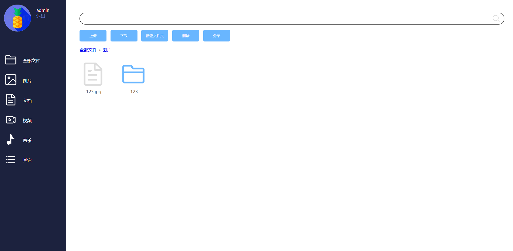 

## 1.3 技术选型

### 1.3.1 前端技术选型

| 技术名称 | 说明                                                         |
| -------- | ------------------------------------------------------------ |
| Html     | Html是一种超文本标记语言，是各大浏览器所能识别的语言，在该项目中主要用于UI界面的绘制 |
| CSS      | CSS是层叠样式表，主要用来修饰和美化Html代码展示的效果        |
| Jquery   | 一个Js封装库，具备超高的人气，强大且灵活，是Java程序员必需掌握的前端技术 |

### 1.3.2 后端技术选型

| 技术名称 | 说明                                                         |
| -------- | ------------------------------------------------------------ |
| Servlet  | 一种Java语言编写的服务器端程序，用来处理Http请求             |
| Jsp      | 一种动态网页技术，运行在服务器端，并动态的将数据和页面结合在一起，最后响应给请求者 |
| Jstl     | Jsp标准标签库，允许开发人员通过它获取Java代码中的数据，从而提高程序可读性 |
| Cookie   | 一种会话跟踪技术，用来方便服务器识别用户是谁                 |
| Session  | 一种会话跟踪技术，主要用来识别用户、存储用户信息             |
| Filter   | Filter是过滤器的意思，通过用来对请求预先做一些处理。比如权限判断、编码设置 |
| JDBC     | Java用来连接数据库的技术                                     |
| Mysql    | 流行的、免费的、轻量级数据库                                 |

# 2 项目开发流程及思维

## 2.1 项目开发流程

一个项目如何从0变成1呢？当你知道这个答案的时候，你就具备了项目开发的流程了。

任何项目开发流程都不是上来就编码，那一定大错特错，且后期进入无限修改环节。那一个项目如何开始呢？

**项目做什么？——>目标——>做一个网盘**

**项目用什么做？——>技术选型——>JavaWeb阶段所学技术**

**项目怎么做？——>过程——???**

通过上面3句话我们知道我们现在要知道的就是实现它的过程，这个过程又可以简单分为几个步骤。

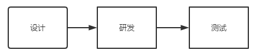 

## 2.2 项目设计

### 2.2.1 功能设计

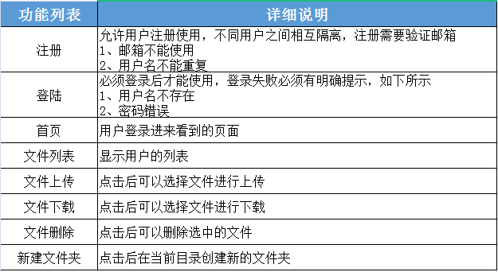 

### 2.2.2 数据库表设计

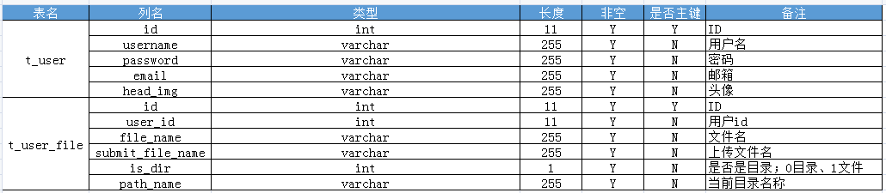 

### 2.2.3 静态页面设计

见01_静态页面下的文件

## 2.3 项目环境搭建

有了功能列表、数据库表、静态页面后，我们就可以开始研发了。

### 2.3.1 数据库搭建

打开sqlyog，创建一个新的数据库，名为mydisk

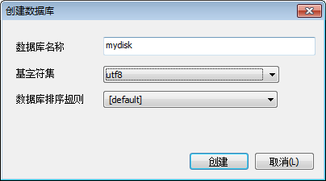 

创建完成后，导入02_数据库文件/mydisk.sql文件，并执行该数据库脚本，此时，数据库搭建完毕。


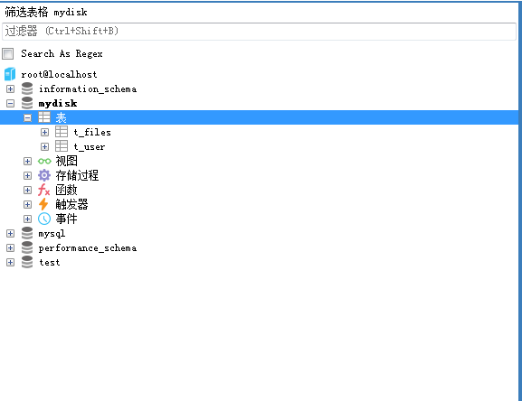 

### 2.3.1 项目搭建

点击Create New Project

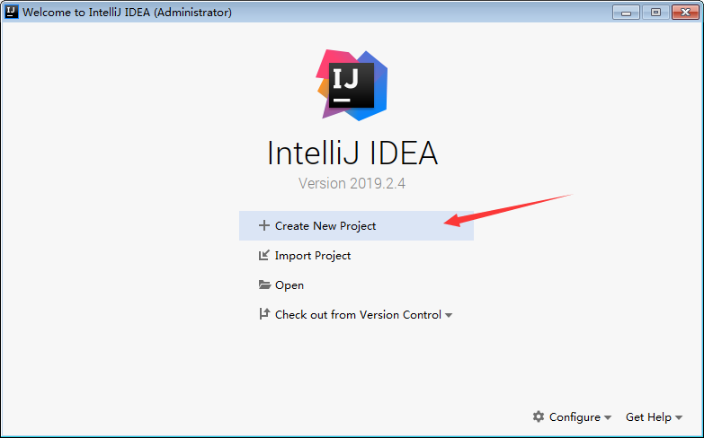 

选择创建Java Enterprise项目，即Java企业级项目，也就是Web项目

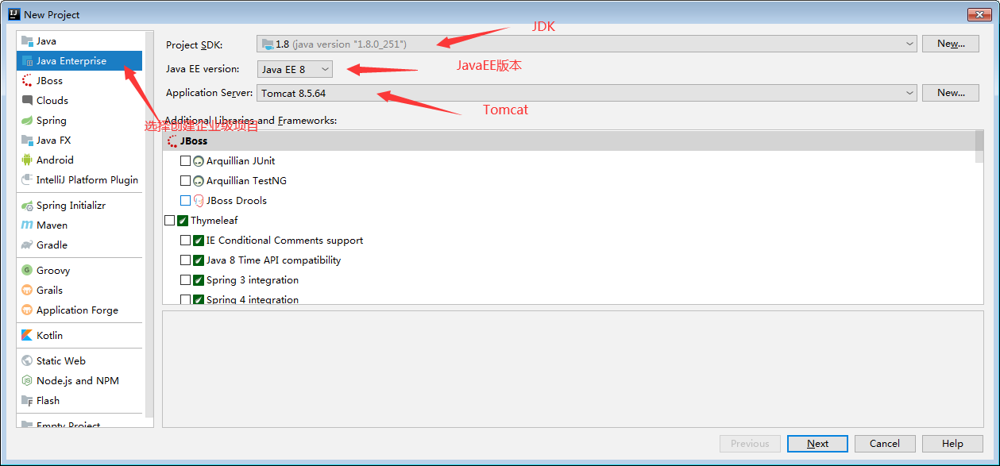 

勾选用JavaEE Web模板生成该项目

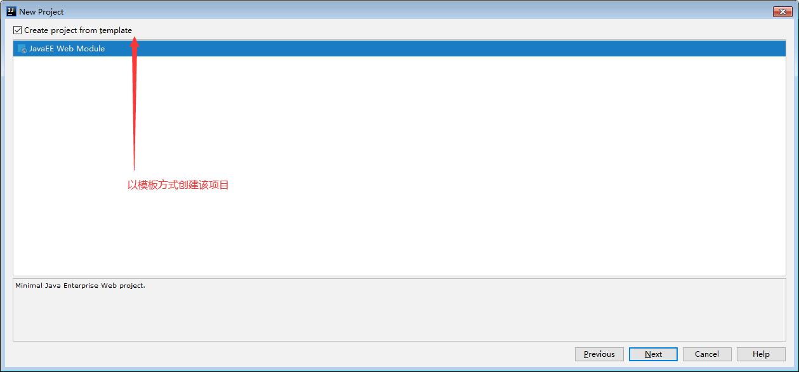 

输出项目名称后，确定即可。

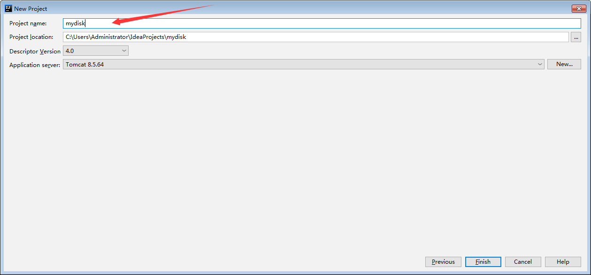 

项目创建完成后

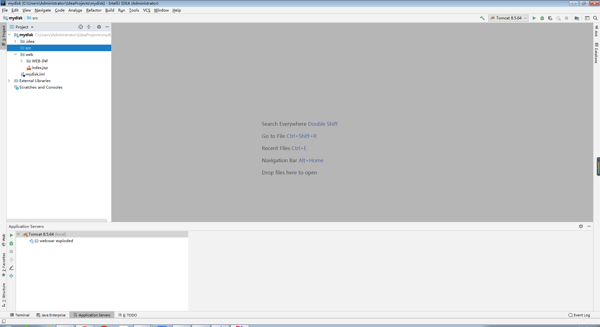 

### 2.3.2 包名规范

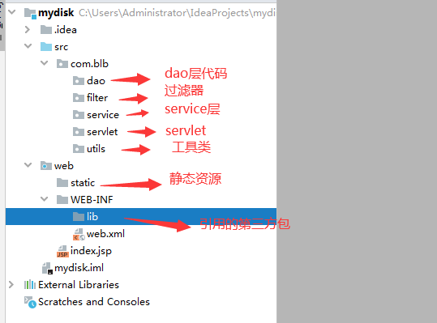 

### 2.3.3 编写工具类

为了方便操作JDBC，于是我们需要封装DBUtils工具类，先看成果。

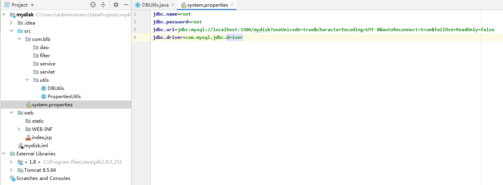 

1、首先编写JDBC配置文件（方便修改jdbc配置，放在代码中则需要重新编译代码才能生效）

**system.properties**

```properties
jdbc.name=root
jdbc.password=root
jdbc.url=jdbc:mysql://localhost:3306/mydisk?useUnicode=true&characterEncoding=UTF-8&autoReconnect=true&failOverReadOnly=false
jdbc.driver=com.mysql.jdbc.Driver
```

2、编写PropertiesUtils工具类用来读取和操作Properties文件

**PropertiesUtils.java**

```java
package com.blb.utils;

import java.io.IOException;
import java.util.Properties;

public class PropertiesUtils {
	
	private static Properties properties =  new Properties();
	
	static {
		try {
			getConfig();
		} catch (IOException e) {
			e.printStackTrace();
		}
	}

	/**
	 * 读取properties文件
	 * @param file
	 * @return
	 * @throws IOException
	 */
	public static Properties readProperties(String file) throws IOException {
		Properties properties = new Properties();
		properties.load(PropertiesUtils.class.getClassLoader().getResourceAsStream(file));
		return properties;
	}
	
	/**
	 * 读取系统默认配置文件
	 * @return
	 * @throws IOException
	 */
	public static Properties getConfig() throws IOException {
		properties.load(PropertiesUtils.class.getClassLoader().getResourceAsStream("system.properties"));
		return properties;
	}
	
	/**
	 * 获取配置的值
	 * @param key
	 * @return
	 */
	public static String getValue(String key) {
		return properties.getProperty(key);
	}
	
	/**
	 * 获取配置的值
	 * @param key
	 * @return
	 */
	public static Object getValue(Object key) {
		return properties.get(key);
	}

	/**
	 * 获取配置文件对象
	 * @return
	 */
	public static Properties getProperties() {
		return properties;
	}
	
}
```

3、编写DBUtils工具类，这里用了HikariCP这个连接池。

**DBUtils.java**

```java
package com.blb.utils;

import com.zaxxer.hikari.HikariConfig;
import com.zaxxer.hikari.HikariDataSource;

import java.sql.Connection;
import java.sql.PreparedStatement;
import java.sql.ResultSet;
import java.sql.SQLException;

/**
 * 连接池工具类
 * @author admin
 *
 */
public class DBUtils {
	
	private static HikariDataSource hikariDataSource;

	static {
		HikariConfig conf = new HikariConfig();
		conf.setUsername(PropertiesUtils.getValue("jdbc.name"));
		conf.setPassword(PropertiesUtils.getValue("jdbc.password"));
		conf.setJdbcUrl(PropertiesUtils.getValue("jdbc.url"));
		conf.setDriverClassName(PropertiesUtils.getValue("jdbc.driver"));
		hikariDataSource = new HikariDataSource(conf);
	}
	
	/**
	 * 获取连接
	 * @return
	 * @throws SQLException
	 */
	public static Connection getConnection() throws SQLException {
		return hikariDataSource.getConnection();
	}
	
	/**
	 * 执行语句
	 * @param connection
	 * @param sql
	 * @param paramObject
	 * @throws SQLException 
	 */
	public static void execute(Connection connection, String sql, Object... paramObject) throws SQLException {
		PreparedStatement prepareStatement = connection.prepareStatement(sql);
		for (int i = 0; i < paramObject.length; i++) {
			prepareStatement.setObject(i+1, paramObject[i]);
		}
		prepareStatement.execute();
	}
	
	/**
	 * 执行查询语句
	 * @param connection
	 * @param sql
	 * @param paramObject
	 * @return 
	 * @throws SQLException
	 */
	public static ResultSet executeQuery(Connection connection, String sql, Object... paramObject) throws SQLException {
		PreparedStatement prepareStatement = connection.prepareStatement(sql);
		for (int i = 0; i < paramObject.length; i++) {
			prepareStatement.setObject(i+1, paramObject[i]);
		}
		return prepareStatement.executeQuery();
	}
	
	/**
	 * 关闭连接池
	 * @param connection
	 * @throws SQLException
	 */
	public static void close(Connection connection) throws SQLException {
		connection.close();
	}
}
```

4、放入相关的Jar包

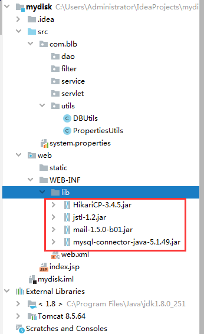 

加入jar包后不会生效，需要右键lib目录，Add as library...

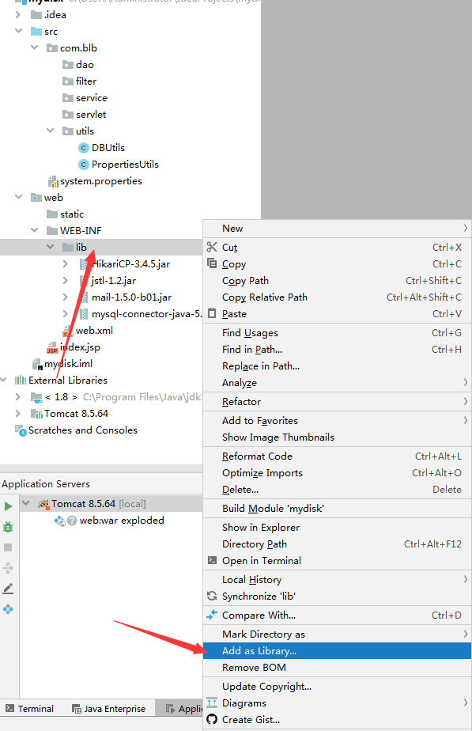 

### 2.3.4 编写BaseServlet

一个Servlet对应一个请求，一个项目很多的请求就得很多Servlet，因此我们需要对Servlet做点封装。使用反射技术实现一个Servlet可以处理多个请求。同时还可以将转发、重定向、返回Json这类Servlet中通用的功能封装起来。

**BaseServlet.java**

```java
package com.blb.servlet;

import javax.servlet.ServletException;
import javax.servlet.http.HttpServlet;
import javax.servlet.http.HttpServletRequest;
import javax.servlet.http.HttpServletResponse;
import java.io.IOException;
import java.io.PrintWriter;
import java.lang.reflect.InvocationTargetException;
import java.lang.reflect.Method;

/**
 * 基础Servlet
 * 包含请求映射方法
 * 转发、重定向、返回Json等功能
 * @author Administrator
 *
 */
public class BaseServlet extends HttpServlet {
	
	private static final String SUFFIX = ".jsp";
	
	/**
	 * 
	 */
	private static final long serialVersionUID = 1L;

	/**
	 * 转发跳转页面
	 * @param request
	 * @param response
	 * @param url
	 * @throws ServletException
	 * @throws IOException
	 */
	public void response(HttpServletRequest request, HttpServletResponse response, String url) {
		try {
			String toUrl = url + SUFFIX;
			request.getRequestDispatcher(toUrl).forward(request, response);
		} catch (ServletException e) {
			e.printStackTrace();
		} catch (IOException e) {
			e.printStackTrace();
		}
	}
	
	/**
	 * 重写向页面
	 * @param response
	 * @param url
	 * @throws IOException
	 */
	public void responseRedirect(HttpServletResponse response, String url) throws IOException {
		response.sendRedirect(url);
	}
	
	/**
	 * 返回json
	 * @param response
	 * @param context
	 * @throws IOException
	 */
	public void responseJson(HttpServletResponse response, String context) throws IOException {
		response.setContentType("application/json;charset=utf-8");
		response.setCharacterEncoding("UTF-8");
		PrintWriter out = response.getWriter() ;
		out.write(context);
		out.close();
	}

	@Override
	protected void service(HttpServletRequest request, HttpServletResponse response) throws ServletException, IOException {
		// 获取请求的URI地址信息
		String url = request.getRequestURI();
		// 截取其中的方法名
		String methodName = url.substring(url.lastIndexOf("/")+1, url.length());
		Method method = null;
		try {
			// 使用反射机制获取在本类中声明了的方法
			method = this.getClass().getDeclaredMethod(methodName, HttpServletRequest.class, HttpServletResponse.class);
		} catch (Exception e) {
			e.printStackTrace();
			response(request, response, "404");
		}
		try {
			// 执行方法
			method.invoke(this, request, response);
		} catch (IllegalAccessException | IllegalArgumentException | InvocationTargetException e) {
			e.printStackTrace();
			response(request, response, "500");
		}
	}

}
```

再编写一个UserServlet进行测试

**UserServlet.java**

```java
package com.blb.servlet;

import javax.servlet.annotation.WebServlet;
import javax.servlet.http.HttpServletRequest;
import javax.servlet.http.HttpServletResponse;

@WebServlet("/user/*")
public class UserServlet extends BaseServlet{

    /**
     * 登录
     * @param request
     * @param response
     */
    public void login(HttpServletRequest request, HttpServletResponse response){
        System.out.println("测试baseServlet");
    }
}
```

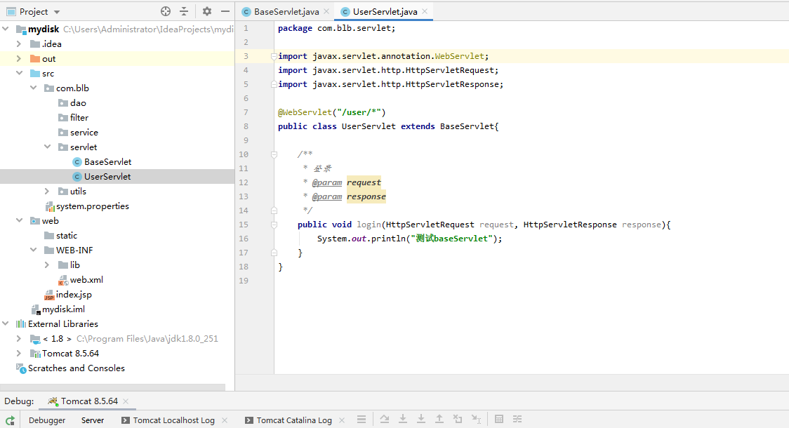 

打开chrome，访问http://localhost:8080/user/login，可以看到控制台输出了测试语句，表示BaseServlet编写成功。

路径访问说明：因为UserServlet配置的是@WebServlet("/user/*")，表示所有/user/xxx开头的请求都会被它拦截，然后请求会进入该servlet的service方法（从BaseServlet中继承来的service方法），而service方法中通过反射找到请求路径后面的login，从而找到login方法进行调用。因此，想访问UserServlet中的其它方法，只需要访问地址为http://localhost:8080/user/xxx即可。

 

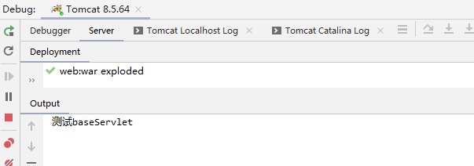 