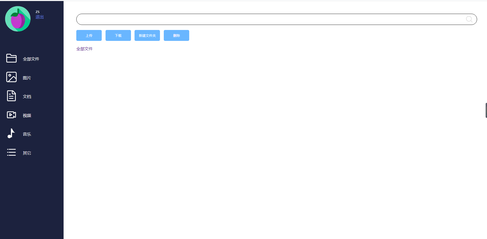
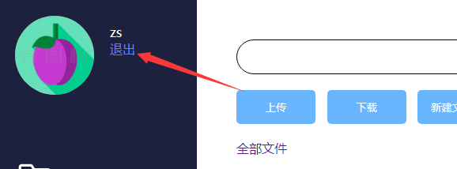
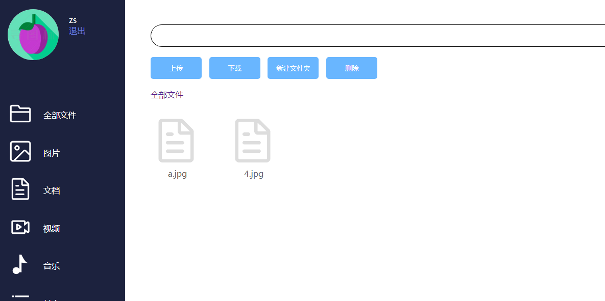

# day03

# 项目目标

- 完成上传与显示

# 1 首页

## 1.1 首页前端编写

```html
<%@ page language="java" contentType="text/html; charset=UTF-8"
         pageEncoding="UTF-8" %>
<%@ taglib prefix="c" uri="http://java.sun.com/jsp/jstl/core" %>
<%@ taglib prefix="fn" uri="http://java.sun.com/jsp/jstl/functions" %>
<!DOCTYPE html>
<html>
<head>
    <meta charset="UTF-8">
    <title>Insert title here</title>
    <style type="text/css">
        html, body {
            height: 100%;
            margin: 0;
            padding: 0;
        }

        .left {
            color: white;
            width: 250px;
            background-color: #1C223E;
            position: absolute;
            top: 0;
            bottom: 0;
        }

        .right {
            position: absolute;
            left: 250px;
            top: 0;
            bottom: 0;
            right: 0;
            padding: 50px;
            color: #656565;
        }

        .list_item {
            display: flex;
            margin-left: 20px;
            margin-bottom: 20px;
        }

        .list_item_menu {
            margin: auto;
            margin-left: 20px;
        }

        .bt_bar, .breadcrumb {
            margin-top: 20px;
        }

        .bt_bar > input {
            min-width: 100px;
            padding: 13px;
            background-color: #69B6FF;
            outline: none;
            border: none;
            border-radius: 5px;
            color: white;
            margin-right: 10px;
            cursor: pointer;
        }

        .file_list_item {
            display: inline-block;
            margin-right: 40px;
            width: 105px;
            margin-top: 30px;
        }

        .file_list_item:hover {
            cursor: pointer;
        }

        .search_bar > input {
            text-indent: 20px;
            background-image: url(./static/img/search.png);
            background-repeat: no-repeat;
            background-size: 30px;
            background-position: 99% 5px;
        }

        .list_item_menu:hover {
            cursor: pointer;
        }

        .click {
            background-color: #8483c5;
        }

		a{
			text-decoration: none;
		}

        .list_item a{
            color: white;
        }

    </style>
</head>
<body>
<div style="display: flex; height: 100%; width: 100%;">
    <div class="left">
        <div style="height: 200px; width: 100%; display: flex;">
            <div style="padding: 20px;">
                
            </div>
            <div style="padding-top: 30px;">
                <div style="color: white;">${user.username }</div>
                <a href="/user/logout">
                    <div style="color: #6880EE;">退出</div>
                </a>
            </div>
        </div>
        <div style="height: calc(100% - 200px); width: 100%;">
            <div class="list_item">
                <div class="list_item_img">
                    
                </div>
                <div class="list_item_menu"><a href="index">全部文件</a></div>
            </div>

            <div class="list_item">
                <div class="list_item_img">
                    
                </div>
                <div class="list_item_menu">图片</div>
            </div>

            <div class="list_item">
                <div class="list_item_img">
                    
                </div>
                <div class="list_item_menu">文档</div>
            </div>

            <div class="list_item">
                <div class="list_item_img">
                    
                </div>
                <div class="list_item_menu">视频</div>
            </div>

            <div class="list_item">
                <div class="list_item_img">
                    
                </div>
                <div class="list_item_menu">音乐</div>
            </div>

            <div class="list_item">
                <div class="list_item_img">
                    
                </div>
                <div class="list_item_menu">其它</div>
            </div>
        </div>
    </div>
    <div class="right">
        <div class="search_bar">
            <input style="height: 40px; width: 100%; border-radius: 25px; outline: none; border: solid 1px;">
        </div>
        <div class="bt_bar">
            <input type="button" value="上传" id="upload">
            <input type="button" value="下载" id="download">
            <input type="button" value="新建文件夹" id="folder">
            <input type="button" value="删除" id="del">
        </div>
		<c:set var="paths" value="${fn:split(pathName, '/')}"></c:set>
		<div class="breadcrumb"><a href="/index">全部文件 </a>
			<c:forEach items="${paths}" var="path" varStatus="i">
				>
				<c:set var="pp" value=""></c:set>
				<c:forEach items="${paths}" var="p" end="${i.index}" varStatus="ii">
					<c:set var="pp" value="${pp.concat('/').concat(p)}"></c:set>
					<c:if test="${ii.last}">
						<a href="/index?pathName=${pp}">${path}</a>
					</c:if>
				</c:forEach>
			</c:forEach>
		</div>
        <div class="file_list">
            <c:forEach items="${list}" var="userFile">
                <div class="file_list_item">
                    <div>
                        <c:if test="${userFile.isDir==1 }">
                            
                        </c:if>
                        <c:if test="${userFile.isDir==0 }">
                            
                        </c:if>
                    </div>
                    <div style="text-align: center;">${userFile.submitFileName }</div>
                </div>
            </c:forEach>
        </div>
    </div>
</div>
<form style="display: none;">
    <input name="pathName" value="${pathName}">
    <input type="file" name="files" multiple="multiple">
</form>
<script type="text/javascript" src="./static/js/jquery.min.js"></script>
<script type="text/javascript">
    $(function () {
        //上传按钮
        $('#upload').click(function () {
            $('form>input[type="file"]').click();
        })

        //真正上传方法
        $('form>input[type="file"]').change(function () {
            $.ajax({
                url: '/upload',
                type: 'post',
                data: new FormData($('form')[0]),
                contentType: false,
                processData: false,
                dataType: 'json',
                success: function (e) {
                    if (e.rs) {
                        window.location.reload()
                    } else {
                        alert(e.msg);
                    }
                }
            })
        })

        //下载
        $('#download').click(function () {
            var id = $('.file.click').attr("data");
            if (id != undefined) {
                window.location.href = "/download?id=" + id;
            }
        })

        //新建目录
        $('#folder').click(function () {
            var pathName = $('input[name="pathName"]').val();

            var text = prompt("请输入目录名称");
            if (text) {
                $.post('/createDir', {
                    pathName: pathName,
                    name: text
                }, function (e) {
                    if (e.rs) {
                        window.location.reload()
                    } else {
                        alert(e.msg);
                    }
                }, 'json')
            }
        })

        //文件点击选中
        $('.file').click(function () {
            $('.file').not(this).removeClass("click");
            $(this).toggleClass("click")
        })

        //进入目录
        $('.folder').dblclick(function () {
            var path = $(this).attr("data");
            window.location.href = "index?pathName=" + path;
        })

        //删除
        $('#del').click(function () {
            var id = $('.file.click').attr("data");
            if (id != undefined) {
                $.post('/del', {
                    id: id
                }, function (e) {
                    console.log(e);
                    if (e.rs) {
                        window.location.reload()
                    } else {
                        alert(e.msg);
                    }
                }, "json")
            }
        })

    })
</script>
</body>
</html>
```

## 1.2 首页后台

```java
package com.blb.servlet;

import com.blb.entity.UserFile;
import com.blb.service.IUserFileService;
import com.blb.service.impl.UserFileServiceImpl;
import com.blb.utils.SessionUtils;

import javax.servlet.ServletException;
import javax.servlet.annotation.WebServlet;
import javax.servlet.http.HttpServletRequest;
import javax.servlet.http.HttpServletResponse;
import java.io.IOException;
import java.sql.SQLException;
import java.util.List;

@WebServlet("/index")
public class IndexServlet extends BaseServlet {

    private IUserFileService userFileService = new UserFileServiceImpl();

    @Override
    protected void service(HttpServletRequest req, HttpServletResponse resp) throws ServletException, IOException {
        String pathName = req.getParameter("pathName");
        pathName = pathName==null?"/":pathName;
        req.getSession().setAttribute("pathName", pathName);
        try {
            List<UserFile> list = userFileService.getFiles(SessionUtils.getUserId(req), pathName);
            req.setAttribute("list", list);
        } catch (SQLException e) {
            e.printStackTrace();
        }
        req.getRequestDispatcher("index.jsp").forward(req, resp);
    }

}

```

## 1.3 测试首页功能

 

## 1.4 退出

点击退出按钮，退回到登录页面并清除登录状态

 

 

# 2 文件上传

编写文件上传接口，注意上传文件如果出现重名时，不能覆盖，因此采用的是每次上传都改个名称，存入数据库时把上传时文件名和修改后的文件名都存放数据库，显示时，显示上传时文件名，下载时根据修改后文件名查找文件。

**@MultipartConfig**不要漏掉，否则无法成功上传文件。


**FileServlet.java**

```java
package com.blb.servlet;

import com.blb.entity.UserFile;
import com.blb.service.IUserFileService;
import com.blb.service.impl.UserFileServiceImpl;
import com.blb.utils.IDUtils;
import com.blb.utils.IOUtils;
import com.blb.utils.Response;
import com.blb.utils.SessionUtils;

import javax.servlet.ServletException;
import javax.servlet.annotation.MultipartConfig;
import javax.servlet.annotation.WebServlet;
import javax.servlet.http.HttpServletRequest;
import javax.servlet.http.HttpServletResponse;
import javax.servlet.http.Part;
import java.io.File;
import java.io.IOException;
import java.io.InputStream;
import java.sql.SQLException;
import java.util.ArrayList;
import java.util.Collection;
import java.util.List;

@MultipartConfig
@WebServlet("/file/*")
public class FileServlet extends BaseServlet {

    private IUserFileService userFileService = new UserFileServiceImpl();

    /**
     * 文件上传
     * @param req
     * @param resp
     * @throws IOException
     */
    public void upload(HttpServletRequest req, HttpServletResponse resp) throws IOException, ServletException {
        String pathName = req.getParameter("pathName");
        try {
            List<UserFile> list = new ArrayList<>();

            Collection<Part> parts = req.getParts();
            for (Part part : parts) {
                if (part.getName().equals("files")) {
                    String fileName = part.getSubmittedFileName();

                    //生成新的文件名
                    String suffix = fileName.substring(fileName.lastIndexOf("."), fileName.length());
                    String newFileName = IDUtils.getID() + suffix;

                    //保存文件
                    InputStream inputStream = part.getInputStream();
                    IOUtils.inputStreamToFile(inputStream, new File(SessionUtils.getUploadPath(req) + pathName + "/" + newFileName));

                    UserFile userFile = new UserFile();
                    userFile.setFileName(newFileName);
                    userFile.setSubmitFileName(fileName);
                    userFile.setUserId(SessionUtils.getUserId(req));
                    userFile.setIsDir(1);
                    userFile.setPathName(pathName);
                    list.add(userFile);
                }
            }
            userFileService.saveList(list);
            resp.getWriter().write(Response.success());
        } catch (SQLException | IOException e) {
            e.printStackTrace();
            resp.getWriter().write(Response.error("文件上传失败"));
            return;
        }
    }


}

```

选择一张图片，确定

 

可以看到4.jpg成功的上传上来了。

 

# 3 列表显示

列表显示就是上传后重新刷新页面，在首页中已经把当前文件夹下所有的目录和文件显示出来了。见1.2代码。

