# 我的网盘

### 1、简介

我的网盘是一款简单易用的免费网盘，提供永久免费云存储空间,支持文件上传、下载、目录创建等功能，是您工作、学习、生活 的必备工具!


 

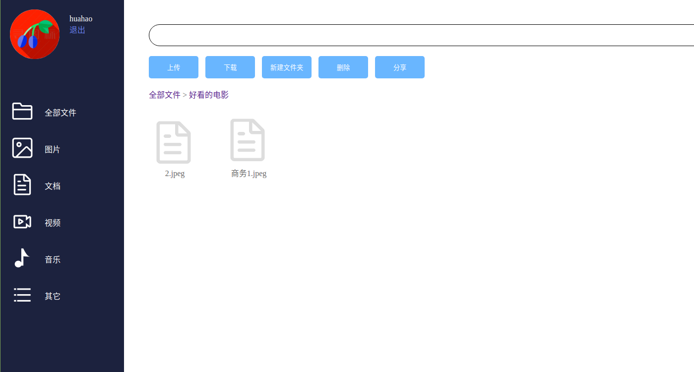  

### 2、网盘所用技术

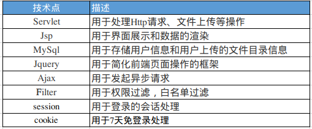 

### 3、功能列表

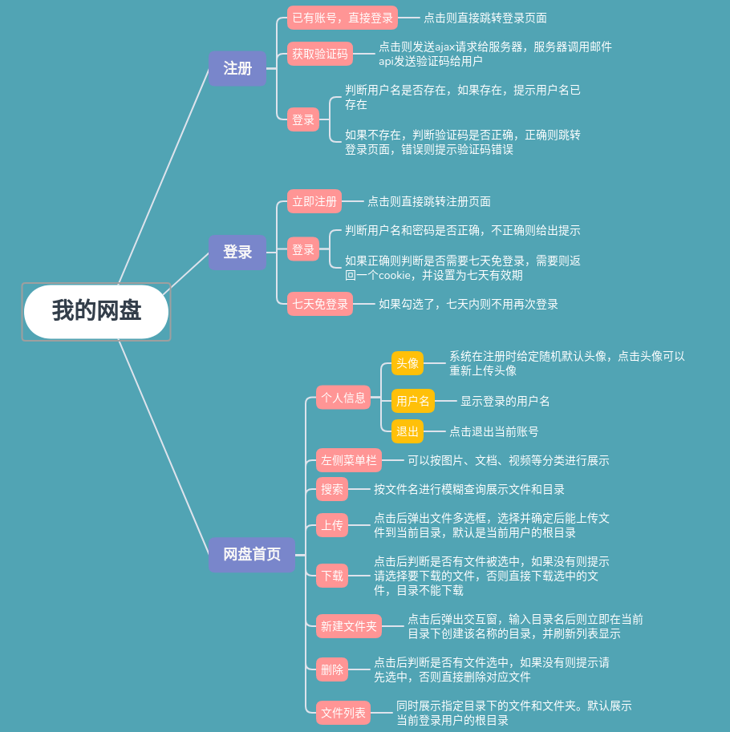 

### 4、数据库设计

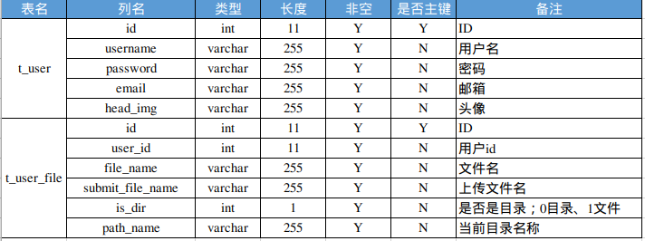 

### 5、项目实战

#### 5.1、项目实战之环境搭建

创建一个Java Enterprise项目，选择Project SDK版本，建议使用JDK8，Java EE version默认即可，Application Server选择一个Tomcat即可，如果没有配置Tomcat，点击后面的New按钮即可重新选择Tomcat。

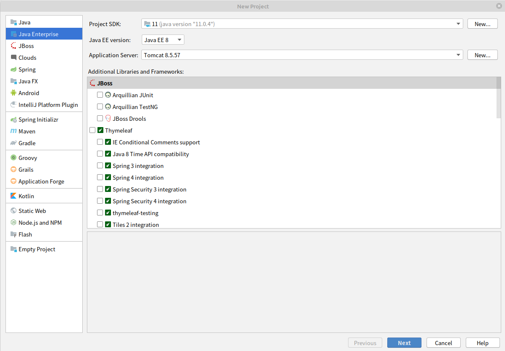

勾选Create project from template

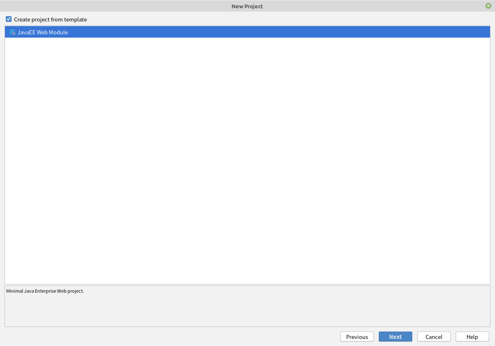 

输入Project name，例如：mydisk，点击finish等待项目创建完成即可。 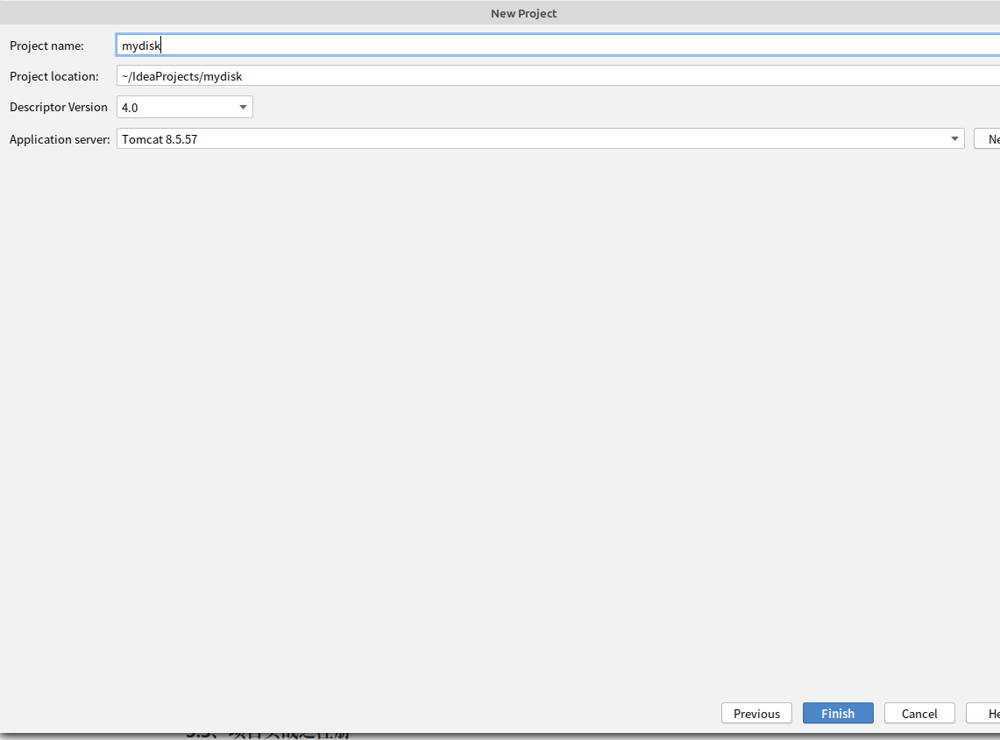 

项目创建完毕后，在src目录下建好对应的包路径。

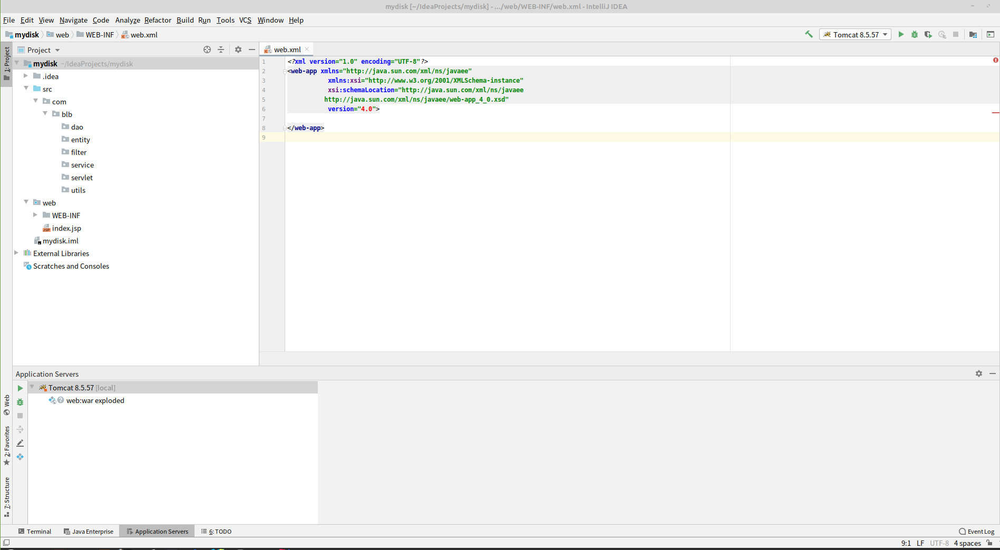 

在web-inf目录下创建lib目录。

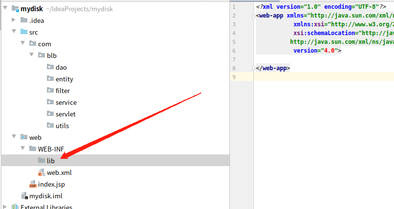 

将03_依赖包下的所有jar包放到lib目录下。

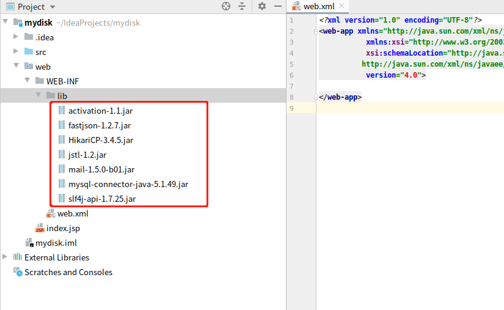 

编写系统配置文件：system.properties。主要配置项有：jdbc、邮箱、文件上传的路径

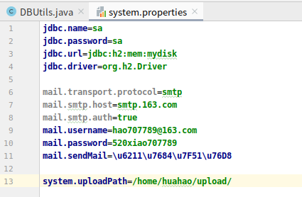 

将mydisk/src/com/blb/utils下的所有工具类放到项目中的utils包下

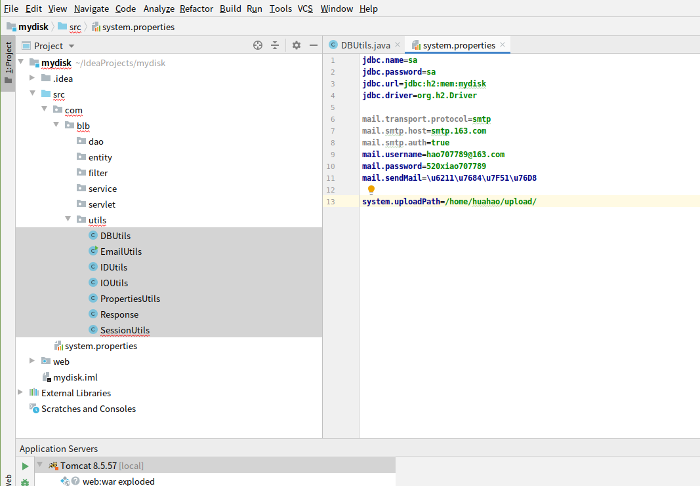 

将mydisk/src/com/blb/entity下所有实体类放到项目中的entity包下

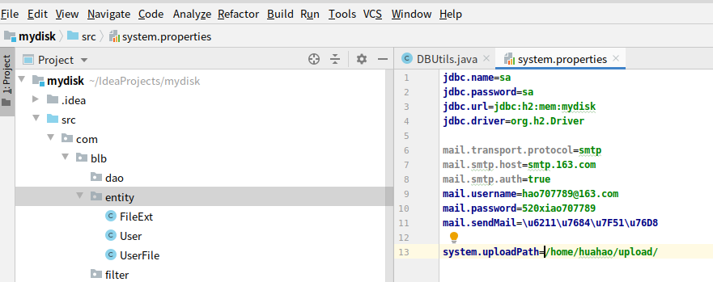 

至此，环境准备完毕。

#### 5.2、项目实战之搭建数据库

打开数据库管理工具，这里我们采用mysql数据库，创建一个新的数据库：mydisk，编码为utf8。

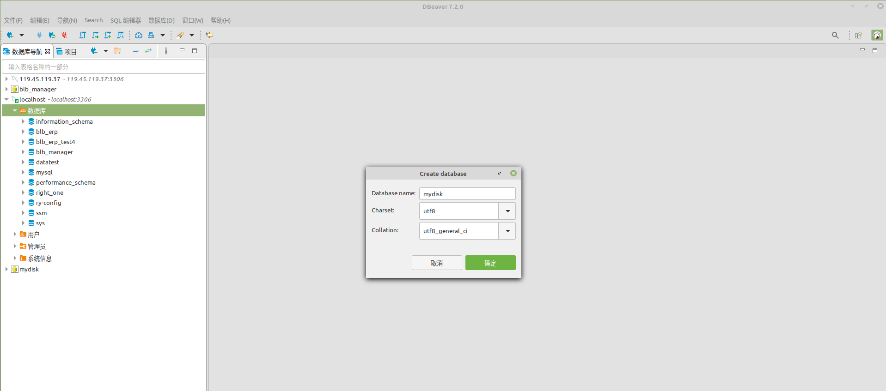 

把02_数据库文件/mydisk.sql导入到mydisk数据库中。

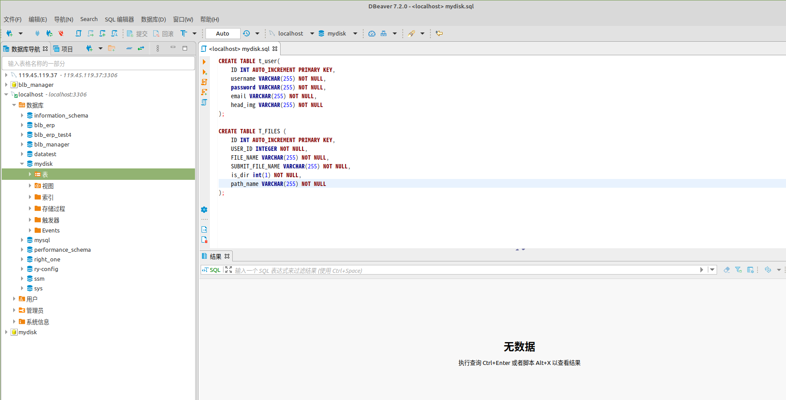 

数据库导入成功后。

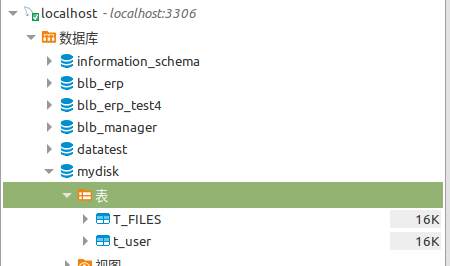 

#### 5.3、项目实战之注册

1. 编写register.jsp

将01_静态页面下的register.html复制到项目中的web目录下，将修改后缀为.jsp，并加入jsp的头部内容。

```jsp
<%@ page language="java" contentType="text/html; charset=UTF-8"
    pageEncoding="UTF-8"%>
```

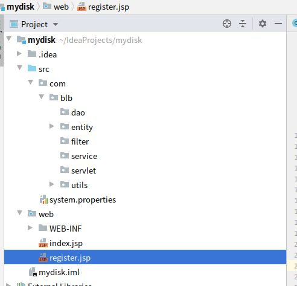 

2. 放入静态资源文件

将mydisk/WebContent/static目录复制到项目中web目录下，然后启动项目，访问：http://localhost:8080/register.jsp可以看到如下图

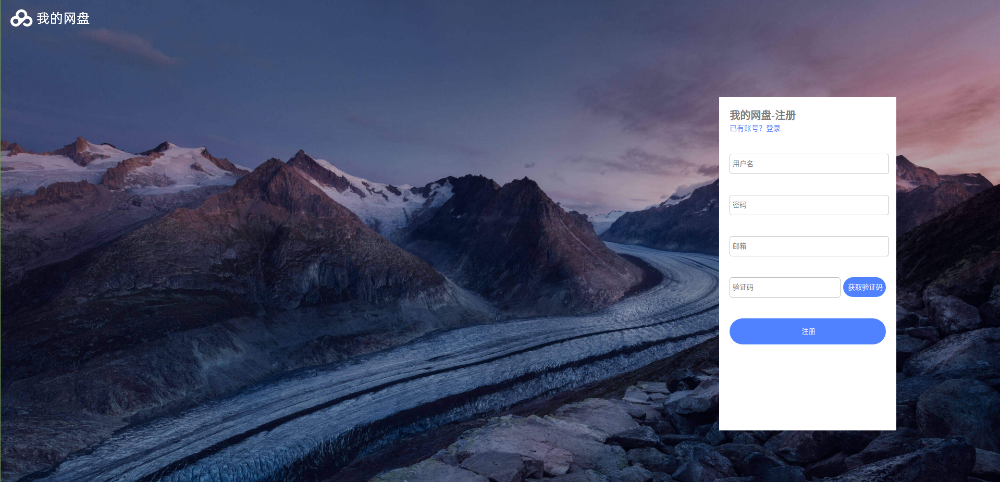 

3. 编写获取验证码的Servlet：CheckCodeServlet

```java
package com.blb.servlet;

import java.io.IOException;

import javax.servlet.ServletException;
import javax.servlet.annotation.WebServlet;
import javax.servlet.http.HttpServlet;
import javax.servlet.http.HttpServletRequest;
import javax.servlet.http.HttpServletResponse;

import com.blb.entity.User;
import com.blb.service.IUserService;
import com.blb.service.impl.UserServiceImpl;
import com.blb.utils.EmailUtils;
import com.blb.utils.Response;

@WebServlet("/getCheckCode")
public class CheckCodeServlet extends HttpServlet {

	private static final long serialVersionUID = 1L;
	private IUserService userService = new UserServiceImpl();

	@Override
	protected void service(HttpServletRequest req, HttpServletResponse resp) throws ServletException, IOException {
		try {
			String email = req.getParameter("email");
			if (email.isEmpty()) {
				resp.getWriter().write(Response.error("邮箱不能为空"));
				return;
			}
			User user = userService.getUserByEmail(email);
			if (user!=null) {
				resp.getWriter().write(Response.error("邮箱已存在，不允许重复注册"));
				return;
			}
			
			int code = (int) ((Math.random()*9+1)*100000);
			req.getSession().setAttribute("checkCode", code+"");
			EmailUtils.send("【我的网盘】验证码", code+"", email);
			resp.getWriter().write(Response.success());
		} catch (Exception e) {
			e.printStackTrace();
		}
	}
}
```

4、编写UserDao

```java
package com.blb.dao;

import java.sql.SQLException;

import com.blb.entity.User;

public interface UserDao {

	/**
	 * 根据用户名查询用户
	 * @param username
	 * @return
	 * @throws SQLException 
	 */
	User getUserByName(String username) throws SQLException;
	
	/**
	 * 保存
	 * @param user
	 * @throws SQLException 
	 */
	void save(User user) throws SQLException;
	
	/**
	 * 根据邮箱查询用户
	 * @param email
	 * @return
	 * @throws SQLException
	 */
	User getUserByEmail(String email) throws SQLException;
}

```

5、编写UserDaoImpl

```java
package com.blb.dao.impl;

import java.sql.Connection;
import java.sql.ResultSet;
import java.sql.SQLException;

import com.blb.dao.UserDao;
import com.blb.entity.User;
import com.blb.utils.DBUtils;

public class UserDaoImpl implements UserDao {

	@Override
	public User getUserByName(String username) throws SQLException {
		Connection connection = DBUtils.getConnection();
		ResultSet resultSet = DBUtils.executeQuery(connection, "select * from t_user where username = ?", username);
		User user = User.resultToBean(resultSet);
		DBUtils.close(connection);
		return user;
	}

	@Override
	public void save(User user) throws SQLException {
		Connection connection = DBUtils.getConnection();
		DBUtils.execute(connection, "insert into t_user(username, password, email, head_img) values(?,?,?,?)", user.getUsername(), user.getPassword(), user.getEmail(), user.getHeadImg());
		DBUtils.close(connection);
	}

	@Override
	public User getUserByEmail(String email) throws SQLException {
		Connection connection = DBUtils.getConnection();
		ResultSet resultSet = DBUtils.executeQuery(connection, "select * from t_user where email = ?", email);
		User user = User.resultToBean(resultSet);
		DBUtils.close(connection);
		return user;
	}

}
```

6、编写IUserService

```java
package com.blb.service;

import java.sql.SQLException;

import com.blb.entity.User;

public interface IUserService {

	/**
	 * 根据用户名查询用户
	 * @param username
	 * @return
	 * @throws SQLException 
	 */
	User getUserByName(String username) throws SQLException;
	
	/**
	 * 添加用户
	 * @param user
	 * @throws SQLException 
	 */
	void add(User user) throws SQLException;
	
	/**
	 * 根据邮箱查询用户
	 * @param email
	 * @return
	 * @throws SQLException
	 */
	User getUserByEmail(String email) throws SQLException;
}

```

7、编写UserServiceImpl

```java
package com.blb.service.impl;

import java.sql.SQLException;

import com.blb.dao.UserDao;
import com.blb.dao.impl.UserDaoImpl;
import com.blb.entity.User;
import com.blb.service.IUserService;

public class UserServiceImpl implements IUserService {
	
	private UserDao userdao = new UserDaoImpl();

	@Override
	public User getUserByName(String username) throws SQLException {
		return userdao.getUserByName(username);
	}

	@Override
	public void add(User user) throws SQLException {
		userdao.save(user);
	}

	@Override
	public User getUserByEmail(String email) throws SQLException {
		return userdao.getUserByEmail(email);
	}

}
```

重新启动项目 ，访问http://localhost:8080/register.jsp，显示如下

 

#### 5.4、项目实战之登录

1. 编写login.jsp

将mydisk/WebContent/login.jsp和index.jsp复制到项目中web目录下。

2. 编写LoginServlet

```java
package com.blb.servlet;

import java.io.IOException;
import java.sql.SQLException;

import javax.servlet.ServletException;
import javax.servlet.annotation.WebServlet;
import javax.servlet.http.HttpServlet;
import javax.servlet.http.HttpServletRequest;
import javax.servlet.http.HttpServletResponse;

import com.blb.entity.User;
import com.blb.service.IUserService;
import com.blb.service.impl.UserServiceImpl;
import com.blb.utils.Response;

@WebServlet("/login")
public class LoginServlet extends HttpServlet {

	private static final long serialVersionUID = 1L;
	private IUserService userService = new UserServiceImpl();

	@Override
	protected void service(HttpServletRequest req, HttpServletResponse resp) throws ServletException, IOException {
		String username = req.getParameter("username");
		String password = req.getParameter("password");
		String remember = req.getParameter("remember");
	
		try {
			User user = userService.getUserByName(username);
			if (user==null) {
				resp.getWriter().write(Response.error("用户名不存在"));
				return;
			}
			if (!user.getPassword().equals(password)) {
				resp.getWriter().write(Response.error("密码错误"));
				return;
			}
			if (remember!=null) {
				
			}
			req.getSession().setAttribute("user", user);
			resp.getWriter().write(Response.success());
		} catch (SQLException e) {
			e.printStackTrace();
			resp.getWriter().write(Response.error("操作失败，请稍后再试"));
		}
	}
	
}
```

3. 测试登录功能

 

 

#### 5.5、项目实战之文件上传

1、打开index.jsp，在上传按钮上添加id="update"

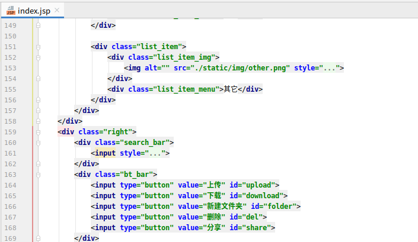 

2、同时在body任意位置添加一个form

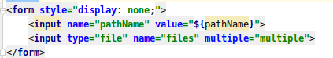 

3、在index.jsp中添加对#upload的点击事件；同时监听上面form中的type=file的输入框的变化，当值发生改变时触发change事件，并在change中发起ajax用于文件上传。

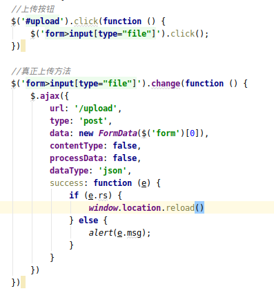 

4、编写UploadServlet.java

```java
package com.blb.servlet;

import com.blb.entity.UserFile;
import com.blb.service.IUserFileService;
import com.blb.service.impl.UserFileServiceImpl;
import com.blb.utils.IDUtils;
import com.blb.utils.IOUtils;
import com.blb.utils.Response;
import com.blb.utils.SessionUtils;

import javax.servlet.ServletException;
import javax.servlet.annotation.MultipartConfig;
import javax.servlet.annotation.WebServlet;
import javax.servlet.http.HttpServlet;
import javax.servlet.http.HttpServletRequest;
import javax.servlet.http.HttpServletResponse;
import javax.servlet.http.Part;
import java.io.File;
import java.io.IOException;
import java.io.InputStream;
import java.sql.SQLException;
import java.util.ArrayList;
import java.util.Collection;
import java.util.List;

@MultipartConfig
@WebServlet("/upload")
public class UploadServlet extends HttpServlet {

	private static final long serialVersionUID = 1L;
	private IUserFileService userFileService = new UserFileServiceImpl();

	@Override
	protected void service(HttpServletRequest req, HttpServletResponse resp) throws ServletException, IOException {
		String pathName = req.getParameter("pathName");
		try {
			List<UserFile> list = new ArrayList<>();
			
			Collection<Part> parts = req.getParts();
			for (Part part : parts) {
				if (part.getName().equals("files")) {
					String fileName = part.getSubmittedFileName();
					
					//生成新的文件名
					String suffix = fileName.substring(fileName.lastIndexOf("."), fileName.length());
					String newFileName = IDUtils.getID() + suffix;
					
					//保存文件
					InputStream inputStream = part.getInputStream();
					IOUtils.inputStreamToFile(inputStream, new File(SessionUtils.getUploadPath(req) + pathName + "/" + newFileName));
					
					UserFile userFile = new UserFile();
					userFile.setFileName(newFileName);
					userFile.setSubmitFileName(fileName);
					userFile.setUserId(SessionUtils.getUserId(req));
					userFile.setIsDir(1);
					userFile.setPathName(pathName);
					list.add(userFile);
				}
			}
			userFileService.saveList(list);
			resp.getWriter().write(Response.success());
		} catch (SQLException | IOException e) {
			e.printStackTrace();
			resp.getWriter().write(Response.error("文件上传失败"));
			return;
		}
	}
}
```

5、测试文件上传

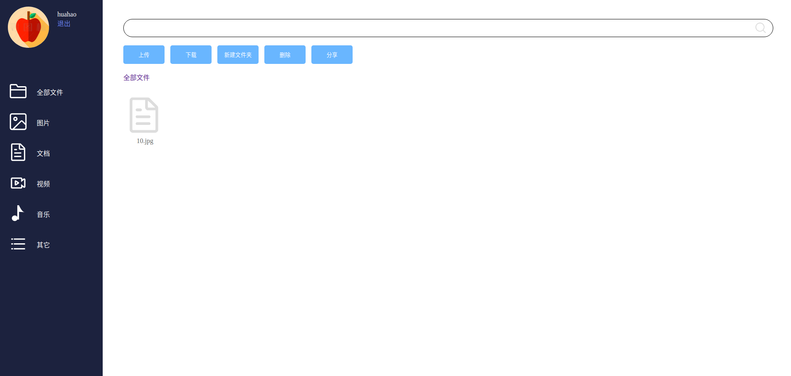 

#### 5.6、项目实战之文件展示

1、编写UserFileDao

```java
package com.blb.dao;

import com.blb.entity.UserFile;

import java.sql.SQLException;
import java.util.List;

public interface UserFileDao {

	/**
	 * 保存上传的文件
	 * @param userFile
	 * @throws SQLException 
	 */
	void save(UserFile userFile) throws SQLException;
	
	/**
	 * 获取指定目录下的文件
	 * @param pathName
	 * @return
	 * @throws SQLException 
	 */
	List<UserFile> getFiles(int userId, String pathName) throws SQLException;

	/**
	 * 根据ID获取
	 * @param id
	 * @return
	 */
	UserFile getById(int id) throws SQLException;

	/**
	 * 根据id删除
	 * @param id
	 */
	void del(int id) throws SQLException;
}
```

2、编写UserFileDaoImpl

```java
package com.blb.dao.impl;

import com.blb.dao.UserFileDao;
import com.blb.entity.UserFile;
import com.blb.utils.DBUtils;

import java.sql.Connection;
import java.sql.ResultSet;
import java.sql.SQLException;
import java.util.List;

public class UserFileDaoImpl implements UserFileDao {

	@Override
	public void save(UserFile userFile) throws SQLException {
		Connection connection = DBUtils.getConnection();
		DBUtils.execute(connection, "insert into t_files(file_name, submit_file_name, user_id, is_dir, path_name) values(?,?,?,?,?)", 
				userFile.getFileName(), userFile.getSubmitFileName(), userFile.getUserId(), userFile.getIsDir(), userFile.getPathName());
		DBUtils.close(connection);
	}

	@Override
	public List<UserFile> getFiles(int userId, String pathName) throws SQLException {
		Connection connection = DBUtils.getConnection();
		ResultSet resultSet = DBUtils.executeQuery(connection, "select * from t_files where path_name = ? and user_id = ? order by is_dir", pathName, userId);
		List<UserFile> list = UserFile.resultToListBean(resultSet);
		DBUtils.close(connection);
		return list;
	}

	@Override
	public UserFile getById(int id) throws SQLException {
		Connection connection = DBUtils.getConnection();
		ResultSet resultSet = DBUtils.executeQuery(connection, "select * from t_files where id = ?", id);
		UserFile userFile = UserFile.resultToBean(resultSet);
		DBUtils.close(connection);
		return userFile;
	}

	@Override
	public void del(int id) throws SQLException {
		Connection connection = DBUtils.getConnection();
		DBUtils.execute(connection, "delete from t_files where id = ?", id);
		DBUtils.close(connection);
	}

}
```

3、编写IUserFileService

```java
package com.blb.service;

import com.blb.entity.UserFile;

import java.sql.SQLException;
import java.util.List;

public interface IUserFileService {

	/**
	 * 保存上传的文件
	 * @param userFile
	 * @throws SQLException 
	 */
	void save(UserFile userFile) throws SQLException;
	
	/**
	 * 批量保存上传的文件
	 * @param userFiles
	 * @throws SQLException
	 */
	void saveList(List<UserFile> userFiles) throws SQLException;
	
	/**
	 * 获取指定目录下的文件
	 * @param pathName
	 * @return
	 * @throws SQLException 
	 */
	List<UserFile> getFiles(int userId, String pathName) throws SQLException;

	/**
	 * 根据ID获取
	 * @param id
	 * @return
	 */
	UserFile getById(int id) throws SQLException;

	/**
	 * 根据id删除
	 * @param id
	 */
	void del(int id) throws SQLException;
}
```

4、编写UserFileServiceImpl

```java
package com.blb.service.impl;

import com.blb.dao.UserFileDao;
import com.blb.dao.impl.UserFileDaoImpl;
import com.blb.entity.UserFile;
import com.blb.service.IUserFileService;
import com.blb.utils.DBUtils;

import java.sql.Connection;
import java.sql.SQLException;
import java.util.List;

public class UserFileServiceImpl implements IUserFileService {
	
	private UserFileDao userFileDao = new UserFileDaoImpl();

	@Override
	public void save(UserFile userFile) throws SQLException {
		userFileDao.save(userFile);
	}

	@Override
	public void saveList(List<UserFile> userFiles) throws SQLException {
		Connection connection = null;
		try {
			connection = DBUtils.getConnection();
			connection.setAutoCommit(false);
			for (UserFile userFile : userFiles) {
				DBUtils.execute(connection, "insert into t_files(file_name, submit_file_name, user_id, is_dir, path_name) values(?,?,?,?,?)",
						userFile.getFileName(), userFile.getSubmitFileName(), userFile.getUserId(), userFile.getIsDir(), userFile.getPathName());
			}
			connection.commit();
		} catch (Exception e) {
			e.printStackTrace();
			try {
				connection.rollback();
			} catch (SQLException e1) {
				e1.printStackTrace();
			}
		}finally {
			DBUtils.close(connection);
		}
	}

	@Override
	public List<UserFile> getFiles(int userId,String pathName) throws SQLException {
		return userFileDao.getFiles(userId, pathName);
	}

	@Override
	public UserFile getById(int id) throws SQLException {
		return userFileDao.getById(id);
	}


	@Override
	public void del(int id) throws SQLException {
		userFileDao.del(id);
	}

}
```

5、编写IndexServlet

```java
package com.blb.servlet;

import com.blb.entity.UserFile;
import com.blb.service.IUserFileService;
import com.blb.service.impl.UserFileServiceImpl;
import com.blb.utils.SessionUtils;

import javax.servlet.ServletException;
import javax.servlet.annotation.WebServlet;
import javax.servlet.http.HttpServlet;
import javax.servlet.http.HttpServletRequest;
import javax.servlet.http.HttpServletResponse;
import java.io.IOException;
import java.sql.SQLException;
import java.util.List;

@WebServlet("/index/*")
public class IndexServlet extends HttpServlet {

	private static final long serialVersionUID = 1L;
	private IUserFileService userFileService = new UserFileServiceImpl();

	@Override
	protected void service(HttpServletRequest req, HttpServletResponse resp) throws ServletException, IOException {
		String pathName = req.getParameter("pathName");
		pathName = pathName==null?"/":pathName;
		req.getSession().setAttribute("pathName", pathName);
		try {
			List<UserFile> list = userFileService.getFiles(SessionUtils.getUserId(req), pathName);
			req.setAttribute("list", list);
		} catch (SQLException e) {
			e.printStackTrace();
		}
		req.getRequestDispatcher("index.jsp").forward(req, resp);
	}	
}
```

6、index.jsp通过jstl循环遍历

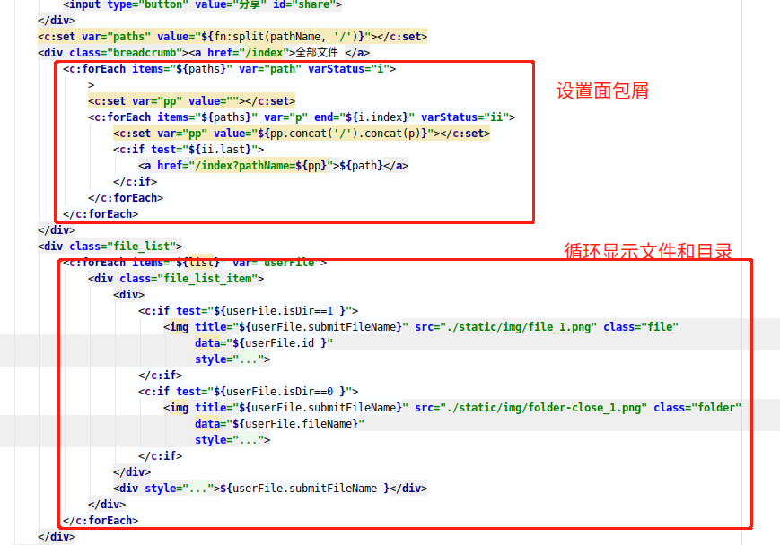 

7、测试文件展示功能

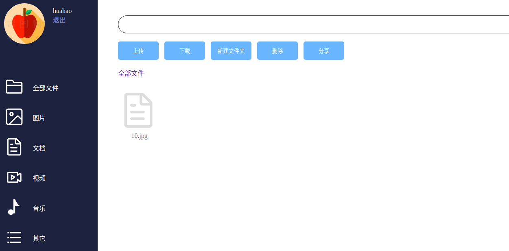 

#### 5.7、项目实战之文件下载

1、文件下载思路是点击文件后，再点击下载即下载选中的文件，所以首先写文件选中效果

 

2、给下载按钮添加id=download

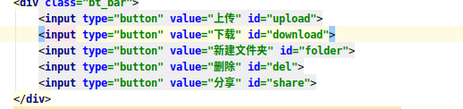 

3、给下载按钮添加点击事件

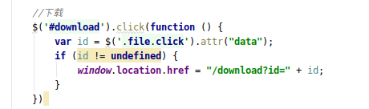 

4、编写下载接口：DownloadServlet

```java
package com.blb.servlet;

import com.blb.entity.UserFile;
import com.blb.service.IUserFileService;
import com.blb.service.impl.UserFileServiceImpl;
import com.blb.utils.SessionUtils;

import javax.servlet.ServletException;
import javax.servlet.ServletOutputStream;
import javax.servlet.annotation.WebServlet;
import javax.servlet.http.HttpServlet;
import javax.servlet.http.HttpServletRequest;
import javax.servlet.http.HttpServletResponse;
import java.io.FileInputStream;
import java.io.IOException;
import java.net.URLEncoder;
import java.sql.SQLException;

@WebServlet("/download")
public class DownloadServlet extends HttpServlet {

   private static final long serialVersionUID = 1L;
   private IUserFileService userFileService = new UserFileServiceImpl();

   @Override
   protected void service(HttpServletRequest req, HttpServletResponse resp) throws ServletException, IOException {
      try {
         String id = req.getParameter("id");
         UserFile userFile = userFileService.getById(Integer.parseInt(id));
         FileInputStream fileInputStream = new FileInputStream(SessionUtils.getUploadPath(req) + userFile.getPathName() + userFile.getFileName());
         ServletOutputStream outputStream = resp.getOutputStream();

         resp.setContentLength(fileInputStream.available());
         resp.setContentType("application/octet-stream");
         resp.setHeader("content-disposition","attachment;filename="+ URLEncoder.encode(userFile.getSubmitFileName(),"UTF-8"));

         byte[] data = new byte[1024];
         int len;
         while ((len=fileInputStream.read(data))!=-1){
            outputStream.write(data, 0, len);
         }
      } catch (SQLException e) {
         e.printStackTrace();
      }
   }
}
```

5、测试下载功能，可以看到左正解已经成功下载该图片

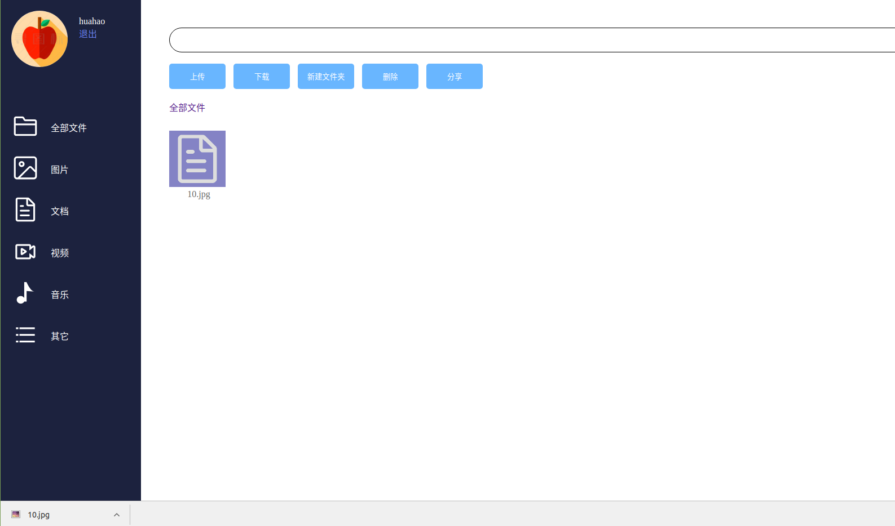 

#### 5.8、项目实战之新建目录

1、给新建目录按钮添加事件，并获取输入的目录名，然后通过ajax发送请求到后台，保存新增的目录及数据。

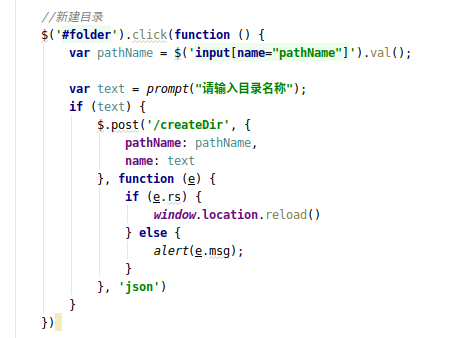 

2、编写处理新建目录的servlet：CreateDirServlet

```java
package com.blb.servlet;

import com.blb.entity.UserFile;
import com.blb.service.IUserFileService;
import com.blb.service.impl.UserFileServiceImpl;
import com.blb.utils.Response;
import com.blb.utils.SessionUtils;

import javax.servlet.ServletException;
import javax.servlet.annotation.WebServlet;
import javax.servlet.http.HttpServlet;
import javax.servlet.http.HttpServletRequest;
import javax.servlet.http.HttpServletResponse;
import java.io.File;
import java.io.IOException;
import java.sql.SQLException;

@WebServlet("/createDir")
public class CreateDirServlet extends HttpServlet {

    private IUserFileService userFileService = new UserFileServiceImpl();

    @Override
    protected void service(HttpServletRequest req, HttpServletResponse resp) throws ServletException, IOException {
        try {
            String pathName = req.getParameter("pathName");
            String name = req.getParameter("name");

            File file = new File(SessionUtils.getUploadPath(req) + pathName + "/" + name);
            if (file.exists()) {
                resp.getWriter().write(Response.error("目录名已存在"));
                return;
            }
            file.mkdir();


            UserFile userFile = new UserFile();
            userFile.setPathName(pathName);
            if (pathName.endsWith("/")) {
                pathName = pathName.substring(0, pathName.length()-1);
            }

            userFile.setFileName(pathName + "/" + name);
            userFile.setIsDir(0);
            userFile.setSubmitFileName(name);
            userFile.setUserId(SessionUtils.getUserId(req));
            userFileService.save(userFile);
            resp.getWriter().write(Response.success());
        } catch (SQLException e) {
            e.printStackTrace();
            resp.getWriter().write(Response.error(e.getMessage()));
        }
    }
}
```

3、测试目录新建

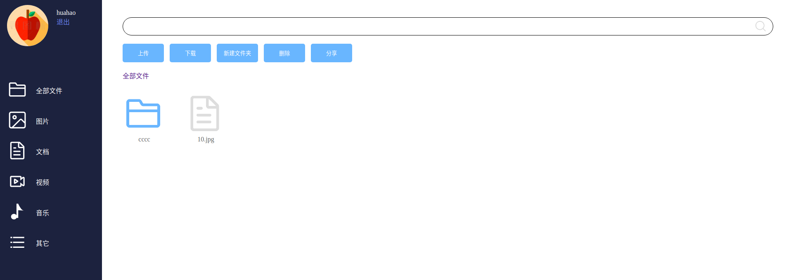 

#### 5.9、项目实战之目录切换

在index.jsp中添加目录的双击事件，调用IndexServlet的api即可切换目录

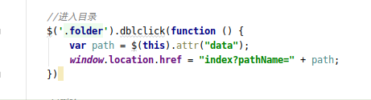 

#### 5.10、项目实战之文件删除

1、在index.jsp中为删除按钮添加id=del

 

2、为删除按钮添加点击事件，并获取删除的文件id，当文件不为空时，则通过ajax发起删除请求给服务器，由服务器执行删除动作。

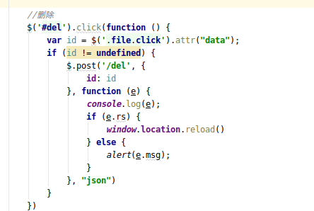 

3、编写DeleteServlet

```java
package com.blb.servlet;

import com.blb.entity.UserFile;
import com.blb.service.IUserFileService;
import com.blb.service.impl.UserFileServiceImpl;
import com.blb.utils.Response;
import com.blb.utils.SessionUtils;

import javax.servlet.ServletException;
import javax.servlet.annotation.WebServlet;
import javax.servlet.http.HttpServlet;
import javax.servlet.http.HttpServletRequest;
import javax.servlet.http.HttpServletResponse;
import java.io.File;
import java.io.IOException;
import java.sql.SQLException;

@WebServlet("/del")
public class DeleteServlet extends HttpServlet {

    private IUserFileService userFileService = new UserFileServiceImpl();

    @Override
    protected void service(HttpServletRequest req, HttpServletResponse resp) throws ServletException, IOException {
        String id = req.getParameter("id");
        try {
            UserFile userFile = userFileService.getById(Integer.parseInt(id));
            userFileService.del(Integer.parseInt(id));
            File file = new File(SessionUtils.getUploadPath(req) + userFile.getPathName() + userFile.getFileName());
            if (file.exists()) {
                file.delete();
            }
            resp.getWriter().write(Response.success());
        } catch (SQLException e) {
            e.printStackTrace();
            resp.getWriter().write(Response.error(e.getMessage()));
        }
    }
}
```

4、测试删除功能

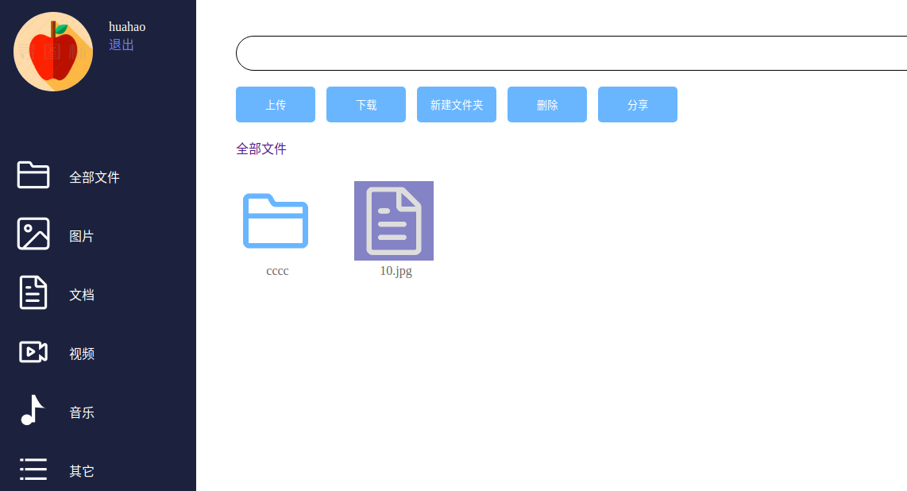 

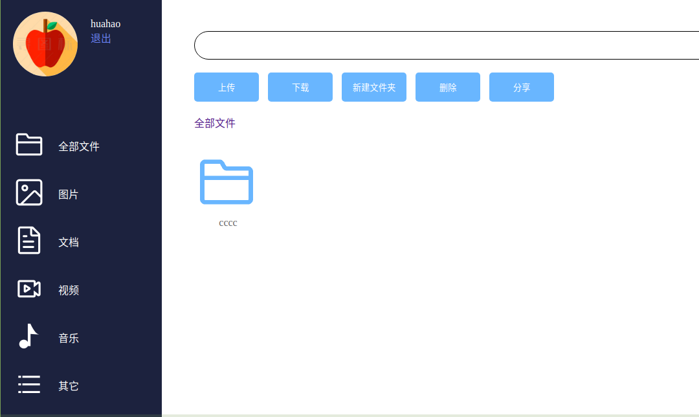 

#### 5.11、项目实战之登录状态过滤

在com.blb.filter包上新建SessionFilter，代码如下

```java
package com.blb.filter;

import java.io.IOException;

import javax.servlet.Filter;
import javax.servlet.FilterChain;
import javax.servlet.FilterConfig;
import javax.servlet.ServletException;
import javax.servlet.ServletRequest;
import javax.servlet.ServletResponse;
import javax.servlet.annotation.WebFilter;
import javax.servlet.annotation.WebInitParam;
import javax.servlet.http.HttpServletRequest;
import javax.servlet.http.HttpServletResponse;

/**
 * 会话过滤器
 * @author huahao
 *
 */
@WebFilter(urlPatterns = "/*", initParams = {
   @WebInitParam(name = "whiteList", value = "/login.jsp;/register.jsp;/getCheckCode;/login;/logout;/register")
})
public class SessionFilter implements Filter {
   
   private FilterConfig config;

   @Override
   public void destroy() {

   }

   @Override
   public void doFilter(ServletRequest arg0, ServletResponse arg1, FilterChain chain)
         throws IOException, ServletException {
      HttpServletRequest request = (HttpServletRequest) arg0;
      HttpServletResponse response = (HttpServletResponse) arg1;

      //白名单放行
      String whiteListStr = config.getInitParameter("whiteList");
      String uri = request.getRequestURI();
      String[] whiteList = whiteListStr.split(";");
      for (String urlString : whiteList) {
         if (uri.equals(urlString)) {
            chain.doFilter(request, response);
            return;
         }
      }
      
      //静态资源放行
      if (uri.startsWith("/static/")) {
         chain.doFilter(request, response);
         return;
      }
      
      //已登录用户放行
      Object object = request.getSession().getAttribute("user");
      if (object!=null) {
         chain.doFilter(request, response);
         return;
      }
      
      //其它情况打回登录页面
      response.sendRedirect("login.jsp");
   }

   @Override
   public void init(FilterConfig config) throws ServletException {
      this.config = config;
   }

}
```

#### 5.12、其它

1、编码过滤器

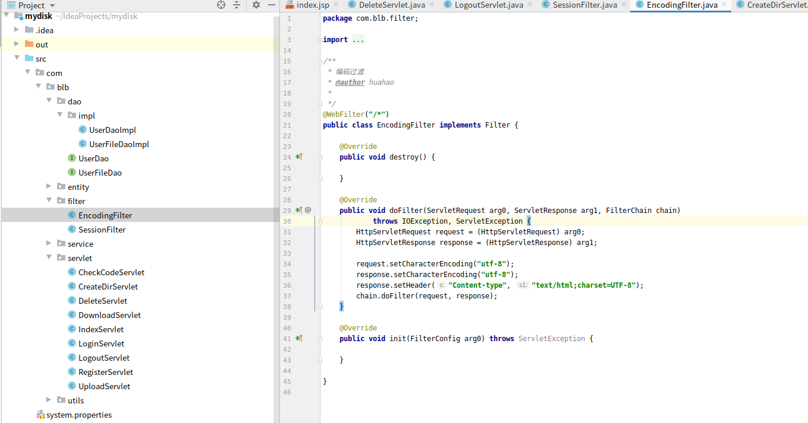 

2、邮件工具类

邮件工具类一定要使用异步发送，否则会因为网络等因素导致用户界面一直不显示邮件已发送。

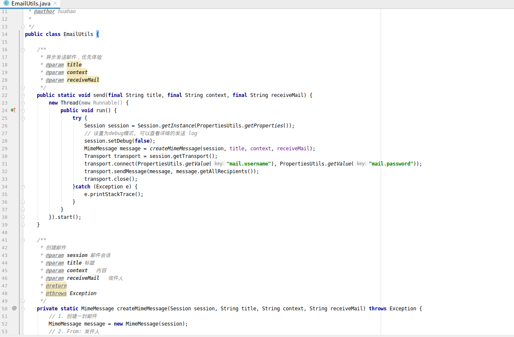