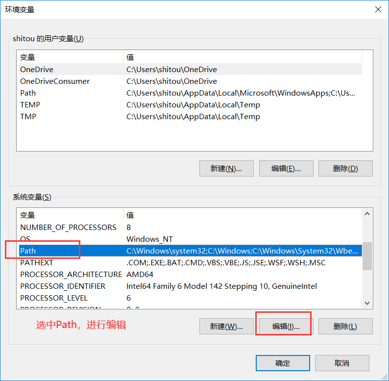
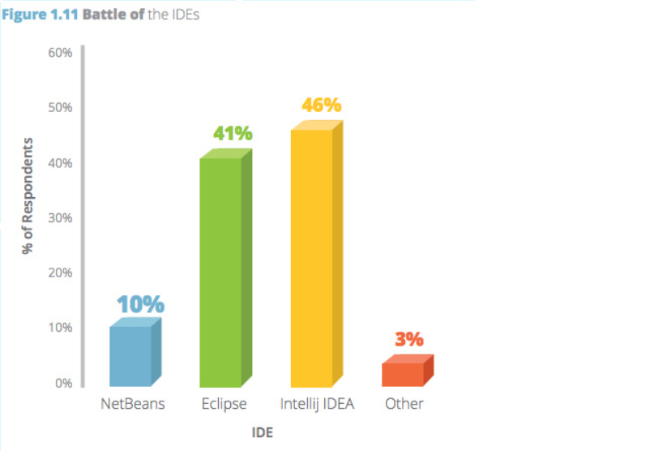
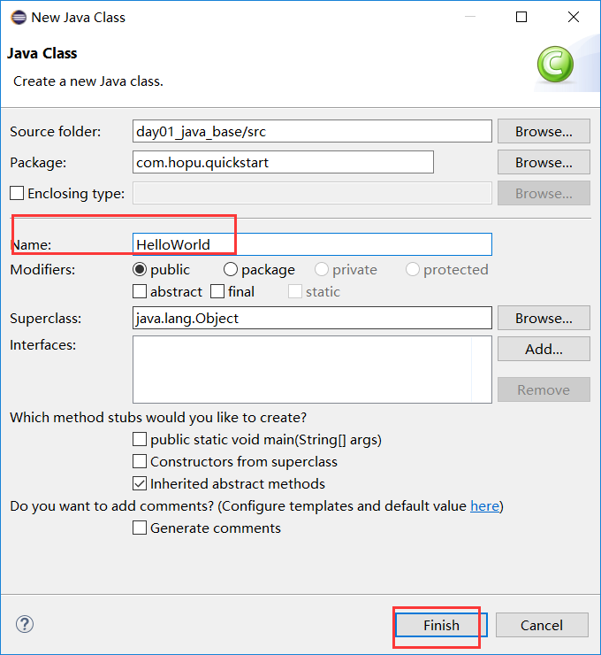

# 学习目标

```
* 能够说出JDK,JRE,JVM各自的作用和关系
* 能够完成HelloWorld案例的编写及运行
* 能够使用注释对程序进行说明
* 能够知道标识符、关键字的特点
* 能够知道常量的分类
* 掌握JDK、eclipse的安装配置
```


# 第1章 初识Java

## 1.1 Java语言概述

### 1.1.1 Java简介

Java语言是美国Sun公司（Stanford University Network），在1995年推出的高级的编程语言。所谓编程语言，是计算机的语言，人们可以使用编程语言对计算机下达命令，让计算机完成人们需要的功能。

**Java分为三个体系：**

- JavaSE（J2SE）（Java2 Platform Standard Edition，java平台标准版）
- JavaEE(J2EE)(Java 2 Platform,Enterprise Edition，java平台企业版)
- JavaME(J2ME)(Java 2 Platform Micro Edition，java平台微型版)。


2005年6月，JavaOne大会召开，SUN公司公开Java SE 6。此时，Java的各种版本已经更名以取消其中的数字"2"：J2EE更名为Java EE, J2SE更名为Java SE，J2ME更名为Java ME。

2009年，Sun公司被甲骨文公司收购，所以我们现在访问oracle官网即可：https://www.oracle.com
Java语言共同创始人之一：詹姆斯·高斯林 （James Gosling），被称为“Java之父”


### 1.1.2 Java能做什么

Java语言主要应用在互联网程序的开发领域。常见的互联网程序比如天猫、京东、淘宝、物流系统、网银系统、OA系统等等，以及服务器后台处理大数据的存储、查询、数据挖掘等也有很多应用。


等等。

现在各行各业的几乎所有互联网网站项目的实现都与Java息息相关，Java实现了后台核心功能的实现以及数据的处理，然后结合一些前端技术，就能实现一个完整的网站项目。


### 1.1.3 Java语言发展历史

* 1995年Sun公司推出Java语言

* 1996年发布Java 1.0版本

* 1997年发布Java 1.1版本

* 1998年发布Java 1.2版本

  - 1998年12月8日，第二代Java平台的企业版J2EE发布；
  - 1999年6月，Sun公司发布了第二代Java平台（简称为Java2）的3个版本：
    - [J2ME](https://baike.baidu.com/item/J2ME)（Java2 Micro Edition，Java2平台的微型版），应用于移动、无线及有限资源的环境；
    - [J2SE](https://baike.baidu.com/item/J2SE)（Java 2 Standard Edition，Java 2平台的标准版），应用于桌面环境；
    - [J2EE](https://baike.baidu.com/item/J2EE)（Java 2Enterprise Edition，Java 2平台的企业版），应用于基于Java的应用服务器。

* 2000年发布Java 1.3版本

* 2002年发布Java 1.4版本

* 2004年发布Java 5.0版本

  2004年9月30日，J2SE1.5发布，成为Java语言发展史上的又一里程碑。为了表示该版本的重要性，J2SE 1.5更名为Java SE 5.0（内部版本号1.5.0）。

* 2005年发布Java 6.0版本

  2005年6月，在Java One大会上，Sun公司发布了Java SE 6。此时，Java的各种版本已经更名，已取消其中的数字2，如J2EE更名为[JavaEE](https://baike.baidu.com/item/JavaEE)，J2SE更名为JavaSE，J2ME更名为[JavaME](https://baike.baidu.com/item/JavaME)。

* 2009年Oracle甲骨文公司收购Sun公司

* 2011年发布Java 7.0版本

* 2014年发布Java 8.0版本

* 2017年9月发布Java 9.0版本

* 2018年3月发布Java 10.0版本

* 2018年9月发布Java 11.0版本

* 2019年3月发布Java 12.0版本

* 2019年9月发布Java 13.0版本

* 2020年3月发布Java 14.0版本

* 。。。

需要说明的是Java是一个开发语言，而它底层实现以及我们真正用的就是Java提供的JDK开发工具包。从上述发展历程可以看出，最近几年Java更新速度较快，但是目前市场上，主流使用的Java开发版本仍然是Java 8，当然也有一些古老的项目仍然使用这Java 7甚至是Java6，而一些创新型的探索公司，已经悄然在使用Java11了。

### 1.1.4 Java主要特性

- Java语言是简单的：

  Java语言的语法与C语言和C++语言很接近，使得大多数程序员很容易学习和使用。另一方面，Java丢弃了C++中很少使用的、很难理解的、令人迷惑的那些特性，如操作符重载、多继承、自动的强制类型转换。特别地，Java语言不使用指针，而是引用。并提供了自动的废料收集，使得程序员不必为内存管理而担忧。

- Java语言是面向对象的：

  Java语言提供类、接口和继承等面向对象的特性，为了简单起见，只支持类之间的单继承，但支持接口之间的多继承，并支持类与接口之间的实现机制（关键字为implements）。Java语言全面支持动态绑定，而C++语言只对虚函数使用动态绑定。总之，Java语言是一个纯的面向对象程序设计语言。

- Java语言是分布式的：

  Java语言支持Internet应用的开发，在基本的Java应用编程接口中有一个网络应用编程接口（java net），它提供了用于网络应用编程的类库，包括URL、URLConnection、Socket、ServerSocket等。Java的RMI（远程方法激活）机制也是开发分布式应用的重要手段。

- Java语言是健壮的：

  Java的强类型机制、异常处理、垃圾的自动收集等是Java程序健壮性的重要保证。对指针的丢弃是Java的明智选择。Java的安全检查机制使得Java更具健壮性。

- Java语言是安全的：

  Java通常被用在网络环境中，为此，Java提供了一个安全机制以防恶意代码的攻击。除了Java语言具有的许多安全特性以外，Java对通过网络下载的类具有一个安全防范机制（类ClassLoader），如分配不同的名字空间以防替代本地的同名类、字节代码检查，并提供安全管理机制（类SecurityManager）让Java应用设置安全哨兵。

- Java语言是体系结构中立的：

  Java程序（后缀为java的文件）在Java平台上被编译为体系结构中立的字节码格式（后缀为class的文件），然后可以在实现这个Java平台的任何系统中运行。这种途径适合于异构的网络环境和软件的分发。

- Java语言是可移植的：

  这种可移植性来源于体系结构中立性，另外，Java还严格规定了各个基本数据类型的长度。Java系统本身也具有很强的可移植性，Java编译器是用Java实现的，Java的运行环境是用ANSI C实现的。

- Java语言是解释型的：

  如前所述，Java程序在Java平台上被编译为字节码格式，然后可以在实现这个Java平台的任何系统中运行。在运行时，Java平台中的Java解释器对这些字节码进行解释执行，执行过程中需要的类在联接阶段被载入到运行环境中。

- Java是高性能的：

  与那些解释型的高级脚本语言相比，Java的确是高性能的。事实上，Java的运行速度随着JIT(Just-In-Time）编译器技术的发展越来越接近于C++。

- Java语言是多线程的：

  在Java语言中，线程是一种特殊的对象，它必须由Thread类或其子（孙）类来创建。通常有两种方法来创建线程：其一，使用型构为Thread(Runnable)的构造子类将一个实现了Runnable接口的对象包装成一个线程，其二，从Thread类派生出子类并重写run方法，使用该子类创建的对象即为线程。值得注意的是Thread类已经实现了Runnable接口，因此，任何一个线程均有它的run方法，而run方法中包含了线程所要运行的代码。线程的活动由一组方法来控制。Java语言支持多个线程的同时执行，并提供多线程之间的同步机制（关键字为synchronized）。

- Java语言是动态的：

  Java语言的设计目标之一是适应于动态变化的环境。Java程序需要的类能够动态地被载入到运行环境，也可以通过网络来载入所需要的类。这也有利于软件的升级。另外，Java中的类有一个运行时刻的表示，能进行运行时刻的类型检查。


## 1.2  Java语言跨平台原理

**官方参考文档地址**：https://docs.oracle.com/javase/8/

### 1.2.1 Java虚拟机

- **JVM**（Java Virtual Machine ）：Java虚拟机，简称JVM，是运行所有Java程序的假想计算机，是Java程序的运行环境，是Java 最具吸引力的特性之一。我们编写的Java代码，都运行在`JVM` 之上。

- **跨平台**：任何软件的运行，都必须要运行在操作系统之上，而我们用Java编写的软件可以运行在任何的操作系统上，这个特性称为**Java语言的跨平台特性**。该特性是由JVM实现的，我们编写的程序运行在JVM上，而JVM运行在操作系统上。


如图所示，Java的虚拟机本身不具备跨平台功能的，每个操作系统下都有不同版本的虚拟机。

###  1.2.2 JRE 和 JDK

- **JRE ** (Java Runtime Environment) ：是Java程序的运行时环境，包含`JVM` 和运行时所需要的`核心类库` 。
- **JDK**  (Java Development Kit)：是Java程序开发工具包，包含`JRE` 和开发人员使用的工具。

我们想要运行一个已有的Java程序，那么只需安装`JRE` 即可。

我们想要开发一个全新的Java程序，那么必须安装`JDK` 。

整个JDK、JRE、JVM的关系可以参照官方图解：


> 说明：
>
> 三者关系： JDK > JRE > JVM


### 1.2.3 流程示意说明


## 1.3 字节

字节是我们常见的计算机中最小存储单元。计算机存储任何的数据，都是以字节的形式存储，右键点击文件属性，我们可以查看文件的字节大小。

8个bit（二进制位） 0000-0000表示为1个字节，写成**1 byte**或者**1 B**。

- 8 bit = 1 B 
- 1024 B =1 KB
- 1024 KB =1 MB
- 1024 MB =1 GB
- 1024 GB = 1 TB


# 第2章 Java开发环境安装配置

既然上面提到了Java开发离不开JDK、JRE和JVM，因此我们要正式开发、使用Java，就必须提前准备好这些工具。而上面介绍了，JDK中包括JRE和JVM以及一些依赖的核心类库，因此，我们只需要安装配置好JDK即可。

另外，考虑到目前开发市场需求，以及各个软件支持情况，我们这里还是以JDK 8的安装配置和使用为例进行说明，其他版本的大同小异，具体细节可以参阅相关文档。

## 2.1 JDK8下载

**地址：**https://www.oracle.com/java/technologies/javase/javase-jdk8-downloads.html

**注意**：针对不同的操作系统，需要下载对应版本的JDK。


这里，我们选择Windows平台下64位版本的下载（如果电脑是32位的可以选择X86 32位的下载安装）。


注意，如果自己下载的话可能需要登录，自己注册一个账号即可（不过外网下载速度非常慢）。

这里，我们在资料中也提供一个下载好的安装包。


## 2.2 JDK安装

### 2.2.1 JDK安装步骤说明

提供下载的JDK安装包通常是一个以.exe结尾的可执行指令安装包，我们需要双击文件进行安装。


> **注意：**
>
> 安装路径中，不要包含中文、空格以及其他特殊字符。


### 2.2.2 JDK安装目录介绍

打开刚才安装JDK的目录。


目录说明如下：

| 目录名称       | 说明                                                         |
| -------------- | ------------------------------------------------------------ |
| bin            | 该路径下存放了JDK的各种工具命令。javac和java就放在这个目录。 |
| include        | 该路径下存放了一些平台特定的头文件。                         |
| jre            | JDK包含的Jre运行环境文件。                                   |
| lib            | 该路径下存放了JDK工具的一些补充JAR包。                       |
| javafx-src.zip | java提供的一个图形化界面工具javafx源码包。                   |
| src.zip        | jdk相关的源码包。                                            |


## 2.3 常用DOS命令

Java语言的初学者，学习一些DOS命令，会非常有帮助。DOS是一个早期的操作系统，现在已经被Windows系统取代，对于我们开发人员，目前需要在DOS中完成一些事情，因此就需要掌握一些必要的命令。

- **进入DOS操作窗口**

  - 按下Windows+R键盘，打开运行窗口，输入cmd回车，进入到DOS的操作窗口。

    

  当然，也可以手动在开始界面打开CMD窗口

  

  

  - 打开DOS命令行后，看到一个路径 c:\user  就表示我们现在操作的磁盘是c盘。


- **常用命令**

  | 操作              | 说明                              |
  | ----------------- | --------------------------------- |
  | 盘符名称:         | 盘符切换。E:回车，表示切换到E盘。 |
  | dir               | 查看当前路径下的内容。            |
  | cd 目录           | 进入单级目录。cd soft             |
  | cd 目录1\目录2... | 进入多级目录。cd soft\java        |
  | cd ..             | 回退到上一级目录。                |
  | cd \              | 回退到盘符目录。                  |
  | cls               | 清屏。                            |
  | exit              | 退出命令提示符窗口。              |

这里，我们可以使用上面的指令，使用CMD窗口切换到之前Java安装目录的bin目录下，查看我们的java安装效果以及版本信息。


## 2.4 JDK环境变量配置

### **2.4.1 配置环境变量作用**

- 开发Java程序，需要使用JDK中提供的工具，工具在JDK8安装目录的`bin` 目录下。


- 在DOS命令行下使用这些工具，就要先进入到JDK的bin目录下，这个过程就会非常的麻烦。

- 不进入JDK的`bin`目录，这些工具就不能使用，会报错。


为了开发方便，我们想**在任意的目录下都可以使用JDK的开发工具**，则必须要配置环境变量，配置环境变量的意义在于告诉操作系统，我们使用的JDK开发工具在哪个目录下。

### 2.4.2 JDK环境变量配置

**1、右键【我的电脑】，选择【属性】**


**2、选择【高级系统设置】**


**3、选择【环境变量(N)】**


**4、选择【系统变量(S)】下的新建**


**5、新建系统环境变量**


**6、配置系统Path路径**




其中，%JAVA_HOME%读取的就是刚才配置的系统环境变量中JAVA_HOME的路径，后面紧跟着\bin,就是定位到了对应的JDK安装的bin目录下，因此，我们在任意位置都能找到bin目录下的相关java指令了。


**6、效果验证**

安装完JDK，并完JDK环境变量的配置后，我们可以在任意路径下进行测试，验证是否正确。


## 2.5 Notepad++软件的安装和配置

Java作为一个开发语言，肯定是少不了编写一些代码，我们目前可用的就是电脑自带的记事本，但是这个记事本用起来格式不方便、编码也有问题、样式也不好看等，因此我们对刚入门的大家推荐一个编辑软件Notepad++。

- **为什么要使用Notepad++软件**

Notepad++功能比windows中的自带记事本功能强大，除了可以用来制作一般的纯文字说明文件，也十分适合编
写计算机程序代码。Notepad++有行号，能够快速定位问题位置，还有语法高亮度显示、代码折叠等功能。而且它是免费的。

-  **Notepad++软件安装**

安装：傻瓜式安装，一直下一步即可。建议也安装到统一的开发软件目录下，比如D:\soft。

具体文件可以在资料中查找，进行安装。

- **Notepad++软件配置**

安装完毕之后，为了使用方便，做一个简单的配置：修改默认语言和编码。


# 第3章 HelloWorld入门程序

## 3.1 程序开发步骤说明

开发环境已经搭建完毕，可以开发我们第一个Java程序了。

HelloWorld案例是指在计算机屏幕上输出“HelloWorld”这行文字。各种计算机语言都习惯使用该案例作为第一个演示案例。

Java程序开发三步骤：**编写**、**编译**、**运行**。


## 3.2 编写Java源代码

1、在本地电脑某个目录下（比如，D:\test）新建一个文件，文件名修改为`HelloWorld.java`，其中文件名为`HelloWorld`，后缀名必须为`.java` 。


2、用记事本打开

> 使用notepad++记事本软件。

3、在文件中写入以下代码并保存，代码如下：

```
public class HelloWorld {
  	public static void main(String[] args) {
    	System.out.println("Hello World!");
  	}
}
```

> 文件名必须是`HelloWorld` ，保证文件名和类的名字是一致的，注意大小写。
>
> 每个字母和符号必须与示例代码一模一样。


第一个`HelloWord` 源程序就编写完成了，但是这个文件是程序员编写的，JVM是看不懂的，也就不能运行，因此我们必须将编写好的`Java源文件` 编译成JVM可以看懂的`字节码文件` 。


## 3.3 编译Java源文件

在DOS命令行中，**进入Java源文件的目录**，使用`javac` 命令进行编译。

命令：

```java
javac Java源文件名.后缀名
```

举例：

```
javac HelloWorld.java
```


编译成功后，命令行没有任何提示。打开文件目录，发现产生了一个新的文件 `HelloWorld.class`，该文件就是编译后的文件，是Java的可运行文件，称为**字节码文件**，有了字节码文件，就可以运行程序了。 


> Java源文件的编译工具`javac.exe`，在JDK安装目录的bin目录下。但是由于配置了环境变量，可以再任意目录下使用。


## 3.4 运行Java程序

在DOS命令行中，**进入Java源文件的目录**，使用`java` 命令进行运行。

命令：

```java
java 文件名字
```

举例：

```
java HelloWorld
```

> java HelloWord  不要写 不要写 不要写 .class


> Java程序`.class文件` 的运行工具`java.exe` ，在JDK安装目录的bin目录下。但是由于配置了环境变量，可以再任意目录下使用。


## 3.5 入门程序说明

###    3.5.1 编译和运行是两回事

* **编译**：是指将我们编写的Java源文件翻译成JVM认识的class文件，在这个过程中，`javac` 编译器会检查我们所写的程序是否有错误，有错误就会提示出来，如果没有错误就会编译成功。
* **运行**：是指将`class文件` 交给JVM去运行，此时JVM就会去执行我们编写的程序了。

###   3.5.2 关于main()方法

* **main()方法**：称为主方法。写法是**固定格式**不可以更改。main()方法是程序的入口点或起始点，无论我们编写多少程序，JVM在运行的时候，都会从main()方法这里开始执行。

### 3.5.3 HelloWorld案例说明

- 非法字符问题。Java中的符号都是英文格式的。
- 大小写问题。Java语言对大小写敏感（区分大小写）。
- 在系统中显示文件的扩展名，避免出现HelloWorld.java.txt文件。
- 编译命令后的java文件名需要带文件后缀.java。
- 运行命令后的class文件名（类名）不带文件后缀.class。


# 第4章 注释与规范

## 4.1 代码注释

* **注释**：就是对代码的解释和说明。其目的是让人们能够更加轻松地了解代码。为代码添加注释，是十分必须要的，它不影响程序的编译和运行。

* Java中有单行注释和多行注释，以及文档注释。

  * 单行注释以 `//开头 换行结束`

  ```
  // 这是一个单行注释，定义了一个变量name
  String name="张三";
  ```

  * 多行注释以 `/*开头  以*/结束`

  ```java
      /*
       * 这是一个多行注释
       * 先定义了一个变量name
       * 接着定义了一方法sleep()
       * */
      private String name="tom";
      public void sleep(String name){
          System.out.println(name+"在睡觉");
      }
  ```


- 文档注释

  文档注释`/**开头  以*/结束`，并且还会跟随使用@标签来指定一些文档标记。

  常用的标签名及说明如下：

  | **标签**        | **描述**                                                     | **示例**                          |
  | --------------- | ------------------------------------------------------------ | --------------------------------- |
  | **@author**     | 标识一个类的作者                                             | @author description               |
  | **@version**    | 指定类的版本                                                 | @version info                     |
  | **@param**      | 说明一个方法的参数                                           | @param parameter-name explanation |
  | **@return**     | 说明返回值类型                                               | @return explanation               |
  | **@deprecated** | 用来注明被注释的类、变量或方法已经不提倡使用，在将来的版本中有可能被废弃 |                                   |
  | **@throws**     | 描述方法抛出的异常，指明抛出异常的条件                       |                                   |

  **示例：**

```
/**
 * 这是一个Java入门程序类HelloWorld
 * @author tom
 * @version 1.1.0
 */
public class HelloWorld2 {
    /**
     * 这个一个根据用户名获取对应年龄的方法
     * @param name  参数name为用户名
     * @return       返回值为Integer类型的年龄
     */
    public Integer getAge(String name){
        Integer age=18;
        return age;
    }
}
```

**使用指令:**

```
javadoc -d 文档存放目录 -author -version 源文件名.java
```

这条命令编译一个名为"源文件名.java"的 java 源文件，并将生成的文档存放在"文档存放目录"指定的目录下，生成的文档中 index.html 就是文档的首页。-author 和 -version 两个选项可以省略。


如果生成文档的代码中有中文，可以添加下面的参数指定编码：

```
 -encoding UTF-8 -charset UTF-8
```

**效果：**


## 4.2 关键字

* **关键字**：是指在程序中，Java已经定义好的单词，具有特殊含义。
  * HelloWorld案例中，出现的关键字有 `public ` 、`class` 、 `static` 、  `void`  等，这些单词已经被Java定义好，全部都是小写字母，notepad++中会有颜色特殊显示。
  * 关键字比较多，不能死记硬背，学到哪里记到哪里即可。


**关键字说明：**

| 关键字       | 含义                                                         |
| ------------ | ------------------------------------------------------------ |
| abstract     | 表明类或者成员方法具有抽象属性                               |
| assert       | 用来进行程序调试                                             |
| boolean      | 基本数据类型之一，布尔类型                                   |
| break        | 提前跳出一个块                                               |
| byte         | 基本数据类型之一，字节类型                                   |
| case         | 用在switch语句之中，表示其中的一个分支                       |
| catch        | 用在异常处理中，用来捕捉异常                                 |
| char         | 基本数据类型之一，字符类型                                   |
| class        | 类                                                           |
| const        | 保留关键字，没有具体含义                                     |
| continue     | 回到一个块的开始处                                           |
| default      | 默认，例如，用在switch语句中，表明一个默认的分支             |
| do           | 用在do-while循环结构中                                       |
| double       | 基本数据类型之一，双精度浮点数类型                           |
| else         | 用在条件语句中，表明当条件不成立时的分支                     |
| enum         | 枚举                                                         |
| extends      | 表明一个类型是另一个类型的子类型，这里常见的类型有类和接口   |
| final        | 用来说明最终属性，表明一个类不能派生出子类，或者成员方法不能被覆盖，或者成员域的值不能被改变 |
| finally      | 用于处理异常情况，用来声明一个基本肯定会被执行到的语句块     |
| float        | 基本数据类型之一，单精度浮点数类型                           |
| for          | 一种循环结构的引导词                                         |
| goto         | 保留关键字，没有具体含义                                     |
| if           | 条件语句的引导词                                             |
| implements   | 表明一个类实现了给定的接口                                   |
| import       | 表明要访问指定的类或包                                       |
| instanceof   | 用来测试一个对象是否是指定类型的实例对象                     |
| int          | 基本数据类型之一，整数类型                                   |
| interface    | 接口                                                         |
| long         | 基本数据类型之一，长整数类型                                 |
| native       | 用来声明一个方法是由与计算机相关的语言（如C/C++/FORTRAN语言）实现的 |
| new          | 用来创建新实例对象                                           |
| package      | 包                                                           |
| private      | 一种访问控制方式：私用模式                                   |
| protected    | 一种访问控制方式：保护模式                                   |
| public       | 一种访问控制方式：共用模式                                   |
| return       | 从成员方法中返回数据                                         |
| short        | 基本数据类型之一,短整数类型                                  |
| static       | 表明具有静态属性                                             |
| strictfp     | 用来声明FP_strict（单精度或双精度浮点数）表达式遵循IEEE 754算术规范 |
| super        | 表明当前对象的父类型的引用或者父类型的构造方法               |
| switch       | 分支语句结构的引导词                                         |
| synchronized | 表明一段代码需要同步执行                                     |
| this         | 指向当前实例对象的引用                                       |
| throw        | 抛出一个异常                                                 |
| throws       | 声明在当前定义的成员方法中所有需要抛出的异常                 |
| transient    | 声明不用序列化的成员域                                       |
| try          | 尝试一个可能抛出异常的程序块                                 |
| void         | 声明当前成员方法没有返回值                                   |
| volatile     | 表明两个或者多个变量必须同步地发生变化                       |
| while        | 用在循环结构中                                               |


## 4.3 标识符

- **标识符**：是指在程序中，我们自己定义内容。比如包名、类的名字、方法的名字和变量的名字等等，都是标识符。

  - HelloWorld案例中，出现的标识符有类名字`HelloWorld` 。

  > **注意：**public、class、void、static等都是关键字，不属于标识符。

  

- **命名规则：`硬性要求`**

  - 标识符可以包含`英文字母26个(区分大小写)`、`0-9数字` 、`$（美元符号）`和`_（下划线）`。int a1 = 10。
  - 标识符不能以数字开头。  int 1i = 10;
  - 标识符不能是关键字。int static  = 10;

  

- **命名规范：`软性建议`**

  - 包名规范：全部字母小写。com.hopu.test。

  - 类名规范：首字母大写，后面每个单词首字母大写（大驼峰式）。HelloWorld。
  - 方法名规范： 首字母小写，后面每个单词首字母大写（小驼峰式）。  methodTestDemo。
  - 变量名规范：首字母小写，后面每个单词首字母大写（小驼峰式）。int varDemo =10。
  - 常量名规范：所有字母大写，多个单词之间有下划线_分隔。String DB_URL="http://xxx"。


# 第5章 Eclipse开发工具

## 5.1 Java常用开发工具介绍

前面我们使用记事本的方式完成了一个HelloWrold.java的入门程序，使用这种简易记事本方式编写源代码，没有智能提示、没有错误提示、不能自动化管理代码。因此，各大公司和组织开发并提供了多种代码开发工具，让程序员方便、快捷、高效、无误的写代码，而不是把时间浪费在其他事上。

这里，我们就对目前一些常用Java开发工具进行简介。

**1、Eclipse**

Eclipse最初是由IBM公司开发的替代商业软件Visual Age for Java的下一代IDE开发环境，2001年11月贡献给开源社区，现在它由非营利软件供应商联盟Eclipse基金会（Eclipse Foundation）管理。Eclipse 是一个开放源代码的、基于 Java 的可扩展开发平台。就其本身而言，它只是一个框架和一组服务，用于通过插件组件构建开发环境。幸运的是Eclipse 附带了一个标准的插件集，包括 Java 开发工具（Java Development Tools，JDT）。

Eclipse是免费的，这点很重要，所以大多老公司里依然是使用eclipse这款IDE，而且它良好的性能，也在市场占着不小的比重。


**2、MyEclipse**

MyEclipse是Eclipse的插件，也是一款功能强大的J2EE集成开发环境，由Genuitec公司发布，它是商用收费的。

MyEclipse 是对Eclipse IDE的扩展，利用它可以在数据库和JavaEE的开发、发布以及应用程序服务器的整合方面极大的提高工作效率。它是功能丰富的JavaEE集成开发环境，包括了完备的编码、调试、测试和发布功能，完整支持HTML、Struts、JSP、CSS、Javascript、SQL，Hibernate，Spring。


**3、NetBeans**

NetBeans是Sun公司（2009年被甲骨文收购）在2000年创立的开放源代码供开发人员和客户社区的家园，旨在构建世界级的Java IDE。

NetBeans当前可以在Solaris、Windows、Linux和Macintosh OS X平台上进行开发，并在SPL(Sun公用许可)范围内使用，是一个屡获殊荣的集成开发环境。NetBeans包括开源的开发环境和应用平台，NetBeans IDE可以使开发人员利用Java平台能够快速创建Web、企业、桌面以及移动的应用程序，NetBeans IDE目前支持PHP、Ruby、JavaScript、Ajax、Groovy、Grails和C /C + +等开发语言。


**4、IntelliJ IDEA**

IntelliJ IDEA是一款综合的Java 编程环境，被许多开发人员和行业专家誉为市场上最好的IDE。它提供了一系列最实用的的工具组合：智能编码辅助和自动控制，支持J2EE，Ant，JUnit，SVN和Git集成，非平行的编码检查和创新的GUI设计器。IDEA把Java开发人员从一些耗时的常规工作中解放出来，显著地提高了开发效率。具有运行更快速，生成更好的代码；持续的重新设计和日常编码变得更加简易，与其它工具的完美集成；很高的性价比等特点。IntelliJ IDEA以前是收费软件，不过在2009年以后就开始推出了免费的社区开源版本。不过商用还是需要收费的。


除了上面提到的这四款由大公司开发的IDE外，JAVA开发的IDE还有很多，例如Spring基于eclipse推出的STS（[Spring Tool Suite](http://spring.io/tools/sts/all/)）、小而且快[JCreator](http://www.jcreator.com/)，但是以上最常用的eclipse和IntelliJ IDEA。国内Java开发人员使用的最多也是eclipse和IntelliJ IDEA。

**这几个常用集成开发工具市场占比大概如下：**



针对于Java语言开发来说，国内目前使用较多的集成开发工具就是Eclipse和IntelliJ IDEA。其中，在一些早期项目和中小型公司还保留使用Eclipse较多；对于大型公司，新项目来说，使用IntelliJ IDEA的越来越多。

因此，我们这里前期会带领大家使用Eclipse集成开发工具进行Java代码开发，到后期会改用IntelliJ IDEA进行开发。


## 5.2 Eclipse安装配置

### 5.2.1 Eclipse下载

**下载地址：**https://www.eclipse.org/downloads/

官方提供了.exe和.zip两种下载安装方式。.exe的安装包下载后，需要通过安装器进一步安装；.zip的压缩包下载后解压配置即可。


**压缩包选择：**


**压缩包平台选择：**


这里，我们在资料中2种安装文件都提供有了。


### 5.2.2 Eclipse安装使用

#### **1、安装**

这里，我们选择以压缩包方式进行eclipse的安装配置，这种方式安装比较简单，直接解压压缩包指定位置即可。


**进入到解压目录：**


其中的eclipse.exe就是eclipse工具启动指令，双击即可使用，当然为了方便后续使用，可以右键【发送到桌面快捷方式】。


#### **2、基本使用**

直接双击eclipse.exe指令，打开eclipse开发工具。


#### **3、JDK配置**

（1）找到上面菜单选项“Window”,选择下面的“Preferences”，然后鼠标左键点击进入设置界面。


（2）进入设置界面之后，找到“Java”选项，然后展开，选择“Installed JRES”，可以看到右侧已有的JDK配置。


（3）需要配置大家本地的JDK版本，然后在右侧点击“Add”进行添加，然后点击“Next”下一步。


（4）勾选刚配置的本地版本，然后再点击“Apply”按钮进行配置应用


（5）点击应用之后，需要大家选择编译版本，找到“Java”下面的“Compiler”选项，进行编辑版本配置。然后点击“Apply and Close”按钮，配置完成。


#### 4、编码设置

（1）修改工作空间默认编码


（2）修改文件编码


接着，我们就可以在当前页面创建项目、创类、方法、编写代码，进行开发测试了。


### 5.2.3 Eclipse实现HelloWorld

完成上面eclipse的安装后，下面，我们就使用eclipse这个专业的Java代码集成开发工具重写一份HelloWorld入门程序。

#### **1、创建项目**


#### 2、编写源代码

（1）先新建一个包，方便分文别来管理我们的代码


（2）接着，在新建一个包下，创建我们的HelloWorld类



接着，把我们之前编写的代码复制或者编写进去都可以。


#### 3、编译测试

我们可以直接通过集成开发工具，编译并运行我们的代码，查看效果。


至此，我们使用eclipse工具就完成了一个简单项目的创建、程序的编写以及运行测试。


# 第6章 常量

**常量**：是指在Java程序中固定不变的数据。

## 6.1 分类

| 类型       | 含义                                   | 数据举例                    |
| :--------- | :------------------------------------- | :-------------------------- |
| 整数常量   | 所有的整数                             | 0，1，  567，  -9           |
| 小数常量   | 所有的小数                             | 0.0，  -0.1，  2.55         |
| 字符常量   | 单引号引起来,只能写一个字符,必须有内容 | 'a' ， ' '，  '好'          |
| 字符串常量 | 双引号引起来,可以写多个字符,也可以不写 | "A" ，"Hello" ，"你好" ，"" |
| 布尔常量   | 只有两个值                             | true ，  false              |
| 空常量     | 只有一个值                             | null                        |

##   6.2 练习

**需求：**输出各种类型的常量。

```java
public class ConstantDemo {
	public static void main(String[] args){
        //输出整数常量
        System.out.println(123456);
        //输出小数常量
        System.out.println(0.123);
        //输出字符常量
        System.out.println('a');
        //输出布尔常量
        System.out.println(true);
        //输出字符串常量
        System.out.println("欢迎来到厚浦学校");
  	}
}
```

